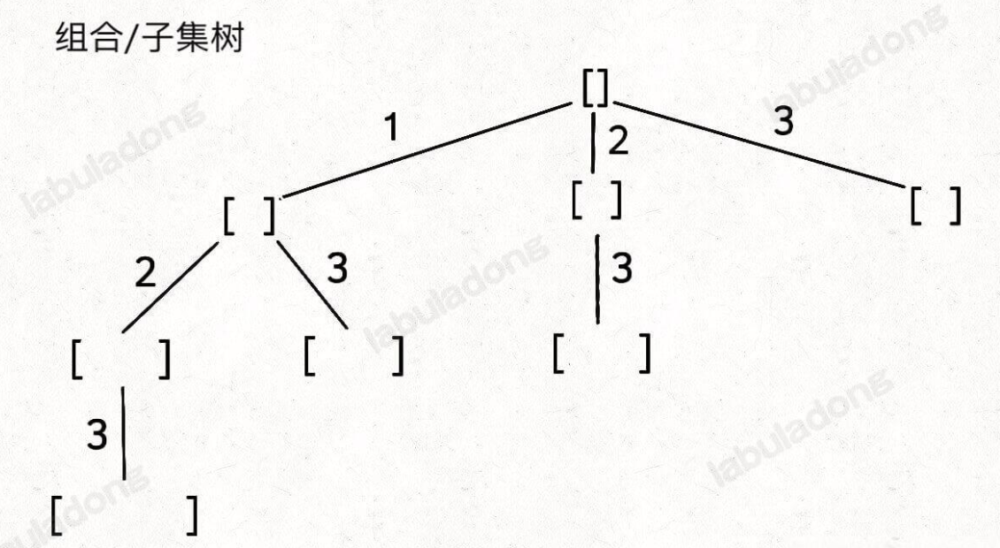
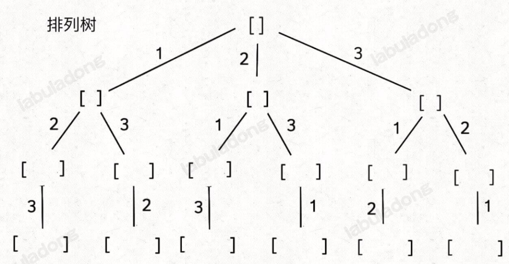

---
title: 回溯算法
date: 2022-12-06
tags:
 - js
categories:
 -  算法
---    
## 膜拜labuladong大佬文章     
+ [](https://labuladong.gitee.io/algo/di-ling-zh-bfe1b/hui-su-sua-56e11/)       
##  回溯算法    
1. 回溯的本质是穷举，穷举所有可能，然后选出我们想要的答案，如果想让回溯法⾼效⼀些，可以加⼀些剪枝的操作，但也改不了回溯法就是穷举的本质.他常常用来解决以下问题      
    + 组合问题  N个数⾥⾯按⼀定规则找出k个数的集合    
    + 切割问题  ⼀个字符串按⼀定规则有⼏种切割⽅式   
    + 子集问题  ⼀个N个数的集合⾥有多少符合条件的⼦集   
    + 排列问题  N个数按⼀定规则全排列，有⼏种排列⽅式    
    + 棋盘问题  如N皇后、解数独   
2. 如何理解回溯法   
    + 所有的回溯法都可以抽象成一个N叉树，树的宽度一般就是集合的大小，树的深度就是递归的深度   
    + 回溯算法是没有重叠子问题的特性的，基本都是类似全排列，穷举的问题。        
    + 伪代码    
        ```js       
            var permute = function(nums) {
                let res = [];
                let track = [];
                let used = new Array(nums.length).fill(false);

                const backtrack = function(nums, track, used) {
                    //终止条件
                    if (track.length === nums.length) {
                        res.push([...track]);
                        return;
                    }
                    //选择：本层集合中元素（树中节点孩⼦的数量就是集合的⼤⼩ //注意i=0,i=start的区别
                    for (let i = 0; i < nums.length; i++) {
                        if (used[i]) {
                            continue;   // nums[i] 已经在 track 中，跳过
                        }
                        // 做选择
                        track.push(nums[i]);
                        used[i] = true;
                        backtrack(nums, track, used);
                        // 取消选择
                        track.pop();
                        used[i] = false; 
                    }
                }

                backtrack(nums, track, used);
                return res;
            }
        ```   
    + 剪枝的地⽅就在递归中每⼀层的for循环所选择的起始位置       
3. N皇后问题        
    ```js      
        var res = [];
        function solveNQueens(n) {
            var board = new Array(n).fill('.').map(() => new Array(n).fill('.'));
            backtrack(board, 0);
            return res;
        }
        function backtrack(board, row) {
            if (row === board.length) {
                res.push(board.map(row => row.join('')));
                return;
            }
            var n = board[row].length;
            for (var col = 0; col < n; col++) {
                if (!isValid(board, row, col)) {
                continue;
                }
                board[row][col] = 'Q';
                backtrack(board, row + 1);
                board[row][col] = '.';
            }
        }

        function isValid(board, row, col) {
            var n = board.length;
            // 检查列是否有皇后互相冲突
            for (var i = 0; i < n; i++) {
                if (board[i][col] === 'Q') {
                return false;
                }
            }
            // 检查右上方是否有皇后互相冲突
            for (var i = row - 1, j = col + 1; i >= 0 && j < n; i--, j++) {
                if (board[i][j] === 'Q') {
                return false;
                }
            }    
            // 检查左上方是否有皇后互相冲突
            for (var i = row - 1, j = col - 1; i >= 0 && j >= 0; i--, j--) {
                if (board[i][j] === 'Q') {
                return false;
                }
            }
            return true;
        } 
    ```     
##  排列-组合-子集问题      
1. 不管是哪种问题，他们的大体背景条件离不开以下集中     
    + 元素无重不可复选，即`nums`中的元素都是唯一的，每个元素最多只能被使用一次，这也是最基本的形式。        
    + 元素可重不可复选，即`nums`中的元素可以存在重复，每个元素最多只能被使用一次。      
    + 元素无重可复选，即`nums`中的元素都是唯一的，每个元素可以被使用若干次。        
2. 子集问题和排列问题的回溯树       
           
       
    + 记住这两种树形结构就能解决所有相关问题    
    + 因为组合问题和子集问题其实是等价的，至于之前说的三种变化形式，无非是在这两棵树上剪掉或者增加一些树枝罢了。        
3. 子集（元素无重不可复选）     
    ```js     
        var subsets = function(nums) {
            // 用于存储结果
            const res = [];
            // 用于记录回溯路径
            const track = [];    
            /**
            * 回溯算法的核心函数，用于遍历子集问题的回溯树
            * @param {number} start - 控制树枝的遍历，避免产生重复子集
            */
            const backtrack = (start) => {
                // 前序遍历位置，每个节点的值都是一个子集
                res.push([...track]);    
                // 回溯算法标准框架
                for (let i = start; i < nums.length; i++) {
                    // 做选择
                    track.push(nums[i]);
                    // 回溯遍历下一层节点
                    backtrack(i + 1);
                    // 撤销选择
                    track.pop();
                }
            };     
            backtrack(0);
            return res;
        };     
    ```     
4. 组合（元素无重不可复选） 
    ```js   
        var combine = function(n, k) {
            const res = [];
            const track = [];
            // 主函数
            function backtrack(start, n, k) {
                // base case
                if (k === track.length) {
                    // 遍历到了第 k 层，收集当前节点的值
                    res.push([...track]);
                    return;
                }
                // 回溯算法标准框架
                for (let i = start; i <= n; i++) {
                    // 选择
                    track.push(i);
                    // 通过 start 参数控制树枝的遍历，避免产生重复的子集
                    backtrack(i + 1, n, k);
                    // 撤销选择
                    track.pop();
                }
            }    
            backtrack(1, n, k);
            return res;
        };      
    ```   
5. 排列（元素无重不可复选）   
    ```js   
        // 记录回溯算法的递归路径
        const track = [];
        // track 中的元素会被标记为 true
        let used;
        /* 主函数，输入一组不重复的数字，返回它们的全排列 */
        var permute = function(nums) {
            used = new Array(nums.length).fill(false);
            backtrack(nums);
            return res;
        };
        const res = [];
        // 回溯算法核心函数
        function backtrack(nums) {
            // base case，到达叶子节点
            if (track.length === nums.length) {
                // 收集叶子节点上的值
                res.push([...track]);
                return;
            }
            // 回溯算法标准框架
            for (let i = 0; i < nums.length; i++) {
                // 已经存在 track 中的元素，不能重复选择
                if (used[i]) {
                    continue;
                }
                // 做选择
                used[i] = true;
                track.push(nums[i]);
                // 进入下一层回溯树
                backtrack(nums);
                // 取消选择
                track.pop();
                used[i] = false;
            }
        }    
    ```     
6. 子集/组合（元素可重不可复选）
    ```js       
        var subsetsWithDup = function(nums) {
            // 定义结果数组和回溯时的路径数组
            let res = [];
            let track = [];
            // 排序，以便于剪枝算法的实现
            nums.sort((a, b) => a - b);
            // 回溯算法
            const backtrack = (nums, start) => {
                // 前序位置，每个节点的值都是一个子集
                res.push([...track]);
                // 遍历子集树枝
                for (let i = start; i < nums.length; i++) {
                    // 剪枝逻辑，值相同的相邻树枝，只遍历第一条
                    if (i > start && nums[i] === nums[i - 1]) {
                        continue;
                    }
                    // 选择当前元素，加入路径数组
                    track.push(nums[i]);
                    // 向子节点递归
                    backtrack(nums, i + 1);
                    // 回溯，撤销选择
                    track.pop();
                }
            }
            backtrack(nums, 0);
            return res;
        };              
    ``` 
7. 排列（元素可重不可复选） 
    ```js       
         var permuteUnique = function(nums) {
            let res = [];
            let track = [];
            let used = new Array(nums.length).fill(false);
            // 先排序，让相同的元素靠在一起
            nums.sort((a, b) => a - b);
            backtrack(nums, used, track, res);
            return res;
        };
        function backtrack(nums, used, track, res) {
            if (track.length === nums.length) {
                res.push(track.slice());
                return;
            }
            for (let i = 0; i < nums.length; i++) {
                if (used[i]) {
                    continue;
                }
                // 新添加的剪枝逻辑，固定相同的元素在排列中的相对位置
                if (i > 0 && nums[i] === nums[i - 1] && !used[i - 1]) { // 如果前面的相邻相等元素没有用过，则跳过
                    continue;
                }
                track.push(nums[i]);
                used[i] = true;
                backtrack(nums, used, track, res);
                track.pop();
                used[i] = false;
            }
        }   
    ```     
8. 子集/组合（元素无重可复选）      
    ```js   
        //我们不妨先思考思考，标准的子集/组合问题是如何保证不重复使用元素的？
        //答案在于 backtrack 递归时输入的参数 start     
        var backtrack = function(nums, start) {
            for (var i = start; i < nums.length; i++) {
                // ...
                // 递归遍历下一层回溯树，注意参数
                backtrack(nums, i + 1);
                // ...
            }
        };      
        //这个 i 从 start 开始，那么下一层回溯树就是从 start + 1 开始，从而保证 nums[start] 这个元素不会被重复使用      

        //那么反过来，如果我想让每个元素被重复使用，我只要把 i + 1 改成 i 即可：
        var backtrack = function(nums, start) {
            for (var i = start; i < nums.length; i++) {
                // ...
                // 递归遍历下一层回溯树，注意参数
                backtrack(nums, i);
                // ...
            }
        };      
    ```     
9. 排列（元素无重可复选）       
    ```js       
        //标准的全排列算法利用 used 数组进行剪枝，避免重复使用同一个元素。如果允许重复使用元素的话，直接放飞自我，去除所有 used 数组的剪枝逻辑就行了。
        var permuteRepeat = function(nums) {
            // 创建结果集和回溯路径
            let res = [];
            let track = [];
            // 回溯算法核心函数
            const backtrack = function(nums) {
                // base case，到达叶子节点
                if (track.length === nums.length) {
                    // 收集叶子节点上的值
                    res.push([...track]);
                    return;
                }
                // 回溯算法标准框架
                for (let i = 0; i < nums.length; i++) {
                    // 做选择
                    track.push(nums[i]);
                    // 进入下一层回溯树
                    backtrack(nums);
                    // 取消选择
                    track.pop();
                }
            }
            // 从第一层开始回溯
            backtrack(nums);
            return res;
        };
    ```     
##  总结关键点          
1. 元素无重不可复选，即 nums 中的元素都是唯一的，每个元素最多只能被使用一次,**<font color='red'>关键点在于同一分支上的去重</font>**      
    ```js   
        //组合子集问题      
         for (let i = start; i < nums.length; i++) {
            backtrack(i + 1);
        }       
        
        //排列问题      
        for (let i = 0; i < nums.length; i++) {
            if (used[i]) continue // 剪枝逻辑
            used[i] = true;
            backtrack();
            used[i] = false;
        }
    ```         
2. 元素可重不可复选，即 nums 中的元素可以存在重复，每个元素最多只能被使用一次，**<font color='red'>关键点在于排序和剪枝</font>**       
    ```js   
        Arrays.sort(nums);      
        //组合子集问题      
        for (let i = start; i < nums.length; i++) {
            // 剪枝逻辑，跳过值相同的相邻树枝
            if (i > start && nums[i] == nums[i - 1]){
                continue;
            } 
            backtrack(i + 1);
        }   

        //排列问题
        for (let i = 0; i < nums.length; i++) {
            if (used[i]) continue // 剪枝逻辑
        // 剪枝逻辑，固定相同的元素在排列中的相对位置
            if (i > 0 && nums[i] == nums[i - 1] && !used[i - 1]) {
                continue;
            }
            used[i] = true;
            backtrack();
            used[i] = false;
        }       
    ```     
3. 元素无重可复选，即 nums 中的元素都是唯一的，每个元素可以被使用若干次,**<font color='red'>删除去重逻辑即可</font>**       
    ```js   
        //组合子集问题         
         for (let i = start; i < nums.length; i++) {
            //backtrack(i+1)
            backtrack(i); //从i开始  多一个分支
        }       
        
        //排列问题      
        for (let i = 0; i < nums.length; i++) {
            //if (used[i]) continue // 剪枝逻辑
            //used[i] = true
            backtrack();
            //used[i] = false;
        }   
    ```       
4. **used数组用位图技巧来提高效率**     
    ```js       
        let used = 0
        if(((used >> i) & 1) === 1){ //第i位为1 表示true
            continue
        }
        used |= 1 << i  //将第i位置为1
        used ^= 1 << i  //将第i位置为0
    ```     

