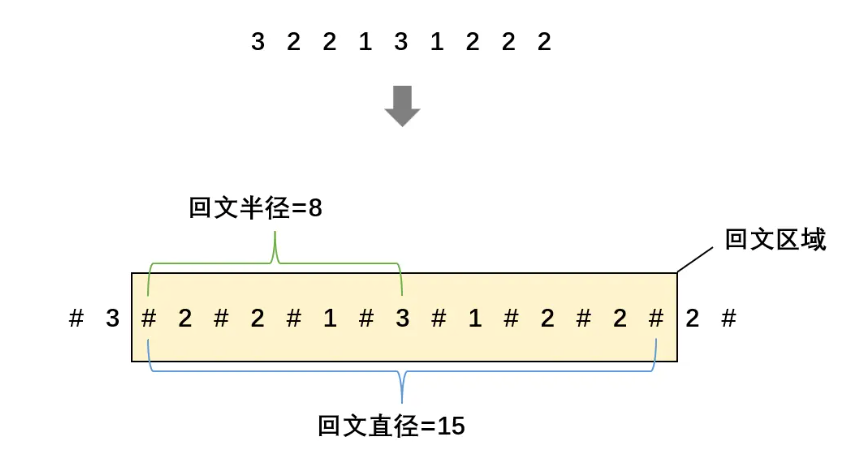
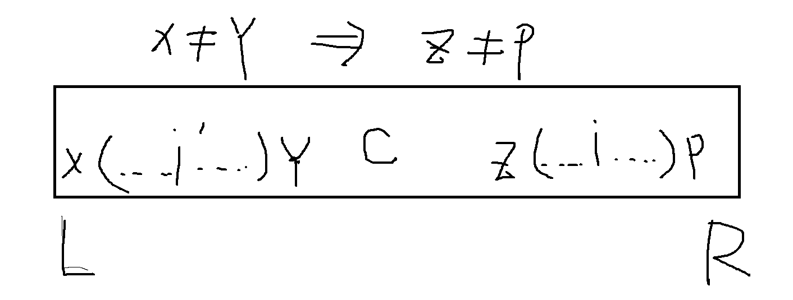
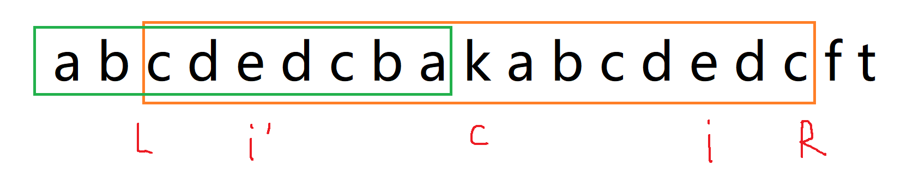
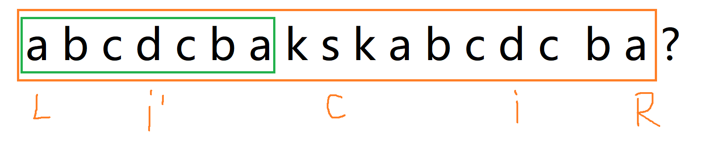

---
title: KMP 和 Manacher算法
date: 2022-12-07
tags:
 - js
categories:
 -  算法
---     

##  KMP       
1. 字符串匹配   
    + “字符串 P 是否为字符串 S 的子串？如果是，它出现在 S 的哪些位置？” 其中 S 称为主串；P 称为模式串   
2. 核心   
    + 利用子串的每一个字符对应的最长前缀nextArr，来标记匹配时的跳转位置，实现匹配的加速操作        
    ```js     
            while (i1 < str1.length && i2 < str2.length) {
              if (str1[i1] == str2[i2]) {
                i1++
                i2++
              } else if (next[i2] == -1) { //或者回到0位置
                i1++
              } else {
                i2 = next[i2] //跳转到对应前缀的后一位
              }
            }
            //i1 越界 或者i2越界    
            return i2 == str2.length ? i1 - i2 : -1   
    ```       
    + next数组    
    ```js     
          //next数组    
        function getNextArray(strArr) {
          if (strArr.length == 1) {
            return [-1]
          }
          let next = new Array(strArr.length)
          next[0] = -1
          next[1] = 0
          let i = 2 //
          let cn = 0
          while (i < next.length) {
            if (strArr[i - 1] == strArr[cn]) {
              next[i++] = ++cn //比之前的前缀+1，i++继续看下一个
            } else if (cn > 0) {
              //当前跳到cn位置的字符，和i-1位置的字符匹配不上,往前继续跳
              cn = next[cn] 
            } else {
              next[i++] = 0 //此处为0，并且i++继续看下一个
            }
          }
          return next
        }  
    ```       

##  Manacher   
  + Manacher算法本质上还是中心扩散法，只不过他用了类似KMP算法的技巧，充分挖掘了已经进行回文判定的子串的特点，实现了加速   

### 中心扩散法
  +  中心扩散法：回文串可以分为奇数回文串和偶数回文串，奇数回文串关于中心一个点对称，偶数回文串关于中心两个点对称，为了避免奇偶的影响，首先对原始字符串进行预处理，即添加分隔符。       
  1. 预处理   
      ```js   
          //预处理
          function manacherStr(str) {
            let strArr = str.split('')
            let resArr = new Array(str.length * 2 + 1)
            let index = 0
            for (let i = 0; i < resArr.length; i++) {
              resArr[i] = (i & 1) == 0 ? '#' : strArr[index++]
            }
            console.log(resArr);
            return resArr
          }   
      ```       
  2. 开始填写辅助数组p    
      + p记录了新字符串中以每个字符为中心的回文子串的信息      
          ```js     
            //str   # a # b # b # a # b #  b  #
            //index 0 1 2 3 4 5 6 7 8 9 10 11 12    
            //p     0 1 0 1 4 1 0 5 0 1 2  1  0
            p[0]=0 //以#为中心，同时向左右扩散，走一步就到边界，能扩散的步数为0   
            p[1]=1 //以a为中心，左右扩散能扩散的步数为1   
            p[2]=0 //以#为中心，扩散一步不是回文串，为0
            //...不难将上述p填满    
          ```   
  3. 辅助数组的最大值就是最长回文子串的长度   
      + 如果最大值是以字符为中心，那么扩散的时候是先分隔符，再子串，无论怎么样最后肯定是分隔符结尾    
      ```js     
           //2.辅助数组+中心扩散法
          var longestPalindrome = function(s){
              let strArr = getStrArr(s)
              let pArr = []//辅助数组 
              for(let i=0;i<strArr.length;i++){
                  pArr.push(makeArr(strArr,i))
              }
              console.log(pArr)
          }
          function makeArr(s,i){
              //获取对应每个字符的可扩散距离
              let count = 0
              let left = i
              let right = i
              while(left>0 &&right<s.length-1){
                  if(s[--left]==s[++right]){
                      count++
                  }else{
                      return count
                  }
              }
              return count
          }
      ```    
###  Manacher优化   
1. 核心思想就是在填写p数组的时候通过分析回文性质，来利用之前填写过的内容来间接获取当前位置的回文区域      
2. 我们就需要获取以下内容     
    1. 回文直径：从对称轴开始向左向右衍生，直到回文区域边界后统计的字符总数        
    2. 回文半径：从对称轴开始向左或向右衍生，直到回文区域边界后统计的字符总数       
    3. maxRight:到当前为止，记录向右扩展的最远边界    
    4. center：对应maxRight的回文中心的索引值     
    5. maxRight与center一一对应，**因此必须要同时更新**             
         
3. Manacher算法设计中有三个重要点     
    + 需要给被辅助字符处理的字符串中的每一个字符计算回文半径，从而构建一个回文半径数组      
    + 设置一个变量 R，记录之前匹配回文区域的所有字符中，回文边界达到的最右下标（初值为-1）    
    + 设置一个变量 C，和 R 一起用，记录当前取得最右下标的回文区域的中心点的下标（初值为-1，如果最右下标重合，按照原中心点的下标）       
4. 根据循环变量i与maxRight进行分情况讨论   
    1. 当`i>=maxRight`,即遍历的字符不在最右边界内，暴力扩          
    2. 当`i<maxRight`即遍历的字符在之前的最右边界内   
      + 此时`i`关于`center`的对称点`mirror`所对应的p值就很重要了（`mirror=2*center - 1`）            
        1. `mirror`回文区域完全在当前最大边界内部,即`p[mirror]<maxRight - i`,则`p[i]=p[mirror]`       
           
        2. i的对称点的回文区域有部分在当前最大边界外面，即`p[mirror]>maxRight - i` ，此时`p[i]=maxRight - i`       
                 
        3. i的对称点的回文区域和当前最大边界重合,即`p[mirror]<maxRight - i`,可以先`p[i]=p[mirror]`，在继续尝试暴力扩一步            
                 
    3. 综上：`p[i] = min(maxRight-i,p[mirror])`     
5. 伪代码   
    ```js     
        function manacher(s){
          //1221 --> #1#2#2#1#    
          //  s --> 处理成  strArr    
          let     
            for(let i = 0 ; i < strArr.length ; i++){
              if(i在R外部){
                //从i开始往两边暴力扩  R变大 i++
              }else{
                if(){
                  //i'的回文区域彻底在L..R内 i++
                }else if(){
                  //i'的回文区域有一部分在L..R外部 i++
                }else{
                  //i'的回文区域和L..R的左边界压线  
                  //从R之外的字符开始扩大，如果第一步扩失败了，R不变，否则R变大，i++    
                }
              }
            }
        }  
    ```       
6. 代码实现   
    ```js   


        function maxLcpsLength(s) {
          if (s == null || s.length == 0) return 0
          let strArr = manacherStr(s) //预处理-->#1#2#2#1#   
          let pArr = new Array(strArr.length)
          let center = 0 //中心
          let maxRight = 0   
          let maxLen = 1 //当前遍历的中心最大扩散步数，其值相当于原始字符串的最长回文子串的长度   
          let start = 0 //原始字符串的最长回文子串的起始位置
          for (let i = 0; i < strArr.length; i++) { //每个位置都求回文区域
            if(i<maxRight){
              pArr[i] =  Math.min(pArr[2 * center - i], maxRight - i) //关键
            }
            //下一次尝试扩散的左右起点
            let left = i-(1+p[i])
            let right = i+(1+p[i])
            
            while (right < strArr.length && left >= 0&&strArr[right] == strArr[left]) {
                pArr[i]++     //尝试扩一步
                left--
                right++
            }
            if (i + pArr[i] > maxRight) { //改变边界和中心点
              maxRight= i + pArr[i]
              center = i
            }
            max = Math.max(max, pArr[i])  //记录最长子串长度
            start = (i-maxLen)/2  //记录最长子串长度起始位置
          }
          console.log(pArr);
          return max
        }
        console.log(maxLcpsLength('abcdcbakskabcdcba'));  //17
    ```   