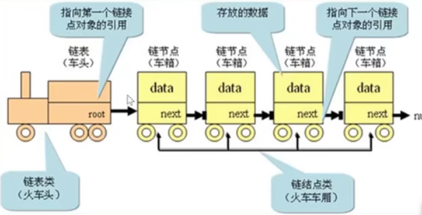
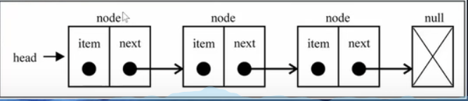

---
title: 数据结构---链表
date: 2022-12-11
tags:
 - js
categories:
 -  算法
---       

##  数据结构---链表   
+ **处理链表的本质，是处理链表结点之间的指针关系**

### 链表与数组的对比    

1.  数组    
  + 最常用的存储多个元素的数据结构    
  + 缺点：    
    1. 数组的创建通常需要申请**一段连续的内存空间**（一整块内存），并且大小是固定的，所以当当前数组**不能满足容量需求**时，需要**扩容**，（一般情况下是申请一个更大的数组，比如两倍，然后将原数组中的元素复制过去）   
    2. 而且在数组开头或者中间位置插入数据的成本很高，需要进行大量元素的位移   
    3. 尽管我们已经学过的js的Array类方法可以帮我们做这些事，但背后的原理依然是这样    

2. 链表   
    + 要存储多个元素，另外一个选择就是链表   
    + 但不同于数组，链表中的元素在内存中**不必是连续的空间**   
    + 链表的每一个元素由一个存储**元素本身的节点**和一个**指向下一个元素的引用**（指针）组成   
    + 优点：   
      1. 内存空间不是必须连续的，可以充分利用计算机的内存，实现灵活的**内存动态管理**   
      2. 链表不必再创建时就**确定大小**，并且大小可以**无限的延伸**下去   
      3. 链表在**插入和删除**数据时，**时间复杂度**可以达到O（1），相对数组效率高很多，只需要改变指针指向     
    + 缺点：  
      1. 链表访问任何一个位置的元素时，都需要**从头开始访问**。（无法跳过第一个元素访问任何一个元素）   
      2. 无法通过下标直接访问，需要一个个从头访问         

###   什么是链表    
1. 链表类似于火车：有一个火车头，火车头会链接一个节点，节点上有乘客（类似于数据），并且这个节点会链接下一个节点    
       
       

2. 链表  
      ```js
          //  1. 链表结点的创建  
          function ListNode(val) {
              this.val = val;
              this.next = null;
          }
          const node = new ListNode(1)  
          node.next = new ListNode(2)


          //2. 中间插入链表元素
          const node3 = new ListNode(3)  // 如果目标结点本来不存在，那么记得手动创建   
          node3.next = node1.next  // 把node3的 next 指针指向 node2（即 node1.next）
          node1.next = node3  // 把node1的 next 指针指向 node3


          //3. 链表元素的删除 (直接让它的前驱结点 node1 的 next 指针跳过它、指向 node3 的后继即可)
          node1.next = node3.next   //node3 就成为了一个完全不可抵达的结点了，它会被 JS 的垃圾回收器自动回收掉


          //4. 麻烦的访问操作
          const index = 10   // 记录目标结点的位置
          let node = head   // 设一个游标指向链表第一个结点，从第一个结点开始遍历
          for(let i=0;i<index && node;i++) {  // 反复遍历到第10个结点为止
              node = node.next
          }
      ```

3. 单向链表的封装
      ```js   
         //封装链表类
          function LinkedList(){
              //  内部的类：节点类    
              function Node(data,next = null){
                  this.data = data
              }
              //属性  
              this.head = null //头指针
              this.length = 0

              //1.追加方法    
              LinkedList.prototype.append = function(data){
                //1.创建新节点
                let newNode = new Node(data)
                //2.判断是否添加的是第一个节点
                if(this.length === 0){//2.1是第一个节点
                  this.head = newNode
                }else{//2.2不是第一个节点  
                  let current = this.head
                  while(current.next){
                    //找到最后一个节点
                    current = current.next 
                  }
                  //最后节点的next指向新的节点
                  current.next = newNode
                }
                //3.length+1
                this.length += 1
              }   

              //2.toString方法
              LinkedList.prototype.toString = function(){
                //1.定义变量
                let current = this.head
                let listString = ''
                //2.循环获取一个个的节点
                while(current){
                  listString += current.data + ' '
                  current = current.next
                }
                return listString
              }   

              //3.insert方法的实现    
              LinkedList.prototype.insert = function(position,data){
                //1.对position进行越界判断
                if(position < 0 || position > this.length) return false
                //2.创建节点           
                let newNode = new Node(data)   
                let current = this.head
                if(position == 0){
                  //如果加到头结点位置  
                  newNode.next = this.head
                  this.head = newNode
                }else{//其他位置position -1 的next指向自己。自己的next指向原来的position
                  let index = 0
                  let previous = null
                  while(index++ < position){
                    previous = current
                    current = current.next
                  }
                  newNode.next = current
                  previous.next = newNode
                }
                this.length += 1
                return true
              }     

              //4. get方法    
              LinkedList.prototype.get = function(position){
                //1.对position进行越界判断
                if(position < 0 || position >= this.length) return null  
                //2. 获取对应的data    
                let current = this.head
                let index = 0
                while(index++ < position){
                    current = current.next
                }
                return current.data
              }   

              //5.  indexOf方法
              LinkedList.prototype.indexOf = function(data){
                let current = this.head
                let index = 0
                while(current){
                  if(data == current.data) return index
                  current = current.next
                  index++
                }
                return -1
              } 

              //6. update(position,ele)方法   update(2,aaa)
              LinkedList.prototype.update = function(position,data){
                  //1.对position进行越界判断
                if(position < 0 || position >= this.length) return false 
                let current = this.head
                let index = 0
                while(index++ < position){//还没有找到position位置
                  current = current.next
                }
                current.data = data
                return true
              }     

              //7.removeAt方法  
              LinkedList.prototype.removeAt = function(position){
                  //1.对position进行越界判断
                if(position < 0 || position >= this.length) return false 
                let current = this.head
                let index = 0
                let previous = null
                if(position == 0){
                  this.head = current.next
                }else{
                  while(index++ < position){//还没有找到position位置
                    previous =current
                    current = current.next
                  }
                  previous.next = current.next
                }
                this.length--
                return true
              } 
              
              //8. remove方法       
              LinkedList.prototype.remove = function(data){
                let position = this.indexOf(data)
                return this.removeAt(position)
              } 
              //9.isEmpty()
              LinkedList.prototype.isEmpty = function(){
                return this.length === 0
              }  
              //10.size()
              LinkedList.prototype.size = function(){
                return this.length
              } 
            }
          let list = new LinkedList()   
      ```