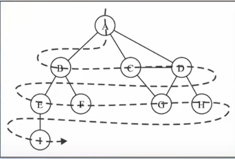
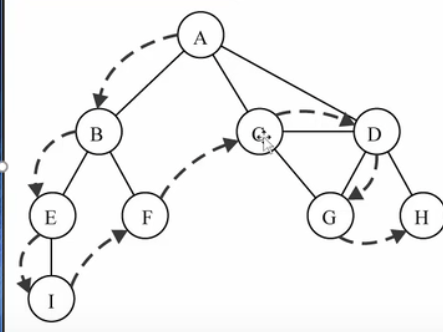

---
title: 数据结构---图
date: 2022-12-17
tags:
 - js
categories:
 -  算法
---       

##    数据结构---图   

### 图的封装    
  + 封装图结构
      ```js   
              //封装图结构
              function Graph() {
                //属性  顶点（数组）  边（字典）    
                this.vertexes = []
                this.edges = new Map()

                //方法    
                //1.添加顶点的方法    
                Graph.prototype.addVertex = function (v) {
                  this.vertexes.push(v)
                  this.edges.set(v, [])
                }
                //2.添加边的方法    
                Graph.prototype.addEdge = function (v1, v2) {
                  (this.edges.get(v1) || this.edges.set(v1, [])) && (this.edges.get(v1)).push(v2);
                    (this.edges.get(v2) || this.edges.set(v2, [])) && (this.edges.get(v2)).push(v1)
                }
                //3.实现tostring方法    
                Graph.prototype.toString = function () {
                  let resStr = ''
                  for (const [key, value] of this.edges) {
                    console.log(key, value)
                  }

                }
              }
              let graph = new Graph()     
      ```   
###   图的遍历      
1.  图的遍历思想    
    + 图的遍历思想是和树的遍历思想是一样的    
    + 图的遍历意味着需要将图中每个顶点访问一遍，并且不能有重复的访问    

2. 有两种算法可以对图进行遍历   
    + 广度优先搜索（Breadth-First Search） BFS    
    + 深度优先搜索（Depth-First Search）  DFS   
    + 两种遍历算法，都需要明确指定第一个被访问的顶点    

3. 两种算法的思想   
    + BFS： 基于队列，入队的顶点先被搜索    
    + DFS： 基于栈或使用递归，通过将顶点存入栈中，顶点是沿着路径被探索的，存在新的相邻顶点就去访问      

4. 为了记录顶点是否被访问过，我们使用三种颜色来反应他们的状态   
    + 白色：表示该顶点还没有被访问    
    + 灰色：表示该顶点被访问过，但并未被探索过    
    + 黑色：表示该顶点被访问过且被完全探索过    

### 广度优先搜索    
1.  广度优先搜索算法的思路    
    + 广度优先算法会从指定的第一个顶点开始遍历图，先访问其所有的相邻点，就像一次访问图的一层            
    + 换句话说，就是先宽后深的访问顶点    
2.  图解BFS   
       
3.  广度优先搜索的实现    
    1. 创建一个队列   
    2.  将V标注为被发现的（灰色），并将V推入队列Q   
    3.  如果Q非空，执行下面的步骤   
        + 将V从Q中取出队列    
        + 将V标注为被发现的灰色   
        + 将v所有的未被访问的领接点（白色），加入队列   
        + 将v置为黑色   
    4.  代码:   
        ```js   
             //实现广度优先搜索    
            Graph.prototype.bfs = function (initV, handler) {
              //1.初始化颜色    
              let colors = this.initializeColor()
              //2.创建队列    
              let queue = new Array()
              //3.顶点加入队列
              queue.push(initV)
              //4.循环从队列取元素
              while (queue.length) {
                //4.1 取出队列的一个顶点
                let v = queue.shift()
                //4.2获取相邻顶点
                let vList = this.edges.get(v)
                //4.3设置v的颜色
                colors[v] = 'gray'
                //4.4循环遍历所有顶点   
                for (let i = 0; i < vList.length; i++) {
                  let e = vList[i]
                  if (colors[e] == 'white') {
                    colors[e] = 'gray'
                    queue.push(e)
                  }
                }
                //4.5访问顶点
                handler(v)
                //4.6顶点设置黑色
                colors[v] = 'black'
              }
            }   
        ```   

### 深度优先搜索    
1.  深度优先搜索的思路:   
    +   深度优先搜索算法将会从第一个指定的顶点开始遍历图,沿着路径知道这条路径最后被访问了   
    +   接着原路回退并探索底一条路径        
2.  图解DFS   
       
3.  深度优先搜索算法的实现:     
    + 广度优先搜索算法我们使用的是队列,这里可以使用栈完成,也可以使用递归    
    + 方便代码书写,我们还是使用递归(递归本质上就是函数栈的调用)   
4.  代码    
    ```js   
         //深度优先搜索(dfs)   
          Graph.prototype.dfs =function(initV,handler){
            let colors = this.initializeColor()
            return this.dfsVisit(initV,colors,handler)
          }
          Graph.prototype.dfsVisit=function(v,colors,handler){
            colors[v] = 'gray'
            handler(v)
            let vList = this.edges.get(v)
            for(let i = 0;i<vList.length;i++){
              let e = vList[i]
              if(colors[e] == 'white'){
                this.dfsVisit(e,colors,handler)
              }
            }
            colors[v] = 'black'
          }   
    ```   
### 遍历框架    
1. 图其实就是一个高级点的多叉树   
    ```js   
        var visited = []; //如果包含环，遍历框架就要一个 visited 数组进行辅助
        var onPath = []; // 记录从起点到当前节点的路径

        /* 图遍历框架 */
        function traverse(graph, s) {
            if (visited[s]) return;
            // 经过节点 s，标记为已遍历
            visited[s] = true;
            // 做选择：标记节点 s 在路径上
            onPath[s] = true;
            for (var i = 0; i < graph.neighbors(s).length; i++) {
                var neighbor = graph.neighbors(s)[i];
                traverse(graph, neighbor);
            }
            // 撤销选择：节点 s 离开路径
            onPath[s] = false;
        }
    ``` 
### 环检测算法    
1. 看到依赖问题，首先想到的就是把问题转化成「有向图」这种数据结构，只要图中存在环，那就说明存在循环依赖
    ```js   
        var canFinish = function(numCourses, prerequisites) {
        // 记录一次递归堆栈中的节点
        var onPath = new Array(numCourses).fill(false);
        // 记录遍历过的节点，防止走回头路
        var visited = new Array(numCourses).fill(false);
        // 记录图中是否有环
        var hasCycle = false;
        function traverse(graph, s) {
            if (onPath[s]) {
                // 出现环
                hasCycle = true;
            }     
            if (visited[s] || hasCycle) {
                // 如果已经找到了环，也不用再遍历了
                return;
            }
            // 前序代码位置
            visited[s] = true;
            onPath[s] = true;
            graph[s].forEach(t => traverse(graph, t));
            // 后序代码位置
            onPath[s] = false;
        }
        for (var i = 0; i < numCourses; i++) {
            // 遍历图中的所有节点
            traverse(graph, i);
        }
        // 只要没有循环依赖可以完成所有课程
        return !hasCycle;
    };
    ```

