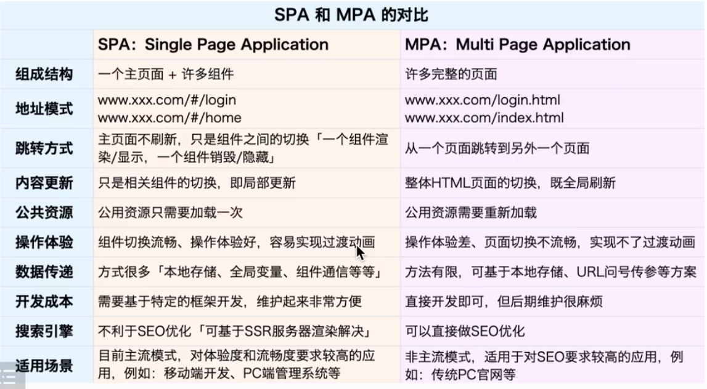

---
title: 前端路由机制
date: 2022-3-3
tags:
 - js
categories:
 -  神奇的API
---   
## 前端路由机制

1. **SPA 和 MPA的对比**
    

2. **hash路由实现机制**   
      ```html
            <body>
            <nav class="nav-box">
                  <a href="#/">首页</a>
                  <a href="#/product">产品中心</a>
                  <a href="#/personal">个人中心</a>
            </nav>
            <div class="view-box"></div>

            <!-- IMPORT JS -->
            <script>
                  /*
                    HASH路由 
                    + 改变页面的哈希值（#/xxx），主页面是不会刷新的
                    + 根据不同的哈希值，让容器中渲染不同的内容「组件」
                  */
                  // 获取渲染内容的容器
                  const viewBox = document.querySelector('.view-box');
                  // 构建一个路由匹配表：每当我们重新加载页面、或者路由切换（切换哈希值），都先到这个路由表中进行匹配；根据当前页面的哈希值，匹配出要渲染的内容(组件)！！
                  const routes = [{
                        path: '/',
                        component: '首页的内容'
                  }, {
                        path: '/product',
                        component: '产品中心的内容'
                  }, {
                        path: '/personal',
                        component: '个人中心的内容'
                  }];

                  // 路由匹配的办法
                  const routerMatch = function routerMatch() {
                        let hash = location.hash.substring(1),
                        text = "";
                        routes.forEach(item => {
                        if (item.path === hash) {
                              text = item.component;
                        }
                        });
                        viewBox.innerHTML = text;
                  };

                  // 一进来要展示的是首页的信息，所以默认改变一下HASH值
                  location.hash = '/';
                  routerMatch();

                  // 监测HASH值的变化，重新进行路由匹配
                  window.onhashchange = routerMatch;
            </script>
            </body>
      ```

3. history路由（浏览器路由）
    ```html
        <body>
            <nav class="nav-box">
                <a href="/">首页</a>
                <a href="/product">产品中心</a>
                <a href="/personal">个人中心</a>
            </nav>
            <div class="view-box"></div>

            <!-- IMPORT JS -->
            <script>
                /*
                History路由{浏览器路由} 
                  + 利用了H5中的HistoryAPI来实现页面地址的切换「可以不刷新页面」
                  + 根据不同的地址，到路由表中进行匹配，让容器中渲染不同的内容「组件」
                问题：我们切换的地址，在页面不刷新的情况下是没有问题的，但是如果页面刷新，这个地址是不存在的，会报404错误！！此时我们需要服务器的配合：在地址不存在的情况下，也可以把主页面内容返回！！
                */
                const viewBox = document.querySelector('.view-box'),
                    navBox = document.querySelector('.nav-box');

                // 点击A实现页面地址切换，但是不能刷新页面
                navBox.onclick = function (ev) {
                    let target = ev.target;
                    if (target.tagName === 'A') {
                        ev.preventDefault(); //阻止A标签页面跳转&刷新的默认行为
                        history.pushState({}, "", target.href);
                        // 去路由匹配
                        routerMatch();
                    }
                };

                // 路由匹配的办法
                const routes = [{
                    path: '/',
                    component: '首页的内容'
                }, {
                    path: '/product',
                    component: '产品中心的内容'
                }, {
                    path: '/personal',
                    component: '个人中心的内容'
                }];
                const routerMatch = function routerMatch() {
                    let path = location.pathname,
                        text = "";
                    routes.forEach(item => {
                        if (item.path === path) {
                            text = item.component;
                        }
                    });
                    viewBox.innerHTML = text;
                };

                // 默认展示首页
                history.pushState({}, "", "/");
                routerMatch();

                // 监听popstate地址变化事件；此事件：执行go/forward/back等方法（或者点击前进后退按钮）可以触发，但是执行pushState/replaceState等方法无法触发！！
                window.onpopstate = routerMatch;
            </script>
        </body>
    ```