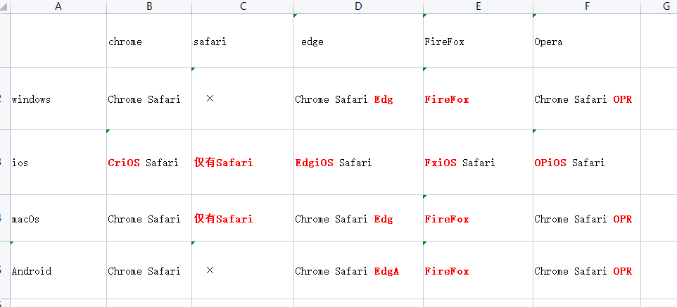

---
title: 获取浏览器版本以及版本号，用于处理兼容性问题
date: 2023-6-25
tags:
 - react
categories:
 -  untils
--- 

## 获取浏览器版本以及版本号，用于处理兼容性问题

1. code
    ```js
        export const getBrowserInfo = () => {
            const { userAgent } = navigator;

            const browserRegexList = [
                { name: 'Edge', regex: /(Edg|EdgiOS|EdgA)\/(\d+)/ },
                { name: 'Opera', regex: /(OPR|OPiOS)\/(\d+)/ },
                { name: 'Firefox', regex: /(Firefox|FxiOS)\/(\d+)/ },
                { name: 'Safari', regex: /(Version)\/(\d+)/ },
                { name: 'Chrome', regex: /(Chrome|CriOS)\/(\d+)/ },
            ];

            let browserName = 'Unknown';
            let browserVersion = 'Unknown';

            for (const { name, regex } of browserRegexList) {
                if (regex.test(userAgent)) {
                    browserName = name;
                    browserVersion = userAgent.match(regex)[2];
                    break;
                }
            }

            return {
                name: browserName,
                version: browserVersion,
            };
        };
    ```
2. 注意ios系统的版本识别会有所不同，比如chrome---crios等等，具体区别看下图
    