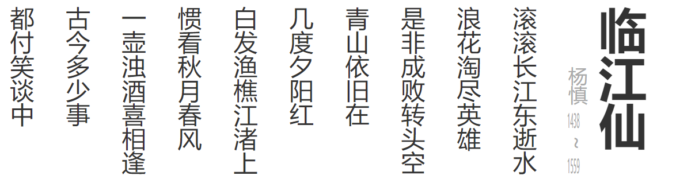

---
title: 调整文字方向
date: 2020-1-03
tags:
 - css
categories:
 -  css小知识
---       

## 调整文字方向   

1.  示例代码      

    ```html   
         <style>
          .poem {
            color: #333;
            font-size: 1.4em;
            writing-mode:vertical-rl;
          }
          .author {
            color: #aaa;
            font-size: 0.8em;
          }
        </style>
      </head>
      <body>
        <div class="poem">
          <h1>临江仙</h1>
          <div class="author">
            <span>杨慎</span>
            <span class="year">1438</span>
            <span class="to">~</span>
            <span class="year">1559</span>
          </div>
          <p>滚滚长江东逝水</p>
          <p>浪花淘尽英雄</p>
          <p>是非成败转头空</p>
          <p>青山依旧在</p>
          <p>几度夕阳红</p>
          <p>白发渔樵江渚上</p>
          <p>惯看秋月春风</p>
          <p>一壶浊酒喜相逢</p>
          <p>古今多少事</p>
          <p>都付笑谈中</p>
        </div>
      </body>     
    ```   

2. 修改代码       

      ```css    
           .poem {
            color: #333;
            font-size: 1.4em;
            writing-mode: vertical-rl;//调整整体文字书写方向
            float: right;
          }

          .author {
            color: #aaa;
            font-size: 0.8em;
            margin-right: -30px;
            text-align: end;  
          }

          .author .year {
            text-orientation: upright;  //调整文字朝向
            text-combine-upright: all;//文字朝向改变之后是否需要组合
          }     
      ```     

3.  展示图    
    