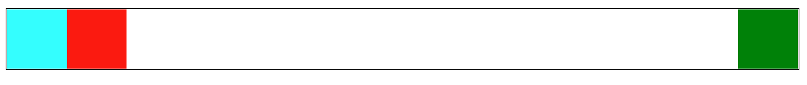
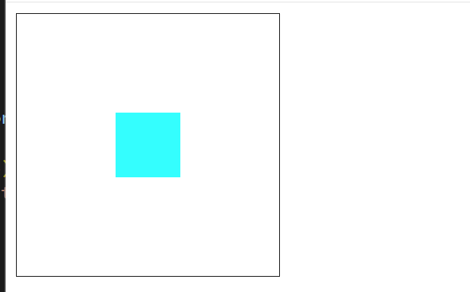
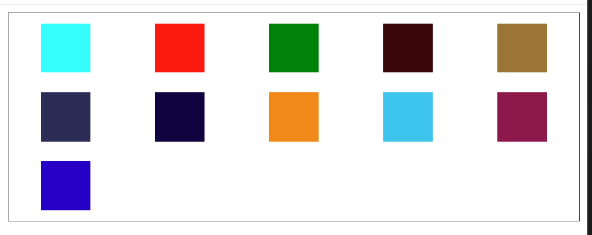

---
title: web布局
date: 2023-11-18
tags:
 - css
categories:
 -  css小知识
--- 

## 基础知识

1. **块元素遵循流方向，内联元素遵循写入方向**：书写方向会影响布局

2. `box-sizing`:
    + `content-box` : 设置此属性的容器 `width === content width`
    + `border-box` : 设置此属性的容器 `width === border + padding + content`

3. 因为拉丁语体系、阿拉伯语体系、汉语体系的书写模式（阅读模式）有所不同，如果按照以前的（例如margin-left）物理属性来布局，则css中的块和内联表现会有差异化。为了应对国际化业务，所以诞生了**逻辑属性**，用于构建一个多语种的web页面。比如`width <-> block-size`

## Flex布局

## Flex布局的基础使用

### **Flex容器**
+ HTML 中的可替代元素是无法成为 Flex 容器的，比如`img`、 `input`、 `select`等元素！
+ 当一个元素变成了 Flex 容器之后，它的**子元素**，包括**其伪元素** `::before` 、`::after` 和 **文本节点** 都将成为 **Flex 项目** 。
+ 注意，Flex 容器两轴的起点和终端同样受 `flex-direction` 、`writing-mode` 或 `direction` 属性值的影响。
+ 如果没有显式给 Flex 容器设置尺寸，则会根据**所有 Flex 项目的大小**来决定，或**根据 Flex 容器的父容器**来决定。
+ 如果需要显式设置 Flex 容器尺寸的话，使用逻辑属性** **`inline-size`** **或** **`block-size`** **更符合多语言的 Web 布局！**
+ **在 Flex 项目上使用** **`margin: auto`，会致使 Flex 项目上的** **`align-self`** **属性失效**。


###  **Flexbox 中空间是如何分配的？**

1. **分配空间过程**  
    + **计算 Flex 容器内的可用空间**: Flex 容器的主轴尺寸减去其 **内距（`padding`） ** 、 **边框宽度（`border-width`）** 、**间距（`gap`）** 和 **Flex 项目的外边距（`margin`）** 。
    + **将所有 Flex 项目的假想主尺寸与 Flex 容器的可用空间进行比较** 。来选择使用收缩因子或者扩展因子来改变**没有明确尺寸**的Flex项目

2. 当 Flex 容器有剩余空间时：
    + 可以使用主轴的对齐方式 `justify-content` 来分配主尺寸的剩余空间；
    + 可以使用侧轴的对齐方式 `align-content` 来分配侧尺寸的剩余空间。
    + 也可以使用 `flex` 属性中的 `flex-grow` 按比例因子来扩展 Flex 项目的尺寸

3. 当 Flex 容器是不足空间
    + Flex 项目在溢出之前，每一个 Flex 项目将会尽可能缩小到其最小内容（`min-content`）的尺寸。即 **Flex 项目一旦达到最小内容（`min-content`）大小， Flex 项目将开始溢出 Flex 容器** ！
    + 可以使用 `flex` 属性中的 `flex-shrink` 按比例因子来对 Flex 项目进行收缩

4. 每一个 Flex 项目因未显式设置任何与尺寸有关的属性，浏览器视每一个 Flex 项目的尺寸即为其内容的最大尺寸（`max-content`）

5. 常见缩写：
    + `flex:1  === 1 1 0%`  (**均分剩余空间，并不是均分容器所有空间**)，要实现等分空间 ` flex: 1; min-width: 0;`
    + `flex: none  ===  flex: 0 0 auto`  **（完全非弹性、不放大也不缩小）**
    + `flex: auto  ===  flex: 1 1 auto `  **（放大且缩小）**
    + `flex：0 1 auto` （默认值不放大会缩小）

6. 技巧：
    + 当给一个容器的 `width` 属性设置一个固定值时，有一个极大的缺陷，即 **内容断行** 或 **内容溢容器** ，尤其是内容溢出，它很有可能就会打破布局的美观。在 `.item` 上添加一个 `min-width` 就可以较好避免这种现象

###  Flex中的对齐方式

1. **空间分配属性**（Flex 容器）：
    + `justify-content`：沿 Flex 容器的主轴分配 Flex 容器的剩余空间；
    + `align-content`：沿 Flex 容器的侧轴分配 Flex 容器的剩余空间；
    + `place-content`：它是 `justify-content` 和 `align-content` 的简写属性。

2. **对齐属性**
    + `align-self`：沿 Flex 容器侧轴对齐单个 Flex 项目；
    + `align-items`：将所有 Flex 项目作为一个组，沿 Flex 容器侧轴对齐。

###  flex布局是**一维布局**的本质

+ Flex 容器在换行后会创建多个 **Flex 行** 。在空间分布方面，每一行就像一个新的 Flex 容器。
+ 因此，如果你要换行，则无法让第 2 行中的某些内容与它上面第 1 行中的某些内容对齐。这就是所谓的 Flex 容器是一维框（盒子）
+ 你只可以在独立的轴上（主轴或侧轴）也就是一行或一列上对齐 Flex 项目，但不能像 CSS Grid 那样同时在两个轴上控制 Grid 项目。
+ **`flex-wrap: wrap`** **(或** **`flex-wrap: wrap-reverse`)碰到了设置 `flex:1` 项目时，只有在 Flex 容器没有足够空间容纳 Flex 项目时（即，同一 Flex 行所有 Flex 项目最小内容宽度总和大于 Flex 容器宽度），才会让 Flex 项目换行（或列）

###  flex布局中的间距
1. `margin` 
    + 运用在 Flex 项目上，设置元素与元素之间的间距
    + 可以给 Flex 项目设置不同的外间距
    + 使用 `margin` 会让 Flex 项目与 Flex 容器之间有空白间距：
2. `gap` 
    + 运用在 Flex 容器上，定义**列与列** 或 **行与行** 之间的间距
    + 但它无法给 Flex 项目设置不同的外间距

###  简写属性
+ `flex-flow ： <flex-direction> <flex-wrap>`

###  flex实现自适应网格布局

1. code
    ```jsx
        <div className={style.colorPalette}>
            {colorPaletteArr.map((item, index) => {
                return <div
                className={`${[0, 1].includes(index) ? style.specialItem : style.nomarlItem} ${style.colorItem}`}
                style={{
                  backgroundColor: item.color,
                }}
                key={index}>
                {[0, 1].includes(index) ? item.name : ''}
              </div>
            })}
          </div>
    ```

2. css
    ```css
        .colorPalette{
          background-color: #fff;
          border-radius: 8px;
          display: flex;
          flex-wrap: wrap;
        }


        .colorItem{
          display: flex;
          align-items: center;
          justify-content: center;
          position: relative;
          color: #646464;
          font-size: 12px;
          height: 20px;
          border-radius: 4px;
          margin: 5px;
        }
        .nomarlItem{
          flex: 1 0 calc(25% - 10px); /* 每行最多4个元素，占据宽度的25%减去margin */
        }
        .specialItem{
          flex: 1 0 calc(50% - 10px);
        }
    ```

## 合理使用flex + margin 实现布局方案   
1. 案例一   
    
    ```html   
          <style>
            .box {
              display: flex;
              border: 1px solid black;
            }
            .item {
              width: 50px;
              height: 50px;
              background-color: aqua;
            }
            .box :nth-child(3) {
              margin-left: auto;   /*意思就是第三个子元素吃掉左侧的剩余空间  magin设置auto就是吃掉剩余空间*/
            }
          </style>
          <body>
            <div class="box">
              <div class="item" style="background-color: aqua;"></div>
              <div class="item" style="background-color: red;"></div>
              <div class="item" style="background-color: green;"></div>
            </div>
          </body>
    ```   
2. 案例二：垂直水平居中   
    
    ```html   
          <style>
            .box {
              display: flex;
              border: 1px solid black;
              width: 200px;
              height: 200px;
            }
            .item {
              width: 50px;
              height: 50px;
              background-color: aqua;
              margin: auto;   /*意思就是吃掉四周剩余空间  magin设置auto就是吃掉剩余空间*/
            }
          </style>
          <body>
            <div class="box">
              <div class="item" style="background-color: aqua;"></div>
            </div>
          </body>
    ```     
3. 案例三：适配类网格布局   
    
    ```html   
          <style>
            .box {
              display: flex;
              border: 1px solid black;
              flex-wrap: wrap;
            }
            .item {
              /* 利用变量控制维护  方便做不同屏幕适配每行几个的响应式布局*/
              --n: 7;
              --gap: calc((100% - 50px * var(--n)) / var(--n) / 2);
              width: 50px;
              height: 50px;
              background-color: aqua;
              /*父元素 - 总的子元素宽度 = 剩余空间  剩余空间分7份再平分给左右*/
              margin: 10px var(--gap);
            }
            @media screen and (min-width: 450px) {
              .item {
                --n: 5;
              }
            }
          </style>
          <body>
            <div class="box">
              <div class="item" style="background-color: aqua;"></div>
              <div class="item" style="background-color: red;"></div>
              <div class="item" style="background-color: green;"></div>
              <div class="item" style="background-color: rgb(60, 5, 9);"></div>
              <div class="item" style="background-color: rgb(156, 116, 50);"></div>
              <div class="item" style="background-color: rgb(41, 46, 88);"></div>
              <div class="item" style="background-color: rgb(12, 6, 65);"></div>
              <div class="item" style="background-color: rgb(245, 134, 8);"></div>
              <div class="item" style="background-color: rgb(36, 199, 239);"></div>
              <div class="item" style="background-color: rgb(143, 22, 76);"></div>
              <div class="item" style="background-color: rgb(2, 9, 199);"></div>
            </div>
          </body>
    ```


