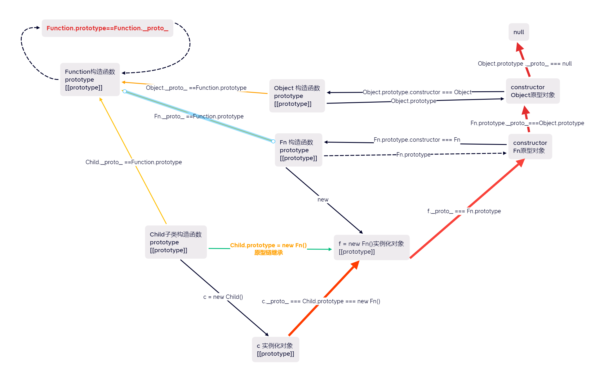

---
title: js中的构造函数--原型链--继承
date: 2023-3-01
tags:
 - es6
categories:
 -  es6
---       

+ 部分引入资源 ：   
     [](https://juejin.cn/post/6844904098941108232)   
     
##  前言     

+ 我们先来看一道面试题      
    ```js    
          function Foo(n){
            this.a=function(){
              console.log('这是实例化对象的a方法')
            }
            Foo.a =function(){ 
              console.log('这是内部FOO.a')
            }
          }
          Foo.a = function(){
            console.log('这是外部FOO.a')
          }
          Foo.prototype.b = function(){
            console.log('这是原型FOO.b')
          }
          Foo.a()//这是外部FOO.a   构造函数还未实例化，访问外部的方法
          let obj = new Foo()
          Foo.a()//这是内部FOO.a   构造函数实例化，优先内部的方法
          obj.a()//这是实例化对象的a方法   this定义的只能实例化对象访问
          obj.b()//这是原型FOO.b      未定义的方法，可以向原型上去找
          Foo.b()//Uncaught TypeError: Foo.b is not a function  原型上的方法构造函数不能直接访问          


          //class实现   
          class Star {
            constructor (name) {
              this.name = name
            }
            sing=function(){
                console.log('I can sing.')
              }
          }
          Star.dance = function() {
            console.log('I can dance.')
          }
          Star.prototype.getName = function(name){
              console.log('My name is ' + name);
          }
          let obj = new Star('aaa')
          Star.dance()   // I can dance.
          Star.sing() // Uncaught TypeError: Star.sing is not a function
          Star.getName('ldh') // Uncaught TypeError: Star.getName is not a function
          obj.sing()  //I can sing.
          obj.getName('obj')  //My name is obj
          console.log(obj.name)  //aaa
      
    ``` 
       
##  原型和原型链      
1. 首先我们来了解一下原型，我们在创建一个函数的时候，就会给函数创建一个`prototype`属性，同时会在内存中生成一个对象,对象中默认有一个`constructor`属性，函数的属性 `prototype` 指向这个对象,`constructor`属性指向函数,同时每一个函数(普通函数，构造函数,例如Object构造函数)也会存在一个`[[prototype]]`属性，这个属性我们可以通过废弃属性`__proto__`等价访问，他会指向大写的`Function`构造函数的`prototype`对象          
    ```js       
      function A (){} //构造函数    
      Object  //构造函数    
      function add(){}//普通函数    
      A.__proto__ ==Function.prototype  //true
      Object.__proto__ ==Function.prototype  //true
      add.__proto__ ==Function.prototype  //true
      A.prototype.constructor == A  //true
      Function.prototype.constructor == Function  //true
      Object.prototype.constructor == Object  //true
    ```     
2. 特殊的Function也是一个函数，也有自己的`prototype`和`[[prototype]]`属性，但是他的`prototype`和`[[prototype]]` 指向同一个地址,也就是   
    ```js   
        Function.prototype === Function.__proto__  
    ```     
2. 当把一个函数作为构造函数 (理论上任何函数都可以作为构造函数) 使用new创建对象的时候，那么这个对象就会存在一个默认的不可见的属性，来指向了构造函数的原型对象。 这个不可见的属性我们一般用 `[[prototype]]` 来表示，只是这个属性没有办法直接访问到(可以使用废弃的`__proto__`获取)   

##  原型链与继承            
     
1.  原型链继承    
      ```js 
          Son.prototype = new Dad()  //通过原型链链接继承了父类     
          Son.prototype.constructor = Son  //严谨一点
          // 实际上就是把Son类的prototype 指向了父类实例化的对象，     
          //优点：继承了父类的模板，包括父类的原型对象。
          //缺点：
          //1.创建子类时，无法向父类构造函数传参数。
          //2.无法实现多继承(因为已经指定了原型对象了)
          //3.如果要给子类的原型上新增属性和方法，就必须放在Son.prototype = new Dad()后面
          //4.来自原型对象的所有属性都被共享了，这样如果不小心修改了原型对象中的引用类型属性，那么所有子类创建的实例对象都会受到影响
          //5.没法继承父类的静态属性，静态方法        
      ```   
2. 构造函数继承   
      ```js  
            //把父类构造函数的代码搬过来，并改变this指向,可以传参  
            function Child () {
                Parent.call(this, ...arguments)
            }
          //使用父类的构造函数来增强子类实例，等于是复制父类的实例属性给子类。
          //优点：解决了原型链继承中子类实例共享父类引用对象的问题，实现多继承，创建子类实例时，可以向父类传递参数。
          //缺点：
          //1.不能继承父类原型的属性和方法。    
          //2.实例并不是父类的实例，只是子类的实例    
          //3.无法实现函数复用，每个子类都有父类实例函数的副本，影响性能。
      ```   
3. 组合式继承   
      ```js   
             // 原型链继承
            Child.prototype = new Parent()
            Child.prototype.constructor = Child
            // 构造继承
            function Child () {
              Parent.call(this, ...arguments)
            }           

            function Parent (name) {
              console.log(name) // 这里有个console.log()
              this.name = name
            }
            function Child (name) {
              Parent.call(this, name)
            }
            Child.prototype = new Parent()
            var child1 = new Child('child1')
            //undefined
            //child1
            //Child {name: "child1"}
            //Parent {name: undefined}
            console.log(child1)
            console.log(Child.prototype)
            //优点    
            //1. 可以继承父类实例属性和方法，也能够继承父类原型属性和方法   
            //2. 弥补了原型链继承中引用属性共享的问题   
            //3. 可传参，可复用       
            //缺点    
            //1.Parent.call(this, name)的时候执行了一遍父类构造函数里面的代码   Child.prototype = new Parent()时又执行了一遍其中的代码    
            //2. 并且生成了两个实例，子类实例中的属性和方法会覆盖子类原型(父类实例)上的属性和方法，所以增加了不必要的内存,Child.prototype因为链接了父类实例，但是父类实例中的属性方法其实已经赋值过去了   
            //3. 对于父类原型上的引用数据共享问题并没有解决
      ```       
4. 寄生组合继承   
      ```js       
          //利用Object.create(proto, propertiesObject) 创造一个空对象，并且可以指定这个对象的原型对象   
          //参数一，需要指定的原型对象    
          //参数二，可选参数，给新对象自身添加新属性以及描述器        
          // 与组合继承的区别
          Child.prototype = Object.create(Parent.prototype)   
          //优点    
          //1. 只调用了一次父类构造函数，只创建了一份父类属性   
          //2. 子类可以用到父类原型链上的属性和方法
          //3. 能够正常的使用instanceOf和isPrototypeOf方法
      ```     
5. 原型式继承   
      ```js       
          function objcet (obj) {
            function F () {};
            F.prototype = obj;
            F.prototype.constructor = F;
            return new F();
        }   
        //es6后等价于Object.create()    使用不多
      ```       
6. 寄生式继承   
      ```js       
          //在原型式继承的基础上再封装一层，来增强对象，之后将这个对象返回
          function createAnother (original) {
            var clone = Object.create(original);; // 通过调用 Object.create() 函数创建一个新对象
            clone.fn = function () {}; // 以某种方式来增强对象
            return clone; // 返回这个对象
        }
      ```         
7. 混入方式继承多个对象   
      ```js       
          function Child () {
              Parent.call(this)
              OtherParent.call(this)
          }
          Child.prototype = Object.create(Parent.prototype)
          Object.assign(Child.prototype, OtherParent.prototype)
          Child.prototype.constructor = Child
      ```     
8. class中的继承        
    1. extends的作用    
        + `class`可以通过`extends`关键字实现继承父类的所有属性和方法    
        + 若是使用了`extends`实现继承的子类内部没有`constructor`方法，则会被默认添加`constructor`和`super`,并且会把参数按照对应的顺序传给父类     
        + 子类必须得在`constructor`中调用`super`方法，否则新建实例就会报错，因为子类自己没有自己的`this`对象，而是继承父类的`this`对象          
        + `class B extends A {}`，只要A是一个有prototype属性的函数，就能被B继承          
            ```js       
                class Child extends Parent {}

                // 等同于
                class Child extends Parent {
                    constructor (...args) {
                        super(...args)
                    }
                }
            ```       
    2. super的作用        
      1. 当成函数调用     
         + 当super被当作函数调用时，代表着父类的构造函数,返回的是子类的实例,也就是说super内部的this指向的是Child     
         + 在子类的`constructor`中`super()`就相当于是`Parent.constructor.call(this)`     
              ```js     
                  class Parent {
                    constructor () {
                      console.log(new.target.name)
                    }
                  }
                  class Child extends Parent {
                    constructor () {
                      var instance = super()
                      console.log(instance)
                      console.log(instance === this)
                    }
                  }
                  var child1 = new Child()  //1.执行super()，即执行父类的constructor   Child    
                  //2.打印instance 子类实例   
                  //3.true
                  var parent1 = new Parent()//4.执行父类的constructor   Parent
                  console.log(child1)//5. Child {}
                  console.log(parent1)//6. Parent {}      
              ```   
         + 子类constructor中如果要使用this的话就必须放到super()之后    
         + super当成函数调用时只能在子类的construtor中使用       
      2. 当成对象来使用     
          + 在子类的普通函数中super对象指向父类的原型对象   
          + 在子类的静态方法中super对象指向父类
          + ES6规定，通过super调用父类的方法时，super会绑定子类的this。     
              ```js     
                  super.getSex.call(this)
                  // 即
                  Parent.prototype.getSex.call(this)
              ```
            
##   与原型有关的几个属性和方法     
1. prototype属性    
    + prototype 存在于构造函数中 (其实任意函数中都有，只是不是构造函数的时候prototype我们不关注而已) ，他指向了这个构造函数的原型对象。   
2. constructor属性    
    + `constructor`它是构造函数原型对象中的一个属性，正常情况下它指向的是原型对象     
    + 它并不会影响任何JS内部属性，只是用来标示一下某个实例是由哪个构造函数产生的而已    
    + 如果我们使用了原型链继承或者组合继承无意间修改了constructor的指向，那么出于编程习惯，我们最好将它修改为正确的构造函数        
        ```js     
            function A (){}
            let a = new A()
            //1. 通过a.__proto__来访问到原型对象    
            a.__proto__  === A.prototype    
            //2.通过a.constructor.prototype来访问到原型对象   
            a.constructor.prototype  === A.prototype    
        ```   
3. 判断方法   
    1. 使用instanceof 操作符可以判断一个对象的类型    
        ```js   
            var p1 = new Person();   
            alert(p1 instanceof Person);	// true   
            Function instanceof Function //true
            [] instanceof Array //true
            [] instanceof Object //true
           // 检测p1的原型链(__proto__)上是否有Parent.prototype
        ```       
    2. isPrototypeOf()    
        ```js       
          //判断指定对象object1是否存在于另一个对象object2的原型链    
         Object.prototype.isPrototypeOf([]) //true
         Array.prototype.isPrototypeOf([]) //true
        ```
    3. hasOwnProperty() 方法,可以判断一个属性是否来自对象本身,但是不能判断是否存在于原型中    
    4. in 操作符  ​ in操作符用来判断一个属性是否存在于这个对象中。但是在查找这个属性时候，现在对象本身中找，如果对象找不到再去原型中找。换句话说，只要对象和原型中有一个地方存在这个属性，就返回true      

##  封装    

## 静态、实例、私有   
1. 私有属性和方法：只能在构造函数内访问不能被外部所访问   
    + 在构造函数内使用var声明的属性   
    + 在class类中约定熟成用`_`开头或者`#`开头的属性     
    + 利用call改变this指向，把私有方法放在模块外部    
        ```js 
            class Widget {
              foo (baz) {
                bar.call(this, baz);
              }
              // ...
            }
            function bar(baz) {
              return this.snaf = baz;
            }   
        ```     
    + 将私有方法名字命名为一个Symbol值    
        ```js     
            const bar = Symbol('bar');
            const snaf = Symbol('snaf');
            export default class myClass{
              // 公有方法
              foo(baz) {
                this[bar](baz);
              }
              // 私有方法
              [bar](baz) {
                return this[snaf] = baz;
              }
              // ...
            };  
        ```
2. 公有属性和方法(或实例方法)：对象外可以访问到对象内的属性和方法，   
    + 在构造函数原型对象上比如`Cat.prototype.xxx`,class中
    + 在`constructor`中用`this`定义，
    + 或者在`constructor`外面用`=`号赋值的方法或属性    
    + `constructor`中定义的相同名称的属性和方法会覆盖在`class`里定义的              
3. 静态属性和方法：   \
    + 定义在构造函数上的方法(比如`Cat.xxx`)，   
    + 不需要实例就可以调用(例如`Object.assign()`)   
    + class类中加一个`static`关键字也可以           
4. 方法查询(属性的`enumerable`为`true`)      
    1. 使用`for...in...`能获取到实例对象自身的属性和原型链上的属性    
    2. 使用`Object.keys()`和`Object.getOwnPropertyNames()`只能获取实例对象自身的属性    
    3. 可以通过`Object.hasOwnProperty()`方法传入属性名来判断一个属性是不是实例自身的属性      