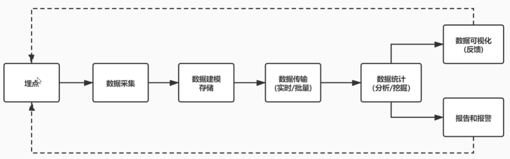
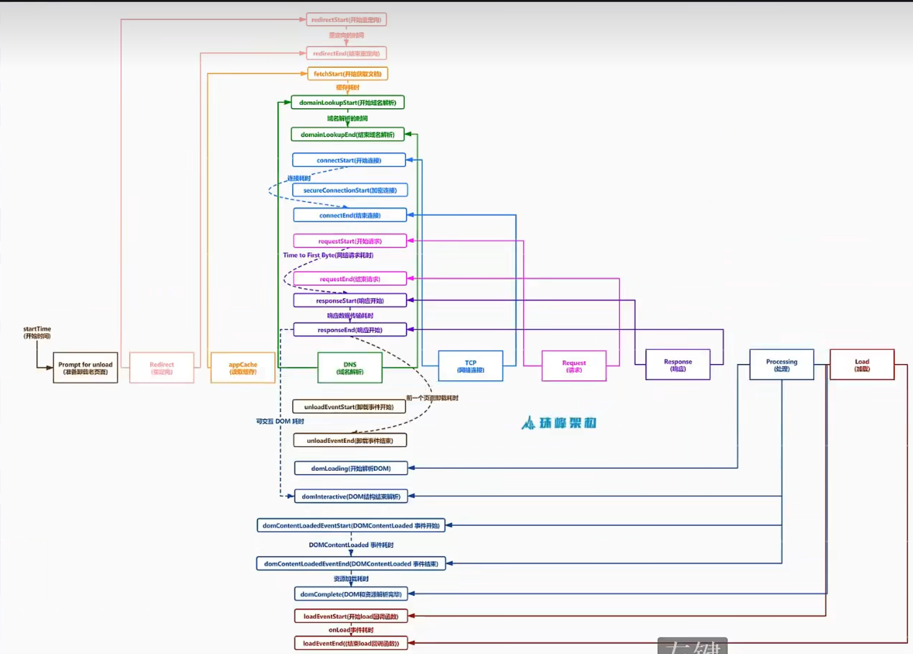
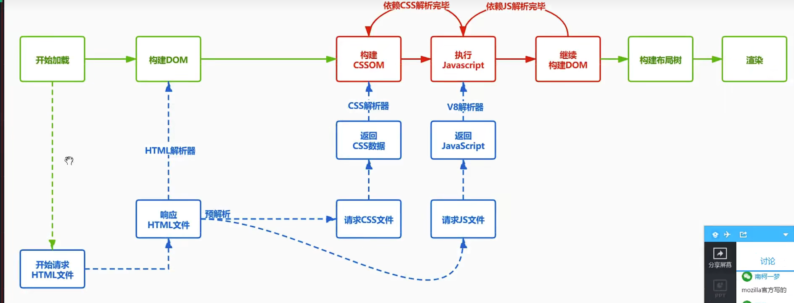

---
title: 前端监控
date: 2022-7-18
tags:
 - js
categories:
 -  面试细节
---   
## 为什么要做前端监控   
1. 更快的发现问题和解决问题   
2. 做产品的决策依据   
3. 提升前端工程师的技术深度和广度，打造简历亮点   
4. 为业务扩展提供了更多可能性       

## 前端监控目标   

### 稳定性--保证页面不出错    
1. js错误：js执行错误或者promise异常    
2. 资源异常：script、link等资源加载异常   
3. 接口错误：ajax或fetch请求接口异常    
4. 白屏：页面空白   

### 用户体验--保证加载速度，用户体验    
1. 加载时间：各个阶段的加载时间   
2. `TTFB(time to first byte)`(首字节时间)：是指浏览器发起第一个请求到数据返回第一个字节所消耗的时间，这个时间包含了网络请求时间、后端处理时   
3. `FP(First Paint)`(首次绘制)：首次绘制包括了任何用户自定义的背景绘制，它是将第一个像素点绘制到屏幕的时刻
4. `FCP(First Content Paint)`(首次内容绘制)：首次内容绘制是浏览器将第一个DOM渲染到屏幕的时间,可以是任何文本、图像、SVG等的时间
5. `FMP(First Meaningful paint)`(首次有意义绘制)：首次有意义绘制是页面可用性的量度标准
6. `FID(First Input Delay)`(首次输入延迟)：用户首次和页面交互到页面响应交互的时间
7. 卡顿：超过50ms的长任务   

### 业务--保证为业务扩展提供可能性    
1. PV：page view即页面的浏览量或点击量    
2. UV：指访问某个站点的不同IP地址的人数   
3. 页面停留时间：用户在每一个页面的停留时间       

##  前端监控流程    
     

##  常见埋点方案    
1. 代码埋点   
    + 代码埋点，就是以嵌入代码的形式进行埋点，比如需要监控用户的点击事件，会选择在用户点击时，插入一段代码，保存这个监听行为，或者直接将监听行为以某一种数据格式直接传递给服务器端    
    + 优点是可以在任意时刻，精确的发送或保存所需要的数据信息    
    + 缺点是工作量大    
2. 可视化埋点   
    + 通过可视化交互的手段，代替代码埋点    
    + 将业务代码和埋点代码分离，提供一个可视化交互的页面，输入为业务代码，通过这个可视化系统，可以在业务代码中自定义的增加埋点事件等等，最后输出的代码耦合了业务代码和埋点代码    
    + 可视化埋点其实就是用系统来代替手工插入埋点代码    
3. 无痕埋点   
    + 前端的任意一个事件都被绑定一个标识，所有事件都被记录下来    
    + 通过定期上传记录文件，配合文件解析，解析出来我们想要的数据，并生成可视化报告供专业人员分析    
    + 无痕埋点的优点是采集全量数据，不会出现漏埋和误埋等现象    
    + 缺点是给数据传输和服务器增加压力，也无法灵活定制数据结构          

## 搜集上报端（SDK） 

##  jsError     
1. 如何监听上报未捕获的JS报错，promise报错，脚本资源加载报错      
    + 监听上报
        ```js   
            window.addEventListener('error', event => { //监听全局未捕获的错误
                    let lastEvent = getLastEvent() //最后一个交互事件
                    if (event.target && event.target.src || event.target.href) { //link/脚本加载错误
                        tracker.send({
                        kind: 'stability', //监控指标的大类    
                        type: 'error', //小类型 这是一个错误
                        errorType: 'resouceError', //JS执行错误    
                        filename: event.target.src || event.target.href, //报错文件
                        tagName: event.error.tagName,
                        selector: getSelector(lastEvent.event.target), //最后一个操作的元素 
                        })
                    } else { //其他JS报错
                        tracker.send({
                        kind: 'stability', //监控指标的大类    
                        type: 'error', //小类型 这是一个错误
                        errorType: 'jsError', //JS执行错误    
                        message: event.message, //报错信息
                        filename: event.filename, //报错文件
                        position: `${event.lineno}:${event.colno}`,
                        stack: getLines(event.error.stack),
                        selector: lastEvent ? getSelector(lastEvent.path) : '', //最后一个操作的元素 
                        })
                    }
                })          

                window.addEventListener('unhandledrejection',event => { //监听全局未捕获的错误
                        let lastEvent = getLastEvent() //最后一个交互事件
                        let message
                        let filename
                        let line = 0
                        let column = 0
                        let stack = ''
                        let reason = event.reason
                        if (typeof reason === 'string') {
                            message = reason
                        } else if (typeof reason === 'object') {
                            //说明是一个错误对象   at http://localhost:8080/:23:38
                            if (reason.stack) {
                            let matchResult = reason.stack.match(/st\s+(.+):(\d+):(\d+)/)
                            filename = matchResult[1]
                            line = matchResult[2]
                            column = matchResult[3]
                            }
                            message = reason.stack.message
                            stack = getLines(reason.stack)
                        }
                        tracker.send({
                            kind: 'stability', //监控指标的大类    
                            type: 'error', //小类型 这是一个错误
                            errorType: 'promiseError', //JS执行错误    
                            message, //报错信息
                            filename, //报错文件
                            position: `${event.line}:${event.column}`,
                            stack,
                            selector: lastEvent ? getSelector(lastEvent.path) : '', //最后一个操作的元素 
                        }) //上报数据
                    })      

                    //格式化        
                    function getLines(stack) {
                            return stack.split("\n").slice(1).map(item => item.replace(/^\s+at\s+/g, "")).join('^')
                        }
        ```         
    + 处理选择器层级        
        ```js       
                function getSelectors(path) {
                        return path.reverse().filter(element => {
                            return element !== document && element !== window
                        }).map(element => {
                            let selector = ''
                            if (element.id) {
                            return `${element.nodeName.toLowerCase()}#${element.id}`
                            } else if (element.className && typeof element.className === 'string') {
                            return `${element.nodeName.toLowerCase()}.${element.className}`
                            } else {
                            selector = element.nodeName.toLowerCase()
                            }
                            return selector
                        }).join(' ')
                    }

                    export default function (pathsOrTarget) {
                        if (Array.isArray(pathsOrTarget)) { //数组路径
                            return getSelectors(pathsOrTarget)
                        } else { //脚本对象
                            let path = []
                            while (pathsOrTarget) {
                            path.push(pathsOrTarget)
                            pathsOrTarget = pathsOrTarget.parentNode
                            }
                            return path
                        }
                    }
        ```     
    + 上报xhr（以阿里云日志为例）       
        ```js    
                let logstoreName ='monitor-store'
                function getExtraData(){
                    return{
                        title:document.title,
                        url:location.href,
                        timestamp:Date.now(),
                        userAgent:userAgent.parse(navigator.userAgent).name
                    }
                }

                class SendTracker{
                    constructor(){
                        this.url = `/logstores/${logstoreName}/track HTTP/1.1`//上报路径
                        this.xhr = new XMLHttpRequest
                    }
                    send(data){
                        let extraData = getExtraData()
                        let log ={...data,...extraData}
                        //对象的值不能是数字    
                        for(let key in log){
                        if(Object.prototype.toString.call(log[key])=='[object number]'){
                            log[key] =`${log[key]}`
                        }
                        }
                        let body = JSON.stringify({
                        __log__:[log]
                        })
                        this.xhr.open('POST',this.uri,true)
                        this.xhr.setRequestHeader('Content-Type','application/json')
                        this.xhr.setRequestHeader('x-log-apiversion','0.6.0')
                        this.xhr.setRequestHeader('x-log-bodyrawsize',body.length)
                        this.xhr.onload =function(){
                        // console.log(this.xhr.response);
                        }
                        this.xhr.onerror =function(error){
                        // console.log(error);
                        
                        }
                        this.xhr.send(body)
                    }
                }
                export default new SendTracker()  
        ```     
## 接口报错采集上报     
+ 监控成功-失败-取消的请求      
    ```js       
        export default function injectXHR() {
            let XMLHttpRequest = window.XMLHttpRequest
            let oldOpen = XMLHttpRequest.prototype.open
            XMLHttpRequest.prototype.open = function (method, url, async) {
                if(!url.match(/logstores/) && !url.match(/sockjs/)){//防止监控上报接口出现死循环 webpack检测也不上报
                this.logData = {
                    method,
                    url,
                    async
                }
                }
                return oldOpen.apply(this, arguments)
            }
            let oldSend = XMLHttpRequest.prototype.send
            let startTime
            XMLHttpRequest.prototype.send = function (body) {
                if (this.logData) {
                startTime = Date.now()
                let handler = (type) => (event) => {
                    let duration = Date.now() - startTime
                    let status = this.status //200 500
                    let statusText = this.statusText //OK Server Error
                    tracker.send({
                    kind: 'stability',
                    type: 'xhr',
                    eventType: type, //load error abort 成功失败取消
                    pathname: this.logData.url,
                    status: status + '-' + statusText,
                    duration,
                    response: this.response ? JSON.stringify(this.response) : '',
                    params: body || ''
                    })
                }
                this.addEventListener('load', handler('load'), false)
                this.addEventListener('error', handler('error'), false)
                this.addEventListener('abort', handler('abort'), false)
                }
                return oldSend.apply(this, arguments)
            }
            }
    ```     
## 监控白屏     
+ 利用`elementsFromPoint`API来监控白屏
    ```js       
            export function blankScreen() {
                let wrapperElements = ['html', 'body', '#container', '.content.main'] //空白点
                let emptyPoints = 0

                function getSelector(element) {
                    if (element.id) {
                    return '#' + id
                    } else if (element.className) { //去除多个空格
                    return '.' + element.className.split(/ +/).join('.')
                    } else {
                    return element.nodeNamee.toLowerCase()
                    }
                }

                function isWrapper(element) {
                    let selector = getSelector(element)
                    if (wrapperElements.indexOf(selector) != -1) {
                    emptyPoints++
                    }
                }
                onload(function(){//注意要在页面加载完成之后才监控白屏  
                    for (let i = 1; i <= 9; i++) {
                    let xElements = document.elementsFromPoint(window.innerWidth * i / 10, window.innerHeight / 2)
                    let yElements = document.elementsFromPoint(window.innerWidth / 2, window.innerHeight * i / 10)
                    isWrapper(xElements[0])
                    isWrapper(yElements[0])
                }
                if (emptyPoints > 16) { //十字中心取18个点验证，有16个点是无效node，认定白屏了(阈值自定义)
                    let centerElements = document.elementFromPoint(window.innerWidth / 2, window.innerHeight / 2)
                    tracker.send({
                    kind: 'stability',
                    type: 'blank',
                    emptyPoints,
                    screen: window.screen.width + 'X' + window.screen.height,
                    viewPoint: window.innerWidth.width + 'X' + window.innerHeight,
                    selector: getSelector(centerElements[0])
                    })
                }
                })
            }
    ```         
+ 注意要在页面加载完成之后才监控白屏        
    ```js   
        function onload(callback){
            if(document.readyState === 'complete'){
                callback()
            }else{
                window.addEventListener('load',callback)
            }
        }
    ```     
## 用户体验指标     
1. 流程图       
     
2. DOM构建流程      
     
3. 性能指标     
    | 字段    | 描述                        | 备注            |         
    | ------- | --------------------------- | -------------------------|        
    | FP    | First Paint(首次绘制) | 包括了任何用户自定义的背景绘制，它是首先将像素绘制到屏幕的时刻 |      
    | FCP    | First Content Paint(首次内容绘制) | 是浏览器将第一个DOM渲染到屏幕的时间,可能是文本、图像、SVG等,这其实就是白屏时间 |     
    | FMP    | First Meaningful Paint(首次有意义绘制) | 页面有意义的内容渲染的时间 |        
    | LCP      | (Largest Contentful Paint)(最大内容渲染)  | 代表在viewport中最大的页面元素加载的时间 |      
    | DCL      |  (DomContentLoaded) DOM加载完成  | 当HTML文档被完全加载和解析完成之后,DOMContentLoaded事件被触发，无需等待样式表、图像和子框架的完成加载 |
    | L     | onLoad    | 当依赖的资源全部加载完毕之后才会触发 |
    | TTI | TTI (Time to Interactive)可交互时间   |  用于标记应用已进行视觉渲染并能可靠响应用户输入的时间点   |     
    | FID | FID First lnput Delay(首次输入延迟)  |  用户首次和页面交互(单击链接，点击按钮等)到页面响应交互的时间 |          
4. 获取对应性能指标              
    ```js       
        dom.setAttribute('elementtiming','meaningful') //只需给dom设置成FMP监控元素,不需要去获取，浏览器自动获取      
        
         let FP = performance.getEntriesByName('first-paint')[0]
         let FCP = performance.getEntriesByName('first-contentful-paint')[0]
    ```     
5. 上报性能指标数据
    ```js       
        export function timing() {
            let FMP, LCP
            //增加一个性能条目的观察者
            new PerformanceObserver((entryList, observer) => {
                let perfEntries = entryList.getEntries()
                FMP = perfEntries[0]
                observer.disconnect() //不再观察了
            }).observe({
                entryTypes: ['element']
            })

            new PerformanceObserver((entryList, observer) => {
                let perfEntries = entryList.getEntries()
                LCP = perfEntries[0]
                observer.disconnect() //不再观察了
            }).observe({
                entryTypes: ['largest-contentful-paint']
            }) //贯彻页面中有意义的元素

            new PerformanceObserver((entryList, observer) => {
                let firstInput = entryList.getEntries()[0]
                let lastEvent = getLastEvent()
                console.log(FID,firstInput) //交互时打印
                if (firstInput) {
                //processingStart开始处理的时间 startTime开始点击的时间，差值就是处理的延迟   
                let inputDelay = firstInput.proceeingStart - firstInput.startTime
                let duration = firstInput.duration //处理的耗时
                if (inputDelay > 0 || duration > 0) {
                    tracker.send({
                    kind: 'experience', //用户体验指标
                    type: 'firstInputDelay',
                    inputDelay,
                    duration,
                    startTime: firstInput.startTime,
                    selector: lastEvent ? getSelector(lastEvent.path || lastEvent.target) : ''
                    })
                }
                }
                observer.disconnect() //不再观察了
            }).observe({
                type: 'first-input',
                buffered: true
            }) //用户的第一次交互  

            onload(function () {
                setTimeout(() => {
                const {
                    fetchStart,
                    connectStart,
                    connectEnd,
                    requestStart,
                    responseStart,
                    responseEnd,
                    domLoading,
                    domInteractive,
                    domContentLoadEventStart,
                    domContentLoadEventEnd,
                    loadEventStart
                } = performance.timing;
                tracker.send({
                    kind: 'experience', //用户体验指标
                    type: 'timing', //统计每个阶段的时间
                    connectTime: connectEnd - connectStart, //连接时间
                    ttfbTime: responseEnd - requestStart, //首字节到达时间
                    responseTime: responseEnd - responseStart, //响应的读取时间
                    parseDOMtime: loadEventStart - domLoading, //DOM解析时间
                    domContentLoadedTime: domContentLoadEventEnd - domContentLoadEventStart,
                    timeToInteractive: domInteractive - fetchStart, //首次可交互时间
                    loadTime: loadEventStart - fetchStart, //完整的加载事件
                })
                //开始发送性能指标    
                let FP = performance.getEntriesByName('first-paint')[0]
                let FCP = performance.getEntriesByName('first-contentful-paint')[0]
                tracker.send({
                    kind: 'experience', //用户体验指标
                    type: 'paint', //统计每个阶段的时间
                    firstPaint: FP.startTime, 
                    firstContentfulPaint: FCP.startTime, 
                    firstMeaingfulPaint: FMP.startTime,
                    largestContentfulPaint: LCP.startTime, 
                })
                }, 3000)
            })
            }       
    ```         

## 总结要点         
1. `try catch`只能捕获同步错误，无法捕获语法错误（这个影响不大，一般开发阶段就处理了）和异步错误
2. 在 `promise` 中使用 `catch` 可以非常方便的捕获到异步 `error` ，这个很简单。为了防止有漏掉的 `Promise` 异常，建议在全局增加一个对 `unhandledrejection` 的监听 
3. `window.addEventListener('error', () => {)}, true)` 捕获资源脚本错误    
4. `Vue.config.errorHandler`      
5. `componentDidCatch(error, info)`       
6. 监控网页崩溃：`window` 对象的 `load` 和 `beforeunload`


