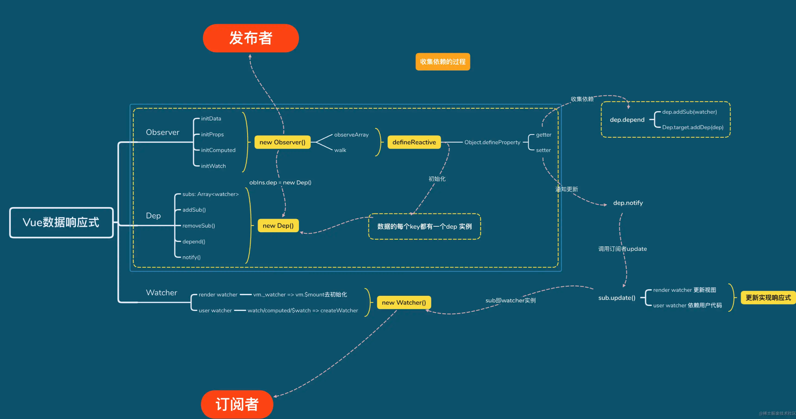
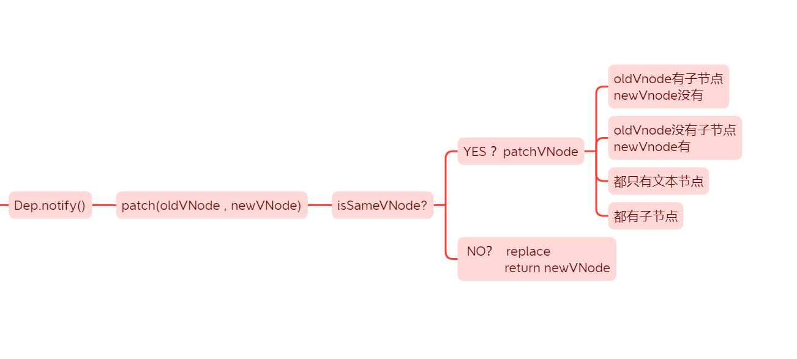

---
title: 面试 -- vue
date: 2021-12-26
tags:
 - vue
categories:
 -  面试细节
---     
##  vue面试题   
1.  **谈一下你对MVVM原理的理解**    
    + 传统的MVC是针对后端来说的，用户操作会请求服务端路由，路由会调用对应的控制器来处理,控制器会获取数据。将结果返回给前端,页面重新渲染，大量逻辑耦合在控制器(C)这一层，更新还要依赖于操作DOM，维护困难   
    + MVVM模式，model，view视图，viewModel(简化了controller这一层)，传统的mvvm要求不能手动操作视图更新，**vue借鉴了一部分思想**，可以通过ref来手动操作，也可以通过v-model自动更新，更加灵活   

2.  **vue2中为什么要用数据代理**      
    + vue2中先对data中的数据进行了数据劫持`observe(data)`   
    + 然后对data中的数据进行代理    
        ```js   
              vm._data = data  //我将返回的对象放到了_data上
              observe(data)  //数据劫持
              //将vm._data用vm来代理就可以了
              for(let key in data){
                proxy(vm,'_data',key)
              }     

              function proxy(vm,target,key){
                Object.defineProperty(vm,key,{  //把_data中的属性再vm上在添加一遍，这样我们就可以直接this.xxx获取数据，不用this._data.xxx来获取数据了   
                  get(){
                    return vm[target][key]
                  }
                })
              }  
        ```   
    + 目的就是：**为了获取属性方便，进行数据代理**    

3. **vue2和vue3响应式数据的理解**   
    + vue2中我们可以大致分为以下重点        
              
        1. **数据劫持**：在初始化数据的时候，vue2将data中的每个属性都使用`Obeject.defineProperty`增加了`getter`和`setter`的对象，并且还添加了`dep`，对于对象，使用`observe`递归的方式把每一个属性都确保执行以上操作，为了避免重复劫持，访问过的数据还被添加上了不可枚举的`__ob__`属性，类似图的遍历        
        2. **依赖收集**：当需要执行render函数时/computed/watch的时候，会new一个`Watcher`，并且赋值给全局变量`Dep.target`,这些就是`Watcher`，他会触发属性的`getter`，此时就会用`dep.depend`把这些`Watcher`收集起来   
        3. **数据监听**：等到数据发生改变了，就会触发`setter`，`setter`就会执行`dep.notify`，通知`Watcher`进行`update`      
        4. **异步更新**: `Watcher`会把自己交给调度器`Scheduler`,`Scheduler`会把`Watcher`进行升序排列，去重，添加到队列里，队列会把执行过程交给`nextTick`，`nextTick`会异步执行，重新执行`Watcher`，运行`render`函数，重新收集依赖....
        4. **数组方法重写**：因为操作变异方法，数组索引会发生改变，耗费性能，所以对变异方法进行重写，并且使用原型链的思想，让数组指向的隐式原型指向新创建的变异方法对象    
        5. **vue2响应式缺陷**       
            1. 给响应式对象新添加/删除一个属性的时候，视图不会更新     
                + 解决方案：`$set $delete`
                + 原理：    
                    1. 目标为数组时，则调用`splice`将修改的数据变为响应式   
                    2. **首先判断这个属性是否在这个对象上，如果存在则设置属性为对应的属性值后直接返回val**    
                    3. 目标对象为Vue实例或根数据对象则warn警告后返回    
                    4. 目标对象如果不是响应式对象则直接赋值返回   
                    5. 最后在给目标对象的属性添加响应式，通知dep实例的所有订阅者进行更新    
                        ```js     
                            defineReactive(ob.value, key, val) // 对新增的key做响应式处理
                            ob.dep.notify() // 通知依赖变更  
                        ```   
                + **<font color='red'>坑</font>**:当对象有一个非响应式属性，你不知道的情况下再次使用 `this.$set` 为对象再次添加同名属性   
                + **常规解法是先删除再添加**    
            2. 无法操作数组索引，或者操作数组长度来更改数组的值，去实现响应式   
                + `Object.defineProperty()`没办法监听数组长度的变化   
                + 通过数组索引改变数组的操作，性能差，vue建议通过其他操作来替换     
            3. 如何优化使用   
                + vue2中减少层级，数据嵌套不要过深    
                + 不需要响应式的数据定义在data的`return`外面，或者定义在data中，使用`Obeject.freeze`将属性值冻结   
                + 缓存使用过的变量，避免频繁调用get和set     
    + vue3则是采用`proxy`来监测整个对象     

4. **`vue-router` 的 `hash` 与 `history` 哪个模式会刷新页面**   
    1. `hash`模式     
        + hash 模式是一种把**前端路由的路径**用井号`#`拼接在真实`url`后面的模式。当井号`#`后面的路径发生变化时，浏览器并不会重新发起请求，而是会触发`onhashchange`事件。(`hash`的改变是记录在 `window.history` 中).
        + 因此，这并不算是一次 `http` 请求，所以这种模式不利于 `SEO` 优化。
        + `hash` 只能修改 `#`后面的部分，所以只能跳转到与当前 `url` 同文档的 `url`  
        + `hash` 永远不会提交到 `server` 端            
            ```js   
                window.addEventListener('hashchange', () => {   
                    // ...具体逻辑  无刷新跳转
                })      
            ```
    2.  `history` 模式      
        + 通过 `pushState` 、 `replaceState` 来实现无刷新跳转的功能,只会更新浏览器的历史记录     
        + 使用 `history` 模式时，在对当前的页面进行刷新时，此时浏览器会重新发起请求。如果 `nginx` 没有匹配得到当前的 `url` ，就会出现 `404` 的页面   
            ```js   
                // 新增历史记录
                history.pushState(stateObject, title, URL)
                // 替换当前历史记录
                history.replaceState(stateObject, title, URL)   
                window.addEventListener('popState', e => {
                    console.log(e.state);//点击后退按钮时会触发`popState`事件
                })  
            ```         
    3. 两种模式对比     
        + Hash 模式只可以更改`#`后面的内容，History 模式可以通过 API 设置任意的同源 URL     
        + History 模式可以通过 API 添加任意类型的数据到历史记录中，Hash 模式只能更改哈希值，也就是字符串        
        + Hash 模式无须后端配置，并且兼容性好。History 模式在用户手动输入地址或者刷新页面的时候会发起 URL 请求，后端需要配置`index.html`页面用于匹配不到静态资源的时候  

5. **vue中computed实现缓存的原理**    
    1. `computed`是响应式的：读取`computed`时会触发get，设置的时候触发set   
    2. 如何控制缓存   
        1. 如果没有缓存，那么每次读取C属性时都会去读取其所依赖的A,B属性，消耗性能   
        2. 通过数据标记，`watcher`上的属性`dirty`，如果`dirty`为`true`就会重新计算，false就会读取缓存   
    3. 依赖的data发生变化，computed如何更新   
        1. 因为C依赖于A，所以A可以收集到C的`watcher`    
        2. 当A发生改变，会把`watcher`上的dirty改为true    
        3. A还会收集使用了C的页面中的watcher，通知页面P更新，页面P就会重新读取计算属性    
        4. 更新完之后，会把dirty重新设置成false   

6. **Vue是如何实现性能优化的呢**    
    1. 观察者设定执行队列，**批量异步更新**      
        + 队列长度设定为100  以一个事件循环时间段为搜集时间        
        + 如果有更改过数据，那么就将对应的观察者直接推进队列中（执行的时候会进行根据id升序排序后执行）    
        + 同一个watcher被多次触发，只会被推入到队列中一次，避免不必要的计算和 DOM 操作          
        + Vue 在内部对异步队列尝试使用原生的 `Promise.then`、`MutationObserver` 和 `setImmediate`，如果执行环境不支持，则会采用 `setTimeout(fn, 0)` 代替      
    2. diff算法减少渲染开支   

7. **Vue依赖收集的时机**    
    1. 对于渲染`Watcher`和计算属性`Watcher`：也是在`beforeMounted`之后`mounted`之前进行依赖收集的。      
    2. 对于侦听器`Watcher`：是在`beforeCreate`之后`created`之前进行依赖收集的     
    3. 当通过vm.$set动态添加响应式数据时，也会去收集依赖        

8. **虚拟DOM和diff算法**    
    1. 首先虚拟DOM就类似于一个树结构，严谨的说法是**虚拟DOM配合diff算法会比直接渲染性能好**   
    2. diff算法是**基于同层级比较的深度优先算法**       
                  
    3. 首先会判断是否为同一类型的节点,**key值 / 标签名 /否都为注释节点 /是否都定义了data /标签为input时，type必须相同**，如果不同则直接替换，如果相同，走`patchVnode`   
    4. `patchVnode`   
        1. 找到对应的真实DOM，称为el    
        2. 判断`newVnode`和`oldVnode`是否指向同一个对象，如果是，那么直接`return`
        3. 如果他们都有文本节点并且不相等，那么将el的文本节点设置为`newVnode`的文本节点。   
        4. 如果`oldVnode`有子节点而`newVnode`没有，则删除el的子节点   
        5. 如果`oldVnode`没有子节点而`newVnode`有，则将`newVnode`的子节点真实化之后添加到el
        6. **如果两者都有子节点，则执行`updateChildren`函数比较子节点，这一步很重要**   
    5. `updateChildren`（首尾指针法）       
        1. `sameVnode(oldS, newS)`    
        2. `sameVnode(oldS, newE)`    
        3. `sameVnode(oldE, newS)`    
        4. `sameVnode(oldE, newE)`    
        5. 比对成功，就会在el中对应位置复用oldVNode，比对失败，先在`oldVnode`中能不能找到相同的key值，没有找到则直接生成`newVnode`,对应上了再去比较标签是不是相等...并且会将对应的首指针右移，尾指针左移        
    6. 为什么不建议使用`index`来作为`key`？   
        + 如果我们在首位添加一个元素，那么所有的节点的`index`就会发生变化，那么我们在进行`patchVnode`的时候，会将他们认定为`key`值不同的节点类型，所有的都会重新渲染，所以建议用独一无二的ID作为key     

9. **Vue中的模板编译原理**     
    1. 解析模板，将其转换成AST语法树        
    2. 标记静态节点（没有绑定动态属性/不是表达式/没有`v-if、v-for...`）       
    3. 代码生成，拼接`render`函数字符串 + `new Function` + `with`     

10. **Vue生命周期钩子**     
    1. 生命周期钩子 在内部会被vue维护成一个数组（vue内部有一个方法mergeOptions）和全局的生命周期合并最终转换成数组，当执行到具体流程时会执行钩子（发布订阅模式）        
    2. **在哪发请求都可以！！！**，主要是看发请求依赖什么，要做什么,**如果考虑SSR就要在created中请求（ssr没有mounted生命周期）**,如果需要操作DOM，那就在mounted里....       
    3. 父子组件生命周期     
        + 父beforecreate -> 父created -> 父beforeMount -> 子beforeCreate -> 子created -> 子beforeMount -> 子mounted -> 父mounted        
        + 父beforeUpdate -> 子beforeUpdate -> 子updated -> 父updated    

11. **data在组件中为什么必须是个函数**   
    1. 关键代码     
        ```js   
            function initData(vm){
                var data = vm.$options.data     
                data = vm._data = typeof data === 'function' ? getData(data , vm) : data || {}
            }      
        ```
    2. 如果是对象的话，那么new 一个新的组件实例的时候，data就会指向同一个对象地址，那我们在操作data数据的时候就会出现混乱       

12. **Vue.mixin的使用场景和原理**       
    1. Vue.mixin主要解决的问题就是公共逻辑抽离（react的高阶函数、hooks、compositionApi），他是面向对象程序设计语言中的类，提供了方法的实现。**其他类可以访问mixin类的方法而不必成为其子类**             
    2. 举例：弹框组件和提示框组件基本逻辑一致，那我们可以将其抽离出来，实现引用复用         
    3. 原理：通过`mergeOptions`方法，每个组件初始化的时候会将选项进行合并       
        + 替换型策略有`props、methods、inject、computed`，就是将新的同名参数替代旧的参数
        + 合并型策略是`data`, 通过`set`方法进行合并和重新赋值
        + 队列型策略有生命周期函数和`watch`，原理是将函数存入一个数组，然后正序遍历依次执行
        + 叠加型有`component、directives、filters`，通过原型链进行层层的叠加        

13. **`nextTick`原理**        
    + nextTick的功能是批处理，是由于 Vue 是异步执行 dom 更新的，一旦观察到数据变化，Vue 就会开启一个队列，然后把在同一个事件循环（event loop）当中观察到数据变化的 watcher 推送进这个队列。如果这个 watcher 被触发多次，只会被推送到队列一次。这种缓冲行为可以有效的去掉重复数据造成的不必要的计算和 dom 操作。而下一个事件循环开始时，Vue 会进行必要的 dom 更新，并清空队列（$nextTick方法就相当于在 dom 更新 和 清空队列后 额外插入的执行步骤）（本身内部采用了异步方法，但是在执行逻辑的时候是同步）      
    + 内部`Promise.then --> MutationObeserver --> SetImmediate --> SetTimeOut` 优雅降级     

14. **`computed`和`watch`的区别**   
    1. 这两个东西内部都是基于`Watcher`的        
    2. computed数据可以用于页面渲染，watch不行      
    3. computed只有在取值时才会执行对应的回调（lazy为true所以不会立即执行），watch默认会执行一次（为了拿到老的值）      
    4. computed用了一个dirty属性实现了缓存机制，多次取值如果依赖的值不发生变化不会更改dirty的结果，拿到的就是老的值     

15. **Vue异步组件的原理(async component)**       
    1. 对标图片的懒加载，流程就是先渲染一个空节点，之后组件加载完毕了，需要重新强制渲染         
        ```js   
            components: {
                    Card, Col, Row, Button, Icon,
                    checkout: () => import('./Checkout')
            },
            <Button @click="show = true" id="checkout">Checkout</Button>//点击按钮展示组件
            <div v-if="show">
                <checkout v-bind:shoppingList="shoppingList"></checkout>
            </div>

             
            // dynamic import
            import("./Message").then(Message => {
            // Message module is available here...
            });   
            const Message = () => ({
                component: import("./Message"),
                loading: LoadingAnimation,
                error: ErrorComponent
            });
        ```

16. **为什么`V-for`和`v-if`不能连用**       
    + vue2是`v-for`的优先级高一些,如果连用会在解析的时候，每次循环都会判断一下,会造成性能问题，可以用计算属性去替换     

17. **Vue组件传值方式以及区别**     
    + 父子通信：`props、emit`      
    + `eventBus`:就是创建一个事件中心，相当于中转站，可以用它来传递事件和接受事件。项目小的时候  用这个比较合适     
         ```js 
            bus.$on('event-name', (preload) => {
                    // ... a模块注册事件
            })     
            bus.$emit('event-name', preload); //b模块触发事件
         ```        
         + 容易出现重复触发的情景,大项目管理事件会十分混乱      
    + `Vuex`:组件之间全局共享数据;通过后端异步请求的数据        
        + 不能做数据持久化存储，刷新页面就要重制，要做数据持久化可以考虑使用 `localstorage`         
        + 增加额外的代码体积，简单的业务场景不建议使用      
    + `inject provide`：依赖注入，父组件可以直接向子孙组件传值    
        ```js   
                //父组件
                export default {
                      provide(){
                        return{
                            val:'这是home的依赖'  //依赖
                        }
                    }
                }   
                //孙组件        
                 export default {
                    inject:['val']  //注入
                 }
        ```         
        + 开发组件库可以使用，其他场景不建议使用，导致数据来源不明确        
        + 传递的属性是非响应式的，所以尽可能来传递一些静态属性                    
    + `$parent $children` 获取父子组件的实例 不建议，破坏单向数据流
    + `$refs` 父拿到子的实例      
    + `$attrs $listeners` 也可以通信，父组件传递给子组件所有的属性和方法           

18. **v-model的实现原理**       
    + v-model是`value + @input`事件的语法糖       
    + 如果放在表单元素上有一些差异，会被解析成一个指令，默认会给input事件拼接一个处理中文输入法的问题，在运行的时候对不同的类型做不同的处理，还会去处理修饰符       

19. **插槽**        
    + 具名插槽：构建一个映射表    
    + 普通插槽：是在父组件中渲染vnode的(只能用父组件的数据，渲染后传递给儿子)       
    + 作用域插槽：在子组件中渲染vnode的（可以使用子组件的数据来继续渲染）       

20. **组件中写name选项有什么好处**      
    + 如果有名字，他会自己注册一遍，可以循环使用自己        
    + 可以定位到具体的组件      
    + 使用`keep-alive`时，可搭配组件name进行缓存过滤              

21. **Vue事件修饰符有哪些**     
    + `stop、prevent、capture、self、once、passive`     

22. **keep-alive平时在哪里使用**        
    + 缓存组件的实例，因为组件的实例上有vm.$el--相当于缓存了dom元素。这样在切换的时候如果有缓存，直接可以复用上次渲染出的vm.$el的结果       
    + `keep-alive` 不用做任何渲染操作，内部使用了一个LRU算法来管理缓存（抽象组件）        
    + `keep-alive` 中组件切换的时候，插槽会触发更新，如果插槽的内容变化了，会重新渲染`$forceupdate`     

23. **如何封装组件**     
    1. 首先我们要思考组件是一个具有一定功能，且不同组件间功能模块相对独立的模块     
        + 组件由状态（`props`）、事件（`events`）和嵌套的片段（`slots`）组成      
        + 组件间通信，父子组件关系可以理解成`props down，event up`

24. **extend 能做什么**     
    + 作用是拓展组件生成一个构造器，通常会与 `$mount` 一起使用      
    + **使用场景**
        + 组件模板都是事先定义好的，如果我要从接口动态渲染组件怎么办？      
        + 所有内容都是在`#app`下渲染，注册组件都是在当前位置渲染。如果我要实现一个类似于`window.alert()`提示组件要求像调用 JS 函数一样调用它，该怎么办？        
    + extend 方法返回的 Sub 其实是一个构造函数，而且继承自 Vue，也就是说 extend 方法返回的是 Vue 的一个子类     

25. **子组件调用父组件方法总结**        
    1. 父组件把方法通过 props 传入子组件中，在子组件里面调用这个方法（hack）        
    2. 子组件触发`this.$emit('fn')`     
    3. 子组件触发`this.$parent.fn()`        

26. **自己封装的组件如何使用v-model**       
    + 允许一个自定义组件在使用 v-model 时定制 prop 和 event。默认情况下，一个组件上的 v-model 会把 value 用作 prop 且把 input 用作 event，但是一些输入类型比如单选框和复选框按钮可能想使用 value 来达到不同的目的。使用 model 选项可以回避这些情况产生的冲突        

27. **路由守卫**        
    1. 全局守卫:指路由实例上直接操作的钩子函数，特点是所有路由配置的组件都会触发，直白点就是触发路由就会触发这些钩子函数        
        ```js    
            - router.beforeEach(to, from, next)   （全局前置守卫）
            - router.beforeResolve(to, from, next)  （全局解析守卫）
            - router.afterEach(to, from)  （全局后置守卫）
            - 注：beforeEach 和 afterEach 都是 vue-router 实例对象的属性，每次跳转前 beforeEach 和 afterEach 都会执行的     
        ```     
    2. 路由独享守卫:是指在单个路由配置的时候也可以设置的钩子函数        
        ```js 
            {
                path: '/',
                name: 'Login',
                component: Login,
                beforeEnter: (to, from, next) => {
                    console.log('即将进入 Login');
                    next();
                }  
            }      
        ```     
    3. 组件内守卫: 是指在组件内执行的钩子函数，类似于组件内的生命周期，相当于为配置路由的组件添加的生命周期钩子函数     
        + `beforeRouterEnter(to, from, next)`：在渲染该组件的对应路由被 confirm 前调用，不能获取组件实例 this，因为当钩子执行前，组件实例还未被创建     
        + `beforeRouteUpdate(to, from, next)`：在当前路由改变，但是该组件被复用时调用。举例来说，对于一个带有动态参数的路径 /foo/:id，在 /foo/1 和 /foo/2 之间跳转的时候，由于会渲染同样的 Foo 组件，因此组件示例会被复用。而这个钩子就会在这种情况下被调用。可以访问组件示例     
        + `beforeRouteLeave(to, from, next)`：导航离开该组件的对应路由时调用，可以访问组件示例 this     
    4. 应用场景     
        + 只有当用户已经登录并拥有某些权限时才能进入某些路由        
        + 验证用户登录过期      
        + 表单组成的向导，例如注册流程，用户只有在当前路由的组件中填写了满足的信息才可以导航到下一个路由        
        + 当用户未执行保存操作而试图离开导航时提醒用户      

28. **`v-on`监听多个方法**      
    1. `v-on="{mouseenter: onEnter, mouseleave: onLeave}"`      
    2. `@mouseenter="onEnter" @mouseleave="onLeave"`        
    3. `@click="onEnter(), onLeave()"`

29. **说说你对 SPA 单页面的理解，它的优缺点是什么？**    
    + **页面局部刷新**    
    1. 优点     
        + 用户体验好、快，内容的改变不需要加载整个页面，避免了不必要的跳转和重新渲染        
        + 基于上面一点，SPA 相对于服务器的压力较小      
        + 前后端分离，架构清晰，前后端进行交互逻辑，后端负责数据处理        
    2. 缺点     
        + **初始加载耗时多：** 为实现单页面Web应用功能及显示效果。需要在加载页面的时候将JavaScript丶CSS统一加，部分页面按需加载     
        + **前进后退路由管理：** 由于单页面应用在一个页面中显示所有的内容，所以不能使用浏览器的前进后退功能，所有的页面切换需要自己建立堆栈管理     
        + **SEO难度较大：** 由于所有的内容都在一个页面中动态替换显示，所以在SEO上其有天然的弱势     

30. **Vue 的数据为什么频繁变化但只会更新一次**      
    + Vue 在更新 DOM 时是异步执行的，只要侦听到数据变化，Vue 将开启有个队列，并缓存在同一个事件循环中发生的所有数据变更。       
    + 如果同一个 watcher 被多次触发，只会被推入到队列中一次。这种在缓冲时去除重复数据对于避免不必要的计算和 DOM 操作是非常是要的。      
    + 然后，在下一个事件循环 tick 中，Vue 刷新队列并执行实际（已去重的）工作。Vue 在内部对异步队列尝试原生的 `Promise.then`，`MutationObserver` 和 `setTimmediate`，如果执行环境不支持，则会采用 `setTimeout(fn, 0)` 代替。     
31. **Vue 如何实现多个路由共用一个页面组件**        
    + **当多个路由共用同一个组件时，切换路由不会触发该组件页面的钩子函数。为了重新触发钩子函数，获取最新数据，有两种方式：**        
    1. 在 router-veiw 里添加 key 控制       
    2. 通过监听路由的方法来重新触发钩子函数     

32. **高性能渲染十万条数据**        
    1. **使用 requestAnimationFrame**       
        ```js   
            //需要插入的容器
            let ul = document.getElementById('container');
            // 插入十万条数据
            let total = 100000;
            // 一次插入 20 条
            let once = 20;
            //总页数
            let page = total/once
            //每条记录的索引
            let index = 0;
            //循环加载数据
            function loop(curTotal,curIndex){
                if(curTotal <= 0){
                    return false;
                }
                //每页多少条
                let pageCount = Math.min(curTotal , once);
                window.requestAnimationFrame(function(){
                    for(let i = 0; i < pageCount; i++){
                        let li = document.createElement('li');
                        li.innerText = curIndex + i + ' : ' + ~~(Math.random() * total)
                        ul.appendChild(li)
                    }
                    loop(curTotal - pageCount,curIndex + pageCount)
                })
            }
            loop(total,index);       
        ```

33. **路由传参**        
    1. 参数有几种写法？     
        + params参数：属于路径中的一部分，注意：在配置路由的时候，需要占位      
        + query参数：不属于路径中的一部分       
    2. 路由传参的三种形式            
        ```js   
                data() {
                    return {
                    keyword: "",
                    };
                },
                methods: {
                    goSearch() {
                    // 路由传参三种形式
                    // 第一种形式 字符串形式
                    this.$router.push("/search/" + this.keyword + "?k=" +   this.keyword.toUpperCase())
                    // 第二种形式 模板字符串形式
                    /this.$router.push(`/search/${this.keyword}?k=${this.keyword.toUpperCase()}`)
                    // 第三种形式 对象形式（常用）
                    this.$router.push({
                        name: "search",
                        params: { keyword: this.keyword },
                        query: { k: this.keyword.toUpperCase() },
                    });
                    },
                },    
        ```     
        + 使用参数            
            ```html       
                <template>
                <div class="first-page">
                    <!--下面这些方式在html中所作的跳转属于声明式的导航-->
                    <!-- <router-link> 默认会被渲染成一个 `<a>` 标签 -->
                    <router-link to="/third">跳到第三页</router-link>
                    <router-link :to="{path:'/third', query:{name:'andy凌云'}}">path-query方法跳到第三页</router-link>
                    <router-link :to="{name:'thirdPage', query:{nextName:'andy凌云2'}}">name-query方法跳到第三页</router-link>
                    <router-link :to="{name:'thirdPage', params:{nextName:'andy凌云222params'}}">name-params方法跳到第三页</router-link>
                    
                    <!-- 路由出口 -->
                    <!-- 路由匹配到的组件将渲染在这里 -->
                    <router-view></router-view>
                    
                    <!--在html中直接使用路由传递的数据的方式-->
                    {{$route.query.name}}
                    {{$route.params.nextName}}
                    <el-button @click="jumpThird">跳到第三页</el-button>
                </div>
                </template>

                <script>
                export default {
                name: "first",
                created() {
                    // 在跳转的目标页面, 获取传递的参数的方式(query和params), 获取参数都是对象形式
                    console.log(this.$route.query, "query");
                    console.log(this.$route.params, "params");
                },
                methods: {
                    jumpThird() {
                    //  下面这些在js中进行的跳转属于编程式导航
                    this.$router.push("/third");   // 只能跳转路由中path定义的， 不能是name
                    this.$router.push({ path: "/third", query: { name: "andy凌云" } });
                    this.$router.push({ name: "thirdPage", query: { age: 18 } });
                    this.$router.push({ name: "thirdPage", params: { age: 18 } });
                    }
                },
                };
                </script>  
                
                <script> 
                    export default new VueRouter ({  //router/index.js
                        routes:[
                                {
                                    path:'/search/:keyword',
                                    component:Search,
                                    meta:{show:true},
                                    name:'search'
                                },
                            ]
                    })
                </script> 
            ```     
    3. 页面刷新参数丢失的问题：params传参参数都是不可见的，可以理解为ajax中的post请求方式。**用query来传参可以理解为是ajax中的get方法，参数是直接在url后面添加的，参数是可见的**，或者存在sessionStorange或者localStorange中都是可行的

