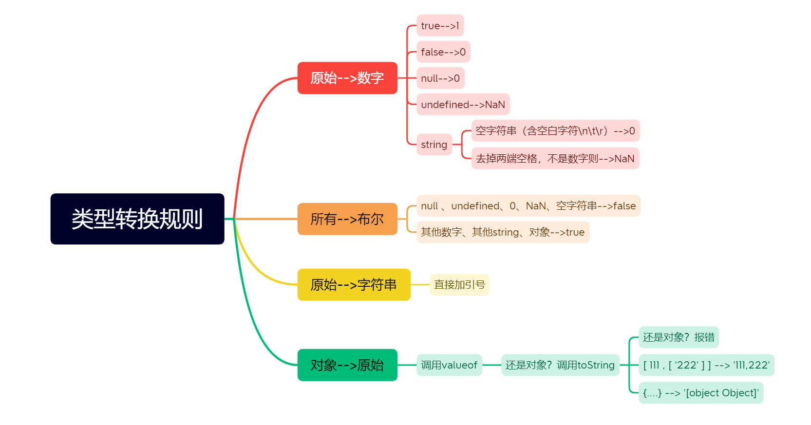
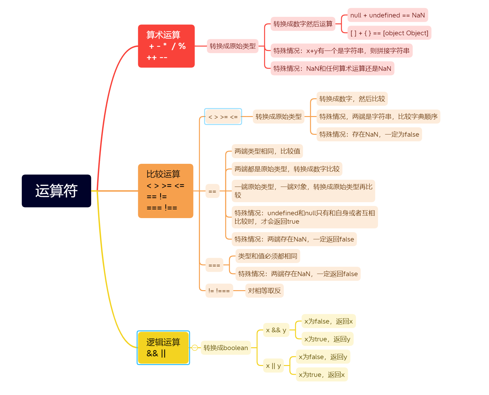

---
title: JS类型转换和运算符
date: 2022-4-2
tags:
 - js
categories:
 -  js小知识
---     

## 类型转换规则   
  + 思维导图    
         

## 运算符   
  + 思维导图    
         

## 表达式   
  + 数据分为字面量和变量，**数据与运算符的结合**就叫表达式，**表达式仍然是数据**    
  + 使用数据的地方可以用表达式的返回值表示
  + 应用    
      ```js     
        if(user){
          if(user.city){
            console.log(user.city.addr)  //防止对象属性出现null/undefined而报错需要判空
          }
        }  

        //改进1   
          if(user && user.addr){
            console.log(user.addr.city)
          }
        
        //改进2   
          console.log(user && user.addr && user.addr.city)
      ```