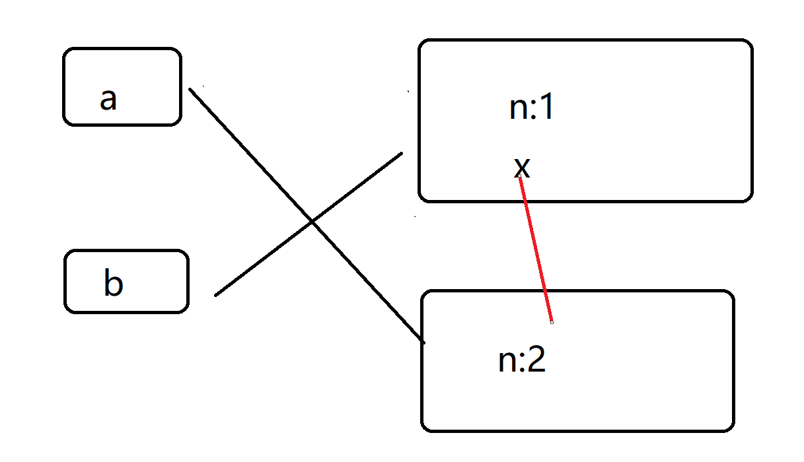

---
title: js赋值运算的坑
date: 2021-4-03
tags:
 - js
categories:
 -  面试细节
---     

## js赋值运算的坑   

      ```js  
          var a = {
            n: 1
          }
          var b = a
          a.x = a = {
            n: 2
          }
          console.log(a.x, b.x);  
      ```   

1. 赋值运算流程  
    1. 找到待赋值变量的内存地址，准备赋值  
    2. 运算右侧代码，得到要赋值的数据  
    3. 将右侧运算的数据放入到之前的地址中   
    4. 返回整个表达式的结果为右侧运算的数据     

2. 例子流程   
    1. 要对a.x进行赋值了，先找到a.x的地址，没有就新建一个地址，然后开始运算等式右边   
    2. 等式右边依旧是赋值，要对a进行赋值了，找到a的地址，然后运算等式右边   
    3. 将`{n:2}`与a的地址链接，a的赋值结束，然后a.x的地址是已经创建好了的，将`{n:2}`的与a.x进行链接   

    
