---
title: css学习笔记
date: 2021-01-02
tags:
 - css
categories:
 -  笔记
---  

## 基础知识  

1. **css简介**  
   web标准：结构（html）表现（css）行为（JavaScript）  
   最佳体验方式：结构、样式、行为相分离  
2. **css引入方式**  
    
  **电商网站首页必须使用内嵌式，加载速度快**  
   
3. **选择器**  
  + 后代选择器：符号是空格 `.nav a`  
  + 子代选择器：符号是大于 `.nav>p`  
  + 并集选择器：符号是逗号 `.nav，.header`  
  + 链接伪类选择器：重点记住`a{}`和`a:hover`  
  + `:focus`选择器：`input:focus` 记住这个写法  
  + 兄弟选择器：  
    1. 选择下一个兄弟：前一个+下一个  
    2. 选择下边所有的兄弟：兄~弟  
  + **属性选择器（css3）**  
  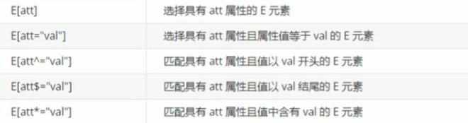  
  + **伪类选择器**  
    1. 这些伪类根据**所有的子元素**进行排序  
    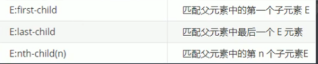  
      + n可以是数字和**公式（n+5表示从第五个开始到最后，-n+5表示前五个）**  
      + 2n或even表示选中**偶数位**的元素  
      + 2n+1 或odd表示选中**奇数位**的元素       
    2.  这几个伪类的功能和上述的类似，不通点是他们是在**同类型元素**中进行排序  
    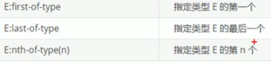  
      + `:not()`否定伪类：将符合条件的元素从选择器中去除  
      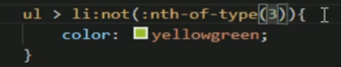  
    3. a元素的伪类  
      + `：link`表示没访问过的链接  
      + `：visited`表示访问过的链接（由于隐私的原因，这个伪类只能修改链接颜色）  
      + `：hover`表示鼠标移入的状态  
      + `：active`表示鼠标点击的状态  
  + **伪元素选择器**  
    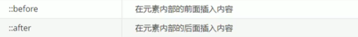  
    + before和after创建一个元素，但是属于<font color="red">行内元素</font>  
    + 新创建的这个元素在文档树中是找不到的，所以我们称为伪元素  
    + before和after **必须有content属性**  
    + 伪元素选择器和标签选择器一样，**权重为1**  
    + **伪元素选择器使用场景**  
      1. 伪元素字体图标  
      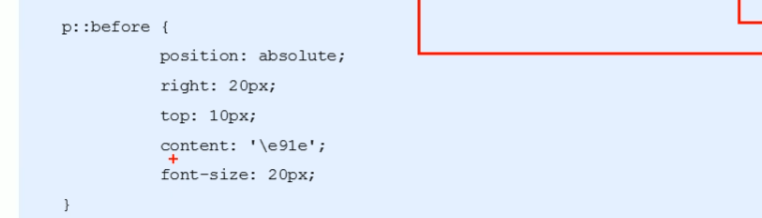  
      2. 仿土豆遮挡效果  
        
      1[](./csspic/css1pic/pic9.jpg)  

4. **背景**  
    
  1. `background-position`：通过方为`top center left`等设置必须同时指定两个值  
  2. `background-clip：`      
        + `border-box`默认值，背景会出现在边框的下边
        + `padding-box`背景不会出现在边框,只出现在内容区和内边距
        + `content-box`背景只会出现在内容区  
  3. `background-origin`：背景图片的偏移量计算的原点  
      + `padding-box` 默认值  
      + `background-position`从内边距处开始计算
      + `content-box`背景图片的偏移量从内容区处计算
      + `border-box`背景图片的变量从边框处开始计算  
  4. `background-size`:设置背景图片的大小  
      第一个值表示宽度,  第二个值表示高度, 如果只写一个，则第二个值默认是 auto  
      + `cover`图片的比例不变,将元素铺满  
      + `contain`图片比例不变,将图片在元素中完整显示  
  5. `background-attachment`: 背景图片是否跟随元素移动  
      + `scroll`默认值背景图片会跟随元素移动  
      + `fixed`背景会固定在页面中，不会随元素移动  
  6. `backgound`背景相关的简写属性  
      + `background-size`必须写在`background-position`的后边，并且使用/隔开  
      + `background-origin background-clip`两个样式，`orgin`要在`clip`的前边  
5. **css三大特性**  
  1. 层叠性  
      相同选择器给设置相同的样式，此时一个样式就会覆盖（层叠）另一个冲突的样式。**层叠性主要解决样式冲突的问题**  
      层叠性原则∶样式冲突，遵循的原则是就近原则，哪个样式离结构近，就执行哪个样式样式不冲突，不会层叠  
  2. 继承性  
      CSS中的继承:子标签会继承父标签的某些样式，如**文本颜色和字号**  
      恰当地使用继承可以简化代码，降低CSS样式的复杂性  
      子元素可以继承父元素的样式`( text-, font-， line-`这些元素开头的可以继承，以及`color`属性)  
    + **行高的继承性**  
      1. 行高可以跟单位也可以不跟单位  
      2. 如果子元素没有设置行高，则会继承父元素的行高为1.5此时子元素的行高是∶当前子元素的文字大小*1.5  
      3. body行高1.5这样写法的优势就是里面子元素可以根据自己文字大小自动调整行高  
  3. 优先性  
       
    1. 权重是有4组数字组成,但是不会有进位(进位据说要到255)。  
    2. 类选择器和属性选择器伪类选择器权重都是10  
    3. **继承的权重是0**，如果该元素没有直接选中，不管父元素权重多高，子元素都是0。     

## 网页布局--盒子模型  

1. **盒子模型**  
    + Css将页面中的所有元素都设置为了一个矩形的盒子  
    + 将元素设置为矩形的盒子后，对页面的布局就变成将不同的盒子摆放到不同的位置  
    + 每一个盒子都由一下几个部分组成:  
      + 内容区`（content) ` 
      + 内边距`（padding)`  
      + 边框 ` （border) `  
      + 外边距`（margin)`  
2. **边框**  
    **边框的大小会影响到整个盒子的大小**  
      + `border-width`:默认值，一般都是3个像素  
      + `border-width`可以用来指定四个方向的边框的宽度（四个值:上右下左）  
      + `border-color`可以分别指定四个边的边框规则和`border-width`一样  
                      也可以省略不写，如果省略了则自动使用`color`的颜色值  
      + `border-style`指定边框的样式 `solid`表示实线,`dotted`点状虚线,`dashed`虚线,`double`双线,默认值是`none`表示没有边框  
      + `border`简写属性，通过该属性可以同时设置边框所有的相关样式，并且没有顺序要求  
    **表格的细线边框** 
      + `border-collapse`属性控制浏览器绘制表格边框的方式。它控制相邻单元格的边框。  
      + `border-collapse:collapse;`示相邻边框合并在一起    
3. **内边距**  
    1. <font color="red">padding影响了盒子实际大小。</font>  
    2. 如果<font color="red">盒子已经有了宽度和高度</font>，此时再指定内边框，会<font color="red">撑大盒子。</font>  
    3. 背景颜色会延伸到内边距上  
    + **解决方案**  
        + 如果盒子本身没有指定`width`或者`height`，就不会撑大盒子，给100%也会撑大  
4. **外边距**  
    1. 外边距<font color="red">不会影响盒子</font>可见框的大小-但是外边距<font color="red">会影响</font>盒子的位置  
    2. 元素在页面中是按照自左向右的顺序排列的  
      + 所以默认情况下如果我们设置的<font color="red">左和上</font>外边距则会<font color="red">移动元素自身</font> 
      + 而设置<font color="red">下和右</font>外边距会<font color="red">移动其他元素</font>  
    3. `margin`会影响到盒子<font color="red">实际占用空间</font>  
    4. **<font color="red">外边距合并</font>**  
      使用`margin`定义块元素的垂直外边距时，可能会出现外边距的合并  
      1. 相邻块元素垂直外边距的合并（一般都是有利的）  
        + 相邻的垂直方向外边距会发生重叠现象  
        + 兄弟元素间的相邻垂直外边距会取两者之间的较大值  
      2. **嵌套块元素垂直外边距的塌陷**  
        + 对于两个嵌套关系(父子关系）的块元素，父元素有上外边距同时子元素也有上外边距，此时父元素会塌陷较大的外边距值  
      3. **<font color="red">解决方案</font>**  
        1. 可以为父元素定义上边框。  
        2. 可以为父元素定义上内边距  
        3. 可以为父元素添加overflow:hidden。  
        4. 还有其他方法，比如浮动、固定，绝对定位的盒子不会有塌陷问题。  
        5. 注意∶**行内元素**为了照顾**兼容性**，尽量**只设置左右内外边距**，不要设置上下内外边距。但是转换为块级和行内块元素就可以了  
5. **盒子大小**  
    默认情况下，盒子可见框的大小由内容区、内边距和边框共同决定  
    + `box-sizing`用来设置盒子尺寸的计算方式（设置`width`和`height`的作用)  
       + `content-box`默认值，宽度和高度用来设置**内容区的大小**  
       + `border-box`宽度和高度用来设置整个盒子**可见框的大小**  
    + **<font color="red">如果盒子模型我们改为了box-sizing: border-box，那padding和border就不会撑大盒子了(前提padding和border不会超过width宽度)</font>**  
6. **元素的水平方向的布局**  
    元素在其父元素中水平方向的位置由以下几个属性共同决定  
    `margin-left、border-left、padding-left、width、padding-right、border-right、margin-right` 
    当我们开启了绝对定位后:水平方向的布局等式就需要添加`left`和`right`两个值  
    一个元素在其父元素中，水平布局必须要满足以下的等式  
    **上述属性之和= 其父元素内容区的宽度（必须满足）**  
    如果相加结果使等式不成立，则称为**过渡约束**，则**等式会自动调整**  
    如果9个值中没有`auto`则调整`right`值，如果有`auto`，则调整`auto`的值  
      + 可设置`auto`的值：`margin width left right`  
      + 因为`left`和 `right`的值默认是`auto`，所以如果不知道`left`和`right`,则等式不满足时，会自动调整这两个值  
7. **垂直方向布局**  
    默认情况下父元素的高度被内容撑开,子元素是在父元素的内容区中排列的  
    如果子元素的大小超过了父元素，则子元素会从父元素中溢出使用`overflow`属性来设置父元素如何处理溢出的子元素  
      + `visible`，默认值子元素会从父元素中溢出，在父元素外部的位置显示  
      + `hidden`,溢出内容将会被裁剪不会显示  
      + `scroll`,生成两个滚动条，通过滚动条来查看完整的内容  
      + `auto`,根据需要生成滚动条  
8. **行内元素的盒模型**  
   + 行内元素不支持设置宽度和高度  
   + 行内元素可以设置`padding`，但是垂直方向`padding`不会影响页面的布局  
   + 行内元素可以设置`border`，垂直方向的`border`不会影响页面的布局  
   + 行内元素可以设置`margin`，垂直方向的`margin`不会影响布局  
  + **`display`用来设置元素显示的类型**  
    + `inline`将元素设置为行内元素`block` 将元素设置为块元素  
    + `inline-block`将元素设置为行内块元素  
    + `table`将元素设置为一个表格  
    + `none`元素不在页面中显示  
  + **visibility用来设置元素的显示状态**  
    + `visible`默认值，元素在页面中正常显示  
    + `hidden`元素在页面中隐藏不显示，但是依然占据页面的位置  
9. **轮廓、阴影 圆角**  
  1. 圆角  
    `border-radius`属性用于设置元素的外边框圆角   
      +  `border-radius : length;`（参数值可以为数值或百分比的形式）  
      +  如果是正方形，想要设置为一个圆，把数值修改为高度或者宽度的一半即可，或者直接写为50%  
      + 如果是个矩形,设置为高度的一半就可以做  
      + 该属性是一个简写属性，可以跟四个值，分别代表左上角、右上角、右下角、左下角,分开写: `border-top-left-radius、border-top-right-radius、border-bottom-right-radius和border-bottom-left-radius`  
  2. 阴影  
    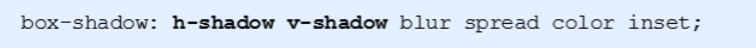  
    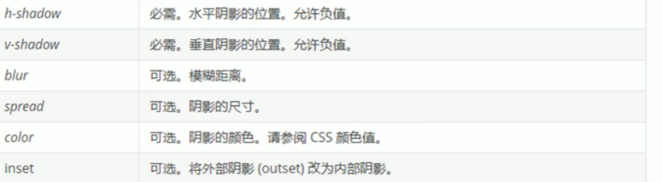  
    1. 默认的是外阴影(`outset)`,但是不可以写这个单词,否则导致阴影无效  
    2. 盒子阴影不占用空间，不会影响其他盒子排列  
  3. 文字阴影  
    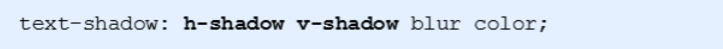  

## 网页布局--元素网页水平垂直居中方法总结  
  在学习元素水平垂直居中问题之前，我们先分别认识不同类型的元素水平、垂直居中的方式有哪些  

1. 水平居中  
  + `inline`元素: `text-align: center`  
  + `block`元素:`margin: auto`  
  + `absolute`元素:`left: 50% + margin-left`负值  
2. 垂直居中  
  + `inline`元素:`line-height`的值等于`height`值  
  + `absolute`元素: `top: 50%+ margin-top`负值  
  + `absolute`元素: `transform: translate (-50%,-50%)`  
  + `absolute`元素: `top, left, bottom, right = 0 + margin: auto`  
3. 元素网页居中  
  + 我们要注意分清楚元素是否已知宽高等信息，一般来说面试默认都是未知宽高的，那我们在使用`margin`的时候就不能使用具体值了  
  + 然后可以结合上方的方法基本搭配使用了，利用平移百分比的方式可以实现

## 网页布局--浮动  
1. 传统网页布局的三种方式  
    + 网页布局的本质——用CSS来摆放盒子。把盒子摆放到相应位置CSS提供了三种传统布局方式(简单说,就是盒子如何进行排列顺序)∶  
      普通流(标准流)、浮动、定位  
    + **标准流**  
      所谓的标准流:就是标签按照规定好默认方式排列.  
      1. 块级元素会独占一行，从上向下顺序排列。  
        常用元素:`div、hr、p、h1~h6、ul、ol、dl、form、table `  
      2. 行内元素会按照顺序，从左到右顺序排列，碰到父元素边缘则自动换行。  
        常用元素: `span、a、i、em`等  
      以上都是标准流布局，我们前面学习的就是标准流，**标准流是最基本的布局方式**。  
      这三种布局方式都是用来摆放盒子的，盒子摆放到合适位置，布局自然就完成了。  
      注意∶<font color="red">实际开发中，一个页面基本包含了三种布局方式，后面移动端学习新的布局方式。</font>  
2. 什么是浮动  
    `float`属性用于创建浮动框，将其移动到一边，直到左边缘或右边缘触及包含块或另一个浮动框的边缘。  
3. 为什么需要浮动  
    + 总结∶有很多的布局效果，标准流没有办法完成，此时就可以利用浮动完成布局。因为浮动可以改变元素标签默认的排列方式.  
    + 浮动最典型的应用:可以让多个块级元素一行内排列显示。  
    + <font color="red">网页布局第一准则∶多个块级元素纵向排列找标准流，多个块级元素横向排列找浮动。</font>  
4. 浮动元素会具有行内块元素特性。  
    + 任何元素都可浮动。不管原先是什么元素，添加浮动之后有<font color="red">行内块元素</font>相似的特性。  
    + 如果块级盒子没有设置宽度，默认宽度和父级一样宽，但是添加浮动后，它的<font color="red">大小根据内容来决定</font>  
    + 浮动的盒子中间是<font color="red">没有缝隙</font> 的，是紧挨着一起的,行内元素同理  
    + **为了约束浮动元素位置,我们网页布局一般采取的策略是:**  
      + <font color="red">先用标准流的父元素排列上下位置,之后内部子元素采取浮动排列左右位置.符合网页布局第一准侧.</font>  
      + <font color="red">网页布局第二准则:先设置盒子大小,之后设置盒子的位置.</font>  
5. 为什么需要清除浮动?  
    由于父级盒子很多情况下，不方便给高度，但是子盒子浮动又不占有位置，最后父级盒子高度为0时，就会影响下面的标准流盒子。  
6. 清除浮动的本质  
    + 清除浮动的本质是清除浮动元素造成的影响  
    + 如果父盒子本身有高度，则不需要清除浮动  
    + 清除浮动之后，父级就会根据浮动的子盒子自动检测高度。父级有了高度，就不会影响下面的标准流了  
7. 清除浮动策略（**开启元素的BFC**）  
    闭合浮动.只让浮动在父盒子内部影响,不影响父盒子外面的其他盒子.  
8. **清除浮动方法**  
    1. 额外标签法也称为隔墙法，是W3C推荐的做法。  
      + 额外标签法会在浮动元素末尾添加一个空的标签。例如`<div style=" clear:both”></div>，`或者其他标签(如`<br />`等）。  
      + 优点︰通俗易懂，书写方便  
      + 缺点︰添加许多无意义的标签，结构化较差  
      + **注意∶要求这个新的空标签必须是块级元素**  
    2. 父级添加`overflow`属性  
      + 可以给父级添加`overflow`属性，将其属性值设置为`hidden、auto或 scroll `  
      + 子不教,父之过,注意是给父元素添加代码  
      + 优点∶代码简洁  
      + 缺点︰无法显示溢出的部分  
    3. 父级添加`after`伪元素  
      + `:after`方式是额外标签法的升级版。也是给父元素添加  
      + 优点∶没有增加标签，结构更简单  
      + 缺点∶照顾低版本浏览器  
      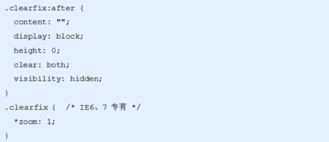  
    4. 父级添加双伪元素  
      + `clearfix`这个样式可以同时解决<font color="red">**高度塌陷和外边距重叠**</font> 的问题，当你在遇到这些问题时，直接使用  
      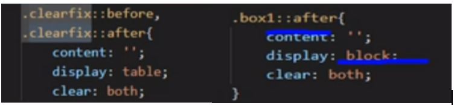  

## 网页布局--定位  
    **通过定位可以将元素摆放到页面的任意位置-使用position属性来设置定位**  
1. 相对定位（`relative` )  
    + 相对定位是元素在移动位置的时候，是相对于它原来的位置来说的(自恋型)。  
    + 相对定位的特点∶(务必记住)  
     1. 它是相对于自己原来的位置来移动的(<font color="red">移动位置的时候参照点是自己原来的位置</font>)。  
     2. <font color="red">原来</font>在标准流的<font color="red">位置继续占有</font>，后面的盒子仍然以标准流的方式对待它。(<font color="red">不脱标，继续保留原来位置</font>)  
      因此，相对定位并没有脱标。它最典型的应用是给绝对定位当爹的。。。  
2. 绝对定位（`absolute`）  
    + 绝对定位的特点;  
        1. 开启绝对定位后,如果不设置偏移量元素的位置不会发生变化  
        2. 开启绝对定位后，元素会从文档流中<font color="red">脱离</font>  
        3. 绝对定位会<font color="red">改变元素的性质</font>，行内变成块，块的宽高被内容撑开  
        4. 绝对定位会使元素<font color="red">提升一个层级</font>  
        5. 绝对定位元素是相对于其<font color="red">包含块</font>进行定位的  
     + 包含块：包含块就是离当前元素最近的祖先块元素  
     + 绝对定位的包含块:  
        + 包含块就是离它**最近的开启了定位**的祖先元素  
        + 如果所有的祖先元素都没有开启定位则**根元素**就是它的包含块  
        + html（根元素、初始包含块)  
3. **<font color="red">子绝父相的由来</font>**  
    + **子级是绝对定位的话，父级要用相对定位**  
        1. 子级绝对定位，不会占有位置，可以放到父盒子里面的任何一个地方，不会影响其他的兄弟盒子。  
        2. 父盒子需要加定位限制子盒子在父盒子内显示。  
        3. 父盒子布局时，需要占有位置，因此父亲只能是相对定位。  
    + 这就是子绝父相的由来，所以相对定位经常用来作为绝对定位的父级。
    + 总结∶因为父级需要占有位置，因此是相对定位，子盒子不需要占有位置，则是绝对定位当然，子绝父相不是永远不变的，如果父元素不需要占有位置，子绝父绝也会遇到。  
4. 固定定位（`fixed`）  
    + **<font color="red">固定定位一定要记得给宽度</font>**  
    + 固定定位是元素固定于浏览器可视区的位置。主要使用场景∶可以在浏览器页面滚动时元素的位置不会改变  
    + 固定定位的特点︰(务必记住)  
        1. 以浏览器的可视窗口为参照点移动元素。跟父元素没有任何关系,不随滚动条滚动。  
        2. 固定定位不在占有原先的位置。
        3. 固定定位也是脱标的，其实固定定位也可以看做是一种特殊的绝对定位。
    + **<font color="red">固定定位小技巧∶固定在版心右侧位置。</font>**  
    + 小算法︰  
        1. 让固定定位的盒子`left: 50%`.走到浏览器可视区（也可以看做版心）的一半位置。  
        2. 让固定定位的盒子`margin-left:`版心宽度的一半距离。多走版心宽度的一半位置就可以让固定定位的盒子贴着版心右侧对齐了。  
5. 粘滞定位  
    + 粘性定位可以被认为是相对定位和固定定位的混合。  
    + 选择器`{ position : sticky; top: 10px; }`  
    + 粘性定位的特点︰  
        1. 以浏览器的可视窗口为参照点移动元素（固定定位特点)  
        2. 粘性定位占有原先的位置（相对定位特点)  
        3. 必须添加` top. left、right、bottom`其中一个才有效  
    + 跟页面滚动搭配使用。兼容性较差，IE不支持。  
      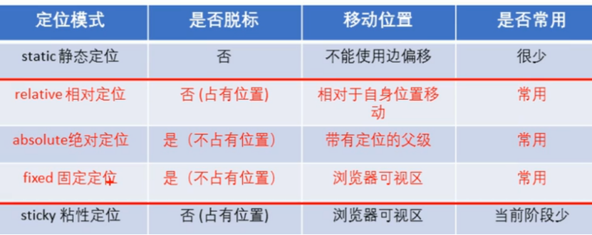  
6. 定位的特殊特性  
    + 绝对定位和固定定位也和浮动类似  
        1. 行内元素添加绝对或者固定定位，可以直接设置高度和宽度。  
        2. 块级元素添加绝对或者固定定位，如果不给宽度或者高度，默认大小是内容大小。  
        3. 浮动元素、绝对定位(固定定位)元素的都不会触发外边距合并的问题。  
        4. 绝对定位（固定定位）会完全压住盒子  
          + 浮动元素不同，只会压住它下面标准流的盒子，但是不会压住下面标准流盒子里面的文字(图片)  
          + 但是绝对定位(固定定位）会压住下面标准流所有的内容。  
          + 浮动之所以不会压住这字，因为浮动产生的目的最初是为了做文字环绕效果的。  
7. 层级  
    + 在使用定位布局时，可能会出现盒子重叠的情况。此时，可以使用`z-index`来控制盒子的前后次序(z轴)  
      `z-index：1；`  
        1. 数值可以是正整数、负整数或0,默认是`auto`，数值越大，盒子越靠上  
        2. 如果属性值相同，则按照书写顺序，后来居上  
        3. 祖先的元素的层级再高也不会盖住后代元素  
        4. 数字后面不能加单位  
        5. 只有定位的盒子才有`z-index`属性   

## 网页布局--字体图标、精灵图等样式类  
1. 字体  
  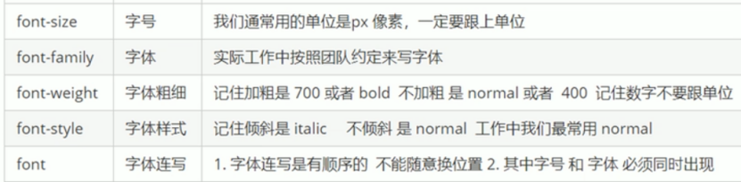  
  + `font:`字体大小/行高 字体族（行高可以省略不写如果不写使用默认值）  
  + 文本属性  
  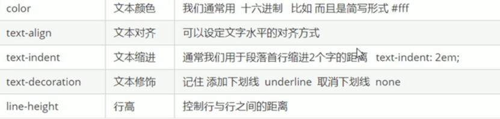  
  + `text-decoration`设置文本修饰  
      + `none`什么都没有  
      + `underline`下划线  
      + `line-through`删除线  
      + `overline` 上划线  
2. 精灵图  
    + 目的:为了有效地减少服务器接收和发送请求的次数，提高页面的加载速度  
    + 使用精灵图核心总结:  
        1. 精灵图主要针对于小的背景图片使用。  
        2. 主要借助于背景位置来实现---`background-position`。  
        3. 一般情况下精灵图都是负值。(千万注意网页中的坐标︰x轴右边走是正值，左边走是负值，y轴同理。)  
3. 字体图标  
    + 字体图标使用场景:主要用于显示网页中通用、常用的一些小图标  
    + 精灵图是有诸多优点的，但是缺点很明显。  
        1. 图片文件还是比较大的。  
        2. 图片本身放大和缩小会失真  
        3. 一旦图片制作完毕想要更换非常复杂。  
    + 此时，有一种技术的出现很好的解决了以上问题，就是字体图标`iconfont`.  
    + 字体图标可以为前端工程师提供一种方便高效的图标使用方式，<font color="red">展示的是图标，本质属于字体</font>。  
4. 字体图标的优点  
    1. 轻量级:一个图标字体要比一系列的图像要小。一旦字体加载了，图标就会马上渲染出来，减少了服务器请求  
    2. 灵活性:本质其实是文字，可以很随意的改变颜色、产生阴影、透明效果、旋转等  
    3. 兼容性:几乎支持所有的浏览器，请放心使用  
    4. 注意:字体图标<font color="red">不能替代精灵技术</font>，只是对工作中图标部分技术的<font color="red">提升和优化</font>。  
    5. 总结∶    
        + 如果遇到一些结构和样式比较简单的小图标，就用字体图标。  
        + 如果遇到一些结构和样式复杂一点的小图片，就用精灵图。  

        
    + 使用步骤  
        1. 把下载包里面的`fonts`文件夹放入页面根目录下  
          
        2. 在`CSS`样式中全局声明字体︰简单理解把这些字体文件通过`css`引入到我们页面中。（`style.css`中可以找到）  
        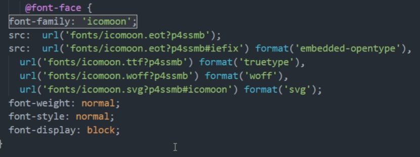  
        3. `html`标签内添加小图标。  
        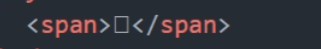  
        4. 指定字体  
        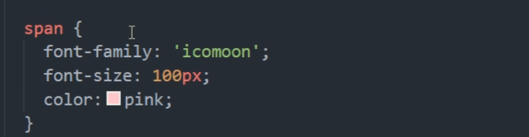  
        5. 字体图标的追加:  
          + 把压缩包里面的`selectionjson` 从新上传，然后选中自己想要新的图标，从新下载压缩包，并替换原来的文件即可。  
          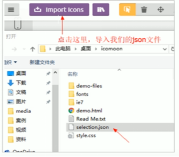    
5. css三角    
  ```css
  div{
    width:0;
    height:0;
    line-height:0;
    font-size:0;
    border:50px solid transparent;
    border-left-color:pink;
  }  
  ```     
  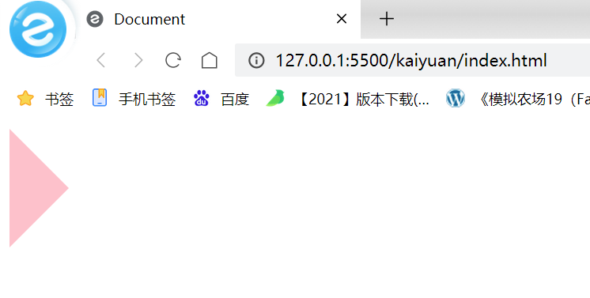 
  这个时候我们加入一个类似的应用场景延伸，很多网站都会出现这样的hover小三角  
  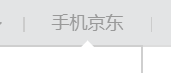  
  如果这里使用一个小三角就会出现没有三角边框的问题，那么我们可以采用用两个不一样颜色的三角(一个边框颜色，一个内容区颜色)重叠来营造边框的效果  
  ```html
  <style>
    .div1 {
      width: 0;
      height: 0;
      line-height: 0;
      font-size: 0;
      border: 50px solid transparent;
      border-left-color: black;
      position: relative;
    }

    .div2 {
      position: absolute;
      top: -50px;
      left: -51px;
      width: 0;
      height: 0;
      line-height: 0;
      font-size: 0;
      border: 50px solid transparent;
      border-left-color: pink;
    }
  </style>
</head>
<body>
  <div class="div1">
    <span class="div2"></span>
  </div>
</body>  
``` 
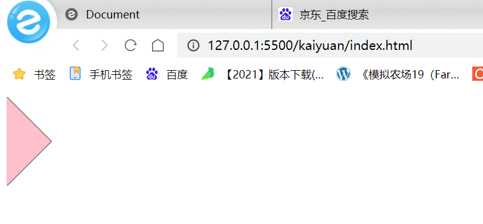  
  这样我们就完成了一个带边框颜色的小三角了~~~~  

6. CSS用户界面样式  
    1. 鼠标样式`cursor`  `li {cursor: pointer; }`  
    设置或检索在对象上移动的鼠标指针采用何种系统预定义的光标形状。  
    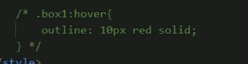  
    2. 轮廓线`outline`  
        + 给表单添加`outline:0;`或者`outline: none;`样式，就可以去掉默认的蓝色边框。  
        + 轮廓不会影响到可见框的大小，用法和`border`一模一样  
    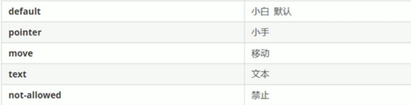   
    3. 防止拖拽文本域 `resize`  
      实际开发中，我们文本域右下角是不可以拖拽的。  
        `textarea{resize:none;}`   
7. 图片、表单和文字对齐  
      1. `vertical-align`设置元素垂直对齐的方式  
          + CSS的`vertical-align`属性使用场景∶经常用于设置图片或者表单(行内块元素)和文字垂直对齐。  
          + 官方解释∶用于设置一个元素的垂直对齐方式，但是它只针对于行内元素或者行内块元素有效。  
            `vertical-align : baseline / top / middle \ bottom`  
          + 图片、表单都属于行内块元素，默认的`vertical-align`是基线对齐。  
          + 设置`middle`可以和文字垂直居中对齐  
          + **<font color="red">解决图片底部默认空白缝隙问题</font>**  
              + bug:图片底侧会有一个空白缝隙，原因是行内块元素会和文字的基线对齐。主要解决方法有两种:  
                  1. 给图片添加`vertical-align:middle | topl bottom`等。（提倡使用的)  
                  2. 把图片转换为块级元素`display: block;`  
      2. `white-space`设置网页如何处理空白  
          + 一定要设置宽度，然后缺一不可  
8. 溢出的文字省略号显示  
      1. 单行文本溢出显示省略号—必须满足三个条件  
      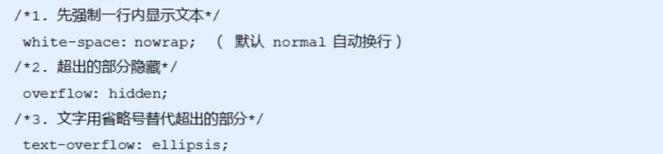  
      2. 多行文本溢出显示省略号  
        + 多行文本溢出显示省略号，有较大兼容性问题，适合于`webKit`浏览器或移动端(移动端大部分是`webkit`内核)  
      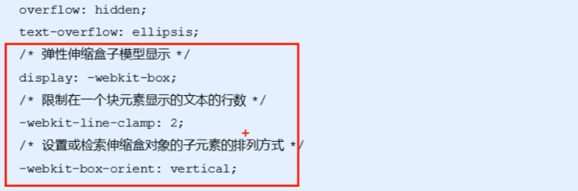  
        + **更推荐让后台人员来做这个效果，因为后台人员可以设置显示多少个字，操作更简单。**    
9. 常见的布局技巧  
    1. `margin`负值运用（浮动盒子实现边框细线）  
      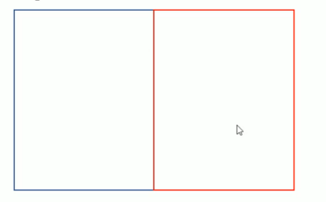  
        1. 让每个盒子`margin`往左侧移动`-1px` 正好压住相邻盒子边框  
        2. 鼠标经过某个盒子的时候，提高当前盒子的层级即可(如果没有有定位，则加相对定位（保留位置），如果有定位，则加`z-index`)  
        ```css  
        /*ul Li:hover {
          1．如果盒子没有定位，则鼠标经过添加相对定位即可position: reLative;
        border: 1px solid blue;
        }*/
        ul li:hover {
        /* 2.|如果Li都有定位，则利用z-index提高层级*/
        z-index: 1;
        border: 1px solid blue;
        }
        ```  
    2. 文字围绕浮动元素  
        巧妙运用浮动元素不会压住文字的特性  
    3. 行内块巧妙运用  
    4. CSS三角强化  
      ```css 
        div{
        width: 0;
        height : 0;
        border-color: transparent red transparent transparent;
        border-style: solid;
        border-width: 22px 8px 0 0 ;}
      ```  
10. CSS初始化  
    + 不同浏览器对有些标签的默认值是不同的，为了消除不同浏览器对HTML文本呈现的差异，照顾刘览器的兼容，我们需要对CSS初始化  
    + 简单理解:CSS初始化是指重设浏览器的样式。(也称为CSS reset )每个网页都必须首先进行CSS初始化。  
11. Unicode编码字体∶  
    + 把中文字体的名称用相应的Unicode编码来代替，这样就可以有效的避免浏览器解释CSS代码时候出现乱码的问题。  
      1. 黑体\9ED1\4F53宋体\5B8B\4F53  
      2. 微软雅黑\5FAE\8F6F\96C59ED1  
12. 布局示例  
    1. 头部制作  
    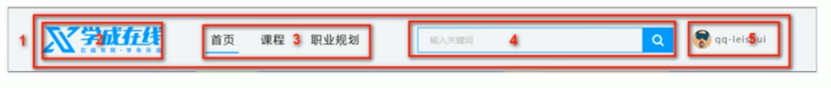   
      + 导航栏注意点:  
        **<font color="red">实际开发中，我们不会直接用链接a而是用li包含链接(li+a)的做法。</font>**  
        1.  `li+a`语义更清晰，一看这就是有条理的列表型内容  
        2. 如果直接用`a`，搜索引擎容易辨别为有堆砌关键字嫌疑(故意堆砌关键字容易被搜索引擎有降权的风险），从而影响网站排名  
        3. 注意:  
            1. 让导航栏一行显示,给`li` 加浮动,因为`li`是块级元素,需要一行显示.  
            2. 这个`nav`导航栏可以不给宽度,将来可以继续添加其余文字  
            3. 因为导航栏里面文字不一样多,所以最好给链接`a`左右`padding`撑开盒子,而不指定宽度  
    2. 底部制作  
    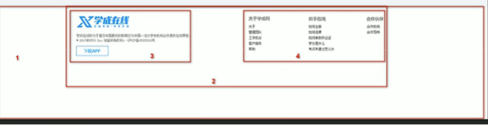  
        1. 1号盒子是通栏大盒子，底部`footer`给高度，底色是白色  
        2. 2号盒子版心水平居中  
        3. 3号盒子版权`copyright`左对齐  
        4. 4号盒子链接组`links` 右对齐  
    
##  CSS3新特性  
1. CSS3滤镜`filter`  
    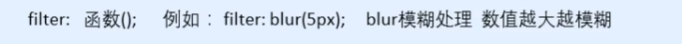  
2. CSS3 `calc`函数:  
    ```css
    {width:calc(100% - 80px)}  
    ```  
    + 运算符前后必须留空格  
3. 过渡  
    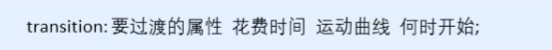  
    1. 属性︰想要变化的css属性，宽度高度背景颜色内外边距都可以。如果想要所有的属性都变化过渡，写一个`all`就可以。  
    2. 花费时间:单位是秒（必须写单位）比如0.5s  
    3. 运动曲线︰默认是`ease`(可以省略)  
    4. 何时开始︰单位是秒(必须写单位)可以设置延迟触发时间默认是0s（可以省略)  
    5. **<font color="red">记住过渡的使用口诀:谁做过渡给谁加</font>**  
4. 2D转换  
    1. 转换`transform`我们简单理解就是变形有2D和3D之分  
    2. 2D移动`translate(x, y)`最大的优势是<font color="red">不影响其他盒子</font>，里面参数用%，是相对于自身宽度和高度来计算的，对<font color="red">行内标签</font>没有效果  
    3. 可以分开写比如`translateX(x)`和`translateY(y)`  
    4. 2D旋转`rotate(度数)`可以实现旋转元素度数的单位是`deg`  
    5. 2D缩放`sacle(xy)`里面参数是数字不跟单位<font color="red">可以是小数</font>最大的优势不影响其他盒子  
    6. 设置转换中心点`transform-origin : x y;`参数可以百分比、像素或者是方位名词  
    7. 当我们进行综合写法，同时有位移和其他属性的时候，记得要将位移放到最前  
        1. 同时使用多个转换，其格式为:` transform:translate() rotate() scale()..`等  
        2. 其顺序会影响转换的效果。(先旋转会改变坐标轴方向)  
        3. **当我们同时有位移和其他属性的时候，记得要将位移放到最前**  
    8.   
        + 是否显示元素的背面  `backface-visibility: hidden;`   
        + 产为元素设置透明效果   `opacity: 0.7;`  
5. 动画  
    1. 先定义动画  
        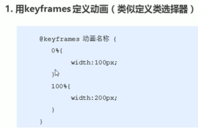  
    2. 再调用动画  
        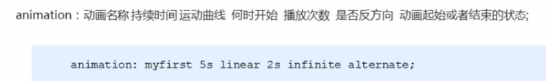  
        
        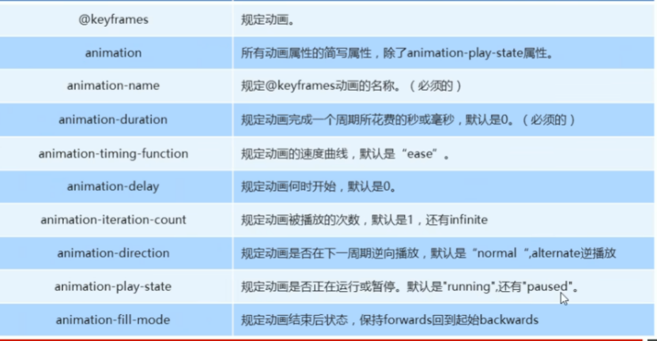
        
6. 3D转换  
    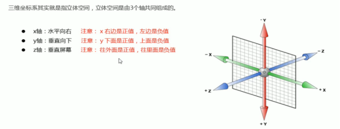  
    1. `Perspective:`在2D平面产生近大远小视觉立体  
        + 如果想要在网页产生3D效果需要透视（理解成3D物体投影在2D平面内)。  
        + 模拟人类的视觉位置，可认为安排一只眼睛去看  
        + 透视我们也称为视距∶视距就是人的眼睛到屏幕的距离  
        + 距离视觉点越近的在电脑平面成像越大，越远成像越小  
        + 透视的单位是像素  
    2. **透视写在被观察元素的父盒子上面的**  
        + d∶就是视距，视距就是一个距离人的眼睛到屏幕的距离。  
        + z∶就是z轴，物体距离屏幕的距离，z轴越大(正值）我们看到的物体就越大。  
    3. 3D旋转`rotate3d`  
        + 旋转轴适用于**左手法则**  
        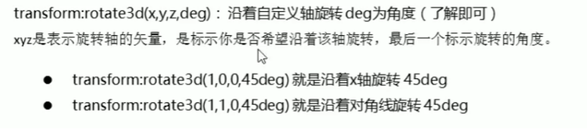  
7. 呈现`transfrom-style`  
   控制子元素是否开启三维立体环境  
    + `transform-style:` flat子元素不开启3d立体空间默认  
    + `transform-style: preserve-3d;`子元素开启立体空间  
    + 代码写给父级，但是影响的是子盒子, **同时有旋转和移动的时候，注意保持中心点位置**  
8. 浏览器私有前缀  
    + `-moz-∶`代表`firefox`浏览器私有属性  
    + `-ms-:`代表`ie`浏览器私有属性  
    + `-webkit-:`代表`safari、chrome`私有属性  
    + `-o-∶`代表`Opera`私有属性  
    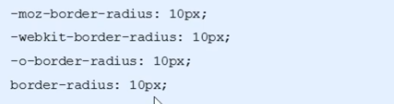


##   移动Web  
1. 视口  
    1. 视口就是浏览器显示页面内容的屏幕区域视口分为布局视口、视觉视口和理想视口  
    2. 我们移动端布局想要的是理想视口就是手机屏幕有多宽，我们的布局视口就有多宽  
    3. 想要理想视口，我们需要给我们的移动端友面添加meta视口标签  
2. `meta`视口标签  
    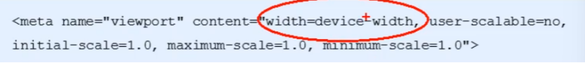  
    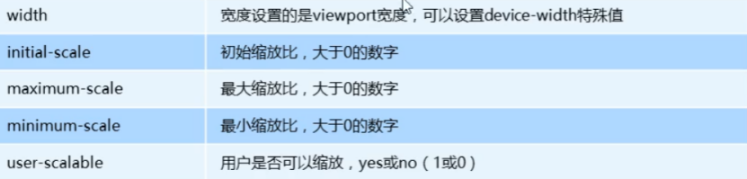  
    + 视口宽度和设备保持一致、视口的默认缩放比例1.0、不允许用户自行缩放、最大允许的缩放比例1.0、最小允许的缩放比例1.0  
    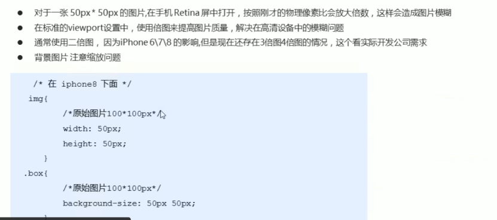  
3. 背景缩放`background-size`  
    + `background-size:`背景图片宽度背景图片高度;   
    + 单位︰长度|百分比|`cover`|`contain`;  
          + `cover`把背景图像扩展至足够大，以使背景图像完全覆盖背景区域。  
          + `contain`把图像图像扩展至最大尺寸，以使其宽度和高度完全适应内容区域  
4. 一些特殊样式  
    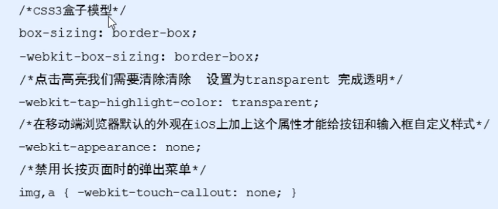  
5. 常见移动端布局   
    1. **流式布局(百分比布局)** 也称非固定像素布局    
        + 通过盒子的宽度设置成百分比来根据屏幕的宽度来进行伸缩，不受固定像素的限制，内容向两侧填充。流式布局方式是移动web开发使用的比较常见的布局方式  
    2. **<font color="red">flex弹性布局(强烈推荐)</font>**  
        1. 布局原理   
          当我们为父盒子设为`flex`布局以后，子元素的`float、clear`和`vertical-align`属性将失效。伸缩布局=弹性布局=伸缩盒布局=弹性盒布局=`flex`布局  
          + 就是通过给父盒子添加`flex`属性，来控制子盒子的位置和排列方式  
          + 常见父项属性  
              1. `flex-direction`设定主轴方向  
              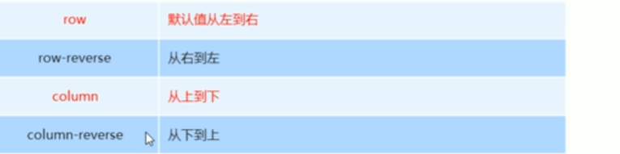  
              2. `justify-content`设置主轴上的子元素排列方式  
              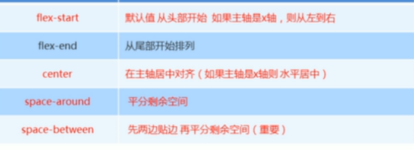  
              3. `flex-wrap`设置子元素是否换行  
              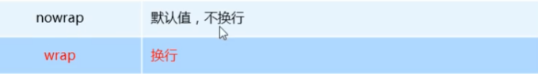  
              4. `align-items :`设置侧轴上的子元素的排列方式(单行)  
              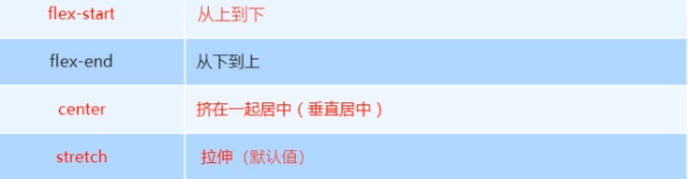  
              5. `align-content :`设置侧轴上的子元素的排列方式(多行)混合布局（一定要换行）  
              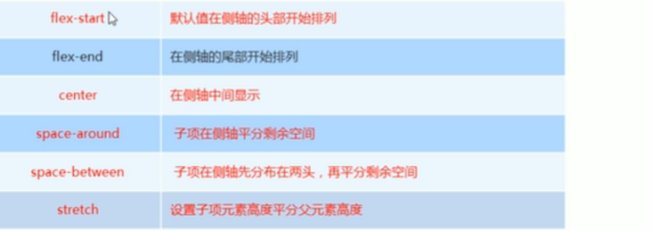  
              6. `flex-flow`属性是`flex-direction`和`flex-wrap`属性的复合属性  
          + 子项常见属性  
              1. `flex`子项目在分配剩余空间时占的份数  
              2. `align-self` 控制子项自己在侧轴上的排列方式  
              3. `order`属性定义项目的排列顺序，数值越小，排列越靠前，默认为0。  
              4. `flex-grow`指定弹性元素的伸展的系数  
                  + 当父元素有多余空间的时,子元素如何伸展-父元素的剩徐空间,会按照比例进行分配  
              5. `flex-shrink`指定弹性元素的收缩系数  
                  + 当父元素中的空间不足以容纳所有的子元素时,如果对子元素进行收缩  
6. 背景渐变  
    1. 线性渐变  
        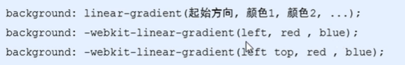  
        + 背景渐变必须添加浏览器私有前缀  
        + 起始方向可以是︰方位名词或者度数，如果省略默认就是`top`  
7. `rem`适配方案  
    1. `rem`基础  
        + `em`是相对于父元素的字体大小来计算的  
        + `rem`是相对于根元素的字体大小来计算  
        + `rem`的优点就是可以通过修改`html`里面的文字大小来改变页面中元素的大小   
    2. 媒体查询  
        ```css
        @media mediatype and |not | only (media feature) {
            css-code;
          }  
        ```  
        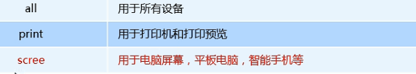  
        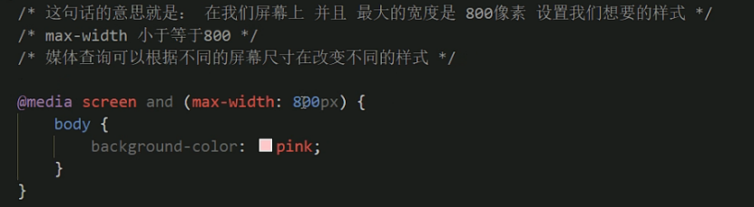  
        **<font color="red">从小到大写需求可以使代码更加简洁</font>**  
    3. 响应式页面兼容移动端（其次)  
        + 媒体查询  
        + `Bootstarp`  
8. Less  
    Less是一门CSS扩展语言，也成为CSS预处理器。:它扩展了CSS的动态特性。  
    1. Less变量  
        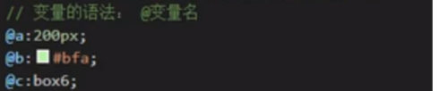  
    2. 类名  
        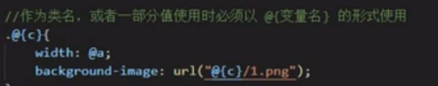  
    3. 如果遇见（交集|伪类|伪元素选择器）  
      内层选择器的前面没有`&`符号，（`&`符号可以理解成外层父元素）则它被解析为父选择器的后代;如果有`&`符号，它就被解析为父元素自身或父元素的伪类  
    4. Less运算  
        + 运算符的左右两侧必须**敲一个空格隔开**  
        + **运算符中间左右有个空格隔开`1px+ 5`** 
        + 对于两个不同的单位的值之间的运算，运算结果的值取**第一个值的单位**  
        + 如果两个值之间只有一个值有单位，则运算结果就取该单位  
           
           
9. 响应式布局  
      
      
        
    + 移动端技术选型  
          + 流式布局(百分比布局)
          + `flex`弹性布局(推荐)
          + `rem`适配布局（推荐)
          + 响应式布局  
10. VW和VH  
    + `vw/vh`是一个相对单位  
    + `100vw = 1`个视口宽度    `100vh = 1`个视口高度  
    + **百分比是相对于父元素来说的，而vw和vh总是针对于当前视口来说的。**  
        
    + 网页中字体大小最小是`12px`，不能设置一个比12像素还小的字体,如果我们设置了一个小于`12px`的字体，则字体自动设置为12

 


  


         


