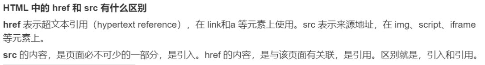
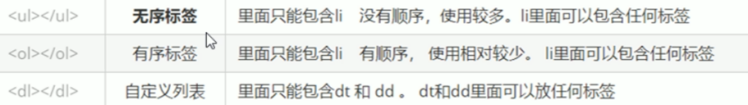
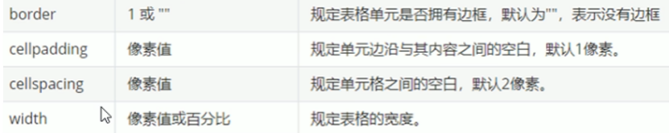
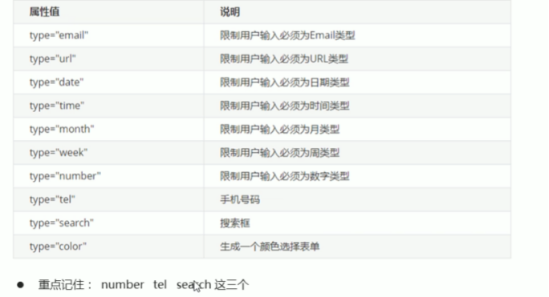
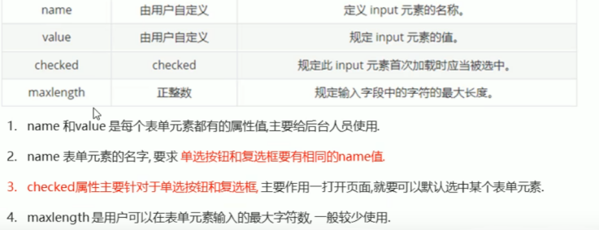
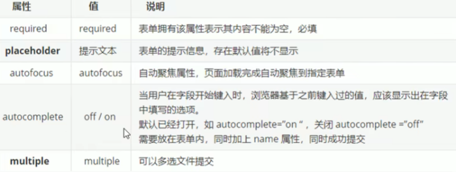
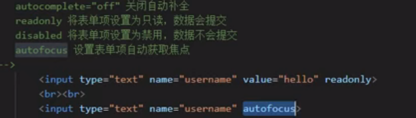

**本人通过blog的形式把自己以前的学习笔记整理了一下，持续更新**  


## 基础知识 

1. **块元素、行内元素、行内块元素的区别**
     + 块元素`h1-h6,p,div,ul,ol,li`  
          + 特点：  
            1. 比较霸道，自己独占一行  
            2. 高度，宽度，外边距和内边距都可以控制  
            3. 宽度默认是父容器的100%  
            4. 是一个容器及盒子，里面可以放行内或者块元素  
            5. 注意文字类元素内不能使用块级元素  
            6. h1-h6，P元素中不能放任何块元素  

     + 行内元素`a,strong,b,em,I,del,s,ins,u,span`  
          + 特点：  
            1. 相邻行内元素在一行上，一行可以显示多个
            2. 高，宽直接设置是无效的 
            3. 默认宽度就是它本身内容的宽度
            4. 行内元素内只能放文本或者其他行内元素 
            5. 链接里面不能放链接，特殊情况a里面可以放块级元素，给a转换块级模式最安全   
     + 行内块元素`img，input，td`  
          + 特点：  
            1. 他们**同时具有块元素和行内元素的特点**  
            2. 相邻行内块在一行上，他们之间会有**空白缝隙**  
            3. 默认宽度就是它本身内容的宽度  
            4. 高度，行高，外边距和内边距都可以控制  

2. **语义化问题**  
    + 什么时候需要用语义化标签  
        1. 强seo需求（搜索引擎会通过语义化标签增强文章的SEO搜索）  
        2. 需要支持屏幕阅读器（屏幕阅读器是根据标签理解语义和段落的）  
        3. 视觉呈现重要程度较低的程序（色彩搭配，元素构成，文字排版应用，留白技巧等方面的要求比较低）  
    + 语义化标签好处  
        1. 便于机器和人类阅读  
        2. 便于搜索引擎搜索  
        3. 自然语境的补充  
        4. 结构化文档的分级  
        5. 支持屏幕阅读器软件  
        6. 根据屏幕可以自动生成目录  
    + 分类  
        1. 结构类：`header，footer，aside，section，nav，article，main`  
        2. 语义类：`em，b，q，s，u，mark，figure，cite，del，alt，title，name`等属性也对seo有影响  
    + 注意：  
        1. 这种语义化标准主要是针对搜索引擎的  
        2. 这些新标签页面中可以使用多次  
        3. 在IE9中，需要把这些元素转换为块级元素  
        4. 其实，我们移动端更喜欢使用这些标签  

## 主体知识  

1. **超链接**  
    + href属性：指定跳转的目标路径，值可以是外部网站也可以是内部页面地址；开发中可以用#（跳转顶部位置）或者`javascript：；`来作为占位符使用；如果需要跳转指定位置，可以将href值设置（#目标id）  
    + target属性：`_self`默认值:当前页面打开超链接   
                  `_blank`:在新页面打开超链接  

  
2. **列表**  
      
3. **图片**  
  Img自结束标签，属于行内块元素  
  属性：  
  1. src：指定外部图片的路径，和超链接一样  
  2. alt：图片的描述，默认情况下不显示，浏览器无法加载图片时显示，**搜索引擎会根据alt的内容来识别图片**，如果不写alt属性则图片不会被搜索引擎所识别  
  3. width，height设置一个另一个等比例缩放  
  4. title：鼠标悬停时的文字  
+ 图片的格式：  
  + jpeg(jpg): 支持的颜色比较丰富，不支持透明效果，不支持动图-一般用来显示照片  
  + gif: 支持的颜色比较少，支持简单透明，支持动图-颜色单一的图片，动图  
  + png: 支持的颜色丰富，支持复杂透明，不支持动图,复杂透明图片（专为网页而生）  
  + webp:  
    + 这种格式是谷歌新推出的专门用来表示网页中的图片的一种格式  
    + 它具备其他图片格式的所有优点,而且文件还特别的小  
    + 缺点:兼容性不好  
  + base64:  
    + 将图片使用base64编码，这样可以将图片转换为字符，通过字符的形式来引用  
    + —般都是一些需要和网页一起加载的图片才会使用base64  
4. **表格**  
  + `<table> </table>`是用于定义表格的标签。  
  + `<tr> </tr>`标签用于定义表格中的行，必须嵌套在`<table> </table>`标签中。  
  + `<td> </td>`用于定义表格中的单元格，必须嵌套在`<tr></tr>`标签中。  
  +  字母`td`指表格数据(table data)，即数据单元格的内容。  
  + `th`是表头部分需要居中加粗的`td`  
  **属性：设置给`table`**  
    
  **设置细线边框：border-collapse: collapse;**  

  **属性：设置给td**  
  + 横向（跨列）合并单元格：colspan  
  + 纵向（跨行）合并单元格：rowspan  
  确定跨行还是跨列合并，找到目标单元格加上属性，并且**删除**  多余的单元格表格的结构标签.  
  1. thead表头区域  
  2. tbody表格主体区域，**浏览器会自动创建tbody包裹tr，tr不是table的子元素**  
  3. tfoot表格底部区域  

  ### 将元素display设置为table，table-row，table-cell作用 ###  

  1. `display：table，padding`设置会失效  
  2. `display：table-row，margin`和`padding`设置会失效  
  3. `display：table-cell，margin`设置会失效  
  4. 认识了上面的设置的作用和注意点以后，我们可以发现可以通过`display:table-cell`和`vertical-align:middle`; 来**进行垂直居中设置**的,也是运用了`cell`时，`vertical-align`属性生效作用。

5. **表单**  
    一个完整的表单分为：表单域，表单控件（元素），提示信息  
1. 表单域：`form`标签定义表单域，以实现用户信息的收集和传递  
2. 表单元素  
  + `input`表单元素  
    `type`属性值：`text，password，radio，submit，button，checkbox，hidden，reset`  
      
      
      
  + **可以通过以下方式修改placeholder里面的字体颜色**  
  ```css
  input::placeholder{color:pink;}
  ```
  + `label`标签  
    1. `<label>`标签为`input`元素定义标注（标签)。  
    2. `<label>`标签用于绑定一个表单元素当点击`<label>`标签内的文本时，浏览器就会自动将焦点(光标)转到或老选择对应的表单元素上用来增加用户体验.  
    3. `<label for="sex">男</ label>`  
    4. `<input type="radio" name="sex"id="sex"/>`  
  + `select`下拉表单元素  
    1. `<select>`中至少包含一对`<option>`。  
    2. 在`<option>`中定义`selected = "selected"`时，当前项即为默认选中项。  
    3. `datalist `非强制选择下拉菜单，可自己输入，用`type=text`引导，加上`list（text属性）`与`id（datalist属性）`  
  + `texarea`文本域  
  
  


