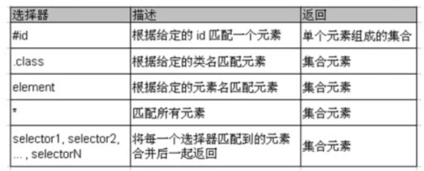
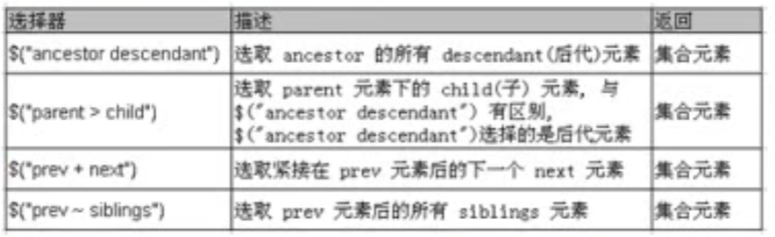
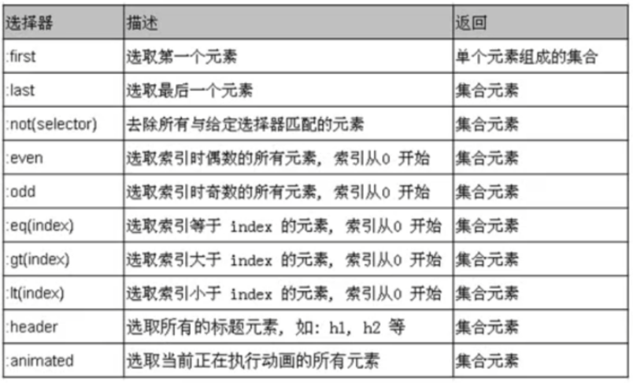
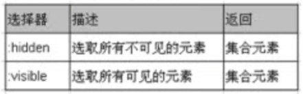
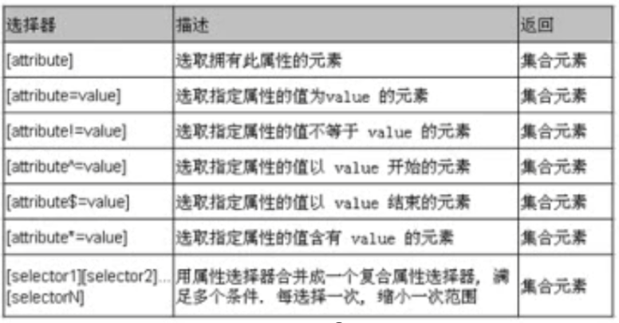
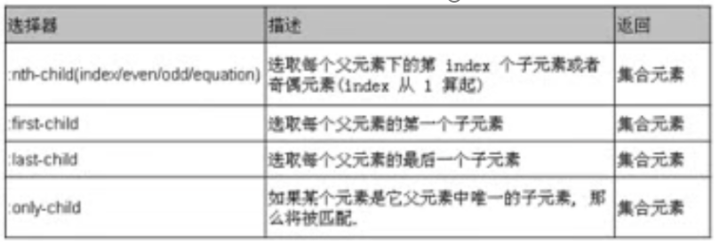
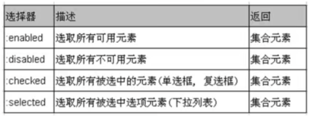
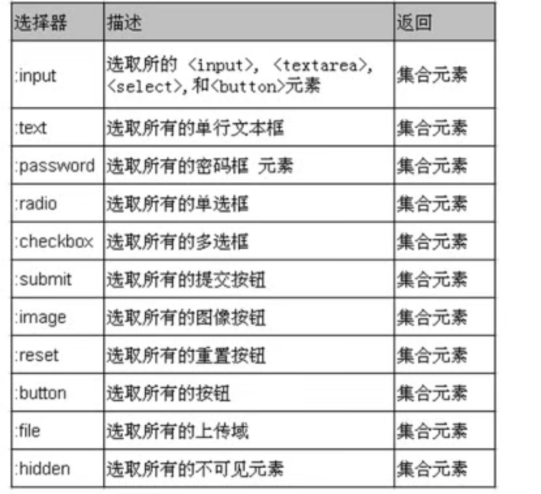
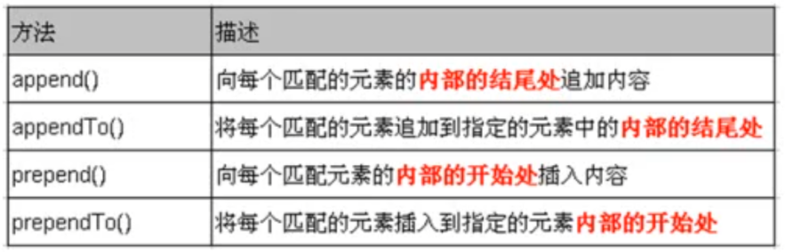

---
title: jQuery学习笔记
date: 2021-1-12
tags:
 - css
categories:
 -  笔记
---    
## jQuery学习笔记  
### jquery对象和dom对象  
1. `jQuery`是`Javascript`的一个函数库。  
2. 利用`jQuery`开发的步骤:  
    1. 导入jQuery库  
    2. 在`$(function())`的中编写jQuery代码  
    ```js  
        <script type="text/javascript" src="jquery-1.7.2.js"></script>
          <script type="text/javascript">
          $(functiono(){
            $("#btn1").click(function(){
              //使所有的可用的单行文本框的value值变为尚硅谷
              $(":text:enabled").val("尚硅谷");
             });
          })
         </script>  
    ```  
    3. jQuery对象VS DOM对象  
        1. jQuery对象不能使用DOM对象的属性和方法，反之，DOM对象也不能使用jQuery对象的属性和方法  
        2. jQuery对象是一个DOM数组对象，所以可以使用下标的方式转为DOM对象  
        ```js  
          var $btn = $("button");
          var btn = $btn[0];  
        ```  
        3. jQuery对象是使用`$()`保证 DOM对象后产生的对象∶  
        ```js  
          $("select :selected").each(function(){
            alert($(this).val());
            });  
        ```  
        4. jQuery的选择器:  
            1. 选取被选中的Select的 option需要使用选取子节点的方式︰  
            ```js  
                $("select[name='test'] :selected").each(function(){
                       //...
                  });  
            ```  
            2. jQuery选择器可以综合使用  
            3. 如果选择器搞不定，可以借助方法  
                +  jQuery对象可以进行隐式迭代,为选取的所有的p节点都添加了click响应函数。jQuery对象本身就是一个DOM对象的数组   
                ```js  
                  $("p").click(function(){...})  
                ```  
                + 在响应函数中,this是一个DOM对象。若想使用jQuery对象的方法需要把其包装为jQuery对象:使用`$()`把`this`包起来。  
                + `text()`方法是一个读写的方法:不加任何参数，读取文本值;加参数为属性节点添加文本值(文本节点)  
                ```js  
                  //2。使第一个table隔行变色
                    $("table:first tr:even").css( "background","#ffaacc");
                  //3。点击button，弹出checkbox被选中的个数
                    $("button").click(function(){
                      alert($( " :checkbox:checked").length)
                    });  
                ```  
        5. jQuery对象的几个方法  
            1. `val()`:获取或设置表单元素的value属性值  
            ```js  
                //设置值
                  $(":text:enabled").val("尚硅谷");
                //获取值
                  alert($(":textenabled").val());  
            ```  
            2.  `attr()`:和`val()`方法类似  
            ```js  
                attr(name,val)://为name属性赋值为val
                attr(name)://获取name属性值  
            ```  
            3. `each()`:对jQuery对象进行遍历，其参数为`function`，函数内部的`this`是正在遍历的DOM对象  
            ```js  
                $("select:selected").each(function(){
                  alert(this.value);
                });  
            ```  
            4. `text()`:和`val()`方法类似  
            ```js  
              text()://获取元素节点的文本子节点的值
              text(str)://设置元素节点的文本子节点的值。  
            ```  
### 选择器  
1. 基本选择器  
    + 基本选择器是jQuery中最常用的选择器,也是最简单的选择器,它通过元素id, class和标签名来查找DOM元素(在网页中id只能使用一次, class允许重复使用).  
        
2. 层次选择器  
    + 如果想通过DOM元素之间的层次关系来获取特定元素,例如后代元素，子元素,相邻元素,兄弟元素等,则需要使用层次选择器.  
        
    + 注意:`("prev~div")`选择器只能选择`"#prev"`元素后面的同辈元素;而jQuerv中的方法`siblings()`与前后位置无关,只要是**同辈节点**就可以选取  
      ```js  
        $("div").siblings()
      ```  
3. 基本过滤选择器  
      
4. 内容过滤选择器  
    + 内容过滤选择器的过滤规则主要**体现在它所包含的子元素和文本内容上**    
      
5. 可见性过滤选择器  
    + 可见性过滤选择器是根据元素的可见和不可见状态来选择相应的元素  
        
    + 可见选择器`:hidden`不仅包含样式属性`display`为`none`的元素,也包含文本隐藏域(`<input type="hidden">`)和`visible:hidden`之类的元素  
    ```js  
      // va1()方法可以返回某一个表单元素的value属性值。
      // show(time):可以使不可见的元素变为可见，time表示时间，以毫秒为单位
      //jQuery 的很多方法支持方法的连缀，即一个方法的返回值来时调用该方法的jQuery对象:可以继续调用该对象的其他方法·
        $("div:hidden").show(2000).css("background","ffbbaa");  
    ```  
6. 属性过滤选择器  
    + 属性过滤选择器的过滤规则是通过元素的属性来获取相应的元素  
        
7. 子元素过滤选择器  
        
      ```js  
          nth-child()选择器详解如下:
        :nth-child(even/odd)://能选取每个父元素下的索引值为偶(奇)数的元素
        :nth-child(2)://能选取每个父元素下的索引值为2的元素
        :nth-child(3n)://能选取每个父元素下的索引值是3的倍数的元素
        :nth-child(3n+1)://能选取每个父元素下的索引值是3n+1的元素  
      ```  
8. 表单对象属性过滤选择器  
    + 此选择器主要对所选择的表单元素进行过滤  
        
      ```js  
          //实际被选择的不是select,而是select 的option子节点,所以要加一个空格·
          //var len =$("select:selected").length
          // alert(len);

          //因为$("select:selected")选择的是一个数组
          //当该数组中有多个元素时，通过.val()方法就只能获取第一个被选择的值
          // alert($("select:selected").val());

          //jQuery对象遍历的方式使each,在each内部的this是正在得到的DOM对象，而不是一个jQuery对象
              $("select:selected").each(function(){
              alert(this.value) ;
              });  
      ```  
9. 表单选择器  
        
### 节点操作  
1. 创建节点  
    ```js  
        //1。操作文本节点:通过jQuery对象的text()方法
          alert($("#bj").text());
          $("#bj").text("尚硅谷");
        //2。操作属性节点:通过jQuery对象的attr()方法·
        //注:直接操作value属性值可以使用更便捷的val()方法.
          alert($(":text[name='username']").attr("value"));
          $(":text[name='username']").attr("value","尚硅谷");  
    ```  
2. 插入节点  
        
      ```js  
          //1。创建一个<li id="atguigu">尚硅谷</li>
          //2。并把其加入到#city的子节点
          //$("<li id='atguigu '>尚硅谷</li>" ).appendTo($("#city"));
            $("#city").append("<li id='atguigu'>[尚硅谷]</li>");
            alert($("#atguigu").text());
          //1。同JS的响应函数一样，jQuery对象的响应函数若返回false,
          //可以取消指定元素的默认行为。比如submit, a等
          //2. val()方法，相当于 attr("value")，获取表单元素的value属性值。
          //3.$.trim(str):可以去除str的前后空格.
          //4.jQuery对象的方法的连缀:调用一个方法的返回值还是调用的对象，于是可以在调用方法的后面依然调用先前的那个对象的其他方法。  
3. 删除节点  
    + `remove()`:从DOM中删除所有匹配的元素,传入的参数用于根据jQuery表达式来筛选元素.当某个节点用`remove()`方法删除后,该节点所包含的所有后代节点将被同时删除.这个方法的返回值是一个指向已被删除的节点的引用.  
    + `empty()`:清空节点-清空元素中的所有后代节点(不包含属性节点).  
    ```js  
        //jQuery对象的remove()方法:将把jQuery对象对应的DOM节点直接删除。
          $("#bj").remove();
        //2.清空#game节点
        //jQuery对象的empty().方法:清空jQuery对象对应的DOM对象的所有的子节点。
            alert("要清空了!");
            $("#game").empty();  
    ```


