---
title: JS学习笔记
date: 2021-01-09
tags:
 - js
categories:
 -  笔记
---    
##   JS基础  
1. JS基础认识  
    1. JavaScript是什么?  
        JavaScript是一门编程语言，可以实现**网页特效，表单验证，数据交互**  
    2. JavaScript的注释?  
        + 单行注释 ` //  `
        + 多行注释 `/* */`  
    3. JavaScript的结束符?  
        分号`;`可以加也可以不加，可以按照团队约定，注意换行默认为结束符  
    4. Javascript输入输出语句?  
        + 输入: `prompt()`  （`+prompt（" "）`可以转换出数值）  
        + 输出: `alert()`  `document.write()`  `console.log()`  
2. 变量和字面量  
    1. 字面量，都是一些不可改变的值，数字、字符串、数组、对象等等  
        变量是计算机存储数据的<font color="red">“容器”</font>，而不是数据  
        可以用`let、var`来声明变量，**注意同一个变量不能用`let`多次声明**  
    2. 变量的本质  
        内存:计算机中存储数据的地方，相当于一个空间   
        变量:是程序在内存中申请的一块用来存放数据的小空间  
    3. 命名规则与规范  
        1. 规则:  
            + 不能用**关键字**,（有特殊含义的字符，`JavaScript`内置的一些英语词汇。例如: `let、var、if、for`等）  
            + 只能用**下划线、字母、数字、$**组成，且**数字不能开头**    
            + 字母**严格区分大小写**，如Age和age是不同的变量  
        2. 规范:  
            + 起名要有意义  
            + 遵守**小驼峰命名法**，第一个单词首字母小写，后面每个单词首字母大写。例: `userName`   
3. 数据类型  
    + 基本数据类型：`number、string、boolean、undefined、null、Symbol、BigInt`   
    + 引用数据类型：`object、function、array`  
    1. 数字类型:正数、负数、小数；  
        + `NaN`是一个特殊的数字，表示`Not A Number`，用`typeof`检查`NaN`会返回`number`  
        + `Number.MAX_VALUE`、`Number.MIN VALUE`表示数字的最值  
        + 尽量不要再JS中进行精度较高的运算  
    2. 字符串类型：通过单引号('')、双引号(""）或反引号(``)包裹的数据都叫字符串  
        + **模板字符串**  
        ```js  
        document.write('大家好，我叫' + name + ',今年' + age + '岁')
        ```   
        用反引号包裹内容，`${}`包住变量   
        ```js  
        document.write(`大家好我叫${name}，今年${age}岁`)  
        ```  
    3. 布尔值  
        + 使用`typeof`检查一个布尔值时，会返回`boolean`  
        + 它有两个值 `true`和`false`，表示肯定的数据用`true`(真)，表示否定的数据用`false`(假)。  
    3. `Null` 和`Undefined`  
        + 只声明，未给变量赋值时，它的值就是`undefined`，使用`typeof`检查时也会返回`undefined`  
        + `Null`类型的值只有一个，就是`null`，这个值专门用来表示一个为空的对象  
        + 使用`typeof`检查一个`null`值时，会返回`object`  
4. 类型转换  
    + JavaScript是弱数据类型: JavaScript也不知道变量属于那种类型，赋值了才清楚。  
    + 坑:使用表单、prompt 获取过来的数据默认是字符串类型，此时不能直接进行加法运算。  
    1. 隐式转换  
        1. `+`号两边只要有一个是字符串，都会把另外一个转成字符串  
        2. 除了`+`以外的算术运算符比如`– * /`等都会把数据转成数字类型  
        3. 作为正号解析时可以把数据转成数字类型  
        4. 我们只需要为任意的数据类型`+`一个`""`即可将其转换为`String`  
    2. 显式转换  
        + **<font color="red">转换成数字</font>**  
            1. **使用`Number()`函数**  
                + 字符串-->数字  
                    1. 如果是纯数字的字符串，则直接将其转换为数字  
                    2. 如果字符串中有非数字的内容，则转换为`NaN`  
                    3. 如果字符串是一个空串或者是一个全是空格的字符串，则转换为`0`  
                + 布尔-->数字  
                    + `true`转成`1` `false`转成`0`  
                + `null` -->数字`0`  
                + `undefined`-->数字`NaN`  
            2. **这种方式专门用来对付字符串**  
                + `parseInt()`把一个字符串转换为一个整数  
                + `parseFloat()`把一个字符串转换为一个浮点数  
                + 如果对非`String`使用`parseInt()`或`parseFloat()`它会先将其转换为`String`然后在操作  
                + **<font color="red">可以在`parseInt()`中传递第二个参数，表示以此进制看待传入进来的参数</font>**    
        + **<font color="red">转换成字符串</font>**  
            1. **调用`String()`函数**  -- 并将被转换的数据作为参数传递给函数  
                + 对于`Number`和`Boolean`实际上就是调用的`toString()`方法  
                + 但是对于`null`和`undefined`，它会将`null`直接转换为`"null"`,将`undefined`直接转换为`"undefined”`  
            2. **调用被转换数据类型的`toString()`方法**  
                + 该方法不会影响到原变量，它会将转换的结果返回  
                + 但是注意:null和undefined这两个值没有toString()方法,   
                + **<font color="red">可以传一个参数2，表示转换成2进制结果 </font>**  
        +  **<font color="red">转换成`boolean`</font>**   
            1. **使用`Boolean()`函数**  
                + 数字--->布尔 : 除了`0`和`NaN`，其余的都是`true`  
                + 字符串--->布尔 : 除了空串，其余的都是`true`  
                + `null`和`undefined`都会转换为`false`  
                + 对象也会转换为`true`  
5. 运算符  
    1. `typeof`就是运算符，它将该值的类型**以字符串的形式**返回  
    2. 一元运算符：自增和自减  自减同理  
        + **无论是a++ 还是++a，都会立即使原变量的值自增1**  
        + **<font color="red">a++的值</font> = 原变量的值（<font color="red">自增前</font>的值)**  
        + **<font color="red">++a的值</font> = 新值（<font color="red">自增后</font>的值)**  
    3. 比较运算符（结果只有`true`和`false`）  
        1. 对于非数值进行比较时，会将其转换为数字然后在比较  
        2. 如果符号两侧的值都是字符串时，不会将其转换为数字进行比较，而会分别比较字符串中字符的Unicode编码，比较字符编码时是一位一位进行比较  
            + **注意:在比较两个字符串型的数字时，一定一定一定要转型**  
            + 在字符串中使用转义字符输入`Unicode`编码  `\u四位编码`  
            + 在网页中使用`Unicode`编码，&#编码;这里的编码需要的是10进制  
        3. 相等运算符  
            + `=`是赋值  
            + `==`是判断，只要值相等，不要求数据类型即返回`true`，会**进行类型转换** （`!=`同理）  
            + `===`是全等要求值和数据类型都一样返回的才是`true`   （`!==`同理）  
    4. 逻辑运算符  
        **&&属于短路的与，如果第一个值为false，则不会看第二个值**  
        1. **<font color="red">与运算：第一个为false，返回第一个；第一个为true，必然返回第二个</font>**  
          
        **||属于短路的或，如果第一个值为true，则不会检查第二个值**  
        2. **<font color="red">或运算：第一个为true，返回第一个；第一个为false，必然返回第二个</font>**  
        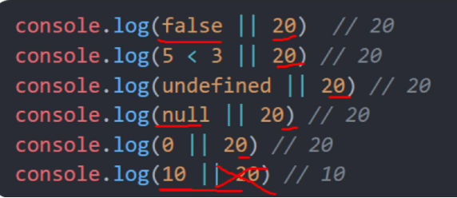  
        3. **<font color="red">非运算：！！a可以将任意数据类型转换为布尔值</font>**  
    5. 运算符的优先级  
        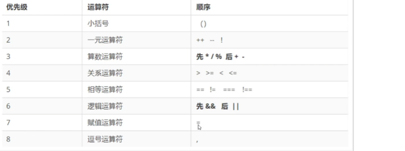  
6. 分支语句  
        1. if语句  
            **若条件的结果不是布尔值，此时条件会发生隐式转换**  
        2. 三元运算符  
            **条件 ? 满足条件执行的代码 : 不满足条件执行的代码**  
            **但是这是个表达式，我们可以用一个变量来接收他的运算结果**  
        3. Switch语句  
            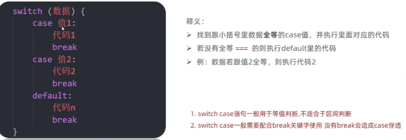  
7. 循环语句  
        1. `while`循环    
            ```js  
            while(){
                要重复执行的代码（循环体）
                }  
            ```  
            循环必备三要素：变量起始值、**终止条件（死循环）**、变量变化值  
        2. `break`和`continue`   
            + `continue`可以用来**跳过当次循环**，这轮循环的语句就不执行了  
            + `break`可以用来**退出`switch`或整个循环语句**  
            + 默认只会对离他**最近**的循环起作用  
            + 可以为循环语句创建一个`label`，来标识当前的循环`label:循环语句`  
            + **使用`break`语句时，可以在`break`后跟着一个`label`,这样`break`将会结束指定的循环**  
        3. `for`循环  
            ```js  
            for (起始条件;退出条件;变化量){
                循环语句
            }
            ```  
            **打印质数练习**  
            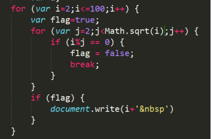  
8. 数组的基本使用  
    1. `arr.push()`方法将一个或多个元素添加到数组末尾，并**返回该数组的新长度(重点)**  
    2. `arr.unshift()`方法将一或多个元素添加到数组开头，并**返回该数组的新长度(索引改变)**  
    3. `arr.pop()`方法从数组中删除最后一个元素，并**返回该元素的值**  
    4. `arr.shift()`方法从数组中删除第一个元素，并且**返回该元素的值**  
    5. `arr.splice(起始索引，删几个，插入的新元素)`，会<font color="red">**改变原数组**</font>  
    6. `arr.slice(起始索引，结束索引)`可以从数组提取指定元素(<font color="red">左闭右开</font>)，并且封装到一个新数组中返回，**<font color="red">不会改变原数组</font>**，第二个参数可以省略不写,此时会截取从开始索引往后的所有元素,可如果索引传递一个负值，则从后往前计算(-1倒数第一个)  
    7. `concat()`可以连接两个或多个数组，并将新的数组返回，**<font color="red">不会改变原数组</font>**  
            `var result = arr.concat(arr2,arr3,"牛魔王","铁扇公主")`  
    8. `join()`可以将数组转换为一个字符串并作为结果返回，**<font color="red">不会对原数组产生影响</font>**.在`join()`中可以指定一个字符串作为参数，将成为数组中元素的连接符，默认`,`作为连接符  
    9. `reverse()`方法用来反转数组，该方法会<font color="red">直**接修改原数组**</font>  
    10. `sort()`用来对数组中的元素进行排序，**<font color="red">会影响原数组</font>**，默认按照`Unicode`编码进行排序  
            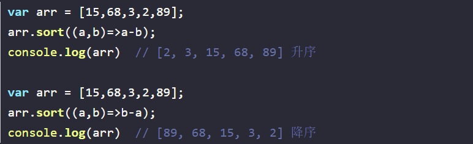  
        **数组去重**  
              
9. 函数  
    1. 函数是封装一些功能的代码块，可以实现代码复用，提高开发效率  
            函数声明: `function 函数名 ( ) {语句...}`  
    2. 函数的参数  
            形参可以理解为是在这个函数内声明的变量，但是没有赋值，实参可以理解为是给这个变量赋值，多余实参不会被赋值，没有对应实参的形参将是`undefined`  
    3. 函数的返回值  
        1. 特点：有值就返回值，无值就结束函数  
        2. **<font color="red">return后面不接数据</font>**或者<font color="red">**函数内不写return**</font>，函数的返回值是`undefined`  
                return能立即结束当前函数,所以**return后面的数据不要换行写**  
                **可以用return [ ]返回多个值**  
    4. `fn()`相当于使用的函数的返回值，`fn`相当于直接使用函数对象  
    5. 作用域  
            + 全局作用域。函数外部或者整个`script`有效  		全局变量  
            + 局部作用域。也称为函数作用域，函数内部有效   	     局部变量  
            + 块级作用域。`{}`内有效   						   块级变量  
            + 如果变量没有声明，直接赋值，也当**全局变量**看，但是**强烈不推荐**    
    + **变量的声明提前**  
            使用`var`关键字声明的变量，会在所有的代码执行之前被声明（但是不会赋值)﹐但是如果声明变量时不适用`var`关键字，则变量不会被声明提前  
    + **函数的声明提前**  
            使用函数声明形式创建的函数`function函数(){  }`,它会在所有的代码执行之前就被创建，所以我们可以在函数声明前来调用函数  
    6. 匿名函数     
            函数表达式  `let 变量 = function () {语句....}`  
        + 立即执行函数  
                  
            **<font color="red">立即执行函数最好在前面加分号，防止报错</font>**  
10. 对象  
    1. 对象属于一种无序的复合的数据类型  
        内置对象、宿主对象（bom、dom）、自定义对象  
    2. 对象声明  
        `Let 对象名 = {  属性名：属性值  ，  方法名：函数  }`  
    3. 属性访问  
        `person.name`  --- `person[‘name’]`  
        + 访问没有的属性返回`undefined`  
        + **在[  ]中可以直接传递一个变量(不加引号)，这样变量值是多少就会读取那个属性**  
    4. 删除对象的属性 --- `delete 对象.属性名`  
    5. `"属性名"  in  对象` 可以检查一个对象中是否含有指定属性  
    6. 遍历对象  
        ```js  
            for ( let  k  in  对象 ) {  
                console.log( obj [ k ] ) 
                }  
        ```  
    7.   
        1. 栈（操作系统）︰**简单数据类型存放到栈里面**  
        2. 堆（操作系统）∶**引用数据类型存放到堆里面, 由垃圾回收机制回收**  
        3. 当比较两个基本数据类型的值时，就是**比较值**。  
        4. 而比较两个引用数据类型时，它是**比较的对象的内存地址**  
    8. Math对象方法  
        ```js  
            Math.random() //生成0-1之间的随机数(包含0不包括1)  
            Math.ceil()  //向上取整  
            Math.floor() //向下取整
            Math.max() //找最大数
            Math.min() //找最小数
            Math.pow() //幂运算
            Math.abs() //绝对值  
            Math.round() //就近取整(0.5往大取整)  
            Math.floor(Math.random()*(M - N + 1)) + N  //生成N - M之间的随机数公式  
        ```  
    
## webAPI进阶--DOM、BOM  
### Day 1  
1. web api的基本认知  
    1. 作用和分类  
        作用:就是使用`JS`去操作`html`和浏览器  
        分类:`DOM`(文档对象模型)、`BOM`（浏览器对象模型)  
    2. 什么是DOM  --- 操作网页内容，可以开发网页内容特效和实现用户交互  
    3. DOM树：将HTML文档以树状结构直观的表现出来，称之为文档树或DOM树  
        作用:文档树直观的体现了标签与标签之间的关系  
    4. DOM对象：浏览器根据html标签生成的JS对象（DOM对象)  
2. 获取DOM对象  
    1. 根据CSS选择器来获取DOM元素(重点)  
        1. 选择匹配的第一个元素  
          `document. querySelector (  )`  
          + 参数：包含一个或多个有效的CSS选择器字符串  
          + 返回值: CSS选择器匹配的第一个元素。如果没有匹配到，则返回`null`。  
        2. 获取多个元素  
          `document.querySelectorAll (  )`  
          + 返回值: CSS选择器匹配的`NodeList对象(伪数组）`，可以遍历但没有`pop()`等方法  
    2. 其他获取DOM元素方法（了解)  
        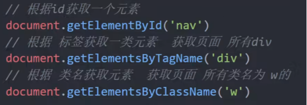  
3. 设置/修改DOM元素内容  
    1. `document.write()`  
        + 只能将文本内容追加到`</body>`前面的位置  
        + 文本中包含的**标签会被解析**  
    2. 元素`innerText`属性  
        + 将文本内容添加/更新到任意标签位置  
        + 文本中包含的**标签不会被解析**  
    3. 元素`.innerHTML`属性  
        + 将文本内容添加/更新到任意标签位置  
        + 文本中包含的**标签会被解析**  
4. 设置/修改DOM元素属性  
    1. 设置/修改元素常用属性  
        + 直接  `对象.属性名 = 新值`  
        + 最常见的属性比如: `href、title、src`等  
    2. 设置/修改元素样式属性  
        + 通过`style`属性操作CSS  
            + `'-'`连接符改成小驼峰命名,这是行内样式，记得单位  
        + 操作类名(`className`)操作CSS  
            + `元素 . className = '类名'`  
        + 如果修改的样式较多，通过style属性修改比较繁琐，我们可以借助css类名的形式。  
            + 缺陷：会覆盖之前的类名  
        + **<font color="red">通过classList操作类控制CSS（三个方法）</font>**   
            ```js  
            元素.classList.add('类名')   //增加一个类
            元素.classList.remove('类名')   //移除一个类
            元素.classList.toggle('类名')   //切换一个类
            元素.classList.contains('类名')  //判断是否含此类
            ```  
    3. 设置/修改表单元素属性  
        + 设置:`DOM对象.属性名 = 新值`  
        + 表单属性中添加就有效果,移除就没有效果,一律使用布尔值表示,如果为`true`代表添加了该属性,如果是`false`代表移除了该属性  
        + 比如: `disabled、checked、selected`  
    4. 获取自定义属性  
        + 名字以`data-name`设置，用`dataset`属性来取得   
5. 定时器-间歇函数  
    1. 开启定时器  
        `setInterval ( 函数，间隔时间 )`  
        + 返回值:返回一个非零数值，这个数字用来作为定时器的唯一标识  
    2. 关闭定时器  
        `clearInterval ( timer )`可以用来关闭一个定时器  
    3. **注意：在轮播图里面，点击一次按钮会开启一个定时器，一定要将在点击事件开始时先清除当前元素上的其他定时器**  
### Day 2  
1. 事件  
    1. 事件监听  
        + 事件是在编程时系统内发生的动作或者发生的事情  
        + 事件监听就是让程序检测是否有事件产生，一旦有事件触发，就立即调用一个函数做出响应，也称为注册事件  
            `元素.addEventListener('事件',要执行的函数)`  
        + 事件监听三要素:  
            + 事件源:哪个`dom`元素被事件触发了，要获取`dom`元素  
            + 事件:用什么方式触发，比如鼠标单击`click`、鼠标经过`mouseover`等  
            + 事件调用的函数:要做什么事  
    2. 拓展阅读-事件监听版本  
        1. DOM LO---`事件源.on事件= function() {}`  
        2. DOM L2---`事件源.addEventListener(事件，事件处理函数)`  
    3. 事件类型  
        + 鼠标事件：`click`鼠标点击 `mouseenter`鼠标经过 `mouseleave`鼠标离开  
        + 焦点事件：`focus`获得焦点 `blur`失去焦点  
        + 键盘事件：`Keydown`键盘按下触发  `Keyup`键盘抬起触发  
        + 文本事件：`input`用户输入事件、`change`事件（失去焦点时并且表单发生变化触发）  
    4. **全选框案例**  
          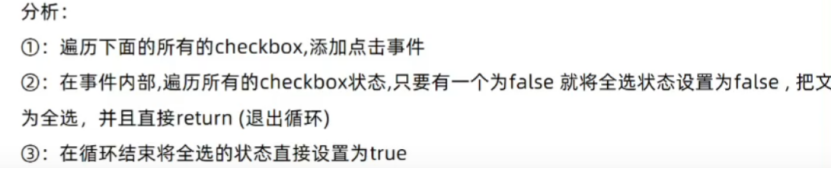  
          ```js  
          for (let i = 0; i < cks.Length; i++) {
            //绑定事件
            cks[i].addEventListener('click ', function () {
              //consoLe.Log(11)
              //只要点击任何一个小按钮，都要遍历所有的小按钮
              for (let j = 0; j < cks.length; j++) {
                //都来看看是不是有人没有选中
                if (cks[j].checked === false) {
                  //如果有false则退出循环结束函数
                  all.checked = false
                  return
                }
              }
              //当我们的循环结束，如果代码走到这里，说明没有
              all.checked = true
            })
          }     
          ```  
2. 高阶函数  
    1. 函数表达式：把函数当值来对待  
    2. 回调函数：如果将函数A做为参数传递给函数B时，我们称函数A为回调函数,例如：`setInterval（fn，1000）`  `fn`就是回调函数  
    3. **<font color="red">环境对象this</font>**  
        解析器在调用函数每次都会向函数内部传递进一个隐含的参数this, this指向的是一个对象，**<font color="red">定时器里面别用this，指向window</font>**   
        1. 以函数形式调用时，`this`永远都是`window`  
        2. 以方法的形式调用时，`this`是调用方法的对象  
        3. 以构造函数的形式调用时，`this`是新创建的那个对象  
        4. 使用`call`和`apply`调用时,`this`是指定的那个对象  
        5. 箭头函数中的`this`，指向定义函数上下文的`this`。  
    4. 编程思想  
        + 当前元素为A状态,其他元素为B状态使用  
            1. 干掉所有人（包括他自己）：使用`for`循环  
            2. 复活他自己：通过`this`或者下标找到自己或者对应的元素  
            ```js  
              //找到以前的active类，移除掉
              document.querySelector(".tab .active").classList.remove("active")
              // 当前的元素添加
              this.classList.add('active')
            ```  
### Day 3  
1. 节点操作  
    1. DOM节点-- DOM树里每一个内容都称之为节点  
        + 元素节点：所有的标签比如`body、div、html`是根节点  
        + 属性节点：·所有的属性比如`href`  
        + 文本节点：所有的文本  
        + 其他  
    2. 查找节点  
        + 父节点查找  
            + `parentNode`属性：返回最近一级的父节点，找不到返回为`null`  
        + 子节点查找  
            + `childNodes`：获得所有子节点、**包括文本节点（空格、换行)、注释节点等**  
            + `children(重点)`：仅获得所有元素节点；返回的还是一个**伪数组**  
        + 兄弟节点查找  
            + `previousElementSibling`属性：表示当前节点的前一个兄弟节点  
            + `nextElementSibling`属性：表示当前节点的后一个兄弟节点  
    3. 增加节点  
        + 创建元素节点方法--`document,createElement('标签名')`  
        + 创建文本节点方法---`document.createTextNode('')`  
    4. 追加节点：（**必须由父元素添加**）  
        + 在最后加新节点------`父节点 . appendChild (子节点)`  
        + 在指定位置加新节点--`父节点 . insertBefore (新节点,旧节点)`  
        + 替换旧结点----------`父节点 . replaceChild (新节点,旧节点)`  
        + **先给新节点添加内容，再追加给父节点**  
    5. 克隆节点  
        + `cloneNode（布尔值`：会克隆出一个跟原标签一样的元素  
            + 若为`true`（深拷贝），则代表克隆时会包含后代节点一起克隆  
            + 若为`false`（浅拷贝），则代表克隆时不包含后代节点，默认为`false`  
    6. 删除节点(**必须由父元素删除**)  
        + `父节点.removeChild(子节点)`;  
        + `子节点.parentNode.removeChild(子节点)`;  
    7. **<font color="red">使用innerHTML也可以完成DOM的增册改的相关操作</font>**  
        + `city.innerHTML += "<li>广州</li>";`  
        + `div span ul Li`标签︰设置文字内容  `元素.innerText`  
        + 表单`input`单选复选 `textarea select`  表单的`vaLue`  
        + 特殊的`button`是通过`inner`来设置  
2. 时间对象  
    1. 利用new关键字实例化时间  
        + 获得当前时间---`let date = new Date()`  
        + 获得指定时间---`let date = new Date(‘2021-8-29 18:30:00’)`  
    2. 时间对象方法  
        + `getDate()`  返回月份中的每一天  
        + `getDay()`  返回星期几(0-6)  
        + `getMonth()` 返回月份（0-11）  
        + `getFullYear()` 返回四位年份  
    3. 时间戳   
        + 指的是从格林威治标准时间的1970年1月1日0时0分0秒到现在的毫秒数  
        + `getTime()`方法 （需要实例化）  
        +  `+ new Date()` 利用正号的隐式转换 （需要实例化）  
        + `Date.now()`  
        + `new Date().tolocaleString()`  --- 可以生成一个标准时间(简易版)  
3. 重绘和回流  
    1. 浏览器是如何进行界面渲染的  
        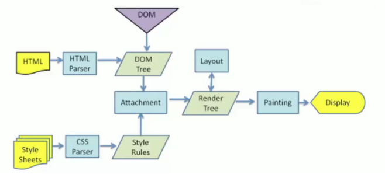  
        + 解析（Parser)HTML，生成DOM树(DOM Tree)  
        + 同时解析(Parser)css，生成样式规则(Style Rules)  
        + 根据DOM树和样式规则，生成渲染树(Render Tree)  
        + 进行布局Layout(回流/重排):根据生成的渲染树，得到节点的几何信息（位置，大小)  
        + 进行绘制 Painting(重绘):根据计算和获取的信息进行整个页面的绘制  
        + Display:展示在页面上  
    2. 回流(重排)  
        当Render Tree 中部分或者全部元素的尺寸、结构、布局等发生改变时，浏览器就会重新渲染部分或全部文档的过程称为回流。  
        + 页面的首次刷新  
        + 浏览器的窗口大小发生改变  
        + 元素的大小或位置发生改变  
        + 改变字体的大小  
        + 内容的变化（如`:input`框的输入，图片的大小)  
        + 激活css伪类（如`::hover`)  
        + 脚本操作DOM（添加或者删除可见的DOM元素)  
        **简单理解影响到布局了，就会有回流**  
    3. 重绘  
        由于节点(元素)的样式的改变并不影响它在文档流中的位置和文档布局时(比如: `color、background-color,outline`等)，称为重绘  
        **<font color='red'>重绘不一定重排，重排一定会重绘</font>**  
    4. **<font color='red'>如何减少重排？</font>**  
        1. 分离读写操作  
        2. 样式集中改变 ：可以添加一个类，样式都在类中改变  
        3. 可以使用`absolute`脱离文档流  
        4. 使用 `display:none `，不使用 `visibility`，也不要改变 它的 `z-index`  
        5. 能用css3实现的就用css3实现。  
### Day 4  
1. 事件对象  
    1. 获取事件对象  
        `元素.addEventListener( 'click ' , function (e) {}) `  
        + **这个e就是事件对象，记录了事件触发的相关信息**  
    2. 事件对象常用属性  
        + `type`获取当前的事件类型  
        + `clientX / clientY`获取光标相对于浏览器可见窗口左上角的位置  
        + `offsetX / offsetY`获取光标相对于当前DOM元素左上角的位置  
        +  `pageX / pageY` 整个页面的文档坐标  
        + key用户按下的键盘键的值  (现在不提倡使用`keycode`)  
2. 事件流  
    + 事件流指的是事件完整执行过程中的流动路径  
          捕获阶段-->目标阶段-->冒泡阶段  
    + 捕获阶段触发事件，可以第三个参数设置`addEventListener( '' function(){}, true )`  
    + **事件冒泡**:当一个元素触发事件后，会依次向上调用所有父级元素的**同名事件**  
    + **阻止事件冒泡**   
          1. `e.stopPropagation()`  w3c标准 不支持IE  
          2. `e.cancelBubble = true`  不符合w3c标准  支持ie  
    + **阻止默认行为，比如链接点击不跳转，表单域的跳转**  
          + `e.preventDefault()`  
    + 鼠标经过事件:  
          + `mouseover`和`mouseout`会有冒泡效果  
          + `mouseenter` 和`mouseleave`**没有冒泡效果(推荐)**  
3. 两种注册事件  
    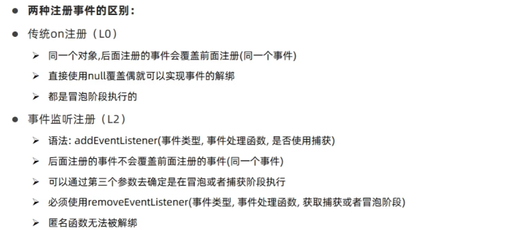  
4. 事件委托  
    + 事件委托是**给父级添加事件**而不是孩子添加事件，利用冒泡减少同一事件绑定的次数  
    + `e.target`来找到真正触发事件的对象  
### Day 5  
1. 滚动事件和加载事件  
    1. 滚动事件  
        + 监听整个页面滚动  
            1. `window.addEventListener( 'scroll', function () { })`  
            2. 给`window`或`document`添加`scroll`事件  
        + 监听某个元素的内部滚动直接给某个元素加即可  
    2. **加载事件**  
        1. `load`事件  
            + 外部资源加载完毕时触发的事件,监听整个页面资源给window 加  
        2. `DOMContentLoaded`  
            + 给`document` 加,当初始的`HTML`文档完全加载和解析完成之后,`DOMContentLoaded`事件被触发，而无需等待样式表、图像等完全加载  
2. 元素大小和位置  
    1. **scroll家族**  
        1. 获取宽高: `scrollWidth`和`scrollHeight`  
            + 获取<font color='red'>**元素的内容总宽高(不包含滚动条)**</font>,**返回值不带单位**  
        2. 获取位置: `scrollLeft`和`scrollTop`  
            + 获取可滚动元素内容往左、往上滚出去看不到的距离, **返回值不带单位**  
            + 监测html的滚动：`document.documentElement.scrollTop`  
            + 这两个属性是**可以修改**的  
    2. **offset家族**  
        1. 获取宽高: `offsetWidth`和`offsetHeight`  
            + 获取<font color='red'>**元素的自身宽高、包含元素自身设置的宽高**</font>、`padding. Border`  
        2. 获取位置:`offsetLeft`和`offsetTop`  **只读属性**  
            + 获取元素距离自己定位父级元素的左、上距离  
        3. `offsetParent`  
            + 可以用来获取当前元素的定位父元素  
    3. **client家族**   
        1. 获取宽高：`clientwidth`和`clientHeight`  
            + 获取<font color='red'>**元素的可视区域宽度和高度，不含边框和滚动条**</font>  
        2. 获取位置: `clientLeft`和`clientTop`  只读属性  
            + 获取左边框和上边框宽度  
    4. `resize`事件：会在窗口尺寸改变的时候触发事件:  
        + 检测屏幕宽度  
        ```js  
          window.addEventListener('resize', function(){
            let w = document.documentElement.clienWidth
            console.log(w)
          })
        ```  
    5. 滚动条检测  
        + **当满足`scrollHeight - scrollTop == clientHeight`说明垂直滚动条滚动到底了**  
        + **当满足`scrollwidth - scrollLeft == clientwidth`说明水平滚动条滚动到底**  
    6. 轮播图技巧  
        + **轮播图最后一张回到第一张**：`索引号 = 索引号 % 数组长度`  
        + **第一张回到最后一张**：`索引号 = (数组长度 + 索引号) % 数组长`   
### Day 6  
1. Window对象  
    1. BOM(浏览器对象模型)  
        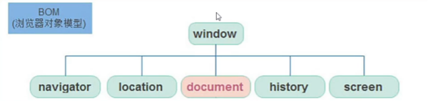  
    2. 定时器-延时函数  
        `setTimeout(回调函数，等待的毫秒数)`   仅仅只执行一次  
        + 递归函数：自己调用自己的函数，一定要**加上退出条件**，以免死递归  
        + `setTimeout`结合递归函数，能模拟`setlnterval`重复执行  
    3. JS执行机制  
        + JavaScript语言的一大特点就是单线程，也就是说，同一个时间只能做一件事。作为浏览器脚本语言，JavaScript以主要用途是与用户互动，以及操作DOM。这决定了它只能是单线程，否则会带来很复杂的同步问题  
        + 同步任务:同步任务都在主线程上执行，形成一个执行栈  
        + 异步任务:JS的异步是通过回调函数实现的  
            1. 普通事件，如`click、resize`等  
            + 资源加载，如 `load、error`等  
            + 定时器，包括 `setInterval、setTimeout`等  
        + 由于主线程不断的重复获得任务、执行任务、再获取任务、再执行，所以这种机制被称为**事件循环**（`event loop`)  
    4. location对象  
          
    5. navigator对象  
        + 代表的当前浏览器的信息，通过该对象可以来识别不同的浏览器  
        + 一般我们只会使用`userAgent`来判断浏览器的信息, 或者`Activexobject`  
    6. histroy对象  
        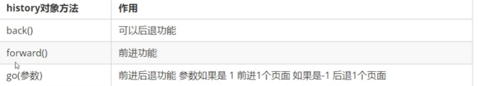  
2. 本地存储  
    1. 本地存储特性  
        1. 数据存储在用户浏览器中  
        2. 设置、读取方便、甚至页面刷新不丢失数据  
        3. 容量较大，`sessionStorage`和`localStorage`约5M左右  
    2. `localStorage`  
        1. 生命周期永久生效，除非手动删除否则关闭页面也会存在  
        2. 可以多窗口(页面）共享（同一浏览器可以共享)  
        3. 以键值对的形式存储使用  
        ```js
           localStorage.setltem('键','值')  //存储数据
           localStorage.getltem('键')  //获取数据
           localStorage.removeltem(key)  //删除数据
        ```  
        4. **存储复杂数据类型存储**  
            + 本地只能存储字符串,无法存储复杂数据类型  
            1. `JSON.stringify(复杂数据类型)`  -- 将复杂数据转换成JSON字符串存储本地存储中  
            2. `JSON.parse(JSON字符串)`  -- 将JSON字符串转换成对象取出时候使用  
    3. `sessionStorage` (了解)  
        1. 生命周期为关闭浏览器窗口  
        2. 在同一个窗口(页面)下数据可以共享  
        3. 以键值对的形式存储使用  
        4. 用法跟localStorage基本相同  
        + 使用场景：多页表单填写，用户可能返回上一页修改；用户误刷新  
### Day 7  
1. 正则表达式  
    1. 正则表达式有什么作用?  
        + 表单验证（匹配) -- 过滤敏感词（替换)  -- 字符串中提取我们想要的部分（提取)  
    2. 定义  
        + `let 变量名=/表达式/匹配模式`    i 忽略大小写  g全局匹配模式  
        + `let变量名=new RegExp("正则表达式","匹配模式")`;  
    3. 检测方法  
        + `reg.test('待检测字符串')`  返回值为布尔值  
        + `reg.exec('字符串')`  返回一个数组  
    4. 元字符（特殊字符）  
        1. 边界符（表示位置，开头和结尾，必须用什么开头，用什么结尾)  
            1. `^`表示匹配行首的文本(以谁开始)  
            2. `$` 表示匹配行尾的文本(以谁结束)  
            3. 如果`^$`在一起，表示精确匹配  
        2. 量词（表示重复次数)   
            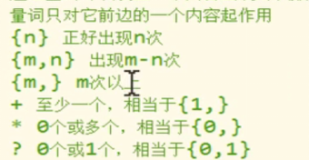  
        3. 字符类(比如`\d表示0~9`)   
            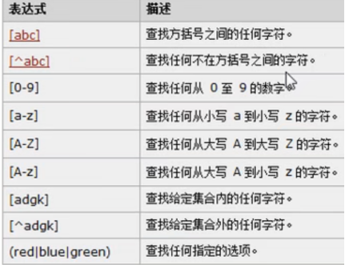  
        4.  .表示除了换行外的任意字符  
            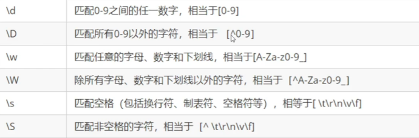  
    5. **过滤敏感词**  
        ```js
            字符串.replace(/正则表达式/,'替换的文本')
        ```  
    6. `split()`  
        + 可以将一个字符串拆分为一个数组  
        + 方法中可以传一个正则表达式作为参数，这样将会根据正则表达式去拆分字符串  
    7. `search()`  
        + 可以搜索字符串中是否含有指定内容  
        + 如果搜索到指定内容，则会返回第一次出现的索引，如果没有搜索到返回-1  
        + 它可以接受一个正则表达式作为参数，然后会根据正则表达式去检索字符串  
        + `search()`只会查找第一个，即使设置全局匹配也没用  
    8. `match()`  
        + 可以根据正则表达式，从一个字符串中将符合条件的内容提取出来  
        + 默认情况下我们的match只会找到第一个符合要求的内容，找到以后就停止  
        + 我们可以设置正则表达式为全局匹配模式，这样就会匹配到所有的内容可以为一个正则表达式设置多个匹配模式，且顺序无所谓  
        + `match()`会将匹配到的内容**封装到一个数组中返回**，即使只查询到一个结果

##  面向对象+JS高级  
### Day 1  

1. 面向对象编程介绍  
    1. 面向过程 蛋炒饭  
        + 优点∶性能比面向对象高，适合跟硬件联系很紧密的东西，例如单片机就采用的面向过程编程  
        + 缺点∶没有面向对象易维护、易复用、易扩展  
    2. 面向对象(**继承性、多态性、封装性**) 盖浇饭  
        + 优点∶易维护、易复用、易扩展，由于面向对象有封装、继承、多态性的特性，可以设计出低耦合的系统，使系统更加灵活、更加易于维护  
        + 缺点︰性能比面向过程低  
2. ES6中的类和对象  
    1. 对象  
        + 对象是由属性和方法组成的，**对象特指某一个，通过类实例化一个具体的对象**  
    2. 类  
        + 类抽象了对象的公共部分，它泛指某一大类( class )  
    3. 面向对象的思维特点:  
        1. 抽取（抽象）对象共用的属性和行为组织(封装)成一个类(模板)  
        2. 对类进行实例化,获取类的对象  
          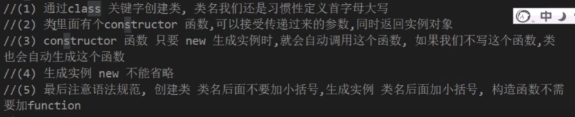  
        **类里面可以添加方法，不需要function关键词，多个方法之间不用逗号隔开**  
3. 类的继承  
    1. `class son extends Father {  } `子类继承父类的一些属性和方法  
    2. `super`关键字用于访问和调用对象父类上的函数。可以调用父类的构造函数，也可以调用父类的普通函数  
    3. 子类在构造函数中使用`super`,必须放到`this`前面(必须先调用父类的构造方法,在使用子类构造方法)  
    4. 在ES6中类没有变量提升，所以必须先定义类，才能通过类实例化对象  
    5. 类里面的共有的属性和方法一定要加this使用  
    6. `constructor`里面的`this`指向实例对象,方法里面的`this`指向这个方法的调用者  
### Day 2  
1. 构造函数  
    构造函数是一种特殊的函数，主要用来初始化对象，即为对象成员变量赋初始值，它总与`new`一起使用。我们可以把对象中一些公共的属性和方法抽取出来，然后封装到这个函数里面  
    + new在执行时会做四件事情:  
        1. 在内存中创建一个新的空对象。  
        2. 让this指向这个新的对象。  
        3. 执行构造函数里面的代码，给这个新对象添加属性和方法。  
        4. 返回这个新对象（所以构造函数里面不需要`return`)。  
    + 静态成员:在构造函数本身上添加的成员称为静态成员，只能由构造函数本身来访问·  
    + 实例成员:在构造函数内部创建的对象成员称为实例成员，只能由实例化的对象来访问  
    + 构造函数方法很好用，但是**存在浪费内存的问题**  
2. 原型  
    ES6之前通过构造函数+原型实现面向对象编程  
    1. 构造函数有原型对象`prototype`，默认指向**空`Object`对象**  
    2. 构造函数原型对象`prototype`里面有`constructor`指向构造函数本身  
    3. 构造函数可以通过原型对象添加方法  
    4. 构造函数创建的**实例对象有`__proto__`原型**指向构造函数的原型对象  
    5. **`__proto__`对象原型和原型对象`prototype`是等价的**  
    6. 对象原型(`__proto__`)和构造函数( `prototype` )原型对象里面都有一个属性`constructor`属性，`constructor`我们称为构造函数，因为它指回构造函数本身。  
    7. **如果我们修改了原来的原型对象,给原型对象赋值的是一个对象,则必须手动的利用`constructor`指回原来的构造函数**  
        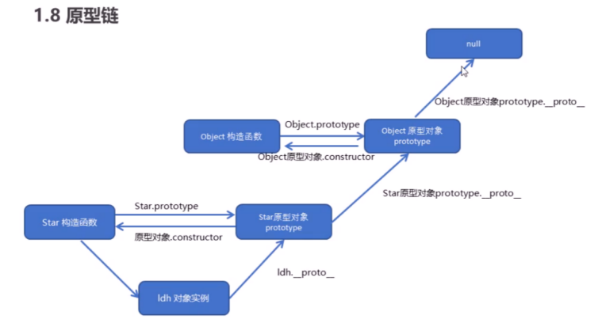  
3. 组合继承  
    ES6之前并没有给我们提供`extends`继承。我们可以通过**构造函数+原型对象**模拟实现继承，被称为组合继承  
        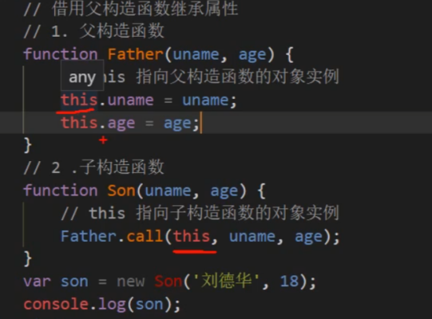  
    + **如何从原型继承方法（<font color="red">两个要点</font>）**  
        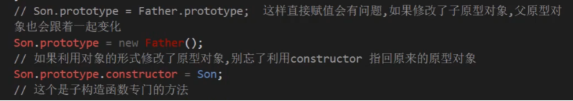  
4. 类的本质  
    + **类的本质其实还是一个函数，我们也可以简单的认为类就是构造函数的另外一种写法**  
        1. 类有原型对象`prototype`  
        2. 类原型对象`prototype`里面有`constructor`指向类本身  
        3. 类可以通过原型对象添加方法  
        4. 所以ES6的类其实就是语法糖.    
5. ES5新增方法  
    1. `forEach`数组遍历  
        ```js
        arr.forEach(function (value,index,array) {
            console.log('每个数组元素' + value)
            console.log('每个数组元素的索引号' + index)
            console.log('数组本身' + array)
        })
        ```  
    2. `fiflter`方法  
        ```js  
        arr.fiflter(function(currentValue,index,arr))  
        ```  
        + `filter()`方法创建一个新的数组，新数组中的元素是通过检查指定数组中符合条件的所有元素,主要用于筛选数组  
        + **<font color="red">注意它直接返回一个新数组</font>**  
    3. `some`方法  
        + `some()`方法用于检测数组中的元素是否满足指定条件.通俗点查找数组中是否有满足条件的元素  
        + **<font color="red">注意它返回值是布尔值,如果查找到这个元素,就返回`true`，如果查找不到就返回`false`.</font>**  
        + 如果找到第一个满足条件的元素,则终止循环不在继续查找.  
        + **`Some`和`foreach`的区别**  
            1. 在`forEach`里面`return`不会终止迭代  
            2. 在`some`里面遇到 `return true`就是终止遍历迭代效率更高  
    4. `reduce`方法  
        +  `.reduce((累加的结果,当前循环项)=>( {  }，初始值)`  
        ```js
            const result = arr.filter(item =>item.state).reduce((amt,item)=>{
                return amt += item.price * item,count
            },0)
        ```  
    5. `trim()` 去除字符串前后的空白。  
    6. `Object.defineProperty`定义新属性或修改原有属性  
        ```js  
            Object.defineProperty(obj,'num',{
                value:1000
            }) 
            //>>第三个参数以对象书写    
            value:设置属性的值默认为undefined  
            writable:值是否可以重写。true | false 默认为false  
            enumerable:目标属性是否可以被枚举。true | false默认为false  
            configurable:目标属性是否可以被删除或是否可以再次修改特性true | false 默认为false
        ```   
    7. `Object.keys（）`  
        + 用于获取对象自身所有的属性，**返回一个由属性名（一层）组成的数组**   
### Day 3  
1. 函数的定义和调用方式  
    1. 函数声明方式`function`关键字(命名函数)  
    2. 函数表达式(匿名函数)  
    3. `new Function（'参数1’,’参数2’,’函数体’）`  
        + 所有函数都是`Function`的实例(对象)  
        + 所有的函数都是对象  
2. **call、apply和bind**  
    ```js
        fn.call(obj，'参数1'，'参数2')  
        fn.apply（obj，['参数1'，'参数2']） //与call的不同点是参数用伪数组传递  
            Math.max.apply（Math，arr）//可以用来求数组中的最值  
        fn.bind(obj，'参数1'，'参数2') //与call不同是他不会调用函数，返回原函数的拷贝  
    ```  
    ```js  
        var btns = document.querySelectorAll('button')
        for(var i = 0;i<btns.length;i++){
            btns[i].onclick = function(){
                this.disabled = true
                setTimeout(() => {
                    this.disabled = false
                }.bind(this),2000);
            }
        }  
    ```  
3. 严格模式  
    1. 为脚本开启严格模式  
        + `use strict `   //`'use strict'` 放在一个立即执行函数里第一行  
    2. 为函数开启严格模式  
        + 在某个函数里面第一行添加 `'use strict'`  
        + 严格模式语法变化  
            1. 我们的变量名必须先声明再使用  
            2. 我们不能随意删除已经声明好的变量  
            3. **严格模式下全局作用域中函数中的`this`是`undefined`**  
            4. 严格模式下,如果构造函数不加`new`调用,`this`会报错.  
            5. 定时器`this` 还是指向`window`  
            6. .函数不能有重名的参数  
            7. 不允许在非函数的代码块内声明函数。  
4. 高阶函数  
    + 高阶函数是对其他函数进行操作的函数，它**接收函数作为参数**或将**函数作为返回值**  
5. 闭包  
    + 闭包( closure )指有权**访问另一个函数作用域中变量**的函数。  
        1. 理解一:闭包是嵌套的内部函数(绝大部分人)  
        2. 理解二:包含被引用变量(函数)的对象(极少数人)  
    + 闭包的作用：  
        1. 闭包作为返回值，函数运行完成变量却不会被销毁。(延长了局部变量的生命周期)  
        2. 让函数外部可以操作(读与)到函数内部的数据(变量/函数)  
        3. 可以用来实现模块化或封装代码。  
6. 递归  
    + **函数内部自己调用自己，这个函数就是递归函数**  
    + **<font color="red">递归函数必须加退出条件</font>**  
    ```js  
        function fn(n) {  //利用递归求解 n！
            if(n == 1){  //递归退出条件
                return 1
            }
            return n * fn(n-1)
        }
    ```  
7. 浅拷贝和深拷贝  
    1. 浅拷贝只是拷贝一层,更深层次对象级别的只拷贝引用.  
        1. `Object.assign(o,obj)`;  
        2. `for in`  
    2. 深拷贝拷贝多层,每一级别的数据都会拷贝.  
        1. 递归（先判断数组在判断对象）  
            ```js  
                function deepClone(obj = {}){
                    //obj是null或者不是数组或者对象，直接返回
                    //注意此处typeof的是小写的object，null判断用的==而不是===
                    if(typeof obj !== 'object' || obj == null ){
                        return obj
                    } else {
                        let result
                        if(obj instanceof Array){
                            result = []
                        }else {
                            result = {}
                            for (let key in obj){
                                //保证key不是原型上的属性
                                if(obj.hasOwnProperty(key)){
                                    result[key] = deepClone(obj[key])
                                }
                            }
                        }
                        return result
                    }
                }
            ```
        2. `JSON`转字符串-->`JSON`转对象  
            ```js
                let newStr = JSON.stringfy(obj)
                let newObj = JSON.parse(newStr)
                return newObj  
            ```  
8. `let`和`const`  
    1. let不能重复定义变量，var可以重复定义变量。  
    2. let有块级作用域，var没有块级作用域。  
    3. let没有变量提升，但有暂时性死区  
    4. const是设置常量，也就是不能改变。const定义的数值字符串的时候值不能改变。  
    5. const定义的对象的时候，对象不能改变，但是对象的属性值可以改变。  
    + 对比  
        1. 使用var声明的变量，其作用域为该语句所在的函数内，且存在变量提升现象。  
        2. 使用let声明的变量，其作用域为该语句所在的代码块内，不存在变量提升。  
        3. 使用const声明的是常量，在后面出现的代码中不能再修改该常量的值。  
9. 数组解构  
    1. 数组解构允许我们按照一一对应的关系从数组中提取值  
    2. `let [a, b, c, d, e] = arr;`  
10. 对象解构  
    1. `let { name, age ) = person ;`  
    2. `let { name:Myname , age:Myage} = person;`  
11. 箭头函数  
    1. 一般会定义一个变量接收 `const fn =  ( ) => {  }`  
    2. **函数体中只有一句代码，且代码的执行结果就是返回值，可以省略大括号**  
        `const sum = (num1 , num2) => num1 + num2 ;`  
    3. 如果形参只有一个，可以省略小括号  
        `const fn = v => v;`  
    4. 箭头函数中可以形参用`…args`来接收不定数量的实参  
        `const sum = (…args) => { } `  
    5. `…s2`可以接收剩余所有解构属性  
        `let [s1, ...s2] = students `  
    6. 在调用函数时，浏览器每次都会传递进两个隐含的参数:  
        1. 函数的上下文对象this  
        2. 封装实参的对象arguments  
            + arguments是一个类数组对象,它也可以通过索引来操作数据，也可以获取长度  
            +  arguments.length可以用来获取实参的长度  
            + 我们即使不定义形参，也可以通过arguments来使用实参，只不过比较麻烦,arguments[0]表示第一个实参，arguments[1]表示第二个实参  
            + 它里边有一个属性叫做callee, 对应当前正在指向的函数的对象  
12. 扩展运算符  
    1. 扩展运算符可以将数组或者对象转为用逗号分隔的参数序列。  
    2. 扩展运算符可以应用于合并数组。  
        `let ary3 = [ ...ary1 , ...ary2];`  
        `ary1.push ( ...ary2) ;`  
    3. 将类数组或可遍历对象转换为真正的数组  `oDivs = [...oDivs];`  
13. array扩展方法  
    1. 构造函数方法: Array.from()  
        + 将类数组或可遍历对象转换为真正的数组  
        ```js  
            let arr2 = Array.from(arrayLike) ;  //   [ 'a','b','c']   
        ```  
        + 方法还可以接受第二个参数，作用类似于数组的map方法，用来对每个元素进行处理,将处理后的值放入返回的数组.  
        ```js  
            let newAry = Array.from(aryLike, item => item * 2)  
        ```  
    2. 实例方法:find()  
        + 用于找出第一个符合条件的数组成员，如果没有找到返回undefined  
        ```js  
             let target = ary.find ( (item,index)=>item.id == 2);  
        ```  
    3. 实例方法: findIndex()  
        + 用于找出第一个符合条件的数组成员的位置，如果没有找到返回-1  
        ```js  
            let index = ary.findIndex ( (value， index) => value > 9);
        ```  
    4. 实例方法: includes()  
        + 表示某个数组是否包含给定的值，返回布尔值。  
        ```js  
            [1，2，3].includes(2)  //  true  
        ```  
14. String的扩展方法  
    1. 实例方法: startsWith()和endsWith()  
        ```js  
            startsWith()://表示参数字符串是否在原字符串的头部，返回布尔值
            endsWith()://表示参数字符串是否在原字符串的尾部，返回布尔值  
        ```  
    2. 实例方法: repeat()  
        + repeat方法表示将原字符串重复n次，返回一个新字符串。  
        ```js  
            'x'.repeat (3)   //  "xxx"  
        ```  
    3. indexof()和lastIndexOf();  
        + 检索一个字符串中是否含有指定内容, 如果字符串中含有该内容，则会返回其第一次出现的索引,如果没有找到指定的内容，则返回-1  
        + 可以指定一个第二个参数，指定开始查找的位置  
    4. split（）  
        + 可以将一个字符串拆分为一个数组  
        + 需要一个字符串作为参数，将会根据该字符串去拆分数组, 如果传递一个空串作为参数，则会将每个字符都拆分为数组中的一个元素  
15. 使用instanceof可以检查一个对象是否是一个类的实例  
    + 对象instanceof构造函数  
    + 如果是，则返回true，否则返回false  
    + 所有的对象都是Object的后代，  
    + 所以任何对象和Object在instanceof检查时都会返回true  
16. set数据结构  
    1. ES6提供了新的数据结构Set。它是类数组，成员的值都是唯一的。  
    2. Set本身是一个构造函数，用来生成Set 数据结构。`const s = new Set () ;`  
    3. Set函数可以接受一个数组作为参数，用来初始化。 `const set = new set ( [1,2,3,4,4]);`  
    4. **利用set数据结构做数组去重**  
        ```js  
            const s3 = new Set([ "a","a","b","b"]);  
            const ary = [...s3];  //['a','b']  
        ```  
    5. 实例方法  
        ```js  
            add(value)://添加某个值，返回Set结构本身  
            delete(value)://删除某个值，返回一个布尔值，表示删除是否成功  
            has(value)://返回一个布尔值，表示该值是否为Set的成员  
            clear()://清除所有成员，没有返回值  
        ```  
17. 垃圾回收（GC)  
    1. 就像人生活的时间长了会产生垃圾一样，程序运行过程中也会产生垃圾,这些垃圾积攒过多以后，会导致程序运行的速度过慢，所以我们需要一个垃圾回收的机制，来处理程序运行过程中产生垃圾.  
    2. 当一个对象没有任何的变量或属性对它进行引用，此时我们将永远无法操作该对象，此时这种对象就是一个垃圾，这种对象过多会占用大量的内存空间，导致程序运行变慢，所以这种垃圾必须进行清理。  
    3. 在JS中拥有自动的垃圾回收机制，会自动将这些垃圾对象从内存中销毁，我们不需要也不能进行垃圾回收的操作  
    4. **我们需要做的只是要将不再使用的对象设置null即可**


