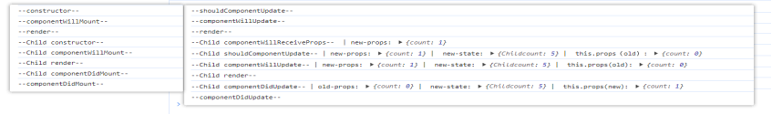
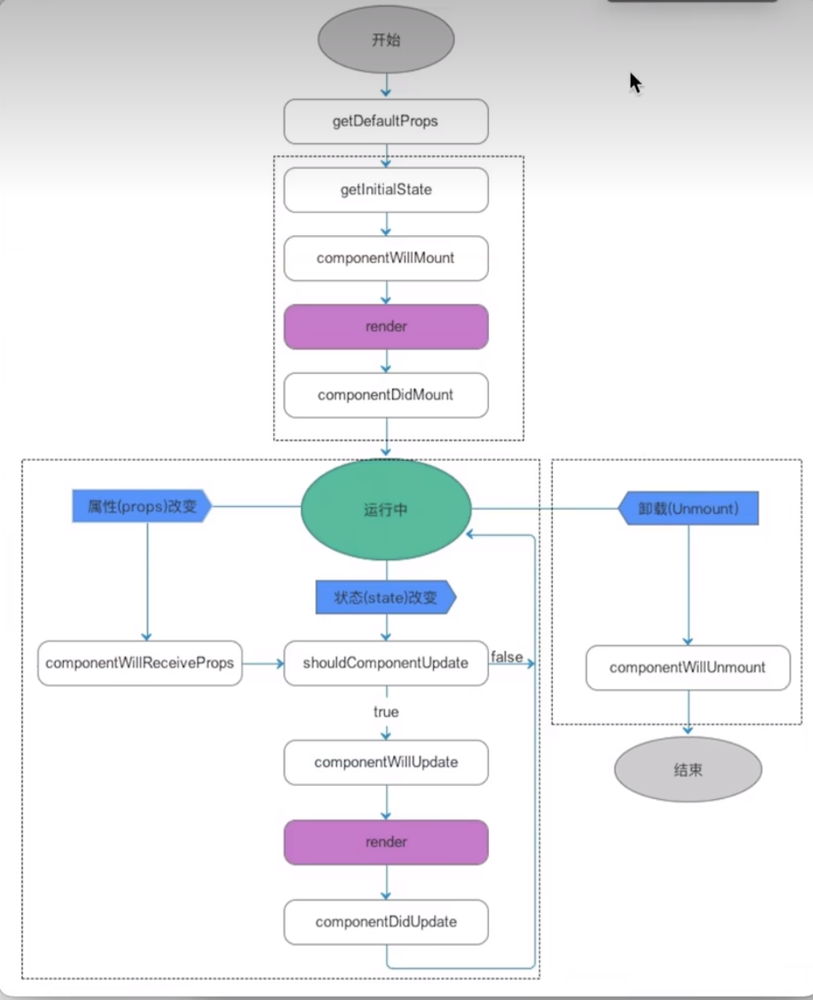

---
title: React学习笔记
date: 2023-5-8
tags:
 - React
categories:
 -  笔记
---     

##  React基础   

### **项目搭建**    
1. 安装脚手架:`npm i create-react-app -g` mac前面要设置sudo   
2. 检查安装情况：`create-react-app --version`   
3. 基于脚手架创建React工程化项目:`create-react-app 项目名称`,项目名称遵循npm命名规范  `数字 小写字母  _`    

4. **React项目中默认安装**    
    + `react` 框架核心    
    + `react-dom` 视图渲染的核心，基于react构建webapp（html页面）
    + `react-native` 构建和渲染app的    
    + `react-scripts`:脚手架为了让项目目录看起来干净一些，把webpack打包的规则及相关的插件/loader等都隐藏到了`node_modules`目录下，`react-scripts`就是脚手架中自己对打包命令的一种封装，基于它打包，会调用`node_modules`中的webpack来进行打包        
    + `web-vitals`:性能检测工具   
    + `eslintConfig`：  
          + 对webpack中ESlint词法检测的相关配置   
          + 词法错误---不符合标准规范   
          + 符合标准，代码本身不会报错，但是不符合ESlint的检测规范    
    + `browserslist`：基于browserslist规范，设置浏览器的兼容情况    
          1. 对`postcss-loader + autoprefixer`生效，会给CSS3设置相关的前缀   
          2. 对`babel-loader`生效，会把ES6编译成ES5         
          3. 无法处理ES6内置API的兼容，我们需要`@babel/polyfill`对常见内置的API重写了     
          4. 脚手架中内置兼容处理`react-app-polyfill`

5. **`scripts`命令**    
      + `start` ：开发环境--在本地启动web服务器，预览打包内容   
      + `build` ：生产环境--打包部署，打包的内容输出到dist目录中    
      + `test` ：单元测试   
      + `eject` : 暴露`webpack`配置规则，修改默认打包规则           

6. **处理跨域**       
      + 安装`http-proxy-middleware`       
      + `src/setupProxy.js`         
        ```js       
                  //处理跨域问题  跨域代理
                  const {createProxyMiddleware} = require('http-proxy-middleware')
                  module.exports = function(app){
                  app.use(
                  createProxyMiddleware('/jian',{
                        target:'https://www.jianshu.com/asimov',
                        changeOrigin:true,
                        ws:true,
                        pathRewrite:{"^/jian" : ''}
                  })
                  );
                  app.use(
                  createProxyMiddleware('/zhi',{
                        target:'https://news-at.zhihu.com/api/4',
                        changeOrigin:true,
                        ws:true,
                        pathRewrite:{"^/zhi" : ''}
                  })
                  )
                  }      
        ```         

### **React基础语法**      

1. **MVC与MVVM**            
      1. React采用的是MVC体系，Vue采取的是MVVM体系           
      2. MVC：model数据层 + view视图层 + controller控制层 （单向数据驱动视图）   
            + 我们需要按照专业的语法去构建视图（页面）：react中是基于jsx语法来构建视图的        
            + 构建数据层：但凡在视图中，需要'动态'处理的（获取需要变化的，不论是样式还是内容），我们都要有对应的数据模型           
            + 控制层：当我们在视图中进行某些操作时，修改了相关数据，react会根据最新的数据重新渲染      
      3. MVVM：model数据层 + view视图层 + viewModel数据/视图监听层 （双向数据驱动视图）      

2. **JSX构建视图的基本知识（javascript and xml）**  
      1. vscode如何支持JSX语法（格式化、快捷提示）
          + 右下角修改成jsx语言格式       
          + 后缀名改成jsx
      2. 在HTML中嵌入"js表达式"，需要使用`{}单胡子语法`
      3. 在`ReactDOM.createRoot()`的时候，不能直接把`HTML/body`作为根容器，需要指定一个额外的盒子，例如`#root`          
      4. 每个构建的视图中，只能有一个根节点           
            + react提供了一个特殊的空文档标记标签`<>React.Fragment</>`        
      5. **<font color='red'>胡子语法中嵌入不同的值，所呈现的特点</font>**          
            1. `number/string`：直接渲染值            
            2. `Boolean/null/undefined/Symbol/Bigint`:渲染内容是空            
            3. 对象：一般不支持渲染，也有特殊情况           
                  + JSX虚拟DOM对象`{React.createElement('button',null,'提交')}`                  
                  + 给元素设置style行内样式，要求必须写成一个对象格式       
            4. 数组对象：把数组每一项分别拿出来渲染，**<font color='red'>并不是变为字符串渲染，中间没有逗号</font>**
            5. 函数对象：不支持在`{}`中渲染，但是可以作为函数组件，用`<Component/>`方式渲染           
      6. **给元素设置样式**         
            1. 行内样式：需要基于**胡子语法 + 对象格式**处理            
                ```jsx
                      <h2 style={{
                        color:'red',
                        fontSize:'18px' //样式属性要基于驼峰命名法处理
                      }}>{text}</h2>      
                ```           
            2. 设置样式类名：需要把`class`替换为`className`       
                  ```jsx        
                        <h2 className='title'></h2>    
                  ```         
      7. 需求案例       
            1. 需求一：基于数据的值，来判断元素的显示隐藏         
                  ```jsx
                        {/* 控制元素的display样式，元素渲染出来了 */}
                        <button style={{display:flag?'block':'none'}}>按钮1</button>

                        {/* 控制元素渲染或者不渲染 */}
                        {!flag ? <button>按钮2</button> :null}
                  ```         
            2. 需求二: 从服务器获取了一组列表数据，循环动态绑定相关的内容           
                  ```jsx         
                        <h2 className='title'>今日新闻</h2>
                        <ul className='news-box'>
                        {list.stories.map((item,index)=>{
                        /*循环创建的元素设置key属性，优DOM-diff*/ 
                              return   (
                                    <li key={item.id}>
                                    <em>{index + 1}</em>
                                    &nbsp;&nbsp;
                                    <span>欢迎大家学习{item.title}</span>
                                    </li>
                              )})}
                        </ul>
                  ```         
            3. 扩展需求：没有数组，就想单独循环五次         
                  ```jsx  
                        //需要使用fill，将稀疏数组填充成密集数组
                        {new Array(5).fill(null).map((_,index) => {return <button key={index}>
                                    按钮{index + 1}
                                    </button>
                        })}          
                  ```         

3. **JSX底层渲染机制**        
      1. 把我们编写的JSX语法，基于`babel-preset-react-app`为`React.createElement(...)`这种格式！
           + 只要是元素节点，必然会基于`createElement`进行处理          
           + `React.createElement(ele,props,...children)`         
                  + `ele`:元素标签名（或组件）
                  + `props`：元素的属性集合对象（如果没有设置过任何属性则为`null`）     
                  + `children`：第三个往后都是当前元素的子节点 
      2. 再把`createElement`执行创建出虚拟DOM对象（virtualDOM，也有称之为：jsx元素、jsx对象、ReactChild对象...）
            ```js
                  export function createElement(ele,props,...children) {
                        let virtualDOM = {
                              $$typeof:Symbol('react.element'),
                              key:null,
                              ref:null,
                              type:null,
                              props:{}
                        }
                        let len = children.length
                        virtualDOM.type = ele
                        if(props != null){
                              virtualDOM.props = {
                              ...props
                              }
                        }
                        if(len === 1) virtualDOM.props.children = children[0]
                        if(len > 1) virtualDOM.props.children = children
                        return virtualDOM
                  }
            ```
      3. 把构建的虚拟DOM渲染为真实DOM（基于`ReactDOM`中的`render`方法）       
            + v16 **该写法现在会有控制台警告**
              ```jsx 
                        import ReactDOM from 'react-dom'; 
                        ReactDOM.render(<App/>, document.getElementById('root'))
              ```
            + v18
              ```jsx 
                        import ReactDOM from 'react-dom/client';
                        const root = ReactDOM.createRoot(document.getElementById('root'))
                        root.render(<App/>)
              ```
      4. 第一次渲染页面是直接从Vdom-->真实dom，并且把`oldVdom`缓存起来，后期视图更新的时候，需要经过一个新老Vdom的 `dom--diff`的对比，计算出补丁包`Patch`（两次视图差异的部分），把patch补丁包进行渲染      


## **React组件基础**

### 函数组件

1. **基本使用**         
     + 创建：在src目录中，创建一个xxx.jsx的文件，就是要创建一个组件，我们在此文件中，**创建一个函数，让函数返回jsx视图（或者jsx元素，VDOM对象），这就是创建一个函数组件**           
     + 调用：基于ES6Module规范，导入创建的组件
     + **双闭合调用区别：我们可以传递子节点，传递给函数的props中，有一个children属性存储这些子节点**
     + 调用组件的时候，我们可以传递各种属性，**如果属性值不是字符串，需要用胡子语法嵌套**
     + **底层渲染的主要区别就是，函数组件的type属性值不是字符串，而是一个函数，他会把函数执行，把Vdom中的props作为实参，传给了函数**

2. **属性props的处理**        
      1. 调用组件，传递进来的属性是‘只读’的，**对象是被冻结的**

      2. 虽然不能修改props，但是可以做规则校验,**不影响使用，但是校验错误会抛出警告**                 
            ```js     
                  import PropTypes from 'prop-types'
                  const DemoOne = function Demo(props){
                        let {className,style,title} = props
                        return (
                              <div className={`demo-box ${className}`} style={style}>
                                    我是DEMO-ONE
                                    <div>{title}</div>
                              </div>
                        )
                  }
                  DemoOne.defaultProps = {//把函数当做对象，设置静态的私有属性方法，来设置校验规则
                        title:'默认值'
                  }
                  DemoOne.propTypes = {  //设置其他规则依赖官方插件prop-types
                        title:PropTypes.string.isRequired, //类型是字符串 必传
                        x:PropTypes.number  //类型是数字
                        y:PropTypes.oneOfType([//多种校验规则中的一个
                        PropTypes.number,
                        PropTypes.string    
                        ])
                  }
                  export default DemoOne  
            ```

3. **插槽机制**         
      1. 和属性作用是一致的：让组件具备更强的复用性         
      2. 传递数据用属性，传递结构用插槽，通过子节点用`children`来获取
            ```jsx
                  //父组件
                  <DemoOne className='demo1'  style={{color:'red'}}>
                        <span  slot='footer'>我是尾部2</span>
                        <span>我是moren</span>
                        <span slot='header'>我是头部</span>
                        <span  slot='footer'>我是尾部1</span>
                  </DemoOne>
                  //子组件
                  import React from 'react'
                  const DemoOne = function Demo(props){
                        let {children} = props
                        //要对children的类型做处理
                        //可以基于React.Children对象中提供的方法，对props.children做处理
                        //count/forEach/map/toArray这些方法的内部，已经对children的各种形式做了处理
                        children = React.Children.toArray(children)
                        let headerSlot = [],
                        footerSlot = [],
                        defaultSlot =[]
                        children.forEach(child =>{
                        //传递进来的插槽信息，都是编译为Vdom对象，而不是传递的标签
                              console.log(child);
                              let {slot} = child.props
                              if(slot === 'header'){ //按照插槽名字 进行筛选不同的插槽信息
                                    headerSlot.push(child)
                              }else if(slot === 'footer'){
                                    footerSlot.push(child)
                              }else{
                                    defaultSlot.push(child)
                              }
                        })
                        return <div className='demo-box' >
                                    {headerSlot}
                                    <div>我是DEMO-ONE</div>
                                    {footerSlot}
                                    {defaultSlot}
                              </div>
                  }
            ```

4. **封装一个Dialog组件**           
      ```jsx
            import PropTypes from 'prop-types'
            import React from 'react'
            const Dialog = function Dialog(props) {
            let {title,content,children} = props
            children = React.Children.toArray(children)
            let submitSlot = [],defaultSlot=[]
            let count = React.Children.count(children)
            children.forEach(child =>{
            let {slot} = child.props
            if(slot === 'submit'){
                  submitSlot.push(child)
            }else{
                  defaultSlot.push(child)
            }
            console.log(child,submitSlot,defaultSlot);
            })
            return <div className='dialog-box'  style={{
                  border:'1px solid red',
                  padding:'10px',
                  width:300,
                  height:'300px'
            }}>
                  <p style={{
                  borderBottom:'1px solid #000',
                  }}>{title}</p>
                  <p>{content}</p>
                  {
                  count > 0 ? <><div>{submitSlot}</div> <div>{defaultSlot}</div></> :null
                  }
            </div>
            }
            //属性规则校验
            Dialog.defaultProps = {
            title:'提示'
            }
            Dialog.propTypes = {
            title:PropTypes.string,
            content:PropTypes.string.isRequired 
            }
            export default Dialog
            //父组件渲染
              root.render(
                  <>
                        <Dialog title='温馨提示' content='大家出门做好防护！'></Dialog>
                        <Dialog  content='这是一个没有标题的dialog'>
                        <button>确定</button>
                        <button>yes</button>
                        </Dialog>
                        <Dialog  content='这是一个提交弹窗'>
                        <button slot='submit'>提交</button>
                        </Dialog>
                  </>
            );
      ```

### **静态组件和动态组件**          

1. **区别**       
      + 函数是**静态组件**        
         + **第一次渲染组件，把函数执行，产生一个私有的上下文：EC(V)**，把解析出来的props（含children）传递进来，但是**被冻结了**，对函数返回的JSX元素（vdom）进行渲染
         + 当我们点击按钮时，会把绑定的小函数执行，修改上级上下文EC(V)中的变量，**私有变量值改变了，但是不会更新视图**      
         + 无法自更新，除非调用它的父组件更新了，那么相关的子组件也一定会更新「可能传递最新的属性值进来」
         + 函数组件具备：属性...「其他状态等内容几乎没有」
         + 优势：比类组件处理的机制简单，这样导致函数组件渲染速度更快！！
      + 类组件是**动态组件**：
         + 组件在第一渲染完毕后，除了父组件更新可以触发其更新外，我们还可以通过：`this.setState`修改状态 或者 `this.forceUpdate` 等方式，让组件实现“自更新”！！
         + 类组件具备：属性、状态、周期函数、ref...「几乎组件应该有的东西它都具备」
         + 优势：功能强大！！
      + Hooks组件「推荐」：具备了函数组件和类组件的各自优势，在函数组件的基础上，基于hooks函数，让函数组件也可以拥有状态、周期函数等，让函数组件也可以实现自更新「动态化」！！

2. **类组件**           
      1. 创建类组件：创建一个构造函数（类）
         + 要求必须继承`React.Component/PureComponent`这个类
         + 必须给当前类设置一个render的方法（放在其原型上）        
            ```js  
                  import React from 'react'     
                  class Sub extends React.Component{
                        render(){
                              return <></> //在render方法中，返回需要渲染的视图
                        }
                  }  
                  export default Sub
            ```
     
      2. class基本语法回顾          
      ```js       
            class Parent {
                  //new的时候，执行的构造函数（需要接收传递进来的实参信息，才需要设置constructor）
                  constructor (x,y){
                        //this --> 创建的实例
                        this.total = x+y
                  }
                  // = 赋值--> 相当于this.num = 200-->创建的实例
                  num = 200
                  //箭头函数没有自己的this，所用到的this是宿主环境中的
                  getNum = ()=>{  
                        console.log(this.num);//this-->实例
                  }
                  //给Parent.prototype设置的公共方法，不可枚举
                  getNum2 (){
                        console.log(this,'原型');
                  }
                  //把构造函数当做一个普通对象，为其设置静态的私有属性方法 Parent.xxx
                  static avg = 100  
                  static average(){}
            }
            Parent.prototype.y = 200 //外部手动给原型上设置公共属性

            /*基于extends实现继承  
            1. 首先基于call继承 React.Component.call(this)  -->  this-->Parent类的实例P 

            2.给创建的实例p设置四个私有属性  

            3. 再基于原型继承 Parent.prototype.__proto__ === React.Component.prototype
            实例-->Parent.prototype-->React.Component.prototype-->Object.prototype
            继承forceUpdate isReactComponent setState方法

            4.只要自己设置了constructor，则内部第一句话一定要执行super() 
            */ 
            class Parent extends React.Component{
                  constructor(n,m){
                        super() //等价于React.component.call()
                  }
            } 
            
            function Component(props,context,updater){
                  this.props = props
                  this.context = context
                  this.refs = emptyObject
                  this.updater = updater || ReactNoopUpdateQueue
            }
      ```
      
      3. render函数在渲染的时候，如果type是：
            + 字符串：创建一个标签
            + 普通函数：把函数执行，并且把props传递给函数，**每次执行会创造新的执行上下文，所以多个组件不影响**
            + 构造函数：把构造函数基于new执行，也会把解析出来的props传递过去，
                + **每次执行会创造新的实例，所以多个组件不影响**
                + 把类组件中的render函数执行，把返回的jsx渲染
      
      4. 调用类组件（new Vote({..})）开始，类组件内部发生的事情
            ```js
                  /*1. 规则校验 && 属性初始化
                      方案一：super(props)
                      方案二：不在constructor中处理或者不写constructor，React也会在内部把传递的props挂载到实例上，所以在其它函数中，只要保证this是实例，就可以基于this.props获取传递的属性
                        */
                  class Parent extends React.Component{
                        constructor(props){
                              super(props) //会把传递进来的属性挂载到this实例上
                              console.log(this.props)//获取到传递的属性
                        }
                        //属性规则校验
                        static defaultProps = {
                              num:0
                        }
                        static propTypes = {
                              title:PropTypes.string.isRequired
                        }
                  }    
                  /* 2.初始化状态 
                              1. 需要手动初始化，如果我们没有去做相关的处理，则默认会在实例上挂载一个state：null
                              state = {
                                    ...
                              }
                              2. 修改状态，视图更新
                                    1. this.state.xxx = xxx  只能修改状态，不能视图更新
                                    2. this.setState(partialState) 既可以修改状态，也可以让视图更新
                                    this.setState({
                                          xxx:xxx,
                                    })
                                    3. this.forceUpdate()强制更新
                  */     
            ```
      
      5. 类组件第一次渲染过程 && 视图更新过程
            ```js
                  /*
                  1. 第一次渲染过程
                        + 触发 `UNSAFE_componentWillMount`钩子函数:组件第一次渲染之前
                        + 为了不抛出黄色警告，可以暂时用`UNSAFE_componentWillMount`,React严格模式使用UNSAFE则会抛出红色警告           
                        + 触发`render`周期函数
                        + 触发`componentDidMount`钩子函数：第一次渲染完毕 
                  */
                 /*    
                 2. 组件更新的逻辑「第一种：组件内部的状态（state）被修改，组件会更新」       
                        + 触发`shouldComponentUpdate`，
                        特殊说明：this.forceUpdate()会跳过shouldComponentUpdate校验  
                        + 触发`UNSAFE_componentWillUpdate`
                        + 触发`render`
                        + 触发`componentDidUpdate`
                   组件更新的逻辑「第二种：父组件更新（props改变），触发的子组件更新」
                        + 触发 UNSAFE_componentWillReceiveProps 周期函数：接收最新属性之前
                        + ...
                  */
                 /*
                   3.组件卸载的逻辑
                        1. 触发 componentWillUnmount 周期函数：组件销毁之前
                        2. 销毁
                 */
                  render () {
                        console.log('render渲染')
                  }
                  UNSAFE_componentWillMount () {
                        console.log('componentWillMount:第一次渲染之前')
                  }
                  componentDidMount () {
                        console.log('componentDidMount:第一次渲染完毕')
                  }
                  shouldComponentUpdate (nextProps, nextState) {
                        //nextState:存储要修改的最新状态
                        //this.state：存储的还是修改前的状态，此时还未改变状态
                        console.log('shouldComponentUpdate,是否允许修改，更新之前', nextProps, nextState, this.state)
                        //此周期函数需要返回true(允许更新)/false(不允许更新)
                        return true
                  }
                  UNSAFE_componentWillUpdate () {
                        console.log('componentWillUpdate,状态还未修改，更新之前')
                  }
                  componentDidUpdate () {
                        console.log('componentDidUpdate,状态已经修改，更新完毕')
                  }
                  UNSAFE_componentWillReceiveProps (nextProps) {
                        console.log('componentWillReceiveProps,父组件修改特殊周期', this.props, nextProps)
                  }
            ```
            
      6. `PureComponent`和`Component`的区别
            + `PureComponent`会给类组件默认添加`shouldComponentUpdate`周期函数
                  1. 在此周期函数中，他对新老的属性进行浅比较     
                  2. 如果比较后发现属性和状态没有变，则返回false，也就不执行后续生命周期了      
            
      7. ref  
            + 应用场景：
                  1. 管理焦点，文本选择或媒体播放。
                  2. 触发强制动画。
                  3. 集成第三方 DOM 库。
            + 基于ref获取DOM的语法（**给类组件设置ref，获取的是当前组件的实例**）        
                  1. string ref(废弃) : 元素设置`ref='xxx'`,通过`this.refs.xxx`来获取            
                  2. callback ref : 把ref属性设置为一个函数`ref =（x=>this.xxx = x）`，直接通过`this.xxx`来获取（推荐）
                  3. React.createRef() : 基于`xxx = React.createRef()`创建一个对象-->`{current:null}`,设置`ref = {xxx}`,通过`this.xxx.current`来获取
                  ```js
                        class Parent extends React.Component{
                              constructor(props){
                                    super(props) 
                                    this.ref1 = React.createRef()  //{current:null}
                              }
                              componentDidMount(){
                                    console.log(this.ref1)  //React.createRef() --> {current:div}
                                    console.log(this.refs.ref2)  //string ref(废弃)
                                    console.log(this.ref3) //callback ref  这个也可以用作父组件拿子组件的ref
                              }
                              render(){
                                    return <div>
                                          <div ref={this.ref1}></div>
                                          <div ref='ref2'></div>   
                                          <div ref={ele=>this.ref3 = ele}></div>
                                    </div>
                              }
                        
                        }  
                  ```
            + **以上三种使用ref方式不能在函数组件上使用，因为函数组件没有实例**
                  1. 可以将该组件转化为 class 组件
                  2. 可以使用 `React.forwardRef`实现ref的转发（可与 `useImperativeHandle` 结合使用）
                  3. 在函数组件 使用useRef
                        ```js
                              const Child = React.forwardRef((props,ref)=>{
                                    return <button ref={ref}></button>
                              })
                              //父组件
                              render(){
                                    return <Child ref={x=>this.child = x}></Child>
                              }///    
                              console.log(this.child)
                        ```
            + 在HOC中转发ref
                  + 这个技巧对高阶组件（HOC）特别有用（接受一个组件，返回一个组件的函数）
                  ```js
                        function logProps(WrapperdComponent){
                              class LogProps extends React.Component{
                                    componentDidUpdate(prevProps){

                                    }
                                    render(){
                                          return <WrapperdComponent {...this.props}/>
                                    }
                              }
                              return LogProps
                        }

                        function logProps(WrapperdComponent){
                              class LogProps extends React.Component{
                                    componentDidUpdate(prevProps){

                                    }
                                    render(){
                                          const {forwardedRef , ...rest} = this.props
                                          return <WrapperdComponent ref={forwardedRef} {...rest}/>
                                    }
                              }
                              return React.forwardRef((props,ref)=>{
                                    return <LogProps {...props} forwardedRef={ref}/>
                              })
                        }
                  ```

### setState进阶        
1. **语法分析**   `setState(obj,callback)`    
      * 第一个参数：当 obj 为一个对象，则为即将合并的 state ；如果 obj 是一个函数，那么当前组件的 state 和 props 将作为参数，返回值用于合并新的 state。

      * 第二个参数 callback ：callback 为一个函数，函数执行上下文中可以获取当前 setState 更新后的最新 state 的值，可以作为依赖 state 变化的副作用函数，可以用来做一些基于 DOM 的操作。

      ```js
            /* 第一个参数为function类型 */
            this.setState((state,props)=>{
                  return { number:1 } 
            })
            /* 第一个参数为object类型 */
            this.setState({ number:1 },()=>{
                  console.log(this.state.number) //获取最新的number
            })
      ```
2. **一次setState在 React 底层主要做了那些事**
* 首先，setState 会产生当前更新的优先级（老版本用 expirationTime ，新版本用 lane ）。
* 接下来 React 会从 fiber Root 根部 fiber 向下调和子节点，调和阶段将对比发生更新的地方，更新对比 expirationTime ，找到发生更新的组件，合并 state，然后触发 render 函数，得到新的 UI 视图层，完成 render 阶段。
* 接下来到 commit 阶段，commit 阶段，替换真实 DOM ，完成此次更新流程。
* 此时仍然在 commit 阶段，会执行 setState 中 callback 函数,如上的`()=>{ console.log(this.state.number)  }`，到此为止完成了一次 setState 全过程。

3. **类组件如何限制 state 更新视图**
* ① pureComponent 可以对 state 和 props 进行浅比较，如果没有发生变化，那么组件不更新。
* ② shouldComponentUpdate 生命周期可以通过判断前后 state 变化来决定组件需不需要更新，需要更新返回true，否则返回false。
* ③ componentDidUpdate不会执行，但是callback依旧会执行！！！类似于$nextTick


4. **异步更新**       
      + 在`React18`中，产生的私有上下文中，遇到`setState`,不会立即更新状态和视图，而是加入到更新队列`updaterQueue`中。
      + 当上下文中代码都处理完毕后，会让更新队列中的任务，统一渲染/更新一次（批处理）
      + 能够有效减少更新次数，降低性能消耗，有效管理代码执行的逻辑顺序
      + **<font color='red'>在`React18`和`React16`中，关于`setState`的区别</font>**            
            + **在`React18`中，不论什么地方，都是异步的，基于`updaterQueue`处理机制实现批处理**           
            + **在`React16`中，在合成事件（On绑定事件），周期函数中，`setState`是异步的，但是如果`setState`出现在其他异步操作中，比如定时器，手动获取DOM元素做的事件绑定，它将变为同步的操作（立即更新状态和视图渲染）**

5. **flushSync**
      + `react-dom`中有个`flushSync`方法，可以刷新`updaterQueue`，也就是让修改状态的任务立即批处理一次
           ```js
                  //写法一 先渲染xy 在渲染z
                  this.setState({x:x+1})
                  flushSync(()=>{
                        this.setState({
                              y:y+1  
                        })
                  })
                  this.setState({z:z+1})

                  //写法二 先渲染xy 在渲染z
                   this.setState({x:x+1})
                   this.setState({y:y+1})
                   flushSync()  
                   this.setState({z:z+1})

                  //写法三 先渲染xz 在渲染y
                   this.setState({x:x+1},()=>{
                       this.setState({y:y+1}) 
                   })
                   this.setState({z:z+1})
           ```

6. **<font color='red'>短时间内多次修改state的同一值的问题</font>**
      ```js
            /*
                  在每一轮循环的时候，x状态没有更新，只是****把修改的任务结果放在了队列中****
                  所以每一轮循环，我们获取的this.state.x的初始值都是0，最后导致，放入队列中的任务都是要把x修改为1，并不是只执行最后一次
             */
            for (let i = 0; i < 20; i++) {
                  this.setState({ x: this.state.x + 1 })
            }
            /*解决方案：
                  利用 this.state((preState)=>{
                        return {}
                  })
                  这是把回调函数放入队列中！！！
                  回调函数中把preState中的x暂存了，这样就保证拿到的初始值不是原始初始值
            */
            for (let i = 0; i < 20; i++) {
                  this.setState((state) => {
                        console.log('back', state)
                        return { x: state.x + 1 }
                  })
            }
      ```

### **合成事件（Synthetic）**
1. 合成事件是围绕浏览器原生事件，充当浏览器包装器的对象，他们将不同浏览器的行为合并为一个API，这样做是为了确保事件在不同浏览器中显示一致的属性

2. 合成事件this指向问题
      ```js
            class App extends React.Component {
              constructor(props) {
                super(props)
                this.state = {
                  count: 'old'
                }
                this.handlerClick = this.handlerClick.bind(this)   //配合方案1使用
              }
             handle1 (e) { //方法在原型上
               console.log(this) //undefined
             }
              handlerClick(x,e) {
                console.log(this);
                this.setState({ count: 'new' })
                console.log(x,this,e)//10,Demo实例   //经过bind处理，name最后一个实参就是传递的合成事件对象
              }
              handlerClick4 = () => {  //Public class fields  //方法在实例上
                console.log(this);
                this.setState({ count: 'new' })
              }

              render() {
                const { count } = this.state
                console.log('App---');
                return  <>
                    {count}
                    {/* 1.配合bind使用，否则this-->undefined */}
                    <div onClick={this.handle1}>click1</div>
                    {/* 2.有性能问题，每次re-render会产生新的函数 */}
                    <div onClick={() => this.handlerClick()}>click2</div>
                    {/* 3.和方案1类似 */}
                    <div onClick={this.handlerClick.bind(this)}>click3</div>
                    {/* 4. Public class fields写法  推荐*/}
                    <div onClick={this.handlerClick4}>click4</div>
                  </>
              }
            }
      ```

3. 合成事件对象`SyntheticBaseEvent`:我们在React合成事件触发的时候，也可以获取到事件对象，只不过此对象是合成事件对象（内部处理，把各个浏览器的事件对象统一化后，构建的一个事件对象），合成事件对象中，包含了常用的属性方法，也保存着`nativeEvent`(浏览器内置原生事件对象)

4. bind在合成事件绑定中的运用
      + 绑定的方法是一个普通函数，需要改变函数中的this是实例，此时需要用到bind（不过一般绑定箭头函数不会出现这个情况）        
      + **想要给函数传递指定的实参，可以基于bind预先处理（bind会把事件对象以最后一个实参传递给函数）**

5. 事件
      1. 事件捕获和事件冒泡
          
          ```js
                  //e.stopPropagation()  阻止事件传播（包括冒泡和捕获）
                  body.addEventListener('click', function (e) {
                        e.stopPropagation()
                        //e.stopImmediatePropagaion()
                        console.log('body捕获')
                  }, true)

                  //e.stopImmediatePropagaion() 阻止事件传播（包括冒泡和捕获）同时限制同级的其他绑定的还未执行的方法也阻止
          ```
      2. 事件委托：只需要给容器做一个事件绑定，点击内部的任何元素，根据事件的冒泡传播机制，都会让容器的点击事件也触发，我们在这里根据事件源（`e.target`）做不同的事情就可以了
      3. React中合成事件的底层原理（**基于事件委托**）      
            1. **组件渲染中，遇到合成事件绑定，并没有给元素做事件绑定，而是给元素设置对应的合成事件属性，最后都会插入到`#root`容器中**
            2. 给`#root`的捕获和冒泡做事件绑定（**17版本以前是给`document`的冒泡阶段做了绑定**）
            3. 在`#root`上绑定的方法执行时，把所有规划的路径中，依次把对应有合成事件属性执行即可
            4. 对于没有实现事件传播机制的事件，才是单独做的事件绑定，例如`onMouseEnter onMouseLeave`
                  ```js
                        // 给#root做事件绑定
                     root.addEventListener('click', (ev) => {
                         let path = ev.path; // path:[事件源->....->window] 所有祖先元素
                         [...path].reverse().forEach(ele => {
                             let handle = ele.onClickCapture;
                             if (handle) handle();//这就是为什么我们用普通函数时，方法执行，没有调用者，this问题会是undefined的原因！！！！
                         });
                     }, true);
                     root.addEventListener('click', (ev) => {
                         let path = ev.path;
                              path.forEach(ele => {
                             let handle = ele.onClick;
                                  if (handle) handle();
                              });
                          }, false);
                  ```
                      
            5. 阻止事件传播的底层机制    
                  + `ev.stopPropagation()`:阻止原生的事件传播 & 阻止合成事件中的事件传播     
                  + `ev.nativeEvent.stopPropagation()`:只能阻止原生事件的传播
                  + `ev.nativeEvent.stopImmediatePropagation()`:原生事件对象的阻止事件传播，只不过可以阻止#root上其它绑定的方法执行
            6. 在`React16`中，关于合成事件对象的处理，内部是基于“事件对象池”，做了一个缓存机制，而17以后，去掉了事件对象池和缓存机制            
                  + 当每一次事件触发的时候，如果传播到了委托的元素上`document #root`，在委托的方法中，我们首先会对内置事件对象做统一处理，生成合成事件对象        
                  + 在`React16`中，为了防止每一次都是重新创建出新的合成事件对象，它设置了一个事件对象池（缓存池），当事件触发时，获取事件操作的相关信息后，我们从事件对象池中获取存储的合成事件对象，把信息赋值给相关的成员，等事件触发结束，会清空当前合成事件对象，再放回事件对象池

6. **移动端click300ms延迟问题**
      1. 移动端的`click`是单击事件，PC端的`click`是点击事件，连着点两下，PC端会触发两次`click`，一次`dbclick`，移动端则不会触发`click`，只会触发`dbclick`         
      2. 单击事件：第一次点击后，检测300ms，看是否有第二次点击操作，如果没有就是单击，如果有就是双击,我们要用单手指事件模型来模拟点击效果
            ```jsx
                  class Demo extends React.Component {
                  // 手指按下：记录手指的起始坐标
                  touchstart = (ev) => {
                     let finger = ev.changedTouches[0]; //记录了操作手指的相关信息
                         this.touch = {
                          startX: finger.pageX,
                          startY: finger.pageY,
                          isMove: false
                      };
                   };
                  // 手指移动：记录手指偏移值，和误差值做对比，分析出是否发生移动
                   touchmove = (ev) => {
                       let finger = ev.changedTouches[0],
                           { startX, startY } = this.touch;
                       let changeX = finger.pageX - startX,
                           changeY = finger.pageY - startY;
                       if (Math.abs(changeX) > 10 || Math.abs(changeY) > 10) {
                           this.touch.isMove = true;
                       }
                  };
                  // 手指离开：根据isMove判断是否是点击
                  touchend = () => {
                      let { isMove } = this.touch;
                      if (isMove) return;
                           // 说明触发了点击操作
                      console.log('点击了按钮');
                  };
                  render() {
                      return <div>
                          <button onTouchStart={this.touchstart}
                              onTouchMove={this.touchmove}
                               onTouchEnd={this.touchend}>
                               提交
                           </button>
                        </div>;
                    }
                }
            ```
      3. 使用`FastClick`解决移动端300ms问题
            ```js
                  import FastClick from 'fastclick'
                  FastClick.attach(document.body)
            ```

7. **React中表单输入实现**          
      ```jsx
            <input value={this.state.email}
                  onChange={(ev)=>{
                        let target = ev.target,
                              text = target.value.trim()
                        this.setState({
                              email:text
                        })
                  }}
            />
      ```

8. **网络请求**         
      1. 基于post请求向服务器发送请求，需要基于请求主体把信息传递给服务器           
         + 普通对象 --> `'[object Object]'`字符串传递给服务器不行   
         + axios库对其做了处理，会默认把普通对象变成JSON字符串   
         + 请求主体传给服务器的格式       
             + 字符串格式         
               + `JSON`字符串：`'{"x":"10","name":"xxxx"}'`  `application/json`            
               + `urlencoded`字符串: `"x=10&name=xxxx"` `application/x-www-urlencoded`
                + 普通字符串 `text/plain`     
             + `FormData`对象 （用于文件上传）`let fm = new FormData()  fm.append('file',file)`  `multipart/form-data`        
             + `buffer`或者进制格式

## **React Hooks 组件化开发**            

### **useState**

1.  **<font color='red'>useState</font>**：目的是在函数组件中使用状态，并且后期基于状态的修改，可以让组件更新
      ```jsx
            import React, { useState } from "react"
             const Demo = function Demo() {
                  /* 执行`useState`，传递的`initialValue`是初始的状态值，返回结果是一个数组：[状态值,修改状态的方法]
                        + `num`变量存储的是：获取的状态值
                        + `setNum`变量存储的是：修改状态的方法
                  */
                 let [num, setNum] = useState(0);
                 const handle = () => {
                     setNum(num + 10);
                 };
                 return <div className="demo">
                     <span className="num">{num}</span>
                     <Button type="primary" size="small" onClick={handle}>新增</Button>
                 </div>;
             };
      ```
      + 第一次渲染组件，把函数执行，产生一个私有上下文
      + 执行 `setNum(value)` ：修改状态值为`value`  && 通知视图更新
      + **把函数（传递属性）重新执行**,num获取到的是新值，setNum获取的是修改状态的新函数，handle也是新函数，产生新的执行上下文...

2. **`useState`处理机制**
      + 函数组件「或者Hooks组件」不是类组件，所以没有实例的概念「调用组件不再是创建类的实例，而是把函数执行，产生一个私有上下文而已」，所以，在函数组件中不涉及`this`的处理！！
      + 内部涉及的函数需要重新的构建{这些函数的作用域(函数执行的上级上下文)，是每一次执行`DEMO`产生的闭包}
      + 每一次执行`DEMO`函数，也会把`useState`重新执行，但是：
            + 执行`useState`，只有第一次，设置的初始值会生效，其余以后再执行，获取的状态都是最新的状态值「而不是初始值」
            + 返回的修改状态的方法，每一次都是返回一个新的

3. **模拟底层实现**           
      ```js
            var _state;
            function useState(initialValue) {
            if (typeof _state === "undefined") {
                  if(typeof initialValue==="function"){
                        _state = initialValue();
                  }else{
                        _state = initialValue
                  }
            };
            var setState = function setState(value) {
                  if(Object.is(_state,value)) return;
                  if(typeof value==="function"){
                        _state = value(_state);
                  }else{
                        _state = value;
                  }
                  // 通知视图更新
            };
            return [_state, setState];
            }
      ```

4. **useState进阶细节处理**         
      1. 不像类组件中的`this.setState`一样，**不支持部分状态的更新**，每次都是修改的整体状态          
          + 官方建议是：需要多个状态，就把`useState`执行多次即可
          + 其他处理方案      
              ```js
                  let [state, setState] = useState({supNum: 10,oppNum: 5})
                  setState({
                        ...state, //在修改值之前，先把原有的所有状态，都展开赋值给新对象，再去修改要改动的那一项值即可
                        supNum: state.supNum + 1
                  });
              ```
      2. `useState`自带了性能优化的机制：
            + 每一次修改状态值的时候，会拿最新要修改的值和之前的状态值做比较「基于`Object.is`作比较」
             + 如果发现两次的值是一样的，则不会修改状态，也不会让视图更新「可以理解为：类似于`PureComponent`，在`shouldComponentUpdate`中做了浅比较和优化」
                  ```js
                  let [x, setX] = useState(10)
                        const handle = () => {
                              for (let i = 0; i < 10; i++) {
                                    /* 案例一：渲染一次，结果为11 */
                              setX(x + 1)

                                    /* 案例二：渲染一次，结果为20 */
                              setX(prev => {// prev:存储上一次的状态值
                              return prev + 1 //返回的信息是我们要修改的状态值
                              })

                                    /* 案例三：渲染两次flushSync一次，setX一次，结果为11，
                                    后续因为作用域的问题，x+1还是11所以不会触发剩下的setX 
                                    */
                              flushSync(() => {
                              setX(x + 1)
                              })
                              }
                        }
                  ```
      
      3. 设置初始值惰性处理         
            ```js
               let [num, setNum] = useState(() => {
                  //只有第一次渲染的时候才会执行取值代码
                  let { x, y } = props,
                  return x + y 
                });
            ```

### **useEffect**

1. **<font color='red'>作用：在函数组件中，使用生命周期函数,遇到修改某个状态后（视图更新后），想要依赖新数据做一些事情，不能直接在代码下面编写，只能在新闭包中获取新值，也就是基于useEffect设置状态的依赖，去执行!!!!</font>**

2. **语法分析** 
      1. `useEffect(callback)`
         + 第一次渲染完毕后，执行`callback`，等价于 `componentDidMount`
         + 在组件每一次更新完毕后，也会执行`callback`，等价于 `componentDidUpdate`
      
      2. `useEffect(callback,[])`：设置了，但是无依赖
         + **只有第一次渲染完毕后**，才会执行callback，等价于 `componentDidMount`
      
      3. `useEffect(callback,[依赖的状态(多个状态)])`：
         + 第一次渲染完毕会执行`callback`
         + 当依赖的状态值(或者多个依赖状态中的一个)发生改变，也会触发`callback`执行
         + 但是依赖的状态如果没有变化，在组件更新的时候，`callback`是不会执行的
      
      4. 返回函数写法
            ```js
                  let [num, setNum] = useState(0)

                  useEffect(() => {
                      console.log('@1', num)  // 获取最新的状态值
                  })

                  useEffect(()=>{
                        return ()=>{
                        console.log('@4', num)   //获取的是上一次的状态值
                        // 返回的小函数，会在组件释放的时候执行
                        // 如果组件更新，会把上一次返回的小函数执行「可以“理解为”上一次渲染的组件释放了」
                        };
                  });
            ```

3. **底层逻辑**       
      + 第一次渲染的时候，调用`MountEffect`方法把所有`useEffct`中的`callback`依次加入到`effect`链表中
      + 等到视图渲染完毕的时候，基于`UpdateEffect`方法通知`effect`链表中的`callback`依次执行，**返回小函数的写法会执行返回一个函数遗留在链表中**      
      + 视图更新的时候，触发第二次渲染，依旧把回调放入`effect`链表
      + 先执行上一次遗留的小函数写法的`callback`,所以他的执行上下文是第一次的。对于依赖发生变化的`effect`会触发回调并且执行

4. **useEffect细节**          
      1. **<font color='red'>`useEffect`必须在函数的最外层上下文中调用</font>**，不能把其嵌入到条件判断、循环等操作语句中    
         ```js
            let [num, setNum] = useState(0);
            useEffect(() => {
                   if (num > 5) {
                    console.log('OK');
                  }
            }, [num]);
         ```
      2. **`useEffect`如果设置返回值，则返回值必须是一个函数「代表组件销毁时触发」**            
         ```js
            //下面案例中，callback经过async的修饰，返回的是一个promise实例，不符合要求！！
               useEffect(async () => {
                  let data = await queryData();
                  console.log('成功：', data);
               }, []);
            
            /* 方案一：promise.then可以控制返回值，如果需要则返回一个函数即可 */
            useEffect(() => {
                  queryData().then(data => {
                        console.log('成功：', data);
                        });
            }, []);
            
            /* 方案二：用小函数调用或者立即执行函数，这样就可以用async await修饰了 */
                useEffect(() => {
                  const next = async () => {
                        let data = await queryData();
                        console.log('成功：', data);
                  };
                  next();
            }, []);
         ```

5. **`useLayoutEffect`的区别**            
      + `useLayoutEffect`会阻塞浏览器渲染真实DOM，优先执行`Effect`链表中的`callback`；
      + `useEffect`不会阻塞浏览器渲染真实DOM，在渲染真实DOM的同时，去执行Effect链表中的`callback`；
         + `useLayoutEffect`设置的`callback`要优先于`useEffect`去执行！！
         + 在两者设置的`callback`中，依然可以获取DOM元素「**原因：真实DOM对象已经创建了，区别只是浏览器是否渲染**」
         + 如果在`callback`函数中又修改了状态值「视图又要更新」
         + `useEffect`:浏览器肯定是把第一次的真实已经绘制了，再去渲染第二次真实DOM
         + `useLayoutEffect`:浏览器是把两次真实DOM的渲染，合并在一起渲染的

6. **视图更新的步骤：**
      1. 基于`babel-preset-react-app`把`JSX`编译为`createElement`格式
      2. 把`createElement`执行，创建出`virtualDOM`
      3. 基于`root.render`方法把`virtualDOM`变为真实DOM对象`「DOM-DIFF」`
          + `useLayoutEffect`阻塞第四步操作，先去执行`Effect`链表中的方法「同步操作」
          + `useEffect`第四步操作和`Effect`链表中的方法执行，是同时进行的「异步操作」
      4. 浏览器渲染和绘制真实DOM对象

### **useRef**

1. **获取方式**       
      ```js
            /* 基于“ref={函数}”的方式，可以把创建的DOM元素(或者子组件的实例)赋值给box变量「不推荐」 */
             let box;
            useEffect(() => { console.log(box)}, []);
            <span className="num" ref={x => box = x}>{num}</span>
           
           /* 基于 React.createRef 创建ref对象来获取想要的内容 */
           let box = React.createRef();
            useEffect(() => {console.log(box.current)}, []);
            <span className="num" ref={box}>{num}</span>

            /* 基于 useRef Hook函数，创建一个ref对象 */
            let box1 = useRef(null)
            useEffect(() => {console.log(box1.current)})
            <span className="num" ref={box1}>{num}</span>  
      ```

2. **useRef & createRef 区别**            
      + `useRef`再每一次组件更新的时候（函数重新执行），再次执行`useRef`方法的时候，不会创建新的`REF`对象了，获取到的还是第一次创建的那个`REF`对象！
      + `createRef`在每一次组件更新的时候，都会创建一个全新的`REF`对象出来，比较浪费性能！！
      + **总结：在类组件中，创建`REF`对象，我们基于 `React.createRef` 处理，因为更新的时候只会触发`render`方法，不会重新创建；但是在函数组件中，为了保证性能，我们应该使用专属的 `useRef` 处理！**

3. **基于`forwardRef`实现`ref`转发:获取子组件内部的某个元素**          
      ```js
            /* 子组件（函数组件） */
            const Child = React.forwardRef(function Child (props, ref) {
                  console.log(ref, 'xxxxx') //在DEMO中，调用Child的时候，传递的ref对象「x」
                  return <div className="child-box">
                        <span ref={ref}>哈哈哈</span>
                  </div>
            })

            /* 父组件 */
            const Demo = function Demo () {
              let x = useRef(null)
              useEffect(() => {
                  console.log(x.current)
              }, [])
              return <div className="demo">
                  <Child ref={x} />
              </div>
            }

            // 函数子组件内部，可以有自己的状态和方法了；如何实现：基于forwardRef实现ref转发的同时，获取函数子组件内部的状态或者方法呢？ => useImperativeHandle
            const Child = React.forwardRef(function Child (props, ref) {
            let [text, setText] = useState('你好世界')
            const submit = () => { }
            useImperativeHandle(ref, () => {
                  // 在这里返回的内容，都可以被父组件的REF对象获取到
                  return {
                        text,
                        submit
                  }
            })
            return <div className="child-box">
                  <span>哈哈哈</span>
            </div>
            })
      ```

### **useMemo && useCallback**

1. **useMemo（callback,[dependencies]）**          
      + 函数组件的每一次更新，都是把函数重新执行，如果依赖值没有发生变化，我们不执行部分逻辑代码
      + `useMemo`具备计算缓存，在依赖的状态值没有发生改变，`callback`没有触发执行的时候，取得是上一次计算出来的结果           
      + `useMemo`是一个优化的Hook函数，如果函数组件中，有消耗性能/时间的计算操作，则竟可能缓存起来，设置相应的依赖            

2. **useCallback（callback,[dependencies]）**：避免重复创建函数，开辟新的堆内存        
      + 组件第一次渲染，`useCallback`执行，把`callback`存起来设为`XXX` 
      + 组件后续每一次更新，判断依赖的状态值是否改变，如果改变，则重新创建新的函数堆，**如果依赖状态没有更新或者没有设置依赖`[]`，则`xxx`获取的一直是第一次创建的函数堆**     
      + 基于`useCallback`，可以始终获取第一次创建函数的堆内存地址（或者说函数的引用）
      + 使用时机：
            + 父组件嵌套子组件，父组件要把一个内部的函数，基于属性传递给子组件，此时传递的这个方法，用`useCallback`处理一下会更好
                ```jsx
                     /*  父组件使用useCallback缓存一个callback给子组件传递保证此函数每一次是相同的堆内存    */
                     const Vote = function Vote() {
                              const change = useCallback((type) => {}, [supNum, oppNum]);
                              return <VoteFooter change={change} />
                     }
                     
                     /* 子组件需要验证父组件传递的属性是否发生改变 */
                     /* 类组件:基于React.PureComponent做浅比较 */
                     class VoteFooter extends React.PureComponent{

                     }

                     /* 函数组件:基于React.memo()作比较  写法一*/       
                     const VoteFooter = React.memo(function VoteFooter(props){
                        let { change } = props 
                        ....
                     })
                     
                     /* 写法二 可以传递第二个参数改成深度比较*/
                     import React, { memo } from "react";
                     const VoteFooter = function VoteFooter(props){}
                     export default memo(VoteFooter,(preProps,nextProps)=>{
                        return JSON.Stringfy(preProps) === JSON.Stringfy(nextProps)
                     });
                     //注意：React.memo的第二个参数进行深度比较时有一定开销，其产生的开销存在大于子组件reRender的可能
                ```

### **useReducer**      
1. 示例           
      ```js
            /*
            useReducer是对useState的升级处理
            + 普通需求处理的时候，基本都是useState直接处理，不会使用useReducer
            + 但是如果一个组件的逻辑很复杂，需要大量的状态/大量修改状态的逻辑，此时使用useReducer管理这些状态会更好一些
            @1 不需要再基于useState一个个的去创建状态了
            @2 所有状态修改的逻辑，全部统一化处理了！！
            */
            import React, { useReducer, useState } from "react";
            const initialState = {
            num: 0
            };
            const reducer = function reducer(state, action) {
            state = { ...state };
            switch (action.type) {
                  case 'plus':
                        state.num++;
                        break;
                  case 'minus':
                        state.num--;
                        break;
                  default:
            }
            return state;
            };

            const A1 = function A1() {
            let [state, dispatch] = useReducer(reducer, initialState);

            return <div className="box">
                  <span>{state.num}</span>
                  <br />
                  <button onClick={() => {
                        dispatch({ type: 'plus' });
                  }}>增加</button>
                  <button onClick={() => {
                        dispatch({ type: 'minus' });
                  }}>减少</button>
            </div>;
            };
            export default A1;
      ```

### **自定义Hook**

1. 作用：提取封装一些公共的处理逻辑       

2. **修改部分状态的Hook**           
      ```js
            const usePartialState = function usePartialState(initialValue) {
            let [state, setState] = useState(initialValue);
            // setState:不支持部分状态更改的
            // setPartial:我们期望这个方法可以支持部分状态的更改
            const setPartial = function setPartial(partialState) {
                  setState({
                        ...state,
                        ...partialState
                  });
            };
            return [state, setPartial];
            };
      ```

3. **首次渲染完统一执行的Hook**           
      ```js
            const useDidMount = function useDidMount(arg){
                  //基于React内置的Hook函数，实现需求
                  useEffect(()=>{
                        ...
                  },[])
            }
      ```

## **组件通信方式** 

### 单向数据流          

1. **理解一：属性的传递方向是单向的**   
      + 父组件可基于属性把信息传给子组件
      + 子组件无法基于属性给父组件传信息；但是可以把父组件传递的方法执行，从而实现子改父        
2. **理解二：关于生命周期函数的延续**
      + 父子组件嵌套，处理机制上遵循**深度优先原则**：父组件在操作中，遇到子组件，一定是把子组件处理完，父组件才能继续处理
      + 组件第一次渲染
            + 父 `willMount` --> 父 `render`
            + 子 `willMount` --> 子 `render` --> 子 `didMount`
            + 父 `didMount` 
      + 组件更新
            + 父 `shouldUpdate` --> 父`willUpdate` --> 父 `render`
            + 子 `willReceiveProps` --> 子 `shouldUpdate` --> 子`willUpdate` --> 子 `render` --> 子 `didUpdate`
            + 父 `didUpdate`
      + 父组件销毁：
            + 父 `willUnmount` --> 释放中
            + 子 `willUnmount` --> 子销毁
            + 父销毁
            


### React 一共有 5 种主流的通信方式
1. props 和 callback 方式
2. ref 方式。
3. React-redux 或 React-mobx 状态管理方式。
4. context 上下文方式。
5. event bus 事件总线。

### **props 和 callback 方式**

1. 以父组件为主导，基于`props`实现通信：因为只有父组件可以调用子组件
      + 基于`props`，把信息传递给子组件 （父-->子）
      + 基于`props.children`（插槽），把HTML结构传递给子组件（父-->子）
      + 基于`props`，把方法传递给子组件，子组件可以执行（子-->父）

2. 父组件基于`ref`获取子组件实例（或者子组件基于`useImperativeHandle`暴露的数据和方法）
      ```jsx
            /* 子组件 */
            function Son(props){
            const {  fatherSay , sayFather  } = props
            return <div className='son' >
                  我是子组件
                  <div> 父组件对我说：{ fatherSay } </div>
                  <input placeholder="我对父组件说" onChange={ (e)=>sayFather(e.target.value) }   />
            </div>
            }
            /* 父组件 */
            function Father(){
            const [ childSay , setChildSay ] = useState('')
            const [ fatherSay , setFatherSay ] = useState('')
            return <div className="box father" >
                  我是父组件
                  <div> 子组件对我说：{ childSay } </div>
                  <input placeholder="我对子组件说" onChange={ (e)=>setFatherSay(e.target.value) }   />
                  <Son fatherSay={fatherSay}  sayFather={ setChildSay }  />
            </div>
            }
      ```

### **event bus事件总线**
+ 需要手动绑定和解绑。
+ 对于小型项目还好，但是对于中大型项目，这种方式的组件通信，会造成牵一发动全身的影响，而且后期难以维护，组件之间的状态也是未知的。
+ 一定程度上违背了 React 数据流向原则。
      ```jsx
            import { BusService } from './eventBus'
            /* event Bus  */
            function Son(){
                  const [ fatherSay , setFatherSay ] = useState('')
                  React.useEffect(()=>{ 
                        BusService.on('fatherSay',(value)=>{  /* 事件绑定 , 给父组件绑定事件 */
                              setFatherSay(value)
                        })
                        return function(){  BusService.off('fatherSay') /* 解绑事件 */ }
                  },[])
                  return <div className='son' >
                        我是子组件
                        <div> 父组件对我说：{ fatherSay } </div>
                        <input placeholder="我对父组件说" onChange={ (e)=> BusService.emit('childSay',e.target.value)  }   />
                  </div>
            }
            /* 父组件 */
            function Father(){
                  const [ childSay , setChildSay ] = useState('')
                  React.useEffect(()=>{    /* 事件绑定 , 给子组件绑定事件 */
                        BusService.on('childSay',(value)=>{
                              setChildSay(value)
                        })
                        return function(){  BusService.off('childSay') /* 解绑事件 */ }
                  },[])
                  return <div className="box father" >
                        我是父组件
                        <div> 子组件对我说：{ childSay } </div>
                        <input placeholder="我对子组件说" onChange={ (e)=> BusService.emit('fatherSay',e.target.value) }   />
                        <Son  />
                  </div>
            }
      ```

### **context方案实现祖先后代通信**

1. **类组件**   
   1. src目录下新建`ThemeContext.js`
       ```jsx
            import {createContext} from 'react'
            const ThemeContext = createContext()
            export default ThemeContext
       ```
  
   2. 基于上下文对象中，提供的`Provider`组件，用来：
      + 向上下文中存储信息：`value`属性指定的值就是要存储的信息           
      + 当祖先组件更新时，`render`重新执行，会把最新的状态值存储到上下文对象中            
          ```jsx
            import ThemeContext from '@/ThemeContext'
            class Dad extends React.Component{
                  render(){
                        let {xxx} = this.state
                       return <ThemeContext.Provide
                              value={{
                                    xxx
                              }}>
                              <Child />
                        </ThemeContext.Provide>
                  }
            }
          ```
   
   3. 在后代组件中，我们需要获取上下文的信息
       ```jsx
            /* 方案一：
                  1. 导入创建的上下文对象
                  2. 给类组件设置静态私有属性  contextType = ThemeContext
                  3. 从this.context中获取对应信息即可
            */
            import ThemeContext from '@/ThemeContext'
            class Child extends React.Component{
                  static contextType = ThemeContext
                  render(){
                        let {xxx} = this.context
                        return <></>
                  }
            }

            /* 方案二：利用Consumer + 函数形参保存了信息
                        多个上下文对象可以采取这种写法
             */
            import ThemeContext from '@/ThemeContext'
            class Child extends React.Component{
                  static contextType = ThemeContext
                  render(){
                        return <ThemeContext.Consumer>
                              {context => {
                                    let {xxx} = context
                                    return <></>
                              }}
                        </ThemeContext.Consumer>
                  }
            }
       ```

2. **函数组件**  
   1. 创建上下文对象没有区别        
   2. 后代组件使用            
      ```jsx
            /* 方案一：利用useContext hook 推荐！*/   
            import ThemeContext from '@/ThemeContext'
            import {useContext} from 'react'
            const Child = function Child(props){
                  let {xxx} = useContext(ThemeContext)
                  return <></>
            }

            /* 方案二：利用Consumer */
            import ThemeContext from '@/ThemeContext'
            const Child = function Child(props){
                  return <ThemeContext.Consumer>
                        {context => {
                              let {xxx} = context
                                    return <></>
                        }}
                  </ThemeContext.Consumer>
            }
      ```
      
## **React样式私有化方案**

1. **内联样式**
    + 每个组件的样式，不再基于样式类名处理了，而是设置为行内样式
    + **动态设置样式，或者设置权重较高样式可以使用**
    + 不利于样式的复用，如果提取为一个通用样式对象，则没有代码提示
    + 不能使用伪类
    + 编译后的样式结构混淆在一起，也不利于优化        

2. **基于样式表、样式类名规范**           
    + 例如：路径+组件名 作为组件外层容器的名字  
    + 组件内部的元素其样式，都基于`less/sass/styles`嵌入到指定外层容器的样式类名下
    + 容易产生权重冲突问题，**超长的选择器前缀造成性能低**，没有真正的动态样式，只能切换类名

3. **CSSModules**       
    + 利用`CSSModules`实现私有化管理
         ```js
            /* 基本用法 
                  sty来接收样式键值对对象，key值就是编写时的类名，值就是编译后的唯一类名。
            */
            import sty from '@/xxx.module.css'
            <div className={sty.box}></div>//sty.box来设置唯一类名

            /* 通过添加:global的类名不会被编译 */
            :global(.clearfix){
                  clear:both
            }

            /* 编译后的结果会有link和list的两个类名，实现继承的效果 */      
            .link{
                  composes:list;
            }

         ```

4. **ReactJSS插件**     
     ```js
          import {createUseStyles} from 'react-jss'
          /* 基于createUseStyles方法，构建组件需要的样式，返回结果是一个自定义hook函数 */       
          const useStyles = createUseStyles({
            box:{
                  width:'300px',
                  backgroundColor:'lightblue',
                  color:props=>props.color //动态传值
            },
            title:props =>{ //函数写法只能给最外层类名加
                  return {
                        fontSize:props.size,
                        '&:hover':{
                              color:'green'
                        }
                  }
            }
          })

          const Demo = function Demo(){
            let {box,list,title} = useStyles({
                  size:14,
                  color:'orange'
            })
            return <nav className={box}>
                  <h2 className={list}>
                  <a className={title}></a>
                  </h2>
            </nav>
          }

          /* 创建一个代理组件（函数组件）：获取基于ReactJSS编写的样式，把获取的样式基于属性传递给类组件 */        
          const ProxyComponent = function ProxyComponent(Component){
            //Component：真实要渲染的组件
            return function HOC(props){
                  let sty = useStyles()
                  return <Component {...props ,...sty}/>
            }
          }
          //方法执行要返回一个函数组件：我们导出的是这个组件，在app中调用的也是这个组件(HOC)
            export default ProxyComponent(Demo)
     ```

5. **style-components插件**   
    1. 使用方法         
         ```js
            /* 
              创建js文件 NavStyle.js
              基于'styled.标签名'这种方式编写需要的样式
                 + 样式要写在"es6模板字符串"中
                 + 返回并且导出的结果是一个自定义组件
                 + 提示插件--vscode-styled-components
             */
            import styled from 'styled-components'
            export const NavBox = styled.nav`
                  background-color:lightblue;
                  width:300px;
                  .title{
                        font-size:20px;
                        color:red
                  }
                  &:hover{
                        color:green
                  }
            `
            import NavBox from '@/NavStyle'
                  return <NavBox></NavBox>
         ```
      2. 编写公共通用样式         
         ```js
              import styled from 'styled-components'
              export const colorRed = '#ff4d4f'
              export const titleSize = '18px'
              export const CommonListBox = styled.ul`
                  box-sizing:border-box;
                  padding:10px;
                  border:1px solid #999;
                  li{
                        font-size:${props=>props.size}px;
                        white-space:nowrap;
                        &:hover{
                              color:${colorRed}
                        }
                  }
              `
         ```

## **React高阶组件**

1. 基本用法：**利用JS中的闭包（珂里化函数）实现的组件代理**
     ```js
          const Demo = function Demo(){
            //Demo组件
          }
          const ProxyTest = function ProxyTest(Component){
            return function HOC(props){
                  let isUse = false
                  return <Component {...props,isUse}/>
            }
          }
          export default ProxyTest(Demo)
     ```

2. 我们可以在代理组件中，经过业务逻辑的处理，获取一些信息，然后基于属性的方案，传递给我们最终要渲染的组件

## **React生态圈**

## **react-redux**
1. `react-redux`的好处
      + `react-redux`内部自己创建了上下文对象，并且我们可以把`store`放在上下文中，在组件中使用的时候，无需我们自己再获取上下文中的`store`了，它可以帮我们获取到
      + 在组件中，无需再基于`getState`获取公共状态，也无需手动把让组件更新的方法放入事件池中了        
          ```jsx
                  /* index.jsx */
                  import store from './store';
                  import { Provider } from 'react-redux';
                  const root = ReactDOM.createRoot(document.getElementById('root'));
                  root.render(
                  <ConfigProvider locale={zhCN}>
                        <Provider store={store}>
                              <Vote />
                        </Provider>
                  </ConfigProvider>
                  );

                  /* xxx.jsx 
                     connect(mapStateToProps,mapDispatchToProps)
                        + mapStateToProps:把需要使用的属性返回给组件，组件用props接收
                        + mapDispatchToProps:把需要派发的任务，当做属性传递给组件
                  */
                  import action from "../store/actions";
                  import { connect } from 'react-redux';
                  //标准写法
                  export default connect(
                        state => {
                          return {
                              supNum: state.vote.supNum,
                              oppNum: state.vote.oppNum,
                              num: state.vote.num
                          }
                        },
                        dispatch => {
                              return {
                                    support() {
                                      dispatch({
                                          type:'xxx'
                                      });
                                    },
                                    oppose() {
                                      dispatch({action.vote.oppose()});
                                    }
                              };
                        }
                        )(VoteFooter); 
                  //简便写法
                  export default connect(state=>state.vote,action.vote)(Component);
          ```

2. **源码**
      ```js
            import React, { createContext, useContext, useEffect, useState, useMemo } from "react";
            import { bindActionCreators } from 'redux';
            const ThemeContext = createContext();

            /* Provider:把传递进来的store放在根组件的上下文中 */
            export function Provider(props) {
            let { store, children } = props;
            return <ThemeContext.Provider
                  value={{
                        store
                  }}>
                  {children}
            </ThemeContext.Provider>;
            };

            /* connect:获取上下文中的store，然后把公共状态、要派发的方法等，都基于属性传递给需要渲染的组件；把让组件更新的方法放在redux事件池中！ */
            export function connect(mapStateToProps, mapDispatchToProps) {
            // 处理默认值
            if (!mapStateToProps) {
                  mapStateToProps = () => {
                        // 不写则:什么都不给组件传递
                        return {};
                  };
            }
            if (!mapDispatchToProps) {
                  mapDispatchToProps = (dispatch) => {
                        // 不写则:把dispatch方法传递给组件
                        return {
                        dispatch
                        };
                  };
            }
            return function currying(Component) {
                  // Component:最终要渲染的组件「Vote」
                  // HOC:我们最后基于export default导出的组件
                  return function HOC(props) {
                        // 我们需要获取上下文中的store
                        let { store } = useContext(ThemeContext),
                        { getState, dispatch, subscribe } = store;

                        // 向事件池中加入让组件更新的办法
                        let [, forceUpdate] = useState(0);
                        useEffect(() => {
                        let unsubscribe = subscribe(() => {
                              forceUpdate(+new Date());
                        });
                        return () => {
                              // 组件释放的时候执行：把放在事件池中的函数移除掉
                              unsubscribe();
                        };
                        }, []);

                        // 把mapStateToProps/mapDispatchToProps，把执行的返回值，作为属性传递给组件！！
                        let state = getState(),
                        nextState = useMemo(() => {
                              return mapStateToProps(state);
                        }, [state]);

                        let dispatchProps = {};
                        if (typeof mapDispatchToProps === "function") {
                        // 是函数直接执行即可
                        dispatchProps = mapDispatchToProps(dispatch);
                        } else {
                        // 是actionCreator对象,需要经过bindActionCreators处理
                        dispatchProps = bindActionCreators(mapDispatchToProps, dispatch);
                        }

                        return <Component
                        {...props}
                        {...nextState}
                        {...dispatchProps}
                        />;
                  };
            };
            };
      ```

## **mobx**
1. mobx是一个简单可扩展的状态管理库，它开发难度低，开发代码量少，渲染性能好

## **recoil（专门为React而生的）**
1. **核心概念**
      1. **`atom`(原子状态)**
          + atom是存储状态的最小单位
          + atomFamily--允许传参
      2. **`selector`（衍生状态 | 计算状态）**
          + selector是以**其他状态（atom | selector）**为参数的纯函数
          + selectorFamily --允许传参
          + constSelector
          + errorSelector
2. 使用步骤
      + 
          ```js
               /* 1. 需要用到recoil的组件包裹起来 */
               import React from 'react'
               import { RecoilRoot } from 'recoil'
               import App from './App'

               return (
                  <RecoilRoot>
                        <App />
                  </RecoilRoot>
               )
               /* 2. 定义atom 
                    + key：在 RecoilRoot 作用域中是唯一的
                    + default：静态值、函数、异步函数。
               */
               export const nameState = atom({
                  key: 'nameState',
                  default: 'ConardLi'
               });
               /* 3.订阅和更新状态
                    + useRecoilState：类似 useState 的一个 Hook，可以取到 atom 的值以及 setter 函
                    + useSetRecoilState：只获取 setter 函数，如果只使用了这个函数，状态变化不会导致组件重新渲染
                    + useRecoilValue：只获取状态
                */
                  import { nameState } from './store'
                  // useRecoilState
                  const NameInput = () => {
                    const [name, setName] = useRecoilState(nameState);
                      const onChange = (event) => {
                          setName(event.target.value);
                        };
                      return <>
                        <input type="text" value={name} onChange={onChange} />
                        <div>Name: {name}</div>
                      </>;
                  }

                  // useRecoilValue
                  const SomeOtherComponentWithName = () => {
                     const name = useRecoilValue(nameState);
                        return <div>{name}</div>;
                  }

                  // useSetRecoilState  
                  const SomeOtherComponentThatSetsName = () => {
                     const setName = useSetRecoilState(nameState);
                        return <button onClick={() => setName('Jon Doe')}>Set Name</button>;
                  }
               /* 4.派生状态
                     + selector 表示一段派生状态，它使我们能够建立依赖于其他 atom 的状态。它有一个强制性的 get 函数，其作用与 redux 的 reselect 或 MobX 的 @computed 类似。
                */
               const lengthState = selector({
                  key: 'lengthState', 
                  get: ({get}) => {
                  const text = get(nameState);
                    return text.length;
                  },
               });

               function NameLength() {
                  const length = useRecoilValue(charLengthState);
                  return <>Name Length: {length}</>;
               }
               /* 5.异步状态
                */
               const userNameQuery = selector({
                  key: 'userName',
                  get: async ({get}) => {
                  const response = await myDBQuery({
                        userID: get(currentUserIDState),
                  });
                  return response.name;
                  },
               });

               function CurrentUserInfo() {
                  const userName = useRecoilValue(userNameQuery);
                  return <div>{userName}</div>;
               }
               /* 6.捕获状态
                     + Suspense：捕获所有异步状态
                     + ErrorBoundary:错误捕获
                */
               function MyApp() {
                  return (
                  <RecoilRoot>
                        <ErrorBoundary>
                        <React.Suspense fallback={<div>Loading...</div>}>
                        <CurrentUserInfo />
                        </React.Suspense>
                        </ErrorBoundary>
                  </RecoilRoot>
                  );
               }
          ```


## **react-router-dom**

1. **V5版本写法**       
      ```js
            import { HashRouter, Route, Switch, Redirect, Link } from 'react-router-dom'
            const App = function App () {
            /* 
            1.基于<HashRouter>把所有要渲染的内容包起来，开启HASH路由 
                  + 后续用到的<Route>、<Link>等，都需要在HashRouter/BrowserRouter中使用
                  + 开启后，整个页面地址，默认会设置一个 #/ 哈希值
              Link实现路由切换/跳转的组件
                  + 最后渲染完毕的结果依然是A标签
                  + 它可以根据路由模式，自动设定点击A切换的方式
            */
            return <HashRouter>
            <NavBox>
                  <Link to="/">A</Link>
                  <Link to="/b">B</Link>
                  <Link to="/c">C</Link>
            </NavBox>

            {/* 2.路由容器:每一次页面加载或者路由切换完毕，都会根据当前的哈希值，到这里和每一个Route进行匹配，把匹配到的组件，放在容器中渲染！！ 
                  + Switch：确保路由中，只要有一项匹配，则不再继续向下匹配
                  + exact：设置匹配模式为精准匹配
            */}
            <div className="content">
                  <Switch>
                  <Route exact path="/" component={A} />
                  <Route path="/b" component={B} />
                  <Route path="/c" render={() => {
                  {/* 3.当路由地址匹配后，先把render函数执行，返回的返回值就是我们需要渲染的内容
                  在此函数中，可以处理一些事情，例如：登录态检验....*/}
                  let isLogin = true
                  if (isLogin) {
                        return <C />
                  }
                  return <Redirect to="/login" />
                  }} />
                  {/* 4.放在最后一项，path设置※或者不写，意思是：以上都不匹配，则执行这个规则
                        <Route path="*" component={404组件} /> 
                     当然也可以不设置404组件，而是重定向到默认 / 地址：
                        <Redirect from="" to="" exact/>
                        + from:从哪个地址来
                        + to:重定向的地址
                        + exact是对from地址的修饰，开启精准匹配
                        */}
                  <Redirect to="/" />
                  </Switch>
            </div>
            </HashRouter>
            }
      ```

2. **路由表配置**
      + 目录
          |-src
              |-router
                  index.js
                  routes.js
      + routes.js
          ```js
                  /* 
                        配置路由表：数组，数组中每一项就是每一个需要配置的路由规则
                        + redirect:true 此配置是重定向
                        + from:来源的地址
                        + to:重定向的地址
                        + exact:是否精准匹配
                        + path:匹配的路径
                        + component:渲染的组件
                        + name:路由名称(命名路由)
                        + meta:{} 路由元信息「包含当前路由的一些信息，当路由匹配后，我们可以拿这些信息做一些事情...」
                        + children:[] 子路由
                        + ...
                  */
                  //事先只把A组件（页面加载就渲染的组件）导入进来，就是打包到bundle.js中
                  import { lazy } from 'react';
                  import A from '../views/A';
                  import aRoutes from './aRoutes';
                  // 一级路由的理由表
                  const routes = [{
                  redirect: true,
                  from: '/',
                  to: '/a',
                  exact: true
                  }, {
                  path: '/a',
                  name: 'a',
                  component: A,
                  meta: {},
                  children: aRoutes
                  }, {
                  path: '/b',
                  name: 'b',
                  /* 借助React.lazy函数和ES6中的import实现
                        1. 分割打包：每个组件单独打包为一个js
                        2. 按需导入/加载：最开始渲染页面不会加载这些单独的js，只有路由规则匹配成功，需要渲染这个组件的时候，再去加载
                        3. 注释为webpack来配置别名
                   */
                  component: lazy(() => import(/* webpackChunkName:"B" */'../views/B')),
                  meta: {}
                  }, {
                  path: '/c/:id?/:name?',
                  name: 'c',
                  component: lazy(() => import('../views/C')),
                  meta: {}
                  }, {
                  redirect: true,
                  to: '/a'
                  }];
                  export default routes;
          ```
      + index.js
          ```js
             import React, { Suspense } from "react";
             import { Switch, Route, Redirect } from 'react-router-dom';

             /* 调用组件的时候，基于属性传递路由表进来，我们根据路由表，动态设定路由的匹配规则 */
             const RouterView = function RouterView(props) {
             // 获取传递的路由表
             let { routes } = props;
             return <Switch>
                  {/* 循环设置路由匹配规则 */}
                  {routes.map((item, index) => {
                        let { redirect, from, to, exact, path, component: Component } = item,
                        config = {};
                        if (redirect) {
                              // 重定向的规则
                              config = { to };
                              if (from) config.from = from;
                              if (exact) config.exact = true;
                              return <Redirect key={index} {...config} />;
                        }
                        // 正常匹配规则
                        config = { path };
                        if (exact) config.exact = true;
                              return <Route key={index} {...config} render={(props) => {
                        // 路由懒加载，一定要Suspense的支持
                        // 统一基于RENDER函数处理，当某个路由匹配，后期在这里可以做一些其它事情
                        // Suspense.fallback：在异步加载的组件没有处理完成之前，先展示的Loading效果！！
                        return <Suspense fallback={<>正在处理中...</>}>
                              <Component {...props} />
                        </Suspense>;
                        }} />;
                  })}
             </Switch>;
             };
             export default RouterView;
          ```

3. **路由懒加载**
    1. 原因：如果我们事先把所有组件全部导入进来，再基于Route做路由匹配，这样最后打包的时候，全部组件打包到一个JS中，这样JS会非常大，第一次加载页面，从服务器获取这个文件就会用很久的时间，导致此阶段页面一直白屏。虽然优化方案中，有建议合成为一个JS文件，这样减少HTTP网络请求的次数，但是这个JS文件不宜过大
    2. 处理方案：**分割打包JS，按需异步加载JS**
        + 我们只把最开始展示的内容/组件打包到**主JS**中，其他的组件内容打包成独立的JS（**一般都是几个组件按照模块合并在一起打包**）
        + 页面加载的时候，首先只把**主JS**`bundle.js`请求回来渲染，其余的JS先不加载       
        + 当路由切换的时候，和哪个规则匹配，想要渲染哪个组件，再把这个组件所在的JS文件，动态导入进来进行渲染即可

4. **路由传参**         
    1. `<Route path='/a' component={A}>`  
        + 给A组件传递三个属性：`history、location、match`
        + 类组件我们基于`props/this.props`获取传递的属性值！ 

    2. `<Route path='/a' render={(props)=>{return <A {...props} />}}>`

5. **react-routerV6版本和V5版本的区别**
      ```jsx
            const App = function App() {
                  return <HashRouter>
                        <HomeHead />
                        <div className="content">
                              {/* 
                                    1. 所有的路由匹配规则，放在<Routes>中；每一条规则的匹配，还是基于<Route>；不再需要Switch，默认就是一个匹配成功，就不在匹配下面的了。
                                    2. 路由匹配成功，不再基于component/render控制渲染的组件，而是基于element，语法格式是<Component/>
                                    3. 不再需要exact，默认每一项匹配都是精准匹配
                                    4. 原有的<Redirect>操作，被 <Navigate to="/" /> 代替！！
                                          + 遇到 <Navigate/> 组件，路由就会跳转，跳转到to指定的路由地址
                                          + 设置replace属性为true，则不会新增地址记录，而是替换现有记录
                                          + <Navigate to={{...}}/> to的值可以是一个对象：pathname需要跳转的地址、search问号传参信息
                                    5. index属性也是默认跳转，不推荐
                              */}
                              <Routes>
                              <Route path="/" element={<Navigate to="/a" />} />
                              <Route path="/a" element={<A />}>
                                    {/* v6版本中，要求所有的路由(二级或者多级路由)，不在分散到各个组件中编写，利用Route双闭合标签统一都写在一起进行处理！！ */}
                                    <Route path="/a" element={<Navigate to="/a/a1" />} />
                                    <Route path="/a/a1" element={<A1 />} />
                                    <Route path="/a/a2" element={<A2 />} />
                                    <Route path="/a/a3" element={<A3 />} />
                              </Route>
                              <Route path="/b" element={<B />} />
                              <Route path="/c/:id?/:name?" element={<C />} />
                              {/* 如果以上都不匹配，我们可以渲染404组件，也可以重定向到A组件「传递不同的问号参数信息」 */}
                              <Route path="*" element={<Navigate to={{
                                    pathname: '/a',
                                    search: '?from=404'
                              }} />} />
                              </Routes>
                        </div>
                  </HashRouter>;
            };

            const A = function A() {
                  return <DemoBox>
                        <div className="menu">
                              <Link to="/a/a1">A1</Link>
                              <Link to="/a/a2">A2</Link>
                              <Link to="/a/a3">A3</Link>
                        </div>
                        <div className="view">
                              {/* Outlet：路由容器，用来渲染二级(多级)路由匹配的内容 */}
                              <Outlet />
                        </div>
                  </DemoBox>;
            };
            /*注意点：
                  1. 在v6中 ，即便组件是基于<Route>匹配渲染的，也不会基于属性把history/location/match传递给组件！只能基于Hook函数处理！！
                  2. Router「HashRouter或BrowserRouter」内部包裹的组件，才能使用“路由Hook”
                  3. 类组件只能如下处理：
                        + 构建路由表的时候，让基于<Route>匹配渲染的组件，可以基于属性获取需要的信息
                        + 不是基于<Route>匹配渲染的组件，我们需要自己重写withRouter「v6中干掉了这个API」，让其和基于<Route>匹配渲染的组件，具备相同的属性！！
                  4.  在react-router-dom v6中 ，实现路由跳转的方式：
                        + <Link/NavLink to="/a" > **点击**实现跳转路由
                        + <Navigate to="/a" /> 遇到这个组件就会跳转
                        + 编程式导航：取消了history对象，基于navigate函数实现路由跳转
            */
            
            /* 编程式导航以及传参方案 */
            import { useNavigate } from 'react-router-dom';
            const navigate = useNavigate();
            navigate('/c');
            navigate('/c', { replace: true }); //跳转并替换现有地址
            // 1. 问号显式传参 在地址中展示，不安全，有长度限制，但是刷新的时候不会丢参数
            navigate({ pathname: '/c',search: '?id=100&name=zhufeng' }); 
            navigate({ pathname: '/c',search: qs.stringify({ id: 100, name: 'zhufeng'}) });  //qs处理传参

            // 2. 路径参数 也有长度限制等...
            navigate(`/c/100/zhufeng`); 
            <Route path="/c/:id?/:name?" element={<C />} />

            //3. 隐式传参信息 地址中看不见，但是也不能刷新，刷新就会丢失
            navigate('/c', {
                        replace: true,//历史记录池替换现有地址
                        state: {
                          id: 100,
                          name: 'zhufeng'
                        }
                  });

            /* 常用的路由Hook以及获取传参信息
                  1. useNavigate  -> 代替5中的 useHistory   ：实现编程式导航
                  2. useLocation 「5中也有」：获取location对象信息  pathname/search/state….
                  3. useSearchParams「新增的」：获取问号传参信息，取到的结果是一个URLSearchParams对象
                  4. useParams「5中也有」：获取路径参数匹配的信息
                  6. useMatch(pathname) -> 代替5中的 useRouteMatch「5中的这个Hook有用，可以基于params获取路径参数匹配的信息；但是在6中，这个Hook需要我们自己传递地址，而且params中也没有获取匹配的信息，用的就比较少了！！」
             */

            // useLocation  问号传参接收
            const location = useLocation();  
            const usp = new URLSearchParams(location.search); //location.search:"?id=100&name=zhufeng"
            console.log(usp.get('id'), usp.get('name')); 

            // useSearchParams  问号传参接收 推荐
            let [usp] = useSearchParams();  //返回的数组第一项就是参数
            console.log(usp.get('id'), usp.get('name'));

            // useParams 路径传参接收
            const params = useParams();
            console.log(params); //=>{id:100,name:'zhufeng'}

            // 隐式传参接收
            const location = useLocation();
            console.log(location.state);
      ```

6. **V6路由表搭建**
      ```js
            import { Navigate } from 'react-router-dom';
            import { lazy } from 'react';
            import A from '../views/A';

            /* A版块的二级路由 */
            const aRoutes = [{
            path: '/a',
            component: () => <Navigate to="/a/a1" />
            }, {
            path: '/a/a1',
            name: 'a-a1',
            component: lazy(() => import(/* webpackChunkName:"AChild" */'../views/a/A1')), //指定打包名字
            meta: {}
            }, {
            path: '/a/a2',
            name: 'a-a2',
            component: lazy(() => import(/* webpackChunkName:"AChild" */'../views/a/A2')),
            meta: {}
            }, {
            path: '/a/a3',
            name: 'a-a3',
            component: lazy(() => import(/* webpackChunkName:"AChild" */'../views/a/A3')),
            meta: {}
            }];

            /* 一级路由 */
            const routes = [{
            path: '/',
            component: () => <Navigate to="/a" />
            }, {
            path: '/a',
            name: 'a',
            component: A,
            meta: {},
            children: aRoutes
            }, {
            path: '/b',
            name: 'b',
            component: lazy(() => import('../views/B')),
            meta: {}
            }, {
            path: '/c/:id?/:name?',
            name: 'c',
            component: lazy(() => import('../views/C')),
            meta: {}
            }, {
            path: '*',
            component: () => {
                  return <Navigate to={{
                        pathname: '/a',
                        search: '?from=404'
                  }} />;
            }
            }];
            export default routes;
      ```

7. **递归构建**
      ```js
            import { Suspense } from 'react';
            import routes from "./routes";
            import { Routes, Route, useNavigate, useLocation, useParams, useSearchParams } from 'react-router-dom';

            /* 统一渲染的组件:在这里可以做一些事情「例如：权限/登录态校验，传递路由信息的属性...」 */
            const Element = function Element(props) {
                  let { component: Component } = props;

                  // 把路由信息先获取到，最后基于属性传递给组件：只要是基于<Route>匹配渲染的组件，都可以基于属性获取路由信息
                  const navigate = useNavigate(),
                        location = useLocation(),
                        params = useParams(),
                        [usp] = useSearchParams();

                  // 最后要把Component进行渲染
                  return <Component navigate={navigate} location={location} params={params} usp={usp} />;
            };

            /* 递归创建Route */
            const createRoute = function createRoute(routes) {
                  /* 空文档标签包裹，因为有多个route并列 */
                  return <> 
                        {routes.map((item, index) => {
                              let { path, children } = item;
                              // 每一次路由匹配成功，不直接渲染我们设定的组件，而是渲染Element；在Element做一些特殊处理后，再去渲染我们真实要渲染的组件！！
                              return <Route key={index} path={path} element={<Element {...item} />}>
                              {/* 基于递归方式，绑定子集路由 */}
                              {Array.isArray(children) ? createRoute(children) : null}
                              </Route>;
                        })}
                  </>;
            };

            /* 路由容器 */
            export default function RouterView() {
                  return <Suspense fallback={<>正在处理中...</>}>
                        <Routes>
                              {createRoute(routes)}
                        </Routes>
                  </Suspense>;
            };

            /* 创建withRouter */
            export const withRouter = function withRouter(Component) {
                  // Component:真实要渲染的组件
                  return function HOC(props) {
                        // 提前获取路由信息，作为属性传递给Component
                        const navigate = useNavigate(),
                              location = useLocation(),
                              params = useParams(),
                              [usp] = useSearchParams();
                        return <Component {...props} navigate={navigate} location={location} params={params} usp={usp} />;
                  };
            };
            //withRouter使用
            <HomeHead x={10}></HomeHead>
            export default withRouter(HomeHead)
      ```


