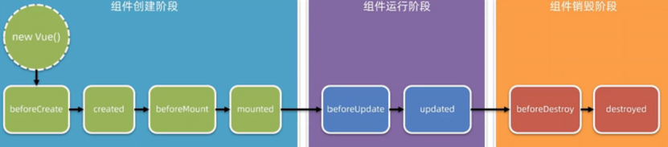
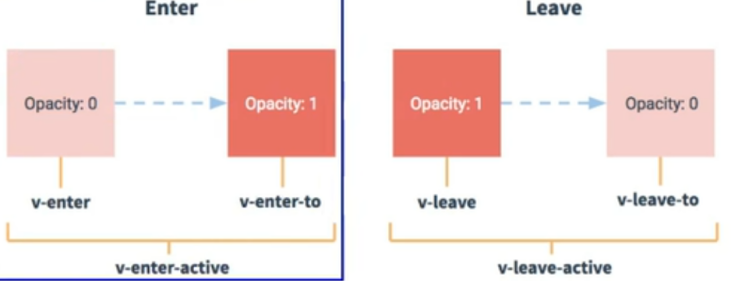

---
title: Vue学习笔记
date: 2021-1-12
tags:
 - Vue
categories:
 -  笔记
---   
## Vue学习笔记(一)--基础概念、基本指令  
### 基础概念  
1. vue特性  
    1. **<font color='red'>数据驱动视图</font>**  
        + 数据的变化会驱动视图自动更新  
        + 好处:程序员只管把数据维护好，那么页面结构会被vue自动渲染出来!  
        + 注意:数据驱动视图是<font color='red'>**单向的数据绑定**</font>。  
    2. **<font color='red'>双向数据绑定</font>**  
        + 在网页中，form表单负责采集数据，Ajax负责提交数据。  
        + 好处:开发者**不再需要手动操作DOM元素**，来获取表单元素最新的值!  
            
2. MVVM  
    + MVVM是vue实现数据驱动视图和双向数据绑定的核心原理。MVVM指的是Model、View和ViewModel  
    + Model表示当前页面渲染时所依赖的数据源。  
    + View表示当前页面所渲染的DOM结构。  
    + ViewModel表示vue的实例，它是MVVM的核心。  
3. vue的基本使用  
    1. 导入vue.js 的script脚本文件  
    2. 在页面中声明一个将要被vue所控制的DOM区域  
    3. 创建vm 实例对象（vue 实例对象)  
###  常用指令  
1. 内容渲染指令  
    + `v-text`:会覆盖元素原有内容  
    + `v-html`:可以把带标签的字符串，渲染真正的html内容，**会有XSS风险，会覆盖子组件**  
    + `{{ }}`: 插值表达式,内容占位符 (只能用在元素的内容节点,不能用于属性节点)  
    + 在插值语法和属性绑定里，可以使用JS表达式  
        ```js  
        {{number + 1}}
        {{ok ? "YES" :"NO"}}
        {{message.split("").reverse().join(' ')}}  
        ```  
2. 属性绑定指令  
    + `v-bind:属性名`	为元素的属性动态绑定值（可以简写成`:`）  
        ```js  
            //在使用v-bind属性绑定期间，如果绑定内容需要进行动态拼接，则字符串的外面应该包裹单引号，例如;
            <div :title="'box' + index">这是一个div</div>  
        ```  
3. 事件绑定指令  
    + `v-on:事件名称="事件处理函数(定义在methods中)"`，可以简写成`@ `  
    + 事件修饰符：		示例：`@click.prevent=''`  修饰符可以连续写  
        ```js  
            .prevent //阻止默认行为（例如:阻止a连接的跳转、阻止表单的提交等)
            .stop //阻止事件冒泡
            .capture//以捕获模式触发当前的事件处理函数
            .once //绑定的事件只触发1次
            .self //只有在event.target是当前元素自身时触发事件处理函数
            .passive://事件的默认行为立即执行，无需等待事件回调执行完毕:  
        ```  
    + 按键修饰符：    示例：`@keyup.enter=''`   
        ```js  
            delete //(“删除”和“退格”键)
            tab//(特殊，必须配合keydown去使用)
            //系统修饰健（用法特殊）:ctrl、alt、 shift、 meta
            @click.ctrl.exact  //只有ctrl被按下的时候触发       
            @click.exact  //没有任何系统按键按下的收触发
            (1).配合keyup使用:按下修饰健的同时，再按其他健，随后释放，事件才触发
            (2).配合keydown使用:正常触发事件。  
        ```  
4. 双向绑定指令（表单元素使用才有意义）  
    + `v-model=''` 用来辅助开发者在不操作DOM的前提下，快速获取表单的数据。  
    1. `<input type="text"/>`，则v-model收集的是value值，用户输入的就是value值。  
    2. `<input type="radio"/>`，则v-model收集的是value值，且要给标签配置value值。  
    3. `<input type="checkbox"/>`  
        1. 没有配置input的value属性，那么收集的就是checked（是布尔值)   
        2. 配置input的value属性:  
            1. v-model的初始值是非数组，那么收集的就是checked(是布尔值)  
            2. v-model的初始值是数组，那么收集的的就是value组成的数组  
    4. v-model的三个修饰符:  
        ```js  
            .lazy://失去焦点再收集数据
            .number://输入字符串转为有效的数字
            .trim://输入首尾空格过滤  
        ```         
    5. 自定义v-model        
        ```js       
            //父组件中      
            <HelloWorld v-model="showFlag" v-if="showFlag"></HelloWorld>        

            //子组件中
            <button @click="$emit('change', false)">关闭组件</button>
            export default {
                name: 'HelloWorld',
                model: {
                    prop: 'checked', //对应props:中的checked
                    event: 'change'  //对应触发事件
                },
                props: {
                    checked: {
                        type: Boolean
                    }
                },
            }
        ```
5. **条件渲染指令（按需控制DOM的显示与隐藏）v-if / v-show 的区别**  
    1. 实现原理不同:  
        + v-if 指令会动态地创建或移除DOM元素   
        + v-show指令会动态为元素添加或移除`style=" display: none;"`样式  
    2. 性能消耗不同:  
        + v-if有更高的切换开销，而v-show有更高的初始渲染开销。因此:  
        + 如果需要非常频繁地切换，则使用v-show较好  
        + 如果在运行时条件很少改变，则使用v-if 较好  
    3. v-if、v-else-if、v-else不需要加条件判断，三者可以配合使用  
6. 列表渲染指令 (基于一个数组来循环渲染一个列表结构)  
    ```js  
        v-for="(item,index)in xxx" :key="item.id"   //遍历数组
        v-for="(value,key,index) in xxx"   :key="key"//遍历对象
    ```  
      + 加key的作用： 
          1. 正确维护列表的状态  
          2. 复用现有的DOM元素，提升渲染的性能
      + **<font color='red'>key的注意事项:</font>**  
          1. key的值只能是**字符串**或**数字**类型  
          2. key的值**必须具有唯一性**（即:key的值不能重复)  
          3. 建议把**数据项id属性的值**作为key的值（因为id属性的值具有唯一性)  
          4. 使用**index的值**当作key的值**没有任何意义**（因为index的值不具有唯一性)  
          5. 建议使用v-for指令时要**指定key的值**（既**提升性能、又防止列表状态紊乱**)  
      + **<font color='red'>面试题:react. vue中的key有什么作用?(key的内部原理)</font>**  
          1. 虚拟DOM中key的作用:  
              + key是虚拟DOM对象的标识，当数据发生变化时，Vue会根据【新数据】生成【新的虚拟Ddl,随后Vue进行【新虚拟DOM】与【旧虚拟DOM】的差异比较，比较规则如下:  
          2. 对比规则:  
              1. 旧虚拟DOM中找到了与新虚拟DOM相同的key:  
                  + 若虚拟DOM中内容没变,直接使用之前的真实DOM!  
                  + 若虚拟DOM中内容变了，则生成新的真实DOM，随后替换掉页面中之前的真实DON.  
              2. 旧虚拟DOM中未找到与新虚拟DOM相同的key  
                  + 创建新的真实DOM，随后渲染到到页面。  
          3. 用index作为key可能会引发的问题:  
              1. 若对数据进行:逆序添加、逆序删除等破坏顺序操作:  
                  + 会产生没有必要的真实DOM更新==>界面效果没问题,但效率低。  
              2. 如果结构中还包含输入类的DOM:  
                  + 会产生错误DOM更新==〉界面有问题。  
          4. 开发中如何选择key? :  
              1. 最好使用每条数据的唯一标识作为key，比如id、手机号、身份证号、学号等唯一值。  
              2. 如果不存在对数据的逆序添加、逆序删除等破坏顺序操作，仅用于渲染列表用于展示，使用index作为key是没有问题的。  
7. 其他指令  
    1. `v-cloak`指令（没有值）  
        + 本质是一个特殊属性,Vue实例创建完毕并接管容器后，会删掉v-cloak属性。  
        + 使用css配合v-cloak可以解决网速慢时页面展示出`{{xxxx}}`的**页面闪烁问题**。  
    2. `v-once`指令（没有值）  
        + `v-once`所在节点在初次动态渲染后，就视为静态内容了。  
        + **以后数据的改变不会引起v-once所在结构的更新，可以用于优化性能**。  
    3. `v-pre`指令（没有值）  
        + 跳过其所在节点的编译过程。  
        + 可利用它跳过:没有使用指令语法、没有使用插值语法的节点会加快编译。  
8. **自定义指令**  
    1. 定义语法:  
        1. 局部指令:  一个自定义指令由一个包含类似组件生命周期钩子的对象来定义
          ```js  
                directives: {
                    focus: {
                        //vue2

                        //bind：只调用一次，指令第一次绑定到元素时调用。在这里可以进行一次性的初始化设置。
                        //inserted：被绑定元素插入父节点时调用 (仅保证父节点存在，但不一定已被插入文档中)。
                        //update：所在组件的 VNode 更新时调用，但是可能发生在其子 VNode 更新之前。
                        //componentUpdated：指令所在组件的 VNode 及其子 VNode 全部更新后调用。
                        //unbind：只调用一次，指令与元素解绑时调用。
                         inserted: function (el,binding) {
                            el.focus()
                        }
                        //binding是一个多属性对象 name value oldValue(仅在update和componentUpdated可用) expression  arg modifiers

                        //vue3 提供的钩子函数就是自身的钩子函数
                    }
                }, 
          ```  
        2. 全局指令:  
          ```js  
                app.directive('focus', {  //app.directive('',{})   指令名，配置对象
                    mounted(el) {   //挂载在实例上，我们可以在对应的生命周期执行操作
                        console.log(el, app,'mounted');
                        el.focus();
                    }
                });
          ```  
    2. 配置对象中常用的3个回调:  
        1. `.bind`:指令与元素成功绑定时调用。（**bind函数只调用1次**）  
        2. `.inserted`:指令所在元素被插入页面时调用。  
        3. `.update`:指令所在模板结构被重新解析时调用。  
    3. 备注:  
        1. 指令定义时不加`v-`，但使用时要加`v-`;  
        2. 指令名如果是多个单词，要使用kebab-case命名方式，不要用camelCase命名。  
        3. 回调中第一个形参**el**表示当前指令所**绑定到的那个真实DOM对象**，形参中的**第二个参数binding，来接收参数**  
        4. 如果**bind**和**update**函数中的**逻辑完全相同**，则**对象格式的指令**可以写成**函数格式**:  
### 注意事项  
  1. el属性是固定的写法，表示当前vm 实例要控制页面上的哪个区域  
  2. data对象就是要渲染到页面上的数据  
  3. methods的作用，就是定义事件的处理函数  
    + methods中的方法可以写成`add:function( ){ }`,也可以简写成`add( ){ }`,可以传参  
  4. vue提供了内置变量，名字叫做`$event`，它就是原生DOM的事件对象e,如果传参的话，注意写成`@click='add(n，$event)'`,如果不传参直接在methods中用e即可  
  5. 给checkbox绑定v-model时可以用<font color='red'>**for+id的组合**</font>提升用户体验，但是要注意这里要用<font color='red'>**动态拼接**</font>，不然只有第一行的checkbox生效  
### Vue监视数据的原理  
  + 用户data数据-->`_data`数据进行代理，并且给每一项数据进行包装，设置`getter、setter`-->数据在vm实例上可以直接找到-->当数据发生变化-->对应`setter`调用（数据劫持）-->形成虚拟DOM-->新旧DOM比对复用-->更新页面  
  1. vue会监视data中所有层次的数据。  
  2. 如何监测对象中的数据?  
      + 通过setter实现监视，且要在new Vue时就传入要监测的数据。  
          1. **<font color='red'>对象中后追加的属性，Vue默认不做响应式处理</font>**  
          2. 如需给后添加的属性做响应式，请使用如下API:  
          ```js  
              Vue.set(targe，propertyName/index，value)
              vm.$set(target，propertyName/index，value)  
          ```  
  3. 如何监测数组中的数据?  
      + 通过包裹数组更新元素的方法实现,本质就是做了两件事:  
          1. 调用原生对应的方法对数组进行更新。  
          2. 重新解析模板，进而更新页面。  
  4. 在Vue修改数组中的某个元素一定要用如下方法:  
      + **<font color='red'>直接对数组的索引操作，不会有响应式变化，但是对索引下的属性操作可以</font>**  
      ```js  
          使用这些API：push()、pop()、 shift()、unshift()、splice()、sort()、reverse()
          Vue.set()或vm.$set()  
      ```  
      + **<font color='red'>特别注意:Vue.set()和vm.$set()不能给vm或 vm的根数据对象添加属性!!!</font>**  
###  过滤器   
1. 基本使用  
    + 过滤器（Filters）是vue为开发者提供的功能，常用于文本的格式化。过滤器可以用在两个地方:**插值表达式**和**v-bind属性绑定**。(**返回过滤器函数的新值**)  
    + 过滤器应该被添加在**JavaScript表达式的尾部**，由管道符`|`进行调用  
    ```js  
        //在双花括号中通过"管道符"调用capitalize过滤器，对message的值进行格式化
         <p>{{ message | capitalize }}</p>  
    ```   
2. 过滤器的注意点：  
    1. 要定义到filters节点下，本质是—个函数  
    2. 在过滤器函数中，一定要有return值  
    3. 在过滤器的形参val中，就可以获取到"管道符"前面待处理的那个值  
    4. 如果全局过滤器和私有过滤器名字一致，按照"就近原则”，调用的是"私有过滤器”  
3. 私有过滤器：它只能在当前vm 实例所控制的el区域内使用。（filters节点下定义的）  
4. 全局过滤器：多个vue实例之间共享过滤器  
    ```js  
      // Vue.filter()方法接收两个参数:
      //第1个参数，是全局过滤器的"名字"
      //第2个参数，是全局过滤器的"处理函数"
      Vue.filter('capitalize',(str) =>{
      return str.charAt(0).toUpperCase() + str.slice(1) + '~~'})  
    ```  
5. 连续调用多个过滤器  
    ```js  
        //把 message的值，交给filterA 进行处理
        //把 filterA处理的结果，再交给filterB进行处理
        //最终把 filterB处理的结果，作为最终的值渲染到页面上
          {{ message | filterA | filterB }} 
    ```  
6. 过滤器传参  
    ```js  
        // arg1 和arg2是传递给filterA 的参数
        <p>i{ message l filterA( arg1, arg2) }</p>
        //过滤器处理函数的形参列表中:
        //第一个参数:永远都是"管道符“前面待处理的值
        //从第二个参数开始，才是调用过滤器时传递过来的arg1 和 arg2参数
        Vue.filter('filterA'，(msg，arg1,arg2) => {
          //过滤器的代码逻辑...
        })  
7. Dayjs的使用  
    ```js  
        //直接调用dayjs()得到的是当前时间ll dayjs(给定的日期时间)得到指定的日期
        const dtstr = dayjs(time) . format('YYYY-MM-DD HH: mm: ss')
        return dtstr  
    ```  
###  侦听器  
1. 可以通过new实例时用watch配置，也可以用`Vue.$watch(''，{对象配置})`  
2. 侦听器的格式  
    + **方法格式的侦听器**  
      ```js  
          watch: {
            name(newVaule，oldValue){ }//不能使用immediate和deep  
          }   
      ```  
    + **对象格式的侦听器**  
      ```js  
          watch: {
              name:{
                handler(newVaule，oldValue){

                }
              }
          }  
      ```  
      + 好处1:可以通过`immediate:true`选项，初始化时调用一次`handler`   
      + 好处2:可以通过`deep:true`选项，让侦听器深度监听对象中每个属性的变化! ! !   
      ```js  
        //如果要侦听的是对象的子属性的变化，则必须包裹一层单引号
        'info.username'(){}  
      ```  
      + **watch可以开启一些异步任务，里面的定时器<font color='red'>必须使用箭头函数</font>**  
###  计算属性  
1. 计算属性指的是通过一系列运算之后，最终得到一个属性值。这个动态计算出来的属性值可以被模板结构或 methods方法使用。  
2. 原理:底层借助了`objcet.defineproperty`方法提供的`getter`和`setter`.  
3. 所有的计算属性，都要定义到`computed`节点之下计算属性在定义的时候，要定义成**方法格式**  
4. 特点：  
    + 虽然计算属性在声明的时候被**定义为方法**，但是计算属性的**本质是一个属性**  
    + **计算属性会缓存计算的结果，只有计算属性依赖的数据变化时，才会重新进行运算**      
        ```js   
            computed:{
                a(){
                    return this.num * 2 
                }       
                b(){
                    get(){
                        return this.num * 2 //这种写法如果绑定给v-model  那么get必须和set搭配使用
                    }
                    set(val){
                        this.num = val / 2
                    }
                }
            }     
        ```   
###  axios的基本使用  
1. 调用axios 方法得到的返回值是 Promise 对象  
2. axios在请求到数据之后，把真正的数据包装成了一个大对象  
 ```js  
    axios({
        methods:'GET',
        url:'http://liulongbin.top:3006/api/getbooks',
        params:{},//url中的查询参数
        data:{}, //post请求的参数
    }).then(function(result){})
    {config，data，headers，request，status，statusText:}  
 ```    
3. 如果调用某个方法的返回值是`Promise` 实例，则前面可以添加`await`!  
4. await只能用在被async“修饰”的方法中  
5. 利用解构赋值的思想直接获取  
    ```js  
        document.querySelector('#btnGet').addEventListener('click', async function () {
            //解构赋值的时候，使用:进行重命名
            const {data: res} =  await axios({
            method:'GET'，
            url: 'http://www.liulongbin.top:3006/api/getbooks'
            })
            console.log(res.data)
            })  
    ```  
6. `axios.get()`与`axios.post()`  
    ```js  
        const { data: res } = await axios.get('http://www.liulongbin.top:3006/api/getbooks'，{
            params: { id: 1 }
            })
            console.log(res)  
        // axios.post( 'url', { /* POST请求体数据*/ })
        const { data: res } = await axios. post('http://w.liulongbin.top:3006/api/post',{ 
            name: 'zs', gender: '女'
            })
            console.log(res)  
    ```  
7. axios挂载在原型上使用  
    1. 在main.js中`axios.defaults.baseURL ='请求根路径'`   全局配置axios请求根路径  
    2. 在main.js中 `Vue.prototype.$http = axios`  
    3. 今后,在每个.vue 组件中要发起请求,直接调用`this.$http.xxx`  
    4. 缺点：不利用API接口的复用        

### class和style写法        
+ class和style写法     
    ```js  
        <p :class="{black : isBlack, yellow: isYellow}"></p> 
        <p :class="[black,yellow]"></p>
        <p :style="styleData"></p>  
        
          styleData:{
            fontSize:'40px',
            color:'red',
          }
    ```

## Vue学习笔记(二)--生命周期、组件化开发  
###  生命周期  
+  生命周期(Life Cycle）是指一个组件从创建→挂载→运行→销毁的整个阶段，强调的是一个时间段。  
+  注意:生命周期强调的是时间段，生命周期函数强调的是时间点。  
       
1. 组件创建阶段  
    + `beforeCreate`: 组件的`props/data/methods`尚未被创建，都处于<font color='red'>**不可用状态**</font>  
    + `created`: 组件的`porps/data/methods`已创建好，都处于<font color='red'>**可用的状态**</font> 。但是组件的<font color='red'>**模板结构尚未生成**</font>   这个阶段可以用来发起Ajax请求，获取数据  
    + 基于数据和模板,在内存中编译生成HTML结构（虚拟DOM）  
    + `beforeMount`: 呈现的是未经Vue编译的DOM结构，所有对DOM的操作不奏效  
    + 将内存中的虚拟DOM转为真实DOM插入页面  
    + `mounted`: 页面中呈现的是经过Vue编译的DOM，对DOM的操作均有效(尽可能避免)，至此初始化过程结束，一般在此进行:开启定时器、发送网络请求、订阅消息、绑定自定义事件、等初始化操作。  
2. 组件运行阶段（当数据改变时）  
    + `beforeUpdate`：此时:<font color='red'>**数据是新的，但页面是旧的**</font>，即:页面尚未和数据保持同步。  
    + 根据新数据，生成新的虚拟DOM，新旧虚拟DOM进行比较，最终完成页面更新，即:完成了Model View的更新  
    + `updated`：此时:<font color='red'>**数据是新的，页面也是新的**</font>，即:页面和数据保持同步。（新DOM）  
3. 组件销毁阶段  
    + `beforeDestroy`： vm中所有的: data、methods、指令等等，都处于可用状态，但是<font color='red'>**所有对数据的更新都不会生效，不会进入update**</font>，马上要执行销毁过程,一般在此阶段:关闭定时器、取消订阅消息、解绑自定义事件等收尾操作  
    + `destroy`: 组件已经被销毁，此组件在浏览器中对应的DOM结构已被完全移除!  
### Vue-cli（脚手架）的使用  
1. vue项目中src目录的构成:  
    + assets文件夹:存放项目中用到的静态资源文件，例如: css样式表、图片资源  
    + components文件夹:程序员封装的、可复用的组件，都要放到components目录下  
    + main.js 是项目的入口文件。整个项目的运行，要先执行main.js  
    +  App .vue是项目的根组件。  
2. vue项目的运行流程  
    + 在工程化的项目中,vue通过main.js把App.vue渲染到index.html的指定区域中!  
        + App.vue用来编写待渲染的模板结构  
        + index.html中需要预留一个el区域  
        + main.js把 App.vue渲染到了index.html所预留的区域中  
3. 组件和组件工程化  
    + 组件就是用来实现局部(特定)功能效果的代码集合  
    + 组件化开发指的是:根据封装的思想，把页面上可重用的UI结构封装为组件，从而方便项目的开发和维护。  
4. 注意事项  
    ```js  
      const school = Vue.extend(options) 可简写为: const school = options
      //一个重要的内置关系:
      VueComponent.prototype.__proto__=== Vue.prototype  
    ```  
    1. 关于不同版本的Vue:  
        1. vue.js与vue.runtime.xxx.js的区别:  
            + `vue.js`是完整版的Vue，包含:核心功能+模板解析器。  
            + `vue.runtime.xxx,js`是运行版的Vue，只包含:核心功能;没有模板解析器。  
        2. 因为`vue.runtime.xxx.js`没有模板解析器，所以不能使用template配置项，需要使用render函数接收到的createElement函数去指定具体内容。  
    2. 使用`vue inspect > output.js`可以查看到Vue脚手架的默认配置。  
    3. 使用`vue.config.js`可以对脚手架进行个性化定制，详情见: [](https://cli.vuejs.org/zh)  
5. mixin混入  
    1. 功能:可以一些公共逻辑抽离出来`data数据、methods、生命周期等等`，其他组件可以直接混入合并自身使用  
    2. 使用方式:  
        1. 第一步在mixin.js文件中定义混合，例如:  
          ```js 
            { data(){...},methods:{....} }  
          ```  
        2. 第二步在要使用的组件中引入，例如:  
          ```js  
            Vue.mixin(xxx)   //全局混入

            import myMixin from '../..mixin'
            mixins:[myMixin]   //局部混入 可以使用mixin中的data、methods、生命周期也会合并执行
          ```     
    3. 缺陷：变量来源不明确，不利于阅读；**watch和生命周期优先直执行mixin中的，其他的默认选择原组件的同名属性**
6. 插件  
    1. 功能:用于增强Vue  
    2. 本质:包含install方法的一个对象，install的第一个参数是Vue，第二个以后的参数是插件使用者传递的数据。  
    3. 定义插件:  
        ```js  
            对象.install(Vue,options){
                Vue.filter(....)  // 1，添加全局过滤器  
                Vue.directive(....)  //2．添加全局指令
                Vue.mixin(....)  //3．配置全局混入(合)
                Vue.prototype.$myMethod = function () {...}   //4 . 添加实例方法
                Vue.prototype.$myProperty = xxXxX  
              }
            Vue.use()  //使用插件  
        ```  
###  组件使用!!!  
1. 私有子组件和全局组件  
    + 通过components注册的是私有子组件  
    + 在vue项目的main.js入口文件中，通过Vue.component()方法，可以注册全局组件  
      ```js  
        //导入需要全局注册的组件
        import Count from '@/components/Count.vue '
        //参数1。字符串格式，表示组件的"注册名称""
        //参数2。需要被全局注册的那个组件
        Vue.component('MyCount',Count)  
      ```  
2. **组件里的props(自定义属性)**  
    ```js  
        props:['name'] // 第一种方式（只接收）
        props:{name:{type:'',required: ,default:  }}  //第三种方式: (限制类型、限制必要性、指定默认值)
        > props是只读的，Vue底层会监测你对props的修改
        >需要修改，可以把 props的值转存到data中  
    ```  
3. 组件中的样式冲突问题  
    1. 导致组件之间样式冲突的根本原因是:单页面应用程序中，多个组件的样式都是<font color='red'>**基于唯一的index.html页面**</font> 呈现的  
    2. style节点的scoped属性：让样式在局部生效,防止冲突。  
    3. /deep/样式穿透  
        + 如果给当前组件的style节点添加了scoped属性，则<font color='red'>**当前组件的样式对其子组件是不生效**</font>的。如果想让某些样式对子组件生效，可以<font color='red'>**使用/deep/深度选择器**</font>。   
        ```js   
            /deep/ .title {
                color: blue; //加上 /deep/时，生成的选择器格式为[data-v-052242de] .title
            }  
        ```  
4. 组件之间的数据共享  
    1. **<font color='red'>父组件向子组件共享数据需要使用自定义属性,注意要绑定要传值的属性</font>**   
        ```js  
            <Left :mSg="message" :user="userinfo"></Left>  
        ```  
    2. **<font color='red'>子组件向父组件共享数据调用父组件事件</font>**  
        + 使用场景:A是父组件，B是子组件，B想给A传数据，那么就要在A中给B绑定父组件事件（事件的回调在A中)  
        1. 利用hack，父组件给子组件穿一个函数形式的props属性，在子组件触发传值  
        2. 在父组件中给子组件绑定一个自定义事件（实际是绑在了子组件的vc实例上），然后子组件在合适的时候利用this.$emit触发此事件，并把参数传给父组件     
            ```js   
                 //父组件中
                <child  @myEvent = 'getStudentName'/>  //绑定事件
                methods:{
                  getStudentName(){
                    //this指向当前组件
                  }
                }

                //子组件中
                this.$emit('myEvent',数据)   //因为事件时绑定在子组件的实例对象上的，所以可以直接通过this进行触发  
            ```  
        3. 在父组件中给子组件加ref，然后通过ref拿到子组件实例，并且可以再mounted时用$on给其注册自定义事件，并且穿一个回调函数来处理收到的参数,后续步骤同②，这样的好处是注册自定义事件的时候可以异步操作.
          + **<font color='red'>注意: 回调要么配置在methods中，要么用箭头函数，直接写回调this指向子组件!</font>**      
              ```js  
                  //父组件中 
                  <Student ref='student'/>
                  mounted(){   //使用 $on 为组件实例对象绑定自定义事件myEvent
                    //1.在methods中定义回调函数
                    this.$refs.student.$on('myEvent', this.getStudentName)
                    
                    //2.箭头函数写法
                    this.$refs.student.$on('myEvent', ()={
                      //this指向当前组件
                    })

                    //3.直接定义回调的写法
                    this.$refs.student.$on('myEvent', function(){
                      //this指向触发该自定义事件的子组件
                    })
                  }
                  methods:{
                    getStudentName(){
                      //this指向当前组件
                    }
                  }

                   //子组件中
                  this.$emit('myEvent',数据)  //触发
              ``` 
        4. 使用event注册自定义事件    
            ```js 
                event.$on('onAdd', this.handler)  //callback最好使用函数名字，方便解绑
                event.$emit('onAdd', 参数数据)
            ```

        6. 解绑自定义事件:  
            ```js  
                 event.$off('atguigu') //解绑一个自定义事件  不及时解绑会造成内存泄漏
                 event.$off([''，''])//利用数组解绑多个自定义事件
                 event.$off()//解绑所有自定义事件  
            ```  
        7. 销毁组件实例  
            ```js  
                this.$destroy() //销毁当前组件实例，原生事件可以触发（但不会有响应式），自定义事件全都会失效  
            ```  
        8. 组件上可以绑定原生事件，需要native修饰符。`<Student @click.native='getStudentName'/>`，**不然认作自定义事件**  
    3. **<font color='red'>在vue2.x中，兄弟组件之间数据共享的方案是EventBus(事件总线)。</font>**  
        ```js  
            //1.安装全局事件总线，$bus就是当前应用的vm
            new vue({
              ...
              beforeCreate(){
              Vue.prototype.$bus = this 
              },
              ...  
              })  
            //2.接收数据:A组件想接收数据，则在A组件中给$bus绑定自定义事件，事件的回调留在A组件自身。
            methods(){
              demo(data){......}
              }
            mounted() {
              this.$bus.$on('xxxx',this.demo)
            }  
            //3.提供数据:
            this.$bus.$emit('xxxx',数据)  
            //4.最好在beforeDestroy钩子中，用$off去解绑当前组件所用到的事件  
        ```  
    4. **<font color='red'>消息订阅与发布(pubsub)</font>**  
        ```js  
            npm i pubsub-js  //安装pubsub
            import pubsub from 'pubsub-js'  
            //接收数据:A组件想接收数据，则在A组件中订阅消息，订阅的回调留在A组件自身。
            methods(){  
              demo(data){......}  
            }  
            mounted() {
              this.pid = pubsub.subscribe('xxx',this.demo)   ////订阅消息
            }  
            pubsub.publish('xxx',数据)  //提供数据:
            PubSub.unsubscribe(pid)   //最好在beforeDestroy钩子中，去取消订阅。  
        ```     
    5. 依赖注入：`inject provide`    
        + 父组件可以直接向子孙组件传值      
            ```js   
                //父组件
                export default {
                      provide(){
                        return{
                            val:'这是home的依赖'  //依赖
                        }
                    }
                }   
                //孙组件        
                 export default {
                    inject:['val']  //注入
                 }
            ```         
        + 开发组件库可以使用，其他场景不建议使用，导致数据来源不明确         
5. $refs引用  
    1. 被用来给元素或子组件注册引用信息(id的替代者)  
    2. 应用在htm1标签上获取的是真实DOM元素，应用在组件标签上是组件实例对象(vc)  
    3. 使用方式:  
        ```js  
          <h1 ref="xxx">.....</h1>或<School ref="xxx"></School>  //打标识  
          this.$refs.xxx   //获取  
        ```  
6. `inputVisible`：控制输入框和按钮的按需切换; 默认值为 false，表示默认展示按钮，隐藏输入框  
7. `this.$nextTick(cb)`方法  
    + Vue是异步渲染，data改变之后，DOM不会立即渲染    
    + 页面渲染会将data的修改做整合，多次相同的data修改只会渲染一次    
    + `$nextTick`会在DOM渲染之后再去触发，以获取最新的DOM节点
### 动态组件  
  1. 动态组件指的是<font color='red'>**动态切换组件的显示与隐藏**</font>  
  2. vue提供了一个内置的`<component>`组件，<font color='red'>**专门用来实现动态组件的渲染**</font>  
        ```html  
            <!--2．通过is 属性，动态指定要渲染的组件-->
            <component :is="comName"></component>  <!--配置楼层的时候comName可以由内管配置好，然后后端返回，前端进行遍历即可-->

            <div v-for='(item,index) in list' :key='index'>
              <component :is="item.T_CODE"></component>  <!--配置楼层的时候list可以由内管配置好，然后后端返回，前端进行遍历即可-->
            </div>
          
            <!--必须是动态的:is  不能是is+确切值-->
        ```  
  3. 动态组件切换时默认会<font color='red'>**销毁原组件**</font>重新创建新组件  
  4. 组件名称默认使用注册名，可以提供一个name属性给组件来使用  
        1. 注册名称是在使用标签时使用  
        2. name名称在调试工具和添加属性时使用     
### 异步组件    
  1. 如何使用   
      ```js     
          <FormDemo v-if='showFormDemo'></FormDemo>  //异步组件 
          
          export default{
            components:{
              FormDemo:() => import('xxx')   //异步引入
            }  
            mounted(){
              // 在mounted中将showFormDemo置为true，或者在某个操作之后将showFormDemo置为true
            }
          }
      ```     
  2. 可用于首屏优化       
### 缓存组件        
1. 需要频繁切换（tab切换），不需要重新渲染，Vue常见的性能优化之一
2. 可以使用vue内置的`<keep-alive>`组件<font color='red'>**让不展示的路由组件保持挂载，不被销毁**</font>  
        ```html  
            <keep-alive>
                <component :is="comName"></component>
            </keep-alive>  
        ```  
3. **keep-alive对应的生命周期函数**  
    1. 当组件被<font color='red'>**缓存**</font>时，会自动触发组件的`deactivated`生命周期函数。  
    2. 当组件被<font color='red'>**激活**</font>时，会自动触发组件的`activated`生命周期函数  
4. **keep-alive的include属性**  
    1. `include`属性用来指定:只有名称匹配的组件会被缓存。多个组件之间用逗号分隔:  
    2. `exclude`属性指定：对应组件不会被缓存，两个属性只能用一个  
        ```html  
                <keep-alive include="Left,Right" exclude="">
                    <component ;is="comName"></component>
                </keep-alive>  
        ```  

###  插槽  
1. 插槽的基本使用  
    + 插槽（Slot) 父组件引用子组件时，可以往子组件内部插入一部分html结构，在子组件要插入的部分用`<slot>`占位，这就是插槽  
    + 每一个slot插槽，都要有一个name名称,如果省略则默认名称叫做`default`  
    + 要渲染到对应插槽内，要用`v-slot:name`，**并用template包裹(无意义标签)**   **slot-scope已废弃**
    + `v-slot：`的简写形式是`#`  
2. 具名插槽   
      ```html  
          <!--父组件-->   
          <NamedSlot>
              <p slot='header'>将插入 header slot中</p><!--老式写法弃用-->
            <template #header> <!--除非只有默认插槽，否则要加在template上-->
              <p>将插入 header slot中</p>
            </template>      
              <p>将插入到main slot中，即未命名的slot</p>
            <template v-slot:footer>
              <p>将插入 footer slot中</p>
            </template>  
          </NameSlot>     

          <!--NamedSlot组件-->    
            <div class='container'>
              <header>
                <slot name='header'></slot>
              </header>
               <main>
                <slot></slot>
              </header>
               <footer>
                <slot name='footer'></slot>
              </footer>
            </div>
      ```  
3. 作用域插槽  
    + 在封装组件的过程中，可以为预留的`<slot>`插槽绑定`props`数据，这种带有`props`数据的`<slot>`叫做“作用域插槽”。  
        ```html  
              <!--父组件-->
              <ScopedSlot :url='website.url'>    <!--父组件给子组件传值-->
                <template v-slot = 'slotProps'>  <!--接收子组件的传值  slotProps自定义-->
                  {{slotProps.slotData.title}}   <!--使用子组件的传值-->
                </template>
              </ScopedSlot>
                
              <!--作用域插槽对外提供的数据对象，可以使用解构赋值简化数据的接收过程 -->    
                <template v-slot = '{slotData}'>  
                  {{slotData.title}} 
                </template>    

              <!--子组件-->   
              <slot :slotData = 'website'> <!--将子组件的website传给父组件使用-->
                {{website.subTitle}} <!--父组件内部不定义的时候，默认展示自身的title-->
              </slot>
        ```     
4. 组合使用     
    ```html   
              <ScopedSlot> 
                <template #slotData = '{test1,test2}'>
                  {{test1.xxx}}  
                </template>
              </ScopedSlot>  
                <template v-slot:slotData = '{test1,test2}'>  
                  {{test2.xxx}} 
                </template>    

              <!--子组件-->   
              <slot name='slotData' :slotData = '{test1,test2}'> 
                {{website.subTitle}} 
              </slot>
    ```     
5. 动态插槽名   
    ```html   
        <template v-slot:[dyname]>
              This is Me.
        </template>
    ```   
### Vue封装的过度与动画  
1. 作用:在插入、更新或移除DOM元素时|在合适的时候给元素添加样式类名,  
      
2. 使用`<transition>`包裹要过度的元素，并配置name属性:  
    ```html  
        <transition name="hello">
          <h1 v-show="isShow">你好啊!</h1>
        </transition>  
    ```  
3. 备注:若有多个元素需要过度，则需要使用:`<transition-group>`，且每个元素都要指定key值    
### VueX（状态管理模式）  
1. 了解vuex   
    + 什么时候使用vuex（中大型项目中）   
        + 多个视图依赖同一个状态    
        + 来自不同视图的行为需要变更同一个状态    
        + 把各个组件都需要依赖的同一个状态抽取出来，在全局使用单例模式进行管理。在这种模式下，任何组件都可以直接访问到这个状态，或者当状态发生改变时，所有的组件都获得更新。
2. vuex基本使用  
    + `npm install vuex --save` 
    + 创建仓库文件并引入使用插件：`src/store/index.js` 
        ```js  
            import Vue from 'vue';
            import Vuex from 'vuex';

            Vue.use(Vuex);

            const store = new Vuex.Store({
              state: {
                // 定义一个name，以供全局使用
                name: '张三',
                // 定义一个number，以供全局使用
                number: 0,
                // 定义一个list，以供全局使用
                list: [
                  { id: 1, name: '111' },
                  { id: 2, name: '222' },
                  { id: 3, name: '333' },
                ],
              },

              getters: {
                getMessage(state) {
                    // 获取修饰后的name，第一个参数state为必要参数，必须写在形参上
                    return `hello${state.name}`;
                  },
              },

              mutations: {
                // 增加mutations属性
                setNumber(state) {
                  // 增加一个mutations的方法，方法的作用是让num从0变成5，state是必须默认参数
                  state.number = 5;
                },
                setNumberIsWhat(state, number) {
                  // 增加一个带参数的mutations方法
                  state.number = number;
                },
              },
            });

            export default store;
        ```         
    + 修改`main.js`   
        ```js   
            import Vue from 'vue';
            import App from './App';
            import router from './router';
            import store from './store'; // 引入我们前面导出的store对象

            Vue.config.productionTip = false;

            new Vue({
              el: '#app',
              router,
              store, // 把store对象添加到vue实例上
              components: { App },
              template: '<App/>',
            });
        ```   
    + 使用vuex数据    
        ```js   
            export default {
                mounted() {
                  console.log(this.getName);
                  console.log(this.$store.getters.getMessage);  //组件中使用getters属性
                  this.$store.commit('setNumber');  //同步修改
                  this.$store.commit('setNumberIsWhat', { number: 666 }); // 调用的时候也需要传递一个对象
                  this.setNumberIsWhat({ number: 999 });//使用解构的mutations
                },
              
                computed: {
                  //官方建议1：操作this.$store.state.XXX最好放在计算属性中
                  getName() {
                    return this.$store.state.name;
                  },
                  //官方建议2： 是不是每次都写this.$store.state.XXX让你感到厌烦，解决方案
                  ...mapState(['name']), // 经过解构后，自动就添加到了计算属性中，此时就可以直接像访问计算属性一样访问它

                  ...mapState({ aliasName: 'name' }),  // 赋别名的话，这里接收对象，而不是数组
                  ...mapGetters(['getMessage']),
                  ...mapGetters({ aliasName: 'getMessage' }),  // 赋别名的话，这里接收对象，而不是数组
                },
                methods: {
                  // 注意，mapMutations是解构到methods里面的，而不是计算属性了
                  ...mapMutations(['setNumberIsWhat']),
                  ...mapMutations({ setNumberIsAlias: 'setNumberIsWhat' }), // 赋别名的话，这里接收对象，而不是数组
                },
            };
        ```   
3. vuex异步操作   
      + store   
          ```js   
              const store = new Vuex.Store({
                state: {
                  name: '张三',
                  number: 0,
                },
                mutations: {
                  setNumberIsWhat(state, payload) {
                    state.number = payload.number;
                  },
                },
                actions: {
                  // 增加actions属性
                  setNum(content,payload) {
                    // 增加setNum方法，默认第一个参数是content，其值是复制的一份store
                    return new Promise(resolve => {
                      // 我们模拟一个异步操作，1秒后修改number为888
                      setTimeout(() => {
                        content.commit('setNumberIsWhat', { number: payload.number });
                        resolve();
                      }, 1000);
                    });
                  },


                    setNum({ commit }) {
                    // 直接将content结构掉，解构出commit，下面就可以直接调用了
                      return new Promise(resolve => {
                        setTimeout(() => {
                          commit('XXXX'); // 直接调用
                          resolve();
                        }, 1000);
                      });
                  },
                },
              });
          ```   
      +  异步操作   
          ```js   
              async mounted() {
                console.log(`旧值：${this.$store.state.number}`);
                await this.$store.dispatch('setNum',{ number: 611 });
                console.log(`新值：${this.$store.state.number}`);

                await this.setNum({ number: 123 }); // 直接这样调用即可
              },
              methods: {
                  ...mapActions(['setNum']), // 就像这样，解构到methods中
                  ...mapActions({ setNumAlias: 'setNum' }),   // 赋别名的话，这里接收对象，而不是数组
              },
          ```   
4. vuex拆分   
    1. 按属性进行拆分   
        + 新建四个文件，分别是`state.js getters.js mutations.js actions.js`   
        + 组装到主文件里面    
            ```js   
                import Vue from 'vue';
                import Vuex from 'vuex';
                import { state } from './state'; // 引入 state
                import { getters } from './getters'; // 引入 getters
                import { mutations } from './mutations'; // 引入 mutations
                import { actions } from './actions'; // 引入 actions

                Vue.use(Vuex);

                const store = new Vuex.Store({
                  state: state,
                  getters: getters,
                  mutations: mutations,
                  actions: actions,
                });

                // 可以简写成下面这样：

                // const store = new Vuex.Store({ state, getters, mutations, actions });

                export default store;
            ```   
    2. 按功能进行拆分 - Module    
        ```js
            const countAbout = {
              namespaced:true,//开启命名空间
              state:{x:1},
              mutations: {...}，
              actions: {...}，
              getters: {
                bigSum(state){
                  return state.sum * 10}
              }}
           
           // 3.开启命名空间后，组件中读取state数据:
            //方式一。自己直接读取
            this.$store.state.personAbout.list
            //方式二。借助mapState读取:
            ...mapstate('countAbout' ,["sum",'school','subject'])，
           
           // 4.开启命名空间后，组件中读取getters数据:
            //方式一。自己直接读取
            this.$store.getters['personAbout/firstPersonName']
            //方式二。借助mapGetters读取:
            ...mapGetters('countAbout',['bigSum'])
            
            //5.开启命名空间后，组件中调用dispatch
            //方式一。自己直接dispatch
            this.$store.dispatch("personAbout/addPersonwang",person)
            //方式二:借助mapActions:
            ...mapActions('countAbout',{incrementOdd:'jiaOdd',incrementwait:'jiawait'})  

            //6.开启命名空间后，组件中调用commit
            //方式一。自己直接commit
            this.$store.commit("personAbout/ADD_PERSON",person)
            //方式二。借助mapMutations:
            ...mapMutations('countAbout',{increment:'3IA',decrement:'IAN'}),  

            备注: mapActions与mapMutations使用时，若需要传递参数需要:在模板中绑定事件时传递好参数，否则参数是事件对象。  
        ```

###  路由  
1. 基本概念   
    + 前端路由指的是Hash地址与组件之间的对应关系。  
    + 用户点击了页面上的路由链接,导致了URL地址栏中的Hash值发生了变化  
    + 前端路由监听了到Hash地址的变化,把当前Hash地址对应的组件渲染都浏览器中  
    + 只要当前的 App 组件一被创建，就立即监听window对象的`onhashchange`事件  
2. 基本使用步骤  
    1. 在项目中安装`vue-router`  
      ```js    
        npm i vue-router@3.5.2 -S  
      ```  
    2. 在src源代码目录下，新建`router/index.js`路由模块，初始化代码 、   
        ```js  
            import Vue from 'vue';
            import VueRouter from 'vue-router';
            import Routes from './routes.js'

            Vue.use(VueRouter); //vue 的 第三方组件，都需要通过Vue.use( . . . )的方式去 install 组件。

            export default new VueRouter {
              base:'/',  //按需自定义公共路径前缀
              mode: 'hash',
              routes
            } 
        ```    
    3. 在`src/main.js`入口文件中，导入并挂载路由模块  
        ```js  
              import router from './router'
              new Vue({
                router,  //注册路由模块
                render: h => h(App),
              }).$mount('#app')
        ```       
    4. 建立`routes.js`    
        ```js   
            import Home from '../view/Home.vue';
            export default [
              {
                path: '/',  // 重定向到home页面
                redirect: '/home'
              },
              {
                path: '/home',
                component: Home
              }
              ...
            ]
        ```
    5. **注意点**   
        + `router`组件`install`的时候，会注册两个全局组件   
            + `router-link` : 跳转路由链接    
            + `router-view` : 在什么地方显示内容，占位符
        + 在`router-link`标签中加入`replace`属性开启，push是追加历史记录，replace是替换当前记录，默认为push  
        + `$router` : 包含所有的方法    
            + `$router.push({path:'home'})`   
            + `$router.replace({path:'home'})//替换路由，没有历史记录`        
        + `$route` : 包含所有的属性     
            + `path/query/params/meta...`
        + 实现切换(`active-class`可配置高亮样式)      
              ```html  
                  <router-link active-class="active" to="/about">About</router-link>  
              ```  
3. 路由重定向和默认子路由  
    1. 在`src/router/index.js`路由模块中，通过`routes`数组声明路由的匹配规则  
      + **路由重定向**指的是: 用户在访问地址A的时候，强制用户跳转到地址C, 通过路由规则的`redirect`属性，指定一个新的路由地址
      + <font color='red'>**子路由规则最好不要/开头**</font>
      + **默认子路由**:如果`children`数组中，某个路由规则的`path`值为空字符串，则这条路由规则，叫做“<font color='red'>**默认子路由**</font>” 
          ```js  
              const router = new VueRouter({
                routes: [
                  { path: '/' ,redirect: '/home' }，//当用户访问/的时候，通过 redirect属性跳转到/home对应的路由规则
                  { path: '/home' , component: () => import('../view/Home.vue')},  //路由懒加载
                  { path: '/movie/:id', component: Movie },  //动态路由  只用配置一遍
                  { path: 'labout ' , component: About },
                  { 
                    path: '/about',// about页面的路由规则（父级路由规则>
                    component: About,
                    children: [ // 1．通过children属性，嵌套声明子级路由规则
                      { path: 'tab1' ，component: Tab1 }，//2．访问/about/tab1时，展示Tab1组件
                      { path: 'tab2',component: Tab2 }// 3．访问/about/tab2时，展示 Tab2组件
                    ]
                  }
                ]
              })  
          ```  
    2. 跳转(要写完整路径):   
        ```html  
            <router-link to="/home/news">News</router-link>  
        ```     
4. 路由传参     
    1. query参数 
        ```js  
            //跳转并携带query参数,to的字符串写法
              <router-link :to='/home/message/detail?id=666&title=你好'></router-link>
              //<!--跳转并携带query参数,to的对象写法
              <router-link
                :to="{
                    path : '/home/message/detail',
                    query : {
                      id:666,
                      title :'你好'
                      }
                    }"
                  ></router-link>  
            //接收参数  
              $route.query.id   
              $route.query.title  
        ```  
    2. params参数 
        ```js  
              routes:[{
                name: 'xiangqing',
                path: 'detail/:id/:title',//使用占位符声明接收params参数
                component:Detail  
              }]
          //跳转并携带params参数，to的字符串写法
            <router-link :to="/home/message/detail/666/你好">跳转</router-link>  
          //跳转并携带params参数，to的对象写法
          <router-link
            :to="{
              name : 'xiangqing' ,
              params :{
                id:666,
                title : '你好'
              }
            }"></router-link>  

            $route.params.id //接收参数
            $route.params.title  
        ```  
        + **<font color='red'>特别注意:路由携带params参数时，若使用to的对象写法，则不能使用path配置项，必须使用name配置!</font>**  
    3. 命名路由（简化长路径路由跳转）  
        ```html  
            <!--简化前，需要写完整的路径-->
            <router-link to="/demo/test/welcome">跳转</router-link>
            <!--简化后，直接通过名字跳转-->
            <router-link :to="{name : 'hello'}">跳转</router-link>  
        ```     
    4. 编程式导航跳转：   
        ```js 
            this.$router.push({  name:'router1',params: { id: status ,id2: status3},query: { queryId:  status2 }});
            //编程跳转写在一个函数里面，通过click等方法来触发
            this.$router.push('hash地址'),//跳转到指定hash地址，并增加一条历史记录
            this.$router.replace('hash地址'),//跳转到指定的hash地址，并替换掉当前的历史记录
            this.$router.go(数值n),//实现导航历史前进、后退
            $router.back(),//在历史记录中，后退到上一个页面
            $router.forward(),//在历史记录中，前进到下一个页面  
        ```
5. 路由的props配置  
      ```js  
          //第一种写法: props值为对象，该对象中所有的key-value的组合最终都会通过props传给Detail组件
          // props:{a: 900}
          //第二种写法:props值为布尔值，布尔值为true，则把路由收到的所有params参数通过props传给Detail组件
          // props :true
          //第三种写法: props值为函数，该函数返回的对象中每一组key-value都会通过props传给Detail组件
          props(route){
            return {
                id : route.query.id,
                title:route.query.title
              }}
      ```  

6. 路由钩子     
    
    1. 全局守卫：在初始化和路由切换前后调用  
        ```js 
          //全局前置守卫:初始化时执行、每次路由切换前执行
          router.beforeEach((to,from,next)=>{
            console.log('beforeEach' ,to,from)
            if(to.meta.isAuth){//判断当前路由是否需要进行权限控制
              if(localStorage.getItem('school') == 'atguigu'){ //权限控制的具体规则
                  next()//放行
                }else{
                  alert('暂无权限查看')
                  //next({name:'guanyu'})
                }
             }else{
                next()//放行
            }
          })
          //全局后置守卫:初始化时执行、每次路由切换后执行
          router.afterEach((to,from)=>{
            console.log('afterEach',to,from)
            if(to.meta.title){
              document.title = to.meta.title //修改网页的title}
              else{
              document.title = "vue_test"
             }}})  
        ```  
    2. 独享路由守卫：写在某一个路由里面的独享配置项  
        ```js  
            beforeEnter(to,from, next){
              console.log('beforeEnter',to,from)
              if(to.meta.isAuth){//判断当前路由是否需要进行权限控制
                if(localStorage.getItem('school') === 'atguigu '){
                  next()
                }else{
                  alert('暂无权限查看:')
                  // next({name : ' guanyu'})
                }
              }else{
                next()
              }}  
        ```  
    3. 组件内守卫  
        ```js  
            //进入守卫:通过路由规则，进入该组件时被调用
            beforeRouteEnter (to，from，next) {},
            //离开守卫:通过路由规则，离开该组件时被调用
            beforeRoutelLeave (to，from,next) {}  
        ```    
    4. 页面权限优化  
        ```js  
        const pathArr =['/home'，'/home/users'，'/home/rights']
          if (pathArr.indexOf(to.path)!=-1) {
            const token = localstorage.getItem('token')}  
        ```  
    5. 路由器的两种工作模式  
        1. 对于一个url来说，什么是hash值?——#及其后面的内容就是hash值。  
        2. hash值不会包含在HTTP请求中，即: hash值不会带给服务器。  
        3. hash模式:  
            + 地址中永远带着#号，不美观。  
            + 若以后地址通过第三方手机app分享，若app校验严格，地址会被标记为不合法。  
            + 兼容性较好。  
        4. history模式:  
            + 地址干净，美观。  
            + 兼容性和hash模式相比略差。  
            + 应用部署上线时需要后端人员支持，解决刷新页面服务端404的问题。 


                
            
             
            


          


