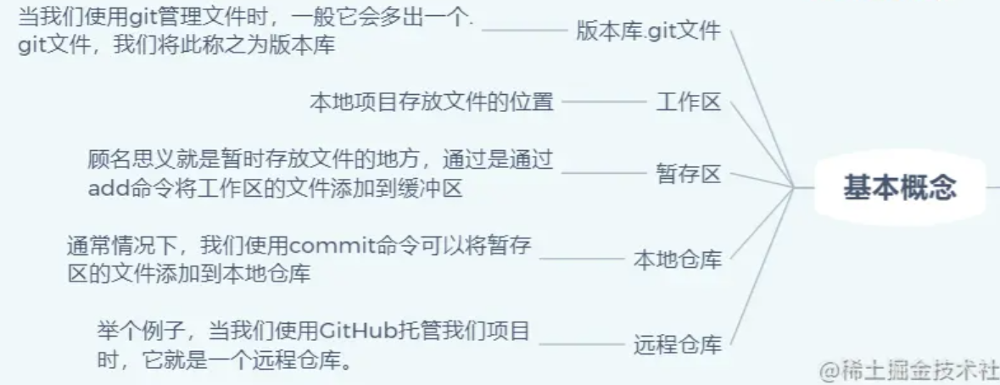
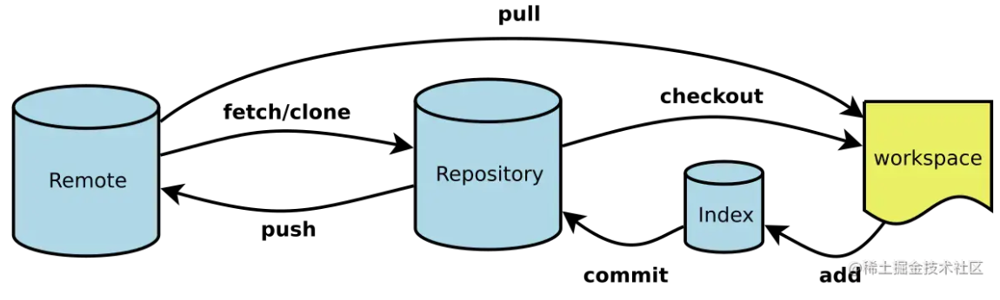
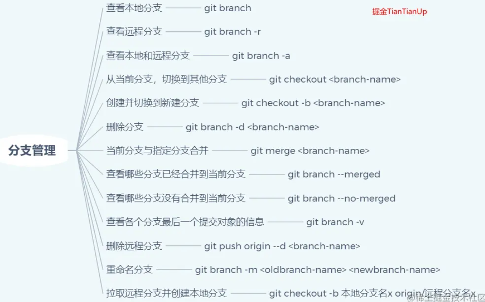
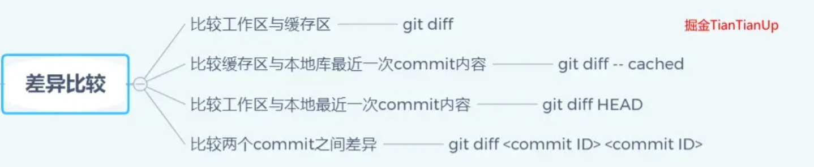
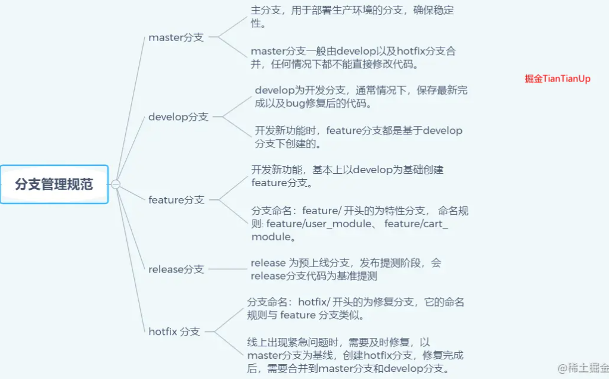

---
title: Git基本使用和常见命令行 
date: 2021-5-06
tags:
 - Git
categories:
 -  工具类
---  
##   Git基本使用和常见命令行  
  原文：[](https://juejin.cn/post/6869519303864123399)  
### 基本概念    
  基于上面的图，我们就有接下来一些概念  
        
        
  +  版本库 `.git`  
      + 当我们使用git管理文件时，比如`git init`时，这个时候，会多一个`.git`文件，我们把这个文件称之为版本库。  
      + `.git`文件另外一个作用就是它在创建的时候，会自动创建`master`分支，并且将`HEAD`指针指向`master`分支。  
  + 工作区  
      + 本地项目存放文件的位置  
      + 可以理解成图上的workspace  
  + 暂存区 (Index/Stage)  
      + 顾名思义就是暂时存放文件的地方，通过是通过add命令将工作区的文件添加到缓冲区  
  + 本地仓库（Repository）  
      + 通常情况下，我们使用commit命令可以将暂存区的文件添加到本地仓库  
      + 通常而言，HEAD指针指向的就是master分支  
  + 远程仓库（Remote）  
      + 举个例子，当我们使用GitHub托管我们项目时，它就是一个远程仓库。  
      + 通常我们使用clone命令将远程仓库代码拷贝下来，本地代码更新后，通过push托送给远程仓库。  

### Git使用流程  
  1. 创建本地仓库 `git init`  
  2. 链接本地仓库与远端仓库  
      + `git remote add origin`  
      + origin默认是远端仓库别名 url 可以是可以使用https或者ssh的方式新建  
  3. 检查配置信息  
      + `git config --list`  
  4. `Git user name` 与`email`  
      + `git config --global user.name "yourname"`  
      + `git config --global user.email "your_email"`  
  5. 生成SSH密钥  
      + `ssh-keygen -t rsa -C "这里换上你的邮箱"`  
      + `cd ~/.ssh` 里面有一个文件名为id_rsa.pub,把里面的内容复制到git库的我的SSHKEYs中   
  6. 常看远端仓库信息  
      + `git remote -v`  
  7. 远端仓库重新命名  
      + `git remote rename old new`  
  8. 提交到缓存区  
      + `git add .` 全部上传到缓存区  
      + `git add 指定文件`  
  9. 提交到本地仓库  
      + `git commit -m 'some message'`  
  10. 提交远程仓库  
      + `git push <远程主机名> <本地分支名>:<远程分支名>`  
  11. 查看分支 `git branch`  
  12. 创建并切换分支 `git checkout -b`    
###  Git文件状态  
  通常我们需要查看一个文件的状态 `git status`  
  + `Changes not staged for commit`  
      + 表示得大概就是工作区有该内容，但是缓存区没有，需要我们git add  
  + `Changes to be committed`  
      + 一般而言，这个时候，文件放在缓存区了，我们需要git commit  
  + `nothing to commit, working tree clean`  
      + 这个时候，我们将本地的代码推送到远端即可  
###  常见命令  
1. git配置命令  
      
2. 分支管理  
      
3. fetch指令  
    + 将远程仓库内容更新到本地  
      
    1. fetch推荐写法  
    ```js 
        git fetch origin <branch-name>:<local-branch-name>  
    ```  
      + 一般而言，这个origin是远程主机名，一般默认就是origin  
      + `branch-name` 你要拉取的分支  
      + `local-branch-name` 通常而言，就是你本地新建一个新分支，将origin下的某个分支代码下载到本地分支。  
    举个例子  
    ```js  
      git fetch origin feature/template_excellent:feature/template_layout
      // 你的工作目录下，就会有feature/template_layout
      // 一般情况下,我们需要做的就是在这个分支上开发新需求
      // 完成代码后,我们需要做的就是上传我们的分支  
    ```  
    2. fetch其他写法  
      + 将某个远程主机的更新，全部取回本地。`git fetch <远程主机名>`  
      + 这样子的话，取回的是所有的分支更新，如果想取回特定分支，可以指定分支名`git fetch <远程主机名> <分支名>`  
      + 当你想将某个分支的内容取回到本地下某个分支的话，如下  
        ```js 
          git fetch origin :<local-branch-name>   //等价于
          git fetch origin master:<local-branch-name>  
        ```  
3. 花式撤销  
      
4. 文件暂存  
      
5. 差异比较  
      
6. 分支命名  
      
7. 状态查询  
    + 查看状态  `git status`  
    + 查看历史操作记录  `git reflog`  
    + 查看日志  `git log`  
8. 文档查询  
    + 展示Git命令大纲  `git help (--help)`  
    + 展示Git命令大纲全部列表  `git help -a`  
    + 展示具体命令说明手册  `git help`  
    


