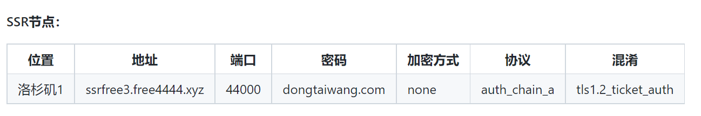
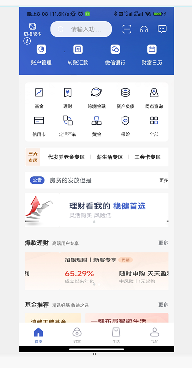
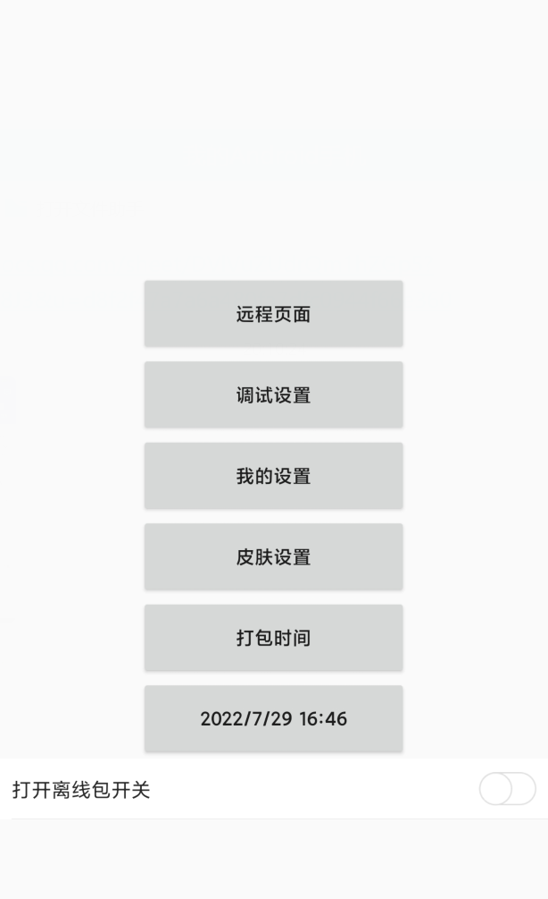
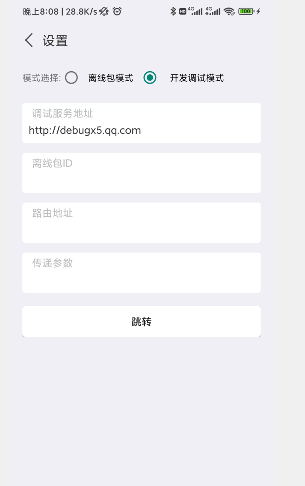
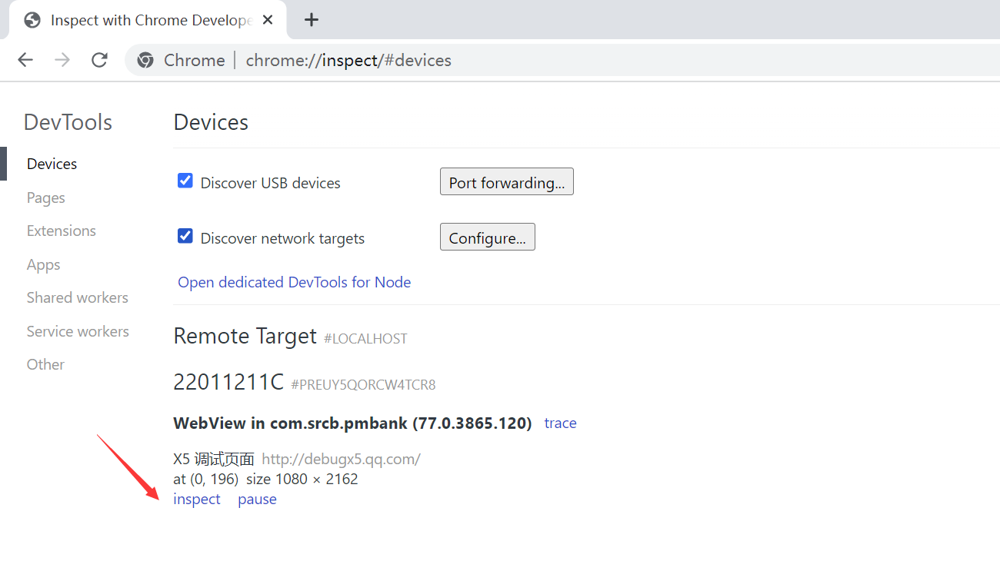

---
title: 利用debugX5进行远程真机谷歌调试  
date: 2022-7-01
tags:
 - debugx5
categories:
 -  工具类
---  
##  利用debugX5进行远程真机谷歌调试  
### 获取科学上网工具  
1. github传送门  
      
2. 利用上述地址可以获取科学上网账号，注意可能会实时更新，下载完之后，把网址中的这一栏对应填好就可以开启科学上网~~  
      
3. 传送门2  
      
    + 此地址直接下载到本地，按照文档自行测试  
###  连接手机  
1. 以安卓为例，首先开启手机的开发者选项（一般来说安卓机在关于手机--手机参数的--例如MIUI版本(快速点击5次进入)）  
2. 在设置--开发者选项---开启USB调试  
3. 用正规数据线连接电脑（一定要正规的，有的三合一数据线不能调试，只能充电）  
### 真机调试  
1. 打开我们要调试的软件（以上海农商银行app（测试版）为例）  
2. 点击左上角的感叹号--进入调试配置页面  
      
3. 点击远程页面  
       
4. 在开发调试模式--调试服务地址中输入`http://debugx5.qq.com`  
      
5. 在信息--勾选打开TBS内核inspector调试功能  
6. 直接手机后台退出app，然后重新进入到你要调试的页面  
7. 在电脑刚才的谷歌调试页面中进入你要调试的页面  
      
8. 接下来我们就可以愉快的进行真机调试了~~不过这个主要是用于UI，楼层搭建时候的真机调试

