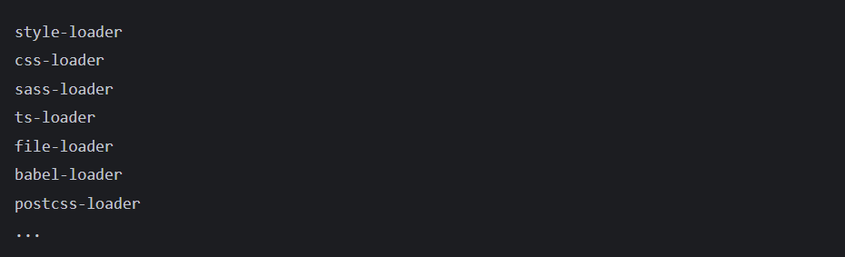
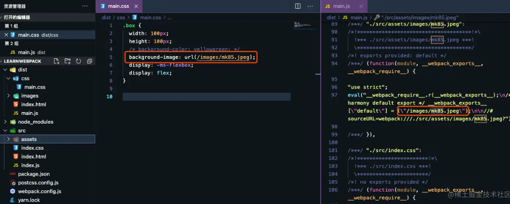
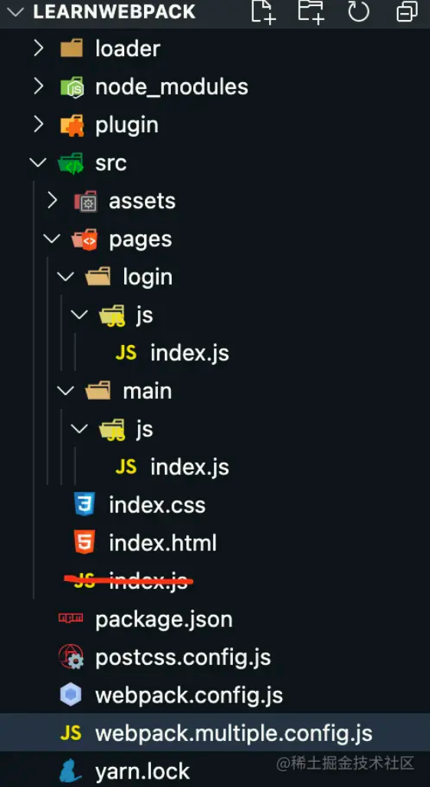

  # webpack基本配置详解  

转载自掘金--KDDA_[传送门](https://juejin.cn/post/6953042611963691021#heading-0)

### webpack概念

webpack是一个现代JavaScript应用程序的静态模块打包器。如果你接触js够早的话，你一定知道最初的工程可没有这样的打包工具，一个文件就相当于一个模块，最终这些文件需要按照一定的顺序使用script标签引入html（因为如果顺序不对就会导致依赖变量丢失等错误问题）。但是这个写项目不仅麻烦而且不优雅，随着node.js的出现和发展，才出现了这类基于node.js运行的打包工具（gulp、grunt，以及现在最流行的webpack），因为node.js拥有可对文件操作的能力。所以webpack本质就是为我们打包js的引用，而我们常听到各种loader、各种plugin、热更新、热模块替换等等都是webpack的一个升华，使得webpack能为我们提供更多的帮助。

  + loader：webpack本身只能打包js和json格式的文件，但实际项目中我们还有会css、scss、png、ts等其他文件，这时我们就需要使用loader来让它正确打包。 

       +  **总结：loader是处理编译js和json以外的文件时用的**

       + 常见的loader  
        
  + plugin：plugin可以在webpack运行到某个阶段时候，帮你做一些事情，类似react/vue中的生命周期。具体的某个插件（plugin）就是在webpack构建过程中的特定时机注入扩展逻辑来改变构建结果，作用于整个构建过程。  
### 初始化项目  
 + 新建一个文件夹  
 ```
 mkdir learnWebpack
 ```
 + 进入到文件夹中  
 ```
 cd learnWebpack/
 ```
 + 初始化package.json文件  
 ```
 # 可以输入配置
npm init

# 默认配置创建
npm init -y

# 是用npm init -y后得到的内容
{
  "name": "learnwebpack",
  "version": "1.0.0",
  "description": "",
  "main": "index.js",
  "scripts": {
    "test": "echo \"Error: no test specified\" && exit 1"
  },
  "author": "",
  "license": "ISC"
}
```
### 安装  
 + 安装webpack、webpack-cli依赖  
 ```
 # 我更喜欢yarn，当然你也可以使用npm
yarn add webpack@4.44.2 webpack-cli@3.3.12 -D
```  
### webpack的零配置    
  我们想要自定义配置webpack的话，需要在根目录上创建一个webpack.config.js的文件，这个文件的内容可以覆盖webpack的零配置  

 + 使用默认的配置文件：webpack.config.js  
  ```
  # 使用webpack.config.js配置文件时，输入该命令即可启动webpack打包
  webpack
  ```   
 + 使用其他配置文件：如yzyConfig.js，可以通过--config yzyConfig.js来指定webpack使用哪个配置文件来执行构建    
 ```
  # 通过--config来指定其他配置文件，并按照指定的配置文件的配置内容进行打包
  webpack --config yzyConfig.js
 ```   

### webpack配置核心概念  
 + chunk：指代码块，一个chunk可能由多个模块组合而成，也用于代码合并与分割（这里的合并分割主要指指纹策略的判断），指纹策略简单来说就是文件名后的hash  
 + bundle：资源经过webpack流程解析编译后最终输出的成果文件（一个.js格式的文件，也就是我们的output文件）  
 + entry：文件打包的入口，webpack会根据entry递归的去寻找依赖，每个依赖都将被它处理，最后打包到集合文件中  
 + output：配置打包输出的位置、文件名等  
 + loader：默认情况下，webpack仅支持js和json文件，通过loader，可以让它解析其他类型的文件。理论上只要有相应的loader，webpack可以处理任何类型的文件  
 +  plugin：loader主要的职责是让webpack认识更多的文件类型，而plugin的职责则是让其可以控制构建流程，从而执行一些特殊的任务。插件的功能非常强大，可以完成各种各样的任务  
 + mode：目标环境，不用的目标环境会影响webpack打包时的决策  
     + production：码进行压缩等一系列优化操作  
     + development：有利于热更新的处理，识别哪个模块变化代  
     + none：什么都不做，打包时会有提示警告  

## 配置webpack.config.js  

### 实现加载css  
我们已经知道.css文件无法正常被webpack打包进bundle（bundle的解释可查看“webpack配置核心概念”部分）文件，所以我们需要一个loader作为加载器将它正确打包进bundle文件  

安装css-loader` yarn add css-loader -D`  

配置css-loader  
```js
const path = require('path')
module.exports = {
  entry: './src/index.js',
  output: {
    filename: 'main.js',
    path: path.resolve(__dirname, './dist') 
  },
  mode: "development",
  module: {
    rules: [
      {
        test: /\.css$/,
        use: "css-loader"
      }
    ]
  }
}
```  
运行webpack命令，检查一下dist/main.js中是否包含了css文件中的内容  
我们发现css文件的内容被成功打包了，这时如果你在dist文件夹下创建了一个html页面给div元素加上了box类，并引入main.js文件，你会发现完全看不到样式效果。
因为此时css中的内容只是被作为一段**字符串**引入了js中（相当于对css文件的内容进行了JSON.stringify），所以你自然是看不到效果的。
想要看到效果要怎么办？当然是将css内容放进style标签啦！不过这步不需要我们做，因为我们有**style-loader**为我们做这件事情！  

### 实现css效果展示  
安装style-loader`yarn add style-loader -D`  

配置style-loader  
```js
const path = require('path')
module.exports = {
  entry: './src/index.js',
  output: {
    filename: 'main.js',
    path: path.resolve(__dirname, './dist') 
  },
  mode: 'development',
  module: {
    rules: [
      {
        test: /\.css$/,
        use: ['style-loader', 'css-loader']
      }
    ]
  }
}
```  
这里需要注意的是，对同一种类型文件**使用多个 loader**的时候，use属性接收一个数组，并且**从右向左**执行。所以**style-loader要写在css-loader前面**  

但是我们知道，css3在浏览器中会存在**兼容性问题**，我们可以通过给属性加上前缀来解决该问题。前端丰富的生态当然不会让你自己傻傻的做这件事情，我们可以通过**autoprefixer**这个插件帮我们完成  

### 实现css前缀自动补充  
已经知道autoprefixer是postcss工具的插件，所以我们需要安装postcss和postcss-loader  

安装postcss、postcss-loader、autoprefixer，**这里postcss-loader需要指定4.x的版本，因为4.x的版本和webpack4会存在报错问题**  
`yarn add autoprefixer postcss-loader@4.2.0 postcss -D`  

配置postcss-loader和插件autoprefixer  
```js
const path = require('path')
module.exports = {
  entry: './src/index.js',
  output: {
    filename: 'main.js',
    path: path.resolve(__dirname, './dist') 
  },
  mode: 'development',
  module: {
    rules: [
      {
        test: /\.css$/,
        use: [
          'style-loader', 
          'css-loader', 
          {
            loader: 'postcss-loader',
            options: {
              postcssOptions: {
                plugins: [require('autoprefixer')]
              }
            }
          }
        ]
      }
    ]
  }
}
```   
当loader需要写配置的时候，我们可以把loader写成一个对象，loader属性就是要使用的loader名称，options属性就是这个loader的配置对象。autoprefixer是postcss的插件，所以autoprefixer的使用自然就要写在postcss-loader的配置中了  

因为postcss有自己的配置文件，所以这里还可以写成这样：  
```js
// webpack.config.js
const path = require('path')
module.exports = {
  entry: './src/index.js',
  output: {
    filename: 'main.js',
    path: path.resolve(__dirname, './dist') 
  },
  mode: 'development',
  module: {
    rules: [
      {
        test: /\.css$/,
        use: ['style-loader', 'css-loader', 'postcss-loader']
      }
    ]
  }
}

// 根目录下新建postcss.config.js文件
module.exports = {
  plugins: [require('autoprefixer')],
}
```  
这里我们需要配置一下browserslist，否则插件不知道按照什么样的规则进行前缀补全  
```json
// 在package.json文件中添加
// 这里的意思表示目标浏览器为ie浏览器，并需要兼容到ie8以上
"browserslist": ["ie > 8"]  
```  

### 实现css以文件形式导出  

随着项目的增大，我们不想把那么多的样式都放在style标签中，我们想用link标签引入，这时我们就需要使用mini-css-extract-plugin    

安装mini-css-extract-plugin  
```
yarn add mini-css-extract-plugin -D
```

配置mini-css-extract-plugin插件和它的loader，这时我们不需要style-loader了，我们要style-loader替换成MiniCssExtractPlugin.loader  
```js
const path = require('path')
const MiniCssExtractPlugin = require('mini-css-extract-plugin')
module.exports = {
  entry: './src/index.js',
  output: {
    filename: 'main.js',
    path: path.resolve(__dirname, './dist') 
  },
  mode: 'development',
  module: {
    rules: [
      {
        test: /\.css$/,
        use: [
          MiniCssExtractPlugin.loader,
          'css-loader', 
          'postcss-loader'
        ]
      }
    ]
  },
  plugins: [
    new MiniCssExtractPlugin({
      filename: "css/[name].css"
    })
  ]
}
```

 + MiniCssExtractPlugin可以配置输出文件名  
 + [name]为占位符，引入的时候是什么名字，导出的时候就是什么名字  
 + css/表示导出到css文件夹下   

### 实现自动生成html文件  

我们发现dist下的html是我们自己手动创建的，这显然不够优雅。**html-webpack-plugin**帮你解决！
```
yarn add html-webpack-plugin@4.5.2 -D
```

配置html-webpack-plugin  
```js
const path = require('path')
const MiniCssExtractPlugin = require('mini-css-extract-plugin')
const HtmlWebpackPlugin = require('html-webpack-plugin')
module.exports = {
  entry: './src/index.js',
  output: {
    filename: 'main.js',
    path: path.resolve(__dirname, './dist') 
  },
  mode: 'development',
  module: {
    rules: [
      {
        test: /\.css$/,
        use: [
          MiniCssExtractPlugin.loader,
          'css-loader', 
          'postcss-loader'
        ]
      }
    ]
  },
  plugins: [
    new MiniCssExtractPlugin({
      filename: "css/[name].css",
    }),
    new HtmlWebpackPlugin({
      template: './src/index.html'
    })
  ]
}
```
### 实现打包清空dist文件夹  

我们会发现每次打包dist文件夹的内容会被覆盖，但是如果下次打包出来的文件名不同，那旧的打包文件还会存在，这是我们不想要的。**clean-webpack-plugin**来帮我们解决这个问题  
```
yarn add clean-webpack-plugin -D
```

配置clean-webpack-plugin  
```js
const path = require('path')
const MiniCssExtractPlugin = require('mini-css-extract-plugin')
const HtmlWebpackPlugin = require('html-webpack-plugin')
const { CleanWebpackPlugin } = require('clean-webpack-plugin')
module.exports = {
  entry: './src/index.js',
  output: {
    filename: 'main.js',
    path: path.resolve(__dirname, './dist') 
  },
  mode: 'development',
  module: {
    rules: [
      {
        test: /\.css$/,
        use: [
          MiniCssExtractPlugin.loader,
          'css-loader', 
          'postcss-loader'
        ]
      }
    ]
  },
  plugins: [
    new MiniCssExtractPlugin({
      filename: "css/[name].css",
    }),
    new HtmlWebpackPlugin({
      template: './src/index.html'
    }),
    new CleanWebpackPlugin()
  ]
}
```

### 实现图片在js文件中引入  

实现这个功能我们使用url-loader，当然你也可以使用file-loader。url-loader是file-loader的升级版，它内部也依赖了file-loader。**file-loader和url-loader在webpack5后都被废弃了，使用asset modules代替**  
```
yarn add url-loader file-loader -D
```
**你可以会疑问为什么要装file-loader，因为url-loader依赖file-loader。若不装，当url-loader将图片转换为base64导入bundle时不会存在问题，但直接输出图片到dist文件夹下就会报错，告诉你缺少file-loader**  
```js
const path = require('path')
const MiniCssExtractPlugin = require('mini-css-extract-plugin')
const HtmlWebpackPlugin = require('html-webpack-plugin')
const { CleanWebpackPlugin } = require('clean-webpack-plugin')
module.exports = {
  entry: './src/index.js',
  output: {
    filename: 'main.js',
    path: path.resolve(__dirname, './dist') 
  },
  mode: 'development',
  module: {
    rules: [
      {
        test: /\.css$/,
        use: [
          MiniCssExtractPlugin.loader,
          'css-loader', 
          'postcss-loader'
        ]
      },
      {
        test: /\.(png|jpe?g|gif)$/,
        use: {
          loader: 'url-loader',
          options: {
            name: '[name].[ext]',
            limit: 1024 * 3
          }
        }
      }
    ]
  },
  plugins: [
    new MiniCssExtractPlugin({
      filename: "css/[name].css",
    }),
    new HtmlWebpackPlugin({
      template: './src/index.html'
    }),
    new CleanWebpackPlugin()
  ]
}
```
+ [ext]表示导入时是什么格式，导出时就是什么格式  
+ limit表示图片大小的阈值，超过阈值的图片会被原封不动的放置到打包文件夹下（file-loader做的这件事情，在js中引入时会帮你生成一个地址，即打包后对应的访问地址），没有超过会处理成base64放在bundle文件中  

在入口文件中引入图片  
```js
// index.js
import './index.css'
import mk85 from './assets/images/mk85.jpeg'
console.log(mk85) // mk85.jpeg
const img = document.createElement('img')
img.src = mk85
const BoxDiv = document.getElementsByClassName('box')
BoxDiv[0].appendChild(img)
```

### 实现图片在css文件中引入  

在css中引入图片我们依旧使用url-loader，但需要对配置稍微进行修改  
css代码  
```css
.box {
  width: 100px;
  height: 100px;
  /* background-color: yellowgreen; */
  background-image: url('./assets/images/mk85.jpeg');
  display: flex;
}
```  
直接引用并打包，打包成功！打开html页面，发现看不到图片，因为地址不对。打包后mk85图片在dist文件夹下，而index.css的引用路径依旧是mk85.jpeg，可index.css是在css文件夹下的，所以自然是无法引用到。那如何才能引用到呢？最简单的方法就是加上/，**但这里有坑（其实也不是坑，这是一个关于/images、./images、image三者有什么不同的知识点）**。补充：create-react-app也是通过/ 实现引用统一的  

修改url-loader配置  
```js
const path = require('path')
const MiniCssExtractPlugin = require('mini-css-extract-plugin')
const HtmlWebpackPlugin = require('html-webpack-plugin')
const { CleanWebpackPlugin } = require('clean-webpack-plugin')

module.exports = {
  entry: './src/index.js',
  output: {
    filename: 'main.js',
    path: path.resolve(__dirname, './dist') 
  },
  mode: 'development',
  module: {
    rules: [
      {
        test: /\.css$/,
        use: [
          MiniCssExtractPlugin.loader,
          'css-loader', 
          'postcss-loader'
        ]
      },
      {
        test: /\.(png|jpe?g|gif)$/,
        use: {
          loader: 'url-loader',
          options: {
            name: '[name].[ext]',
            limit: 1024 * 3,
            outputPath: "images/",
            publicPath: "/images",
          }
        }
      }
    ]
  },
  plugins: [
    new MiniCssExtractPlugin({
      filename: "css/[name].css",
    }),
    new HtmlWebpackPlugin({
      template: './src/index.html'
    }),
    new CleanWebpackPlugin()
  ]
}
```  
+ outputPath表示输出的到哪里（file-loader提供的）  
+ **name: images/[name].[ext]**这样写和用outputPath设置效果一样吗？在配合publicPath字段时不一样。所以当你不需要配置publicPath字段时，可以通过name设置输出路径（file-loader提供的）  
```js
options: {
  name: '[name].[ext]',
  limit: 1024 * 3,
  outputPath: "images/",
  publicPath: "/images",
}
  
// 等价于
  
options: {
  name: 'images/[name].[ext]',
  limit: 1024 * 3,
  publicPath: "/",
}
```  
+ publicPath表示资源引用的路径  
运行webpack命令看一下结果  
  

成功了！是我们想要的结果，不过问题又来了，当你打开html页面时发现并不能看到图片正常显示，这里就牵扯到**关于/images、./images、image三者有什么不同的知识点**  

简单来说，如果我起了服务，我的实际路径就是“localhost:8080/images/mk85.jpeg”，如果没有起服务那就是“/images/mk85.jpeg”

所以让我们开启一个服务吧！

### 实现webpack本地服务  

安装webpack-dev-server  
```
yarn add webpack-dev-server -D
```
配置url-loader  
```js
const path = require('path')
const MiniCssExtractPlugin = require('mini-css-extract-plugin')
const HtmlWebpackPlugin = require('html-webpack-plugin')
const { CleanWebpackPlugin } = require('clean-webpack-plugin')

module.exports = {
  entry: './src/index.js',
  output: {
    filename: 'main.js',
    path: path.resolve(__dirname, './dist') 
  },
  mode: 'development',
  module: {
    rules: [
      {
        test: /\.css$/,
        use: [
          MiniCssExtractPlugin.loader,
          'css-loader', 
          'postcss-loader'
        ]
      },
      {
        test: /\.(png|jpe?g|gif)$/,
        use: {
          loader: 'url-loader',
          options: {
            name: '[name].[ext]',
            limit: 1024 * 3,
            outputPath: "images/",
            publicPath: "/images",
          }
        }
      }
    ]
  },
  devServer: {
    open: true,
    port: 8080,
  },
  plugins: [
    new MiniCssExtractPlugin({
      filename: "css/[name].css",
    }),
    new HtmlWebpackPlugin({
      template: './src/index.html'
    }),
    new CleanWebpackPlugin()
  ]
}
```

+ 只需要加上devServer配置即可  
+ open表示打开浏览器  
+ port表示服务的端口号  

**注意：这时就不是使用webpack命令来启动项目了，需使用webpack-dev-server来启动**

### 实现多页面打包  

顾名思义，多页面自然是有多个html页面，每个html页面都有自己的js文件，那么，**有多少个入口就要有多少个出口**  

我们首先要设置一下目录形式，以适应多页面打包的形式（以下形式不是唯一的，但有助于大家的理解）  
  
+ 这里不需要src/index.js  
+ 新建一个webpack.multiple.config.js  
+ 新建src/pages/login/js/index.js  
+ 新建src/pages/main/js/index.js  

安装glob，用于处理文件  
```
yarn add glob -D
```
配置webpack.multiple.config.js  
```js
module.exports = {
  entry: {
    login: './src/pages/login/js/index.js',
    main: './src/pages/main/js/index.js'
  },
  output: {
    filename: '[name].js',
    path: path.resolve(__dirname, './dist') 
  },
  plugins: [
    new HtmlWebpackPlugin({
      template: './src/index.html',
      filename: 'login.html',
      chunks: ['login'] // chunks的名字对应entry中的名字
    }),
    new HtmlWebpackPlugin({
      template: './src/index.html',
      filename: 'main.html',
      chunks: ['main']
    })
  ]
}
```  
这样就完成了！你可以使用`webpack --config ./webpack.multiple.config.js `命令运行一下。结果会如你所愿的
但是，这时你肯定会想难道我每写一个页面就重新配置一次吗？这也太麻烦了，也不优雅！那我们现在解决一下这个问题吧，直接上代码  
```js
// 我们写一个方法自动做我们上面配置的事情
const glob = require("glob")

const setMpa = () => {
  const entry = {}
  const htmlwebpackplugins = []
	// 通过glob库拿到我们的入口文件数组
  const entryFiles = glob.sync(path.resolve(__dirname, "./src/pages/*/*/index.js"))
	// console.log(entryFiles)
  // 打印结果
  // [
  //  '/Users/yzy/Desktop/learnSpace/learnWebpack/src/pages/login/js/index.js', 
  //  '/Users/yzy/Desktop/learnSpace/learnWebpack/src/pages/main/js/index.js'
  // ]
  entryFiles.forEach((item) => {
    const entryFile = item
    const match = entryFile.match(/src\/pages\/(.*)\/js\/index\.js$/)
    // console.log(match)
    // 打印结果
    // [
    //   'src/pages/login/js/index.js',
    //   'login',
    //   index: 43,
    //   input: '/Users/yzy/Desktop/learnSpace/learnWebpack/src/pages/login/js/index.js',
    //   groups: undefined
    // ]
    const pageName = match[1]
    entry[pageName] = entryFile
    htmlwebpackplugins.push(
      new HtmlWebpackPlugin({
        template: `./src/index.html`,
        filename: `${pageName}.html`,
        chunks: [pageName]
      })
    )
  })

  return {
    entry,
    htmlwebpackplugins,
  }
}
```  
有了这个方法以后，我们把它加到配置文件里  
```js
const path = require('path')
const MiniCssExtractPlugin = require('mini-css-extract-plugin')
const HtmlWebpackPlugin = require('html-webpack-plugin')
const { CleanWebpackPlugin } = require('clean-webpack-plugin')
const glob = require("glob")

const setMpa = () => {
  const entry = {}
  const htmlwebpackplugins = []
  const entryFiles = glob.sync(path.resolve(__dirname, "./src/pages/*/*/index.js"))
  entryFiles.forEach((item) => {
    const entryFile = item
    const match = entryFile.match(/src\/pages\/(.*)\/js\/index\.js$/)
    const pageName = match[1]
    entry[pageName] = entryFile
    htmlwebpackplugins.push(
      new HtmlWebpackPlugin({
        template: `./src/index.html`,
        filename: `${pageName}.html`,
        chunks: [pageName]
      })
    )
  })

  return {
    entry,
    htmlwebpackplugins,
  }
}
const { entry, htmlwebpackplugins } = setMpa()
module.exports = {
  entry,
  output: {
    filename: '[name].js',
    path: path.resolve(__dirname, './dist') 
  },
  mode: 'development',
  module: {
    rules: [
      {
        test: /\.css$/,
        use: [
          'style-loader',
          'css-loader', 
          'postcss-loader'
        ]
      },
      {
        test: /\.(png|jpe?g|gif)$/,
        use: {
          loader: 'url-loader',
          options: {
            name: '[name].[ext]',
            limit: 1024 * 3,
            outputPath: "images/",
            publicPath: "/images",
          }
        }
      }
    ]
  },
  devServer: {
    open: true,
    port: 8080,
    hot: true
  },
  plugins: [
    new MiniCssExtractPlugin({
      filename: "css/[name].css",
    }),
    new CleanWebpackPlugin(),
    ...htmlwebpackplugins
  ]
}
```  
 我们再使用**webpack --config ./`webpack.multiple.config.js**命令运行一下，成功！  

 ### 小结  

 到这里就算是完成了一个简单的webpack项目配置!


 


 