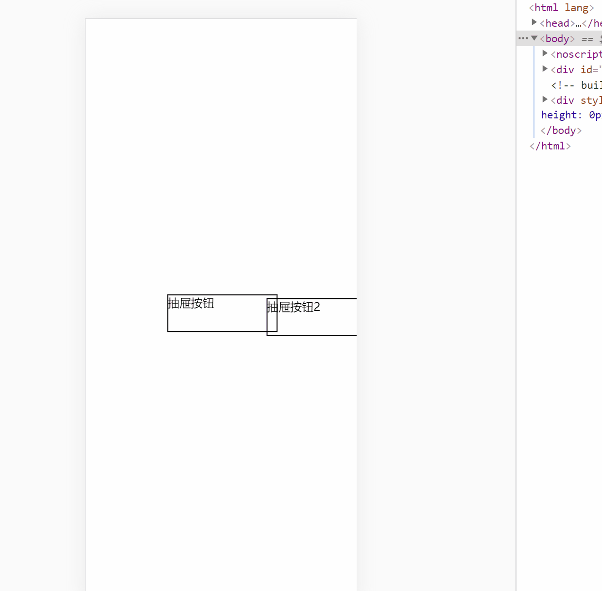

---
title: opacity过渡和v-show一起使用无效的解决方法
date: 2022-4-03
tags:
 - vue
categories:
 -  踩坑
---     
##  opacity过渡和v-show一起使用无效的解决方法    

1. 需求背景 ：做一个抽屉功能，利用v-show来展示，并添加遮罩层，以及过渡效果   
2. 代码      

      ```html  
             <template>
                <div id='hwWrapper'>
                  <div class='btn' @click='bth'> 抽屉按钮</div>
                  <div class='btn2' @click='bth2'> 抽屉按钮2</div>
                  <div class='mask' @click="close" :class="{show:isShow}" v-show='isShow'>
                    <div class='box' :class="{showBox:isShow}">
                      <ul>
                        <li>Lorem ipsum dolor, sit amet consectetur adipisicing elit. Libero deleniti aperiam aut aspernatur ipsum excepturi quod dicta et nihil voluptate hic nulla, quidem provident expedita quibusdam consectetur sequi ipsa inventore.</li>
                        <li>Lorem ipsum dolor, sit amet consectetur adipisicing elit. Libero deleniti aperiam aut aspernatur ipsum excepturi quod dicta et nihil voluptate hic nulla, quidem provident expedita quibusdam consectetur sequi ipsa inventore.</li>
                        <li>Lorem ipsum dolor, sit amet consectetur adipisicing elit. Libero deleniti aperiam aut aspernatur ipsum excepturi quod dicta et nihil voluptate hic nulla, quidem provident expedita quibusdam consectetur sequi ipsa inventore.</li>
                        <li>Lorem ipsum dolor, sit amet consectetur adipisicing elit. Libero deleniti aperiam aut aspernatur ipsum excepturi quod dicta et nihil voluptate hic nulla, quidem provident expedita quibusdam consectetur sequi ipsa inventore.</li>
                        <li>Lorem ipsum dolor, sit amet consectetur adipisicing elit. Libero deleniti aperiam aut aspernatur ipsum excepturi quod dicta et nihil voluptate hic nulla, quidem provident expedita quibusdam consectetur sequi ipsa inventore.</li>
                        <li>Lorem ipsum dolor, sit amet consectetur adipisicing elit. Libero deleniti aperiam aut aspernatur ipsum excepturi quod dicta et nihil voluptate hic nulla, quidem provident expedita quibusdam consectetur sequi ipsa inventore.</li>
                      </ul>
                    </div>
                  </div>
              <div class='box2' :class="isShow2?'showBox2':''">
              盒子
              </div>
                </div>
              </template>
              <script>
              export default {
                data() {
                  return {
                    subjectList: [{ name: 'jack' }, 555, 'abc', ['dd']],
                    isShow: false,
                    isShow2:false,
                  }
                },
                methods: {
                  bth() {
                    this.isShow = true
                  },
                  bth2() {
                    this.isShow2 = !this.isShow2
                  },
                  close() {
                    this.isShow = false
                  },
                },
              }
              </script>
              <style lang='less'>
              .hwWrapper {
                width: 100%;
                height: 100vh;
                position: relative;
                margin: 0;
                padding: 0;
              }
              .btn {
                width: 150px;
                height: 50px;
                border: 1px solid black;
                position: absolute;
                top: 50%;
                transform: translate(-50%, -50%);
                left: 50%;
              }.btn2 {
                width: 150px;
                height: 50px;
                border: 1px solid black;
                position: absolute;
                top: 50%;
                transform: translate(40%, -40%);
                left: 50%;
              }
              .mask {
                position: fixed;
                top: 0;
                width: 100%;
                height: 100vh;
                background-color: rgba(0, 0, 0, 0.5);
                opacity: 0;
                z-index: 1000;
                transition: all 0.5s;
                .box {
                  position: absolute;
                  left: -400px;
                  top: 0;
                  height: 100vh;
                  width: 20%;
                  background-color: #fff;
                  transition: all 0.5s;
                  ul {
                    display: flex;
                    flex-direction: column;
                    align-items: center;
                    justify-content: center;
                    overflow: hidden;
                  }
                }
                .showBox {
                  left: 0;
                }
              }
              .show { 
                opacity: 0.5;
              }
              .box2{
                height: 100vh;
                position: absolute;
                width: 20%;
                top: 0;
                left: -500px;
                background-color: pink;
                transition: all 0.5s;
              }
              .showBox2{
                left: 0;
              }
              </style>   
      ```      

3. 效果     
            

+ 很明显，抽屉二生效了，抽屉一并没有生效，我的理解是，v-show，使用的display:none来控制显示与隐藏效果的，说明，该DOM元素之前就是存在的，如果同时用一个变量来控制v-show，和过渡动画，应该会有先后触发的问题，于是我增加了一个变量   

4. 修改代码       

      ```html   
                <div class='mask' @click="close" :class="{show:isShow}" v-show='isShow3'></div>        
                  <script> 
                  bth() {
                        this.isShow3 = true
                      setTimeout(()=>{  //利用延时器来控制执行时机
                      this.isShow = true
                      },20)
                    },
                    bth2() {
                      this.isShow2 = !this.isShow2
                    },
                    close() {
                      this.isShow = false
                      setTimeout(()=>{ //注意两次延时器的执行对象
                      this.isShow3 = false
                      },200)
                    },
                    </script>   
      ```       

5. 效果图    
        