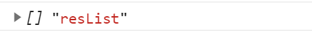
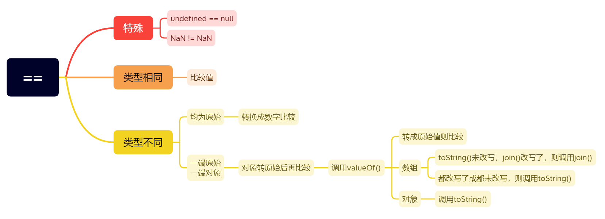

---
title: 工作中遇到的隐式转换的坑
date: 2022-7-05
tags:
 - js
categories:
 -  踩坑
---     
## 工作中遇到的隐式转换的坑   

1. 背景:今天遇到这样一个问题，后端给我同时返回了三个列表，其中有一个有值，我这边要做接收之后的数据处理，我一开始是这样处理的   
      ```js  
          //假设三个列表分别是aList，bList，cList   
          let aList = [] , bList=[], cList=[{cname:111}]  
          this.resList = aList || bList || cList 
          console.log(this.resList)  
      ```   
2. 按照我一开始的想法，应该是谁有值，resList就会接收谁，而结果是：  
              
3. 我的第一时间是what？按照隐式转换不应该空数组转成false么，于是   
      ```js   
           console.log([], ![], !![], [] == false, [] == '', [] == 0, [] == [])  
           //[] false true true true true false  
      ```   
4. 按照上面我们看的出来，在使用==的时候,或者运算的时候才会按照我们的想法进行隐式转换，而单独使用的时候并不是这样的，所以我们得先了解隐式转换的本质    

## 隐式转换   

1. 什么时候会发生隐式转换？    
    1. 数学运算符中      
        1. 减、乘、除   
            + 我们在进行非`Number`类型进行` - / * `运算时，会将非`Number`类型转换成`Number`类型   
              ```js   
                  1 - true // 0， 首先把 true 转换为数字 1， 然后执行 1 - 1
                  1 - null // 1,  首先把 null 转换为数字 0， 然后执行 1 - 0
                  1 * undefined //  NaN, undefined 转换为数字是 NaN
                  2 * ['5'] //  10， ['5']首先会变成 '5', 然后再变成数字 5   

                  //这里我们注意转换成NaN的情况有哪些   
                  undefined  NaN  '1   2'   '12ab'
                  //注意字符串，字符串中间有空格会转换成NaN,两端有空格其余是纯数字会转换成数字  
                  //Infinity 转换之后还是 Infinity      
              ```   
        2. 加法   
            + 因为加法可能存在字符串拼接的情况，要单独处理，优先级如下   
                1. 当一侧为`String`类型，被识别为字符串拼接，并会优先将另一侧转换为字符串类型    
                2. 当一侧为`Number`类型，另一侧为原始类型，则将原始类型转换为`Number`类型  
                3. 当一侧为`Number`类型，另一侧为引用类型，将引用类型和`Number`类型转换成字符串后拼接   
                ```js   
                    123 + '123' // 123123   （规则1）
                    123 + null  // 123    （规则2）
                    123 + true // 124    （规则2）
                    123 + {}  // 123[object Object]    （规则3）  
                ```    
    2. 逻辑语句中的类型转换   
          + 当我们使用`if while for`时，接收的应该是一个`truly`或`falsely`，所以需要隐式转换   
              1. 单个变量   会先将变量转换为Boolean值      

                  ```js   
                    null undefined '' NaN 0 false   // false
                    {} , [] ,['5']  // true   
                  ```   
              2. `==`   
                 
                  ```js   
                    //规则 1：NaN和其他任何类型比较永远返回false（包括和他自己）  
                    NaN == NaN // false   

                    //规则 2：Boolean 和其他任何类型比较，Boolean 首先被转换为 Number 类型  
                    true == 1  // true 
                    true == '2'  // false, 先把 true 变成 1，而不是把 '2' 变成 true
                    true == ['1']  // true, 先把 true 变成 1， ['1']拆箱成 '1', 再参考规则3
                    true == ['2']  // false, 同上
                    undefined == false // false ，首先 false 变成 0，然后参考规则4
                    null == false // false，同上   

                    //规则 3：String和Number比较，先将String转换为Number类型
                    123 == '123' // true, '123' 会先变成 123
                    '' == 0 // true, '' 会首先变成 0   
                    
                    //规则 4：null == undefined比较结果是true，除此之外，null、undefined和其他任何结果的比较值都为false。  
                    null == undefined // true
                    null == '' // false
                    null == 0 // false
                    null == false // false
                    undefined == '' // false
                    undefined == 0 // false
                    undefined == false // false   

                    //规则 5：原始类型和引用类型做比较时，引用类型会依照ToPrimitive规则转换为原始类型   
                    //ToPrimitive规则，是引用类型向原始类型转变的规则，它遵循先valueOf后toString的模式期望得到一个原始类型  
                    //如果还是没法得到一个原始类型，就会抛出 TypeError    
                    '[object Object]' == {} 
                    // true, 对象和字符串比较，对象通过 toString 得到一个基本类型值
                    '1,2,3' == [1, 2, 3] 
                    // true, 同上  [1, 2, 3]通过 toString 得到一个基本类型值
                  ```   
2. ToPrimitive规则   
      1. `valueOf()`方法   
          1. 如果没有改写valueOf（）方法，大部分都是返回本身  
            ```js  
              Array：返回数组对象本身。

              Boolean： 返回布尔值

              Date：存储的时间是从 1970 年 1 月 1 日午夜开始计的毫秒数 UTC。

              Function： 返回函数本身。

              Number： 返回数字值。

              Object：返回对象本身。这是默认情况。

              String：返回字符串值。

              Math 和 Error 对象没有 valueOf 方法。   
            ```  
      2. `toString()`方法           
            1. undefined和null没有toString()方法    
            2. 布尔型数据true和false返回对应的’true’和’false’   
            3. 字符串类型原值返回   
            4. 数值类型的情况较复杂   
                1. 正浮点数及NaN、Infinity加引号返回   
                    ```js  
                        1.23.toString();//'1.23'
                        NaN.toString();//'NaN'
                        Infinity.toString();//'Infinity'  
                    ```   
                2. 负浮点数或加’+'号的正浮点数直接跟上.toString()，相当于先运行toString()方法，再添加正负号，转换为数字  
                    ```js  
                        +1.23.toString();//1.23
                        typeof +1.23.toString();//'number'
                        -1.23.toString();//-1.23
                        typeof -1.23.toString();//'number'  
                    ```   
                3. 整数直接跟上.toString()形式，会报错，提示无效标记，因为整数后的点会被识别为小数点  
                    ```js  
                        0.toString();//Uncaught SyntaxError: Invalid or unexpected token   
                    ```   
                4. 数字类型的toString()方法可以接收表示转换基数(radix)的可选参数，如果不指定此参数，转换规则将是基于十进制。同样，也可以将数字转换为其他进制数(范围在2-36)   
                    ```js  
                        var n = 17;
                        n.toString();//'17'
                        n.toString(2);//'10001'
                        n.toString(8);//'21'
                        n.toString(10);//'17'
                        n.toString(12);//'15'
                        n.toString(16);//'11'
                    ```   
            5. 对象Object类型及自定义对象类型返回[object Object]   
                  ```js  
                      {}.toString();//[object Object]
                      {a:123}.toString();//[object Object]
                      Object.toString();//"function Object() { [native code] }"
                  ```    
##  练习    

1.  `[] == ![]`   
    ```js  
        // []是引用类型  ![]是Boolean  -->  []==false  
        // [] == 0  
        // [] 的valueOf原始值为本身[] 调用toString()-->  '' == 0
        // 0 == 0   true
    ```   
2. `[undefined] == false`  
    ```js   
        // --> [undefined] == 0  
        //--> [undefined]调用valueOf 还是本身，继续调用toString()  --> '' == 0  
        // 0 == 0    true  
    ```   
3. `if([undefined])`  
    ```js  
        //此时只看[] 他是引用数据类型，就是true  
    ```   
4. `[]+{}`和`{}+[]`  
    ```js  
        // 1. 对于第一个[]+{}  引用数据类型相加，会先调用valueOf，没有转成原始类型就继续调用toString（），[]-->''  {}-->`[object Object]`   
        // `[object Object]`     
        
        //2. 对于第二个{} + []  {}在前面会被解析成一个空的代码块，就相当于后面是 +[]  解析成正号 ，所以 +'' --> 0  
    ```   
5. 经典面试题   
    ```js  
        // let a = ??? 可使 a 成功输出
        if (a == 1 && a == 2 && a == 3) {
          console.log(a)
        }   
    ```   
    1. 解法一 ：  a 为对象（object），重写 `valueOf / toString` 方法    
        ```js  
            let a = {
                  i: 1,
                  valueOf() {
                    return this.i++
                  }
                }    //改写valueOf和toString都可以   
              //  {i: 4, valueOf: ƒ(){...}}   
        ```   
    2. 使用 `Object.defineProperty` 改写数组 `join` 方法     
        + `Array.prototype.toString() === Array.prototype.join()`（对于任何数组，默认方法也成立，且方法无参数）   
        + 数组在调用 `toString` 方法的时候， 若 `toString` 方法没有被重写，而 `join` 被重写了，则数组会去调用 `join` 方法
            ```js      
                let arr = [1, 2, 3]
                arr.join = () => 'join 被重写了'
                arr.toString() // join 被重写了   
            ```  
        + 对于数组我们无法直接在 `let a = [1, 2, 3]` 里面增加方法，所以考虑使用 `Object.defineProperty()` 方法，  
            ```js  
                 let a = Object.defineProperty([1, 2, 3], 'join', {
                            get: function () {
                              return () => this.shift()
                            }
                          }) 
                  // 打印：[join: (...), length: 0, get join: ƒ ()]   
            ```  
    3. 使用 `Proxy` 代理构造 `get` 捕获器   
        ```js  
            let a = new Proxy(
                      { v: 1 },
                      {
                        get(target, property, receiver) {
                          // 隐式转换会调用 Symbol.toPrimitive，这是一个函数
                          if (property === Symbol.toPrimitive) {
                            // 函数属性，所以要返回一个函数，会被自动执行
                            return () => target.v++
                          }
                        }
                      }
                    )
                    // 打印：Proxy {v: 4, ...} 
        ```   
##  总结 == 隐式转换    
1. 流程图
       


