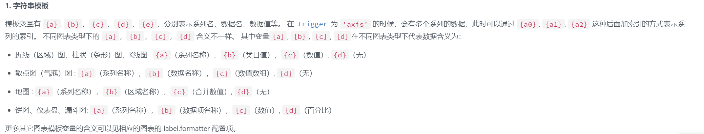
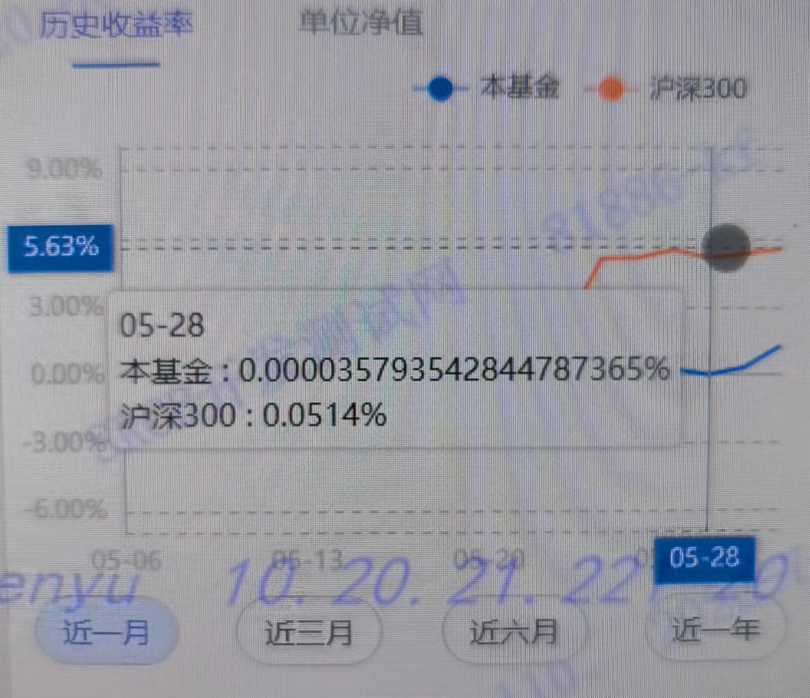

## echarts使用--格式化问题  

在使用echarts的时候，遇到了tooltips的格式化问题以及坐标刻度的格式化问题。在翻阅了文档之后也是一头雾水  
下面来介绍一下我的两种处理方式

### 1.tooltips的格式化问题

#### 1.1字符串模板格式化

对于提示框官方首推了字符串模板的格式化方法  
  
示例：`formatter:'{b0}:{c0}<br />{b1}:{c1}'`  
实操：

```
  tooltip.formatter:`{b}<br />{a0} : {c0}%<br />{a1} : {c1}%`
```  

效果图  
  
此处的a、b、c对应的具体名自己要获取后端返回数据来测试确定最好，使用字符串模板可以进行简单的数据格式化，但是我没有在此找到符合我要求的格式方式,因此介绍第二种方式

#### 1.2回调函数格式化  

回调函数格式化就比较灵活了，可以多种自定义格式内容  
实操：  

```
formatter:params =>{
  let res = "<div><p>" +params[0].axisValue + "</div></p>"
  for(let i = 0;i<params.length;i++){
    let tempNum = $Fw.util.Format.fmtInterest(Number(params[i],value),2,100)
    if(params[i].value > 0){
      tempNum = `<span style="color:red;">` +tempNum + "</span>"
    }else if{
      tempNum = `<span style="color:green;">` +tempNum + "</span>"
    }
    if(params[i].data !== undefined){
      res += "<p>" +params[i].marker + params[i].seriesName + ":" + tempNum
    }
  }
  return res
}
```  

效果图  
  
其中`$Fw.util.Format.fmtInterest`是封装的一个格式化方法，最主要的是获取params里面的各项数据，`marker`表示的是图例  
可以看的出来，回调函数会更加多样化的对tooltip的内容进行格式化  

### 2.y轴的格式化问题  

类似于上述回调函数的处理方式
