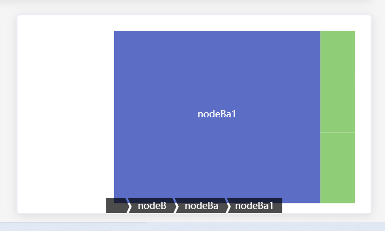

---
title: echarts使用--无法水平滚动的treemap避坑
date: 2022-7-22
tags:
 - echarts
categories:
 -  踩坑
---  
## echarts使用--treemap避坑    
  今天在使用treemap矩阵图时，有一个需要可以使矩阵图水平滚动的需求，在配置项中找到了`roam`属性,  
  ```js
  roam:
  false //关闭
  'scale' or 'zoom' //只能够缩放
  'move' or 'pan' //只能够平移。
  true //缩放和平移均可。
  ```  
  代码如下：  
  ```js
   const videoOption={
  series: [
    {
      type: 'treemap',
      data: [
        {
          name: 'nodeA',
          value: 10,
          children: [
            {
              name: 'nodeAa',
              value: 4
            },
            {
              name: 'nodeAb',
              value: 6
            }
          ]
        },
        {
          name: 'nodeB',
          value: 20,
          children: [
            {
              name: 'nodeBa',
              value: 20,
              children: [
                {
                  name: 'nodeBa1',
                  value: 20
                }
              ]
            }
          ]
        }
      ],
      roam:true
    }
  ]
};  
```    
 结果发现:  
   
 这个平移效果有点僵硬，而且可以随意移动，不符合要求  
 然后又找到了`dataZoom`属性，但是发现`treemap`中貌似不能用此属性，应该是和他没有x，y轴有关  
 最后回到了最原始的css属性。  
 ```css
 .father{
  width: 50px;
  overflow: auto;
.son{
  width:100px ;
}
}
``` 
最终实现了平移滑动。  
### css  YYDS~
 