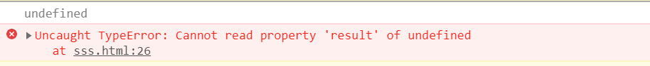
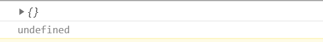

---
title: 小坑---数组的读取报错问题
date: 2022-7-23
tags:
 - js
categories:
 -  踩坑
---    
## 数组的读取报错问题  
我们很多时候从后台返回的数据里面拿到的是数组，然后有一些场景需要我们遍历数组，比如使用`v-for`把数组中的数据进行渲染到页面中,今天在渲染的过程中出现一个报错，但是并不影响使用，经过分析，发现了数组命名时候的问题。  
先来看两个demo：  
```js  
 let arr = []
        console.log(arr[0])
        console.log(arr[0].result)  
```  
我们先来思考一下demo1返回什么  
```js   
 let arr = [{}]
        console.log(arr[0])
        console.log(arr[0].result)  
```  
再来思考一下demo2返回什么  


揭晓    
demo1  
  
demo2  
  
这个arr在初识赋值时候的技巧可以有效避免有时我们遇见的报错坑  
当我们从接口用初始的arr接收数据时，因为数据是异步接收的，所以在渲染时使用`arr[0]`没有问题，但是使用`arr[0].xxx`就会出现`xxx undefined`的报错，虽然不影响使用，但是出现一片红的体验不是很好，所以可以注意一下初始赋值方式  

