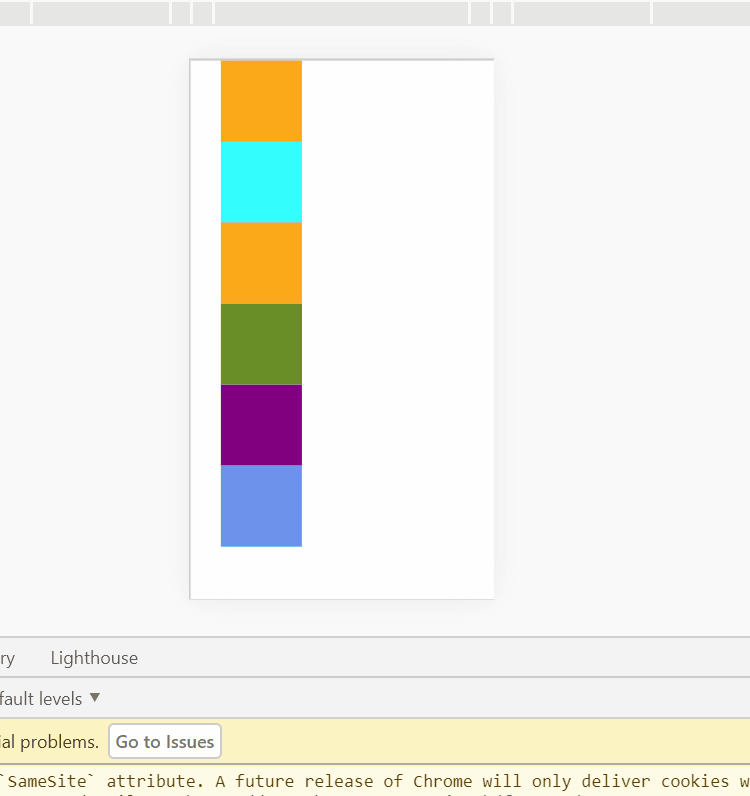
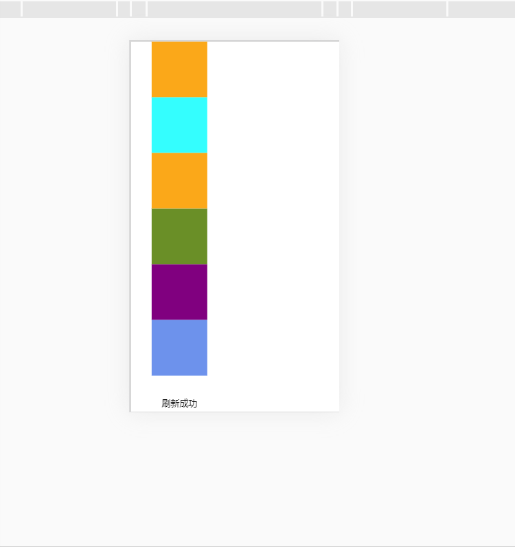

---
title: touch事件---touch事件详解以及实现上拉加载下拉刷新
date: 2022-7-25
tags:
 - js
categories:
 -  踩坑
---   
##  touch事件详解以及实现上拉加载下拉刷新  
### 一、touch事件详解  
  原文传送门：[](https://www.cnblogs.com/lovelgx/articles/7424685.html)  
1. 移动端touch三个触发事件  
   + `touchstart`：触摸开始的时候触发  
   + `touchmove`：手指在屏幕上滑动的时候触发  
   + `touchend`：触摸结束的时候触发  
2. `touches`、`targetTouches`和`changedTouches`详解  
    + **每个触摸事件都包括了三个触摸列表，每个列表里包含了对应的一系列触摸点（用来实现多点触控）：**  
        1. `touches`：当前位于屏幕上的所有手指的列表。  
        2. `targetTouches`：位于当前DOM元素上手指的列表。  
        3. `changedTouches`：涉及当前事件手指的列表   
    + 通过一个例子来区分一下触摸事件中的这三个属性：  
        1. 用一个手指接触屏幕，触发事件，此时这三个属性有相同的值。  
        2. 用第二个手指接触屏幕，此时，`touches`有两个元素，每个手指触摸点为一个值。当两个手指触摸相同元素时，`targetTouches`和`touches`的值相同，否则`targetTouches`只有一个值。`changedTouches`此时只有一个值，为第二个手指的触摸点，因为第二个手指是引发事件的原因  
        3. 用两个手指同时接触屏幕，此时`changedTouches`有两个值，每一个手指的触摸点都有一个值  
        4. 手指滑动时，三个值都会发生变化  
        5. 一个手指离开屏幕，`touches`和`targetTouches`中对应的元素会同时移除，而`changedTouches`仍然会存在元素。  
        6. 手指都离开屏幕之后，`touches`和`targetTouches`中将不会再有值，`changedTouches`还会有一个值，此值为最后一个离开屏幕的手指的接触点  
3. **触点坐标选取（这是重点）**  
    ```js  
        clientX：//触摸目标在视口中的x坐标。
        clientY：//触摸目标在视口中的y坐标。
        identifier：//标识触摸的唯一ID。
        pageX：//触摸目标在页面中的x坐标。
        pageY：//触摸目标在页面中的y坐标。
        screenX：//触摸目标在屏幕中的x坐标。
        screenY：//触摸目标在屏幕中的y坐标。
        target：//触摸的DOM节点目标  
    ```  
    + `touchstart`和`touchmove`使用: `e.targetTouches[0].pageX` 或 `(jquery)e.originalEvent.targetTouches[0].pageX`  
    + `touchend`使用: `e.changedTouches[0].pageX` 或 `(jquery)e.originalEvent.changedTouches[0].pageX`  
4. `touchmove`事件对象的获取  
    ```js
    window.addEventListener("touchstart",function(event){
            console.log(event);
          }) 
    ```  
    ```js  
        function touchmove(e,参数一){   //想要在touchmove:function(e,参数一)加一个参数，
      　　var e=arguments[0]         //结果直接使用e.preventDefault()就会e报错，
          e.preventDefault()        //处理方法为使用arguments[0]获取event参数
        }                      
    ```   
### 二、上拉加载和下拉刷新   
1. **下拉刷新**   
    + 效果图  
          
    ```html  
        <!DOCTYPE html>
        <html lang="en">

        <head>
          <meta charset="UTF-8">
          <meta name="viewport" content="width=device-width, initial-scale=1.0">
          <meta http-equiv="X-UA-Compatible" content="ie=edge">
          <title>弹动效果 touch.js</title>
          <style>
            * {
              margin: 0;
              padding: 0;
            }

            html,
            body {
              width: 100%;
            }

            .app {
              width: 100%;
              height: 100%;
            }

            /* 列表的父盒子，限制宽高 */
            /* 注意设置overflow: hidden;样式后，超出这个盒子的ul将不会显示 */
            .draw {
              width: 100%;
              height: 100%;
              border: 2px solid #ccc;
              overflow: hidden;
              position: fixed;
            }

            ul {
              zoom: 1;
              padding: 0 10%;
            }

            li {
              list-style: none;
              width: 100px;
              height: 100px;
              line-height: 100px;
              text-align: center;
            }

            /* 上移文字框隐藏 */
            ul:nth-child(1) {
              position: relative;
              line-height: 50px;
              top: -100px;
            }
          </style>
        </head>

        <body>
          <div class="app">
            <div class="draw" id="draw">
              <ul>
                <li><span class="span1">下拉刷新</span></li>
                <li style="background:orange"></li>
                <li style="background:cyan"></li>
                <li style="background:orange"></li>
                <li style="background:olivedrab"></li>
                <li style="background:purple"></li>
                <li style="background:cornflowerblue"></li>
              </ul>
            </div>
          </div>
          <script>
            let startY = 0;
            const maxMove = 500;
            let draw = document.getElementById('draw');
            let span1 = document.querySelector('.span1')
            let ul = draw.children[0];
            let moveY
            draw.addEventListener('touchstart', function (e) {
              //记录第一次触屏位置
              span1.textContent = '下拉刷新' //重置下拉刷新文字提示
              startY = e.changedTouches[0].pageY;
            });
            draw.addEventListener('touchmove', function (e) {
              //记录结束时的触屏位置
              let endY = e.changedTouches[0].pageY
              //设置最大滑动尺寸
              moveY = endY - startY <= maxMove ? endY - startY : maxMove;
              if (moveY > 200) {
                span1.textContent = '释放后刷新'
              }
              // 为了清除卡顿问题，需要清除过渡效果
              ul.style.transition = "none";
              // 阻尼系数0.3  效果会更加舒服，不然有点像拖拽
              ul.style.transform = `translateY(${0.3 * moveY }px)`;
            });
            draw.addEventListener('touchend', function () {
              if (moveY > 0 && moveY <= 200) {
                ul.style.transition = 'transform .6s'; //不刷新回弹
                ul.style.transform = `translateY(0px)`
                return;
              } else if (moveY > 200) {
                span1.textContent = '刷新中' //刷新回弹，模拟请求数据
                setTimeout(() => {
                  span1.textContent = '刷新成功';
                  setTimeout(() => {
                    ul.style.transition = 'transform .6s';
                    ul.style.transform = `translateY(0px)`;
                  }, 1000)
                }, 1000)
              }

            });
          </script>
        </body>
        </html>  
    ```   
2. **上拉加载**    
    1. 实现思路一 ：和下拉刷新一致  
        + 效果图  
            
          ```js
            <script>
            let startY = 0;
            const maxMove = 500;
            let draw = document.getElementById('draw');
            let span1 = document.querySelector('.span2')
            let ul = draw.children[0];
            let moveY
            draw.addEventListener('touchstart', function (e) {
              //记录第一次触屏位置
              span1.textContent = '上拉加载' //重置下拉刷新文字提示
              startY = e.changedTouches[0].pageY;
            });
            draw.addEventListener('touchmove', function (e) {
              //记录结束时的触屏位置
              let endY = e.changedTouches[0].pageY
              //设置最大滑动尺寸
              moveY = startY - endY
              if (moveY > 200) {
                span1.textContent = '释放后刷新'
              }
              // 为了清除卡顿问题，需要清除过渡效果
              ul.style.transition = "none";
              // 阻尼系数0.3  效果会更加舒服，不然有点像拖拽
              ul.style.transform = `translateY(${-0.3 * moveY }px)`;
            });
            draw.addEventListener('touchend', function () {
              if (moveY > 0 && moveY <= 200) {
                ul.style.transition = 'transform .6s'; //不刷新回弹
                ul.style.transform = `translateY(0px)`
                return;
              } else if (moveY > 200) {
                span1.textContent = '刷新中' //刷新回弹，模拟请求数据
                setTimeout(() => {
                  span1.textContent = '刷新成功';
                  setTimeout(() => {
                    ul.style.transition = 'transform .6s';
                    ul.style.transform = `translateY(0px)`;
                  }, 1000)
                }, 1000)
              }

            });
          </script>
          ```    
    2. 实现思路二 : 利用滚动事件  
          ```js
            //给容器加监听事件
            this.$refs.ListBox.addEventListener('scroll',e=>{
              //滑动元素可视高度 + 滑动元素下滑距离 >= 元素内容总高度
              if(e.target.clientHeight+e.target.scrollTop >= e.target.scrollHeight&& this.isRefreshBool){
                console.log('下滑刷新~')
               
                setTimeout(()=>{
                  //模拟发请求异步任务获取数据
                },500)
                 this.isRefreshBool = false  //用标签规避重复发请求，导致请求数据重复
              }
            })
          ```  
          + **注意点**   
                **我在给容器加scroll事件时，发现一直失效，可能是以下原因**  
              1. 给监听事件加第三个参数`true`，将冒泡阶段监听改为捕获阶段监听
              2. 注意逻辑顺序，监听的是不动的容器，而不是可滑动的元素
              3. 监听的容器css属性设置  
              ```css  
                .listBox{
                  overflow-y:auto;
                  -webkit-overflow-scroll:touch;
                }   
              ```  
              4. 可以在滑动到底部时，再结合`touch`事件实现过渡动画
                

      
        


    　
        

