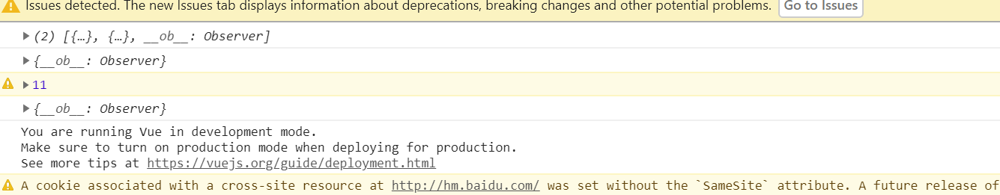

---
title: 出现__ob__Observer的数组中无法取值问题
date: 2022-7-30
tags:
 - Vue
categories:
 -  踩坑
---  
##   出现__ob__Observer的数组中无法取值问题  
### 背景  
    我们在调用接口的时候，经常把result中list要拿出来赋值给data中已经定义好的数组，然后再用这个数组去渲染或者进一步处理，但是今天我在处理result的的时候，是把其中的数据push到data中的数组，结果发现，没有办法从赋值的数组中拿到数据了，更加奇怪的是，我居然可以在控制台看见，但是拿不出来.....    
### 处理过程   
+ 逛了一上午博客，发现大多数给的处理方式都是  
    1. `JSON.parse(JSON.stringfy(this.list))`   
    2. `Object.assign({},this.list)`  
    这两种方式其实就是浅层深拷贝，但是经过试验，确实可以在这行代码执行的时候把数组中的Vue监测干掉，但是，一旦重新赋值给data中的定义好的数组时，就会原形毕露了。  
+ 然后我就开始去找`__ob__Observer`为啥会出现  
    ```js
      <body>
        <div id="app">{{ message }}</div>
        <script>
          var vm = new Vue({
            data: {
              message: 'Hello Vue!',
              arr: []，
              arrtt:''
            },
            mounted() {
              this.pushArr()
              this.arrforeach()
            },
            methods: {
              pushArr() {
                this.arr.push({
                  name: 11,
                  age: 18
                }, {
                  name: 22,
                  age: 25
                })
                console.log(this.arr)
              },
              arrforeach() {
                this.arr.filter(item => {
                  console.log(item)
                 if (item.age == 18) {
                    this.arrtt = item.name
                    console.warn(this.arrtt);
                  }
                })
              }
            },
           }).$mount('#app')
         </script>
       </body>  
    ```   
    结果发现： 
        
    1. 我是可以push之后再去操作数组的，可以拿到其中的值,所以百度很多说和push有关的应该可以排除了  
    2. 所有的定义在data中的数组，你只要给他赋值，不管是push还是索引等等其他赋值行为，都会出现__ob__Observer  
    3. __ob__Observer并不是影响数组的取值或者其他操作，可以看见，即使数组有这个监测标志，我是可以正常对数组进行遍历和取值的  
    4. 综上，关键点是调用接口的异步操作让我们还取不到值所造成的  
    ### 解决方案  
     + **我们首先模拟一个场景，我们是先调用接口，然后在成功回调里面获取数组赋值给data中的定义数组，然后在用这个数组中的某个值去当第二个接口的参数，按照之前的方式，会发现取不到值，导致第二个接口调用失败**  
     1. 使用await语法糖，让第一个接口成功回调结束后再调用第二个接口  
     2. 给第二个接口调用加一个延时器，让其等待后再入参  
     3. 又发现个大坑，我们公司框架await好像没法用，目前原因未知，所以我在第一个接口调用的成功回调里面再调第二个接口，用嵌套来实现   
