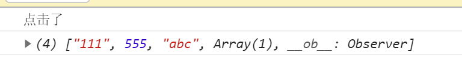
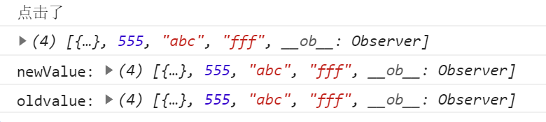

---
title: vue中操作数组的注意事项
date: 2022-8-15
tags:
 - vue
categories:
 -  踩坑
---       
##  vue中操作数组的注意事项    

1. 我们首先知道的是，vue2中data中的数据是响应式的数据，底层数组的7个变异方法也是被改写过了，那我们有哪些注意事项呢：     

      1. 使用索引操作数组  

      ```html   
          <template>
            <div>
              <div @click='bth'> but</div>
            </div>
          </template>

          <script>
          export default {
            data() {
              return {
                subjectList: [{ name: 'jack' }, 555, 'abc', ['dd']],
              }
            },
            watch: {
              subjectList: {
                handler(n, o) {
                  console.log(n, o)
                },
                deep:true
              },
            },
            methods: {
              bth() {
                console.log('点击了')
                this.subjectList[0] = '111'
                console.log(this.subjectList)
              },
            },
          }
          </script>

          <style>
          </style>  
      ```       
      + 测试结果    
             

      2. 使用7个变异方法以及$set进行测试   

          ```js   
              watch: {
                subjectList: {
                  handler(n, o) {
                    console.log('newValue:',n)
                    console.log('oldvalue:', o)
                  },
                },
              },
              methods: {
                bth() {
                  console.log('点击了')
                  // this.subjectList[3] ='ccc'
                  // this.subjectList.pop()
                  this.$set(this.subjectList,3,'fff')
                  console.log(this.subjectList)
                },
              },  
          ```   
          + 测试结果       

                   

## 小结   
1. vue2中使用索引操作数据，数据会发生改变，<font color='red'>**但是vue2无法监测,视图无法更新,watch不会触发**</font>   
2.  使用变异方法或者$set操作数组，数组会发生变化，<font color='red'>**视图也会更新，watch会触发，但是无法监测到new/oldvalue的差异了！**</font>    

> 引用官方文档的说法：注意:在变异(不是替换)对象或数组时，旧值将与新值相同，因为它们的引用指向同一个对象/数组。Vue不会保留变异之前值的副本。   

## 如果想要监测新旧变化，可以如下改造    

1. 结合watch和computed   
    ```js   
          data() {
            return {
              subjectList: [{ name: 'jack' }, 555, 'abc', ['dd']],
            }
          },
          watch: {
            subjectListData: {
              handler(n, o) {
                console.log('newValue:',n)
                console.log('oldvalue:', o)
              },
              deep:true
            },
          },
          computed:{
            subjectListData(){
              console.log('computed执行了')
              return[...this.subjectList]  
              // return JSON.parse(JSON.stringify(xxx))
            }
          },   
    ```   

    这样就可以监测到新旧值的差异了~~~~~


      