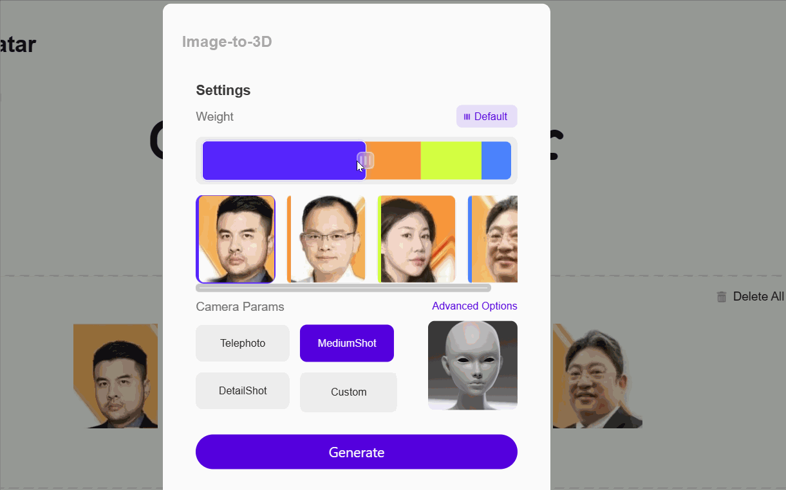

---
title: 滑动控件的算法思想
date: 2023-6-5
tags:
 - react
categories:
 -  踩坑
--- 

1. 需求：制作一个**滑块控件**，盒子中有多个子元素，父盒子宽度固定，子元素能够通过滑动两端来自由分配各个子元素的宽度比例

2. 利用指针数组，记录每个滑块两端的位置，作为指针位置，这样前一个滑块的右指针和后一个滑块的左指针是重叠的，两个指针之间的距离可以作为该子元素的宽度，每一个指针又可以作为**position：left**的位置   
    ```js
        const [pointerArr, setPointerArr] = useState([0, 71.2, 142.4, 213.6, 284.8, 356])
         const controlerItemRefs = [useRef(null), useRef(null), useRef(null), useRef(null), useRef(null)]
    ```

3. demo
    

4. 主要函数实现
    ```js
          const handlerLeftMouseDown = (event) => {
          if (event.button !== 0) return; // 只响应鼠标左键事件
          const minSize = 10;
          const startX = event.clientX;
          const pointerIndex = currentIndex;
          let newPointerArr = pointerArr.slice();
          const copyPointer = pointerArr.slice();
          document.onmousemove = function (e) {
            const endX = e.clientX;
            const diffX = endX - startX;
            /*
            左按钮左移：
                1.改变自身的positon和width
                2.先影响左侧第一个元素的width，当其width达到min时，只影响其position
                3.可能影响左侧全部元素，最多移到左侧边缘
            */
            newPointerArr[pointerIndex] = copyPointer[pointerIndex] + diffX;
            if (diffX < 0) {
              for (let i = pointerIndex - 1; i > 0; i--) {
                if (Math.abs(diffX) + minSize * i > copyPointer[pointerIndex] - copyPointer[i]) {
                  newPointerArr[i] = newPointerArr[i + 1] - (pointerIndex - i) * minSize;
                  if (newPointerArr[i] < i * minSize) {
                    newPointerArr[i] = i * minSize
                  }
                } else {
                  break;
                }
              }
            }
            //左移边界条件
            if (newPointerArr[pointerIndex] < pointerIndex * minSize) {
              newPointerArr[pointerIndex] = pointerIndex * minSize
            }
            //右移边界条件
            if (copyPointer[pointerIndex + 1] - newPointerArr[pointerIndex] < minSize) {
              newPointerArr[pointerIndex] = copyPointer[pointerIndex + 1] - minSize
            }
            setPointerArr(newPointerArr.slice());
          };
          document.onmouseup = function () {
            document.onmousemove = null;
            document.onmouseup = null;
          };
          if (event.preventDefault) {
            event.preventDefault();
          }
        };

        const handlerRightMouseDown = (event) => {
          if (event.button !== 0) return; // 只响应鼠标左键事件
          const startX = event.clientX;
          const minSize = 10;
          const pointerIndex = currentIndex + 1;
          let newPointerArr = pointerArr.slice();
          const copyPointer = pointerArr.slice();
          const tailLength = (pointerArr.length - 1 - pointerIndex)
          //记录后续元素的原始宽度
          document.onmousemove = function (e) {
            const endX = e.clientX;
            const diffX = endX - startX;
            newPointerArr[pointerIndex] = copyPointer[pointerIndex] + diffX;
            if (diffX > 0) {
              for (let i = pointerIndex + 1; i < pointerArr.length - 1; i++) {
                if (diffX + copyPointer[pointerIndex] + minSize > copyPointer[i]) {
                  newPointerArr[i] = newPointerArr[pointerIndex] + (i - pointerIndex) * minSize
                  if (newPointerArr[i] > 363 - (tailLength - i + pointerIndex) * minSize) {
                    newPointerArr[i] = 363 - (tailLength - i + pointerIndex) * minSize
                  }
                } else {
                  break;
                }
              }
            }
            if (newPointerArr[pointerIndex] > 363 - tailLength * minSize) {
              newPointerArr[pointerIndex] = 363 - tailLength * minSize
            }

            if (newPointerArr[pointerIndex] - copyPointer[pointerIndex - 1] < minSize) {
              newPointerArr[pointerIndex] = copyPointer[pointerIndex - 1] + minSize
            }

            setPointerArr(newPointerArr.slice());
          };
          document.onmouseup = function () {
            document.onmousemove = null;
            document.onmouseup = null;
          };
          if (event.preventDefault) {
            event.preventDefault();
          }
        };
    ```
